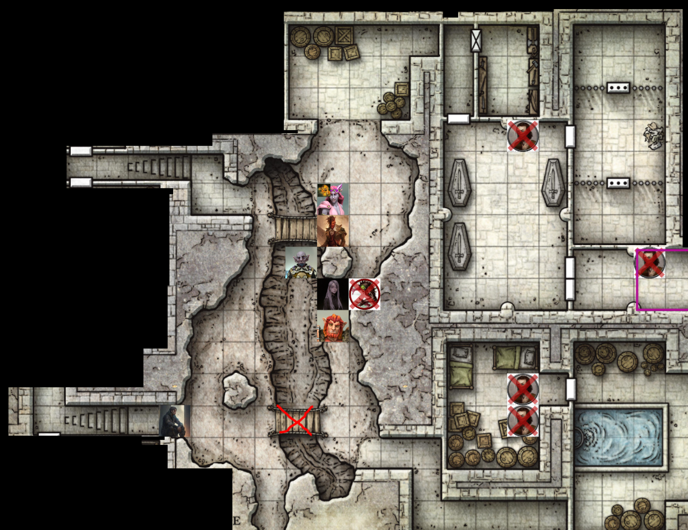

# Session 11 | 2023. 09. 11. (hétfő)

Rorr-on és Ashtonon kívül mindenki lépteket hall mögülük.

rorr, menj arrébb, valaki jött - sera

crossbow-al a kezében befut egy alak: hol vannak a foglyok?
(180 magas sötét rövid hajú medium-built fehér leather armor rogue - human)

"jónapot kívánok!" - orik bentről
"szervusz" - nana
"miért keresed a foglyokat?" - sera

Orik felsegíti Sera-t.
"nem ide tartozol feltételezem.. azt hiszem, odabent vannak, de mivoltunk itt előbb -sera

át tudtad ugrani a lyukat? - nana
nem volt olyan nagy ugrás - rogue
"ezt majd meséld a baártunknak a gödör alján
Rafi a neve.. de nme is barátunk! - rorr
irónia volt rorr.. - sera
az miaz..

(Val) rogue: Ora, itt vagy? kiált

nem jön válasz bentről.

Orik itt van! - szól rorr

ashton közben megpróbálja kinyitni a cellaajtókat - a hölgyekével kezdve - átkutatja a halottak zsebeit kulcs után, de nem talál.

Ti kik vagytok? - Val
sera lehúzza a maszkot és a csuklyát - 
úgy érzem, ti sem ide tartoztok - Val
kiváló megfigyelés, mi árulta el? - orik - kezet nyújt: "Orik Spellweaver, nagyon örvendek!" 

rogue karddal és crossbowval biccent: "Val"
orik tartja a kezét, a rugó csak nézelődik.

Ashton kinyitja a déli cellát, a sarokban rémülten kuporogva védi a fiatalabb lányt az idősebb; elképedve nézi a tieflinget.

udvariasan meghajol Ashton, üdvözli: "Ashton Quira, alá szolgáljuk, az éppen megbízott Sildar nagyúr megbízásából azért jöttünk hogy glasstaffal cseveglyünk, ahogy a banditákkal is. éppen ezért az akarutnk közös, mind a hárman - négyen - szeretnénk távozni... van egy nagyobb lyuk a padlón, arra kifellé érdemes vigyázni."
a nő riadtan néz vissza: ő ennek örül és támogatja, "ha valóban hasonló beszélgetést szeretnének folytatni glasstaffal, nem tudom sajnos merre találják, csak a nevét hallottuk, velüónk nem foglalkozott..."
"ezt vehetjük szerencsés fordulatnak..felteszem a másik cellában lévő úriember a hölgy férje!"
"az a fiam!"
"ezesetben rövidesen őt is kiszabadítjuk.amondó vagyok fönt jobb a levegő, a faluban várnámn meg a többieket..már ha vannak többiek, remélem vannak többiek - van -e fogoly rajtuk kívül beljebb?"
"most nem..volt egy férfi még, őt Laruin néven emlegették és impsztornak nevezték a többiek.. de őt tegnap elvitték"
az probléma..mármint neki, nem nekünk.. kegyedben kit tisztelhetünk?
"mirna dendrar vagyok, ő a lányom, nilsa.. a fiam pedig Nars."

közben orik a kínosan hosszú csend után Sera odalép és lehajta a kinyújtott kezet.. ne vedd magadra
semmi gond..mindenki a maga módján interpretálja az illem fontosságát.
én úgy sejtem, ebben a helyzetben nem anynira fontos.. keresel valakit? - sera
én ajánlom hogy fogj vele kezet, különben egész nap a modorról fog pofázni - nana
orik orra dereng.

igen, apámat keresem.. ellenállás híján jutottam idáig - Val
ezt nekünk köszönheted.. felajánlanám, hogy tarts velünk, ha a jutalmat nem kell tőled félteni..akkor semmi akadálya.
utatok merre vezet? - Val
további cellák irányába, még foglyokat keresünk, a holléttükről nincs tudomás, szóval feltételezzük, vannak még cellák itt-ott.
ez esetben csatlakoznék..szolgáltatásaimat mint lakatos tudom ajánlani.. - Val
még a végén kiderül, hogy jobb vagy, mint Ash... - sera
én Serafine vagyok - de nem nyújt kezet.
Ashton volnál szíves egy pillanatra kérlek?! - orik hátrakiált
egy pillanat! máris megyek! - kinyijtja Ash az ajtót is.." ha rámhallgattok..felvennétek egy köpenyt, és irány kifelé..gyorsan-gyorsan-gyorsan."

rorr-t látva megtorpannak a foglyok.

ő veletek van?
igen, nélküle nem lennénk itt.. - ash
csak a fajtársai nélkül mi sem lennénk is
hallottam hogy vannak más bugbearek is..de azok nem velem vannak
elébe menvén a kérdéseknek, én sem vagyok agresszív
amíg van mód az illem útját követni, ugye orik - sera
a kisasszony gúnyolódik velem - 
miben segíthetek ? ashorik kérdésér
a fiatalaember csatlakozna hozzánk - orik

ashton meglepődve veszi észre a rugót. odasétál, megragadja a jobb kezét, megfogja ballal a kardot, belecsap a kezdébe, üdv cimbora, ash vagyok! hallom, mostantól velünk tartasz
mindig ilyen s-era
néha még ilyenebb - ashton

nos, mi volt a probléma? - ash oriknak
nincs probléma... - orik
akkor előre- orik

Mirna hálálkodva megjegyzi, hogy kiszabadítottuk, üzeni Glasstaffnak, hogy rohadjon meg a pokolban
ezt mindenképpen átadjuk - sera
sajnos sok mindent nem tudok felajánlani a szabadulásért..
miért is kéne? - ash
áhh..tudom már.. én thunder tree-ben nőttem fel, volt egy boltja a családnak.. a padló alatt elrejtettünk egy smaragd nyakéket.. az ott maradt, mikor az undead-ek jöttek... sose mertem visszamenni érte, de ha arra jártok, egy alkímista boltot keressetek, ott a padló alatt egy kis dobozban fogjátok találni.

orik - köszönjük, nagyon kedves.

bocsánat hogy ijesztő vagyok, nem direkt volt - rorr
amikor elterveztük, hogy lejövünk ide nem terveztük megmenteni őket, mivel nem tudtuk hogy önök itt vannak.. de ez egy pozitív véletlen és hozadék, alapvetően nem tartunk a nyakékre igényt, talán..talánn.. ha mégis arrajárunk, visszahozhatjuk önöknek.

A foglyok elindulnak kifelé, Val szeme megakad a tűzkígyón Nana lába között. a gyerekek szorosan anyjuk mögött mennek.

Val is belép a cellákba, körülnéz ő is bent.. a ruhakupachoz lép, átnézi azokat - átlag ruhák, de kitűnik egy hentesköpeny belőle.

3 lépés távolságba követi a partyt.

Orik figyel, hogy a gödrön óvatosan átjussanak a lyukon.
mirna sok sikert kíván.

Rorr még utánuk kiált: "lehet enni mindenből, de a kútból ne igyatok!" 
köszönjük, de inkább távozunk! - hallatszik a léptük.

Orik még visszalép a cellába - kapcsolót, rejtett ajtót keres. Egy pillanatra felkelti a figyelmét az északi cella falán egy jelölés, de nem tudja hová tenni, véletlenszerűnek tűnik.
Ashton! szükségeltetne a jelenléted! - kiált ki.
ash odamegy
ashton, van itt egy valamiféle irka-firka, egészen úgy tűnik, mintha lenne jelentősége, de nem igazán tudom hova tenni.
valóban! - mondja ash, majd hátrafordul.

valamit lehet jelent, de nem nekik, valszeg egy unatkozó rab lehetett inkább.

három szellemalak azon tanakodik, hogy a modortalan sírrablók elvették a gyűrűket - csak ő látj.
"elnézést, úgy gondoltuk, hogy mi nagyobb hasznát vesszük ezeknek..remélem nem veszik zokon!"
meglepődnek hogy a loclk látja őket, 
már hogyne vennénk zokon! családi ereklye, hozzánk tartozik!
természetesen, ahogy a kúria többi része is..nem tudom jártak e mostanában odafent, elég elhanyagott állapotban van... ezekkel viszont bizonyítani tudjuk, hogy jogalapounk van felújítani a dolgokat... a város és önök is jobban járnának.
Ashton, jól vagy? - sera

ashton győzködése nyomán - a fiatalember mond valamit... az egyik továbbra is felháborodott - ezekre szükségünk van, hogy igazoljuka túlvilágon nemesi mivoltunkat?
kinek akarod igazolni? - másik szellemnő

ne aggódjon, amennyiben a városból megkapjuk a jogokat,  visszaszolgáltajuk önöknek - ashton
pampogó: ha most visszaadod, hogy békében nyugodhassunk, talán tudunk hasznos információkat adni, amihez nincs hozzákötve a szellemünk!! - szellem

nincs fontosabb ennél, majd nyújtja feléjük a gyűrűt - ashton

ashton, mit művelsz? - sera
visszaszolgáltatom a tulajdonosának - ash

szellemek néznek rá.. really??! 

Val megállapította, hogy Ash bolond, megkérdőjelezve döntését, hogy csatlakozzon hozzájuk.

oh...megmutattá, hogy melyik kripta az öné?
ashton, kivel kötsz épp túlvilági alkut, ha nem vagyok indiszkrét?
semmi extra..
orikkal visszateszik a gyűrűt - 
a másik kettő nehezményezi hogy az ő gyűrűjük nem került vissza
ashton tovább győzködi, de sértődöttek, hogy csak egy valakik kapott gyűrűt..
az egyik legnemesebb ősünk kardját megtaláljátok a szomszéd teremben egy ládában..
ahol rafi leesett?
nem, a nyugati iránybna..
bármi ismertetőjel hogy könyebben megtaláljuk?

ashton,  nem tudom mivel vettek rá erre - sera
túloldalt barlang, ahol láda - benne kard.

sera fejben: a foglyokról kérdezd inkább
ash visszafordul - már eltűntek a szellemek..
szóval arra barlang..
és ott?
nincs már ott senki..elijesztetted őket

sera jelzi, hogy ez csak fejben trötént

szóval Val, ha esetleg közben ráér - orik
Val odalép, az északi cellában mutat egy jelet neki.. Val érti, beszél Thief's cant-et.

a szimbólum jelentése 'Fogadó', más érdekeset nem találnak.
Mond ez önnek valamit? - orik
Akár... közelebb lép, kapcsolót keres.
Orik nézi ahogy keresgél, de nem talál semmit.
Közli Orikkal, hogy semmi nincs ott..
ezekszerint maga érti, hogy mi van odaírva..
csak egy sejtés..
nos, köszönöm, hogy fáradt..

Orik, megtennéd, hogy ezt az ajtót most te nyitod ki? az előző próbálkozás kissé fájt...
természetesen kisasszony... orik odalép, csapdákat keres - de nem talál semmit..
a kilincset lenyomja, egy nagyon rövid folyosó tárul elé, jobboldalt elöl még egy ajtó.

Orik a következő ajtót is megnézi, ott sincs csapdának jele, újból benyitna - de zárva az ajtó.
előveszi a kis eszközeit, belenéz a lyukba, nézelődik, majd egyetlen mozdulattal a zár kattan, és kinyílik.

rorr nézi hogy mi történik.

belépve feltűnik, hogy ez egy fegyverraktár - lándzsák, kardok, íjak, nyílvesszők, stb..
a másik falon felakasztva kb. egy tucat vörös köpeny.
egész ok állapotú fegyverek - nincsenek túlhasználva. nagy eséllyel lopott/fosztogatott eszközök.

"ez egy fegyverreaktár..úgyhogy azt javasom, tekintve, hogy az itt múlt időben tartozkódoknak nincs már rá szüksége, javaslom, hogy szolgáljuk ki magunkat.!" - orik
Rorr szeme felcsillan az újak látán - gyorsan fel is kap egy tegezt az oldalára, és egy íjat vesz a kezébe.

van egy mély táskád, ugye, Orik? a falunak szüksége van fegyverekre, jó lenne felfegyverezni őket.. - ashton

Orik elkezdi a belső zsebébe bepakolni a fegyverraktár tartalmát.., a többiek feszülve nézik, mit is csinál.

lehet segítség volna, ha elmondanád, hogy néz ki a családod... segítene, hogy tudjuk, kiket keresünk! - sera val-nak

vagy neveket, bármi ami segíthet! 

Aurora a hugom, legutóbb mikor láttam, 5 éves lehetett.. jó pár éve, hírből/hallomásból tudok bármit.. szőke apró lány volt..
(fogadott) apám, Ezdall, vékony termetű, barna hajú, rough looking, szintén rogue - tőle tanultam mindent... egyik éjszaka eltűnt, próbálom kideríteni mi történt..

a húgoddal egyszerre tűntek el?
nem, nem ismerték egymást.
de úgy gondolod hogy itt vannak?
hallomások alapján igne, reményekedem mind a kettőt itt találom.

úgy tűnik, zsákutcába futottunk, de talán találunk foglyokat másfelé is - sera

"azt hiszem, ez minden!" -orik
kell segítség? - sera
nem, megoldom. - orik
"hogy nem húzza le a zsebed az a sok cucc?" - rorr oriknak
"nos.. kedves rorr..azt hiszem most nem megyek részletekbe..de ez amolyan varázstrükk.
"azok jók, azok jók.."
elmés kis bűbáj, ..., mutogatja a zsebet, a táskát.

Ash, gyere, attól tartok, vissza kell fordulni - sera
menjetek nyugodtan
te nem jössz?
én inkább erre megyek - kinyitja a titkos ajtót a folyosó másik felén.

bent egy másik raktárhelyiséget lát maga előtt - az egyik fal gyakorlatilag egy barlang, egy természetes barlang északi vége, ami be lett falazva/ráépítve.
hordó mindenfelé, szalma, szerszámok, kalapács, szögek, stb.. dél felé is mellékjáratok a barlangból - hasadék a barlang fölött - két híd fölötte. az olajlámpák itt is égnek.

(barlangra nyílik a raktárajtó.. - Rorr dúdol)
én erre mennék, de óvatosan.. picit szellőssebb a járat!

Rorr belép, körülnéz, Ash követi, Orik a nyomában.
Ash a ládákat nézi át - főleg használati tárgyak, szerszámok, ruhák vannak benne.
szőrméket is talál - milyen szőrme, mennyit érhet.

Val még hátrébb marad, Orik a szőrmét nézi, amit Ash mutat neki.
Orik megvizsgálja: hód prém - 30 prém, darabonként 2 arany.

Orik, van határa a belső zsebed tartalmának? - sera

Nana beviharzik a hód hallatán: "ki tette ezt?!"

egy mesterember lehetet... képzett bőrműves lehetett..
nana csúyán néz orikra

ash számol 1, 2, 3, 4, 5..6.. már csak 24 embert kell megölnünk, hogy minden hódot megbosszuljunk... iletve nem számoltam a fogadónál lévőket, így már csak 16!
nana elfogadja a bosszú gondolatát.

"ti nem jöttök?!" - kiált hátra rorr
"amennyiben az előttünk álló tetemes banditát próbáltuk elkerülni, ez nem volt megfontolt cselekedet..." -ashton
"oh.." - rorr

Ashton a barlangba néz - hűvös van, huzat..
az orrát az enyhe rothadásszag üti meg, ami a barlangban terjeng..

Val megunja a várakozást, előrébb jön, a barlangba óvatosan belépve.

"nézzük meg azt a folyosót, ott!" - mutat az északi járatra Sera.

Orik közben a 30 hódprémet is "zsebre" rakja.. Nana csúnyán néz rájuk, de Ashton a természet körforgásáról hadovál, a halott állatok minden részét "használni" kell.

tudjuk, hogy a barlangnak a végén egy másik titkos ajtó vezet minket vissza a ciszternához - én a menekülőutat térképezném fel.
szóval _azt_? mutat délre sera

sera szerint fölösleges sok embernek mennie, ashton ágál, hogy egyet könnyedén legyőznek.

Ashton, Val és Rorr oson elsőként a barlangba befelé, egyelőre nesztelnül.

Val egyszerre megtorpan - a személyes aurájába lép valami.
Mi van?! - rorr
Val kapkodja a fejét körbe, mi történhetett - a déli kőoszlop mögött egy árnyat lát megmozdulni.
Baj van?! - suttog rorr előre
" nem tudom, osonjunk közelebb, aztán megmondom mit láttam.. " 

Rorr hirtelen azt érzi, mintha valami matatna az elmédben (bal láb, jobb láb..) - de nem talál semmit ott. ő is megtorpan egy pillanatra (annyira titok, hogy még nekem sem mondták el..)

haladunk tovább.

minden ok? - sera ashnak fejben
nem teljesen..valszeg keserves kínok között halálozunk el mindjárt.
de jöjjek?
nem kell, messzireől is tudsz segíteni.
majd tisztességgel eltemetlek,
ne aggódj, csak lökj a gödörbe..

szűkül a járat, belátunk a hasadékba.. nem túl meredek, rücskös a széle, mászhatónak tűnik. 5-10ft széles. 20ft mély.

Ash lenéz, a ládát kutatva, de nem látja. Rorr fel se fogja kérdést.. Val ládát nem lát, de egy félig megevett emberi testet észrevesz.. 
Valakinek jó volt a vacsora... - jelzi hátra

Ashton elméjébe is behatolna valami, de eredménytelen - ő is megtorpan egy pillanatra.

a déli hídhoz érünk.

Ash hátraszól Sera-nak fejben, hogy "már majdnem a végére értünk, és valaki az elmékbe próbál férkőzni... valszeg nem ezen az oldalon van, nem találkoztunk senkivel.. menjetek át az északi hídon, hátha közre tudjuk fogni"

Sera közli a tervet Nana-val és Orikkal, elindulnak óvatosan az északi híd felé.

ahogy belép mindenki a barlangba - mindenki érces kacagást hall a fejébe.
ashton nem törődik vele, neki mindennapos a hangok a fejében.

"mi ez, miez.. Glasstaff bőkezű vacsorát küld? nem, glasstaff nem ilyen bőkezű.."
"ugyan, én a fél fogadra sem lennék elég.. " - sera válaszol fejben
"ezt te is hallottad?!" - rorr ashnek
"akkor nem csak én hallottam!" - ashton kiált fel.

valóban nem - a hang - különben is, nemrég ettem.. de ha nem GS küldte őket, GS ellen jöttek..

Orik ash üvöltése mentén kihúzza magát, lesajnálóan sóhajt..

Ash félhangosan: "úgy érzem ez remek lehetőség tárgyalásra.. ahonnan jöttünk, rengeteg fogást hagytunk hátra.."
"óóó én azt tudom, de az nem finom.." 
ash győzködi

akkor nem akarsz megenni minket?
mint mondtam, előbb vacsoráztam..az a kérdés, átmehettek -e..
Sera: glasstaff a barátod?
kiszolgál.. a régi hús nem jó.. folyamatos friss utánpótlás kell

elképzelhető hogy glasstaffnak nem a barátja vagyunk... de ez nem jelenti, hogy a tiéd ne lehetnénk... ahová megyünk, rengeteg a _friss hús_ .. - ashton
végülis..a hasadék segít ebben.. - szóval tudtok jobbat ajánlani, mint GS?
mit ajánl GS? - sera
folyamatos..friss húst - és nekem itt jó. - a hang
képzeld, hogy rejtegeti előtted a husikát.. ott tartogatta őket, 3 teremmel arrébb..
tudom én.. onnan jött az előző is...

Orik a hullát próbálja beazonosítani a szakadékban - egy nappal ezelőtt vitték ki Laruint, de ez a hulla annál biztosan régebbi..

kezd kényelmetlenné válni ez a kép nélküli beszélgetés.. talán ha megmutatnád magad, akkor könnyebben tudnánk tárgyalni - sera
jó nekem így.. - a hang
szeretnénk látni milyen szép vagy! egy ilyen rettenthetetlen lény, aki ennyit fogyaszt.. - sera

az oszlop mögül előlép egy valami (discordon) - görnyedten jár, egy kisebb méretű ember magassága.

Orik összeteszi fejben - telepátia, külső jegyek, stb. - ez egy notic. Jellemzően föld alatt élnek, szeretik a sötétet, általában korrupt mágia hatására mutálódnak (akár emberből), vonza őket a mágia.. nem agresszívek, nem is buták.. némelyiknek az előző életéből is vannak emlékei. telepátia, abberration faj. veszélyesek tudnak lenni.

na milyen szép vagyok! - halljuk fejben.
ooh..érdekes - orik jegyzetel

Glasstaff engem ellát élelemmel..óvóhellyel, azért hogy ne engedjek át SENKIT - jelzi, amint Ashton elindul.

Na és mondd csak, kedves .. - kezdi Orik.
hatásszünet.. - mióta is élsz itt?
egy pár éve..
te hamarabb voltál itt, mint GS?
igen..addig csak a betévedt falusiak szolgáltattak élelmet..
és amikor te ide költöztél, akkor a kúria még működő gazdaság volt?
nem..
tehát már a romokba költöztél.. tehát miért pont ide?
finom..a mágia is olyan, mint a friss hús..

mondd csak.. van neked neved?
hajdanán lehet volt..
(és mi volt? - nana)
túl sokat kérdeztek... 

COMBAT

orik feje megtelik a rodhadás gondolataival, de elhessegeti..
"milyen dolog így bánni a vendégeiddel.."

Val átfutna a hídon, de az beszakad alatta... még megkapaszkodik, és visszahúzza magát. Átugrik, megcélozza a déli oldalról a noticot, nyilat küld felé.

Ashton: "azt mondtad szereted a mágiát..egyél (bazdmeg)!" felkiáltással küld egy varázst felé, majd megátkozza őt.

Rorr az új íját próbálná - az loszopba fúródik a vessző. (még szokni kell... "mutasd meg új fiú, mit tudsz!" - kiált oda Val-nak (bardic insp.))

Nana előrébb lép, lángokat idéz a kezébe, de a pyro-python egyből bekapja a lángot..
a kígyó is megköpi a noticot, meggyullad a notic.

orik is rálő, egy lilás színű lövedék lő felé. átugrik a hídon

a fejünkben vegyül a kacaj és a fájdalom hangja, ahogy sebződik a notic.

Sera "edd meg amit főztél" jelleggel a hasadékból emelkedik ki a szokásos csontvázkéz, és kapja el a noticot.

a notic előbújik, és Nana-ra néz szúrós szemmel.. annyira erős benne az elmúlás gondolata, hogy az "fáj".. 

A notic a szakadék széle felé sétál, majd átugrik, Sera-ra.. a lány még időben félreugrik, a notic nekiplaccsan a falnak.. megrázza a fejét, halljuk a kacajt..

A notic pillanatnyni zavarát kihasználva Val egy nyílvesszőt küld a két szeme közé - megszűnik a kacaj, a notic nem mozdul többet.

COMBAT VÉGE

+75 XP 

ashton megnézi a folyosót - zárt, valszeg. a ciszterna melletti titkos ajtóhoz vezet.
Val egy folyosót lát, ajtóval.
oriknál is lépcső, mind a két irányba ajtó a végén.

Ashton mondja Oriknak, hogy ládát + kardot keres.
orik lemászik a gödör aljára, természetellenesen hideg van lent..a hulla másik oldalán, a híd alatt az említett ládát látja. óvatosan a láda felé lép, mágikus csapdákat keres.. nem talál semmi ilyet. sima csapdáknak sincs nyoma.
régi, kopottas láda, kihúzza.
"ha lennétek szívesek köteleket leereszteni.." - orik
rorr és ashton elengedi a kötelet, megköti a két csomót Orik, majd hátrébb lép egyet.

rorr és ashton elkezdi húzni a ládát, ashton oldalán a kötélen a csomó elenged félúton, leng egyet, odacsapódik, de Rorr felhúzza a maradékot.

Rorr gond nélkül felhúzza a ládát, Ashton felnyitja azt.

benne törött üveg, folyadékkal.. csillogó érmék, 160 ezüst és 120 arany. 5 zöldes drágakő, papírtekercs, valamint egy kard - szép, ezüstös veretű hüvelyben. A markolatánál a guard egy ragadozómadár szárnyát formázza.

mindenkinek 20 aranyat, 26 ezüstöt porciózik ki Ash.

A köveket nézegetik egy ideig, malachitként azonosítja Sera, darabonként 15gold, 5 van belőle.

Rorr a kardot vizsgálja - ahogy kihúzza a hüvelyéből - egy hosszú kard, mágikusnak érződik - bele van vésve a pengébe a 'talon' (madárkarom) név; a kard történetét is hallotta Rorr már régi regékben - a Tresendar kúria, Aldith Tresendar, egy neves lovag volt, a 'Fekete Héja' kardja, Sir Aldith itt esett el, az ork betörések során védte az otthonát. A halálával a kard is elveszett, egészen mostanáig.

"hát én erről ismerek egy dalt!" -> Rorr
Ashton is felismeri, jelzi hogy este majd eléneklik a többieknek a dalt.

+1 -es longsword.

spell scroll -> Orik nem tudja elolvasni, de clericek értik ezt a varázst.
