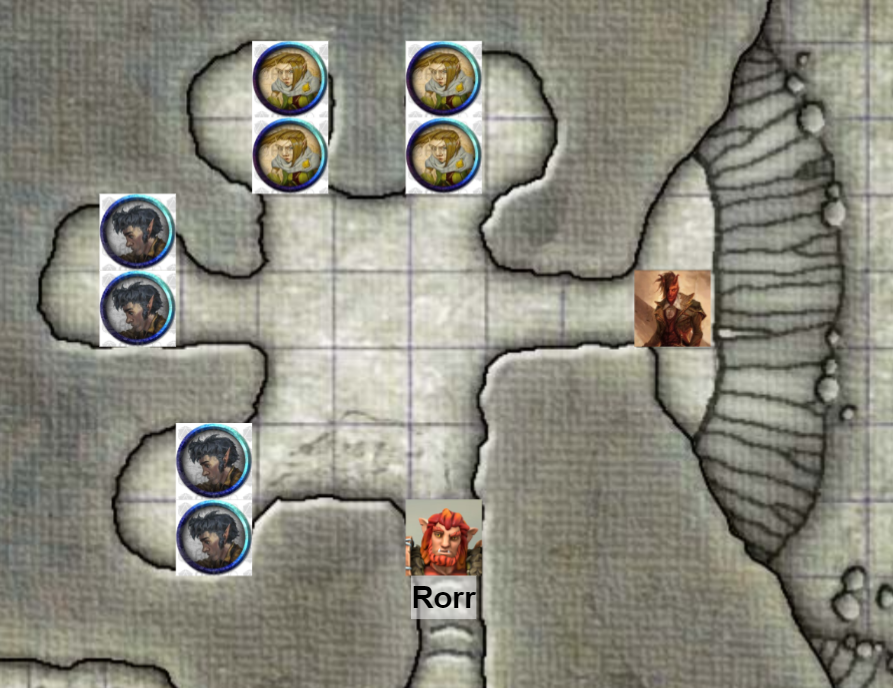

# Session 18 | 2024. 01. 14. (vasárnap)

val marad és szemmeltartja a két gnome-ot (nincs player)

Ash megnézné az alvó részt, hátha onnan nyílik a vízesésnél látszott sziklapárkányhoz vezető út. also, van -e dulakodásra utaló nyom

sera: ismerték az eltűnteket?
gnome-ok: családias hangulat, mindneki ismer mindenkit.
s: mi volt az ő szerepük/feladdatkörük?
g: gombagyűjtők
s: volt több gombagyűjtő/braátaik?
g: persze, mindenki ismete őjket
a: mikor tűntek el
g: egyik 4 másik 8 napja
s: szomorú hogy ne mfigyelnek oda egymásra..
g: mit kellett volna jobban odafigyelni?
S: hamarabb is észrevehették volna mint a vacsora hogy eltűntek.
g: amíg teszik a dolguk addig nincs baj

sera elindul a trónterem felé vezető folyosón, nana orik megy vele.

ash felfelé megy, Rorr vele.
g: halkan arra, alszanak, pihenni kell!
a: természetesen

lefelé vezet a lépcső, kanyarodik, a végén egy kisebb barlang. melléküregekre osztva, helyenként tábortűz maradványa, 4 kis üreggel. belépve jobbra egy barlangnyílás, ami kifelé vezet, enyhe fény szűrődik be onnan, de alapvetően sötét van - szuszogás hallatszik az üregekből. kis csomagok az üregekben, mindegyiknél 2, összesen 8 gnome alszik ott.

Ash körülnéz, talál -e valamit, de nincs dulakodásra utaló jel.

a: súgja Rorrnak találkoztunk 2 őrrel, vannak a szakáscok, a fura néni, a két tudós gnome, és hiányzik kettő. mégis itt 4 akol van 2-2 ággyal amik tele vannak.
r: lehet két műszakba dolgoznak, és váltják egymást. nézd milyen kis nyikhajok!

a odaoson az egyik gödörhöz, használati eszközök, ruhák, fekvőhely, semmi személyes.

a: akjarsz valamit még nézni?
r: nincs öteletem mit nézzünk.
a: vissza a konyhába esetleg, hisz onnan tűntek el..

=================

nana: váljunk szét!
s: inkább maradnék orikkal..megnézném észak felé mi van

orik követi serat, nana külön válik

s: valami baj van a társaságunkkal esetleg?
n: nem, csak így gyrosabb.. ha baj van, szólok
s: egy percig tudsz jelezni!

nana egy kétszárnyú ajtó előtt találja magát. megmunkált non-figuratív faragványok díszítik, vékony arany-erekkel.

nana ráfog a kilincsre, kinyitja azt, a trónszobába érkezik.
nem a tipikus királyi trón bársonnyal/arannyal, hanem gnome-okhoz méretezett, maradék vasakból összetákolva.

nana visszacsukja az ajtót, és visszafordul Serahoz

s: ez az ajtó vezet a pulpitushoz valszeg.
tovább mennek
s: orik inkáább te menj előre..

orik udvariasan de határozottan bekopog.

motoszkálást és széklábakat hall.

bentről: ki az , mit akar?
o: a nevem OS, és egy megbizatás ügyében vagyok iti
milyen megb.?
eltűn gnomeokat kersek
kiket?
o: fidellstik és dibledob (s17 nevek)
és mit akarsz tőlem?:
klérdéseket feltenni
mifeéle kérdéseket
o: szeretnék pl. megbizonyosodni róla hogy nem vagy alakváltó
miféle alakváltó honnan tudsz róla?
o. mint említettem megbíztak minket kutassuk fel az eltűánt gnómeokat és találjuk meg az alakváltókat és így vagy úgy szabaduljunk meg tőle.
itt csak ketten vagyunk de mi nem vagyunk alakváltóak és eltűnjt gnome sincs itt
o: pusztán hang alapján igen nehéz teljes bizonyossággal elhinni hogy egyikőtök sem az az ajt mögött. javasolnám hogy folytassuk szemtől szembe a beszélgetést.
ide aztán biztos be nem jössz, amíg az alakváltó kint mászkál mi sem megyünk ki
n: na és kedves király úr mi van ha az alakváltó ott van bent csak láthatatlan alakban?
b: micsoda sületlenség, alakváltó nem tud láthatatlan lenni
o?: és mi van ha ez az alakváltó egy bútor formáját vette fel?
b: hogyne tudnám hogy van ilyen végignéztem minden bútort itt bent, atudom hogy kint az alakváltó. addig mi ki nem megyünk innen.
{{mhkamhm muffled voice bentről}}
o: melyik iráléyhoz van szerencsém?
b: korboz király
o: örvendek a stzeencsének felséges korboz, hogy egészen pontosan végehzessük a nyomzatni folyamot amit elindítottak a fiddle/dubble az lenne a min., hogy alapvetés hogy a mélyen tisztelt párjával is váltok pár szót.

pár mp. szünet és csönd bentről.

b: aztán miért?
o: alaposság. semmi más. soha nem lehetünk elég biztosak, empirikus tapasztalat.
b: mint uralkodó és férj jogom van mindkettőnk nevében nyilatkozni
s: odaengedsz az ajtóhoz egy pillanatra kedves orik?

s benéz a kulcslyukon, de nem lát semmit. csalódottan sóhajt.

b: ez ki volt van veled valaki?
o: két trársam is magammal hoztam hogy egyikünjket se rabolják az alakváltók
b: bezárkózni jobb de ez ser rossz.
s: infóra lenne szükségüknk mélyen tisztál korboz király. hogyan kezdőtött az alakváltós történet/eseméynsor, ami végén önök bezárkóztak a hálóterembe?
b: az úgy kezdődött 8 napja hogy 

==================

bizonyítástok nem vagytok alakváltók
ash megmutatja a papírt.
ok, ez így rendben van, mehettek.
a: mielőtt továbbmennénk, meg lettünk bízva az eltűnésekkel, ezért a teljes környéket szeretnénk átvitzsgláni ebbe beletartozik természetesen az is (nem látott járatra mutat). nem kívánjuk a becsületeket fgirtatni, nehogy shady biznisz történjen arra, amennyiben találkozunk a párkányon fent, csak mi leszünk, nem alakváltók
g: üres folyosó, de persze,

üres folysó, lámpásokkal. titkos ajtót keres, de semmi.
felérünk a két gnome-hoz.

a: ha már ennyiszer összefutunk, megkérdezhetjük a neveiteket?
csaj: Ulla
pasi: Pog

a: én ashton vagyok, csak ash a barátaimnak. ha később találkozunk én Ash vagyok így csak a barátaimnak felelek tehát ha válaszolok tudom hogy ti vagytok mert más nem szól hozzám így.
r: Amit ő mondott, csak én Rorr.
a: ha van fejlemény, szólunk. ha nálatok történik valami vagy alakváltót találtok, kiabáljatok

visszamegyünk a hordók felé, végignézni őket, fura hangja (üres) van -e bármelyiknek.

az északi és keleti hordók nincsenek csapolva. a déli falon lévőkben benne a csap.
végigkopogtatjuk őket, Rorr hallja hogy máskép zengenek, egyértelmű hogy üreges és nem ugyanannyi van bennük.
Ash mindenhol teli hordó hangját hallja.

A sarokban lévő egyik hordó hiányzik - 12 volt legutóbb, most már csak 11.

vonszolásnyom nincs, kőpadló.

rorr megnézi a hordó helyét, az álvány alatt a kőben pár kis sötét folt, ami mintha ki lenne marva, erős savas folyadékkal.

a előveszi a rapírt és minden hordó elejébe egy A betűt karcol.
r: van nyom de nem tudjuk mit nyomozunk.

elindulunk a konyha felé, a nyílpuska körül a gnome néni már nincs ott.
rorr az ebédlőn át, Ash a mechaskorpióhordók felől.

Ash helyén találja a két géprákot, belenéz mind a kettőbe, de nincs benne senki.

Rorr az ebédlőbe lép, középen hosszú asztal, mellette pici székek, a túlsó falon egy nagy szekrény az evőeszközöknek. még nincs megterítve.

van egy üres bak egy a hordónak, de alatta nincsenek cseppek.
Rorr körbesétál, mintha eggyel több szék lenne itt. a szeme sarkából egy mozdulat, az egyik szék ülőrésze kitárul, és óriási fogak jelennek meg.

Rorr a folyosóra ordít Ash felé, "FOGAS SZÖRNY!!" 

==================

korbosz király elmeséli a többieknek, hogy 8 napja eltűnt az egyik társuk, semmit nem találtak. pár nappal később a folyosón a hordós teremben egy eddig ott nem lévő szőnyeg kúszik a hordónál tevékyenkedő gnome felé, hatalmas fogakkal felfalta őt.
a király bepánikolt, és bezárkózott ide a férjével, azóta nem jöttk i.
s: ezt nem mondta a többieknbek?
k: kiabálva jöttem hogy alakváltó, mi mást tehettem volna
s: ez az egyik eltűnt gnome?
k: igen, szegény Orin...
s: amivel most szembe kell néznünk, az egy Mimic., ami csak tárgyak alakját képes felvenni. Arra figyeljen, hogy olyan tárgyak közelébe ne menjen, ami nem volt ott.
k: ezt mondaná az alakváltó is
s: és ha bizonyíítjuk hogy elintéztük a mimicet?
k: akkor lehet, persze. akkor ha elmúlt a veszély, kijövünk.
s: csodálatos, akkor tudjuk hogy orint és werint nem találjuk meg.. már csak a mimicet kell megtalálni. köszönjük a segítséget.
n: meg kéne nézni a trónteremben a trónokat.
s: Orik, te mint varázstárgy szakértő?
o: némi hallgatás, gondolkodik. stabby-stabby a legmegbízhatóbb módszer.
s: akkor csak végig kell nézni a helyet?
o: igen.. vagy megkérdezzük a két feltalálót tud -e segíteni, hogy igaz formáját kikényszerítse valaminek, de ez magas szintű varázslat, nem valószínű hogy értenek hozzá...
s: megígérem hogy nem leszek csalódott ha nem tudják.
o: és királyuram, hogy állnak ellátmánnyal, hogy jut be az élelem?
k: inkább az éhhalál minthogy minket egyenek meg!
o: ami valszeg nincs messze tekintve hogy 10 nap alatt éhenhal egy átlag gnome
s: najó, bökdössük a trónteremben a székeket!

==================

### ⚔ COMBAT ⚔ 

{{Rorr vs mimic.}}

rorr felé vetődik a fogas szék.
belemélyednek a fogak Rorr combjába, grappled {0 movement speed}

rorr vicceset mondana a széknek, de nem értékeli.
kiabál Ash felé

a mimic rágódna a combján, de nem igazán jut át a szőrön.

"ha ezzel nem boldogulsz, még jó hogy nem a seggszőrömön próbálkozol!"
lazul a harapás a combomon, elkezd röhögni a székformájú fogas valami, eldől a szék és a háttámlán forog/röhög.

elengedi Rorr lábát, Rorr arrébb lép, hogy a folyosón jövő Ash-t lássa hogy segítsen.

Ash közeledik, de még nincs látótávban.

Rorr odavág a mimicre a kardjával, felhasad a fa, gennyes zöld anyag folyik belőle, felugrik a szék és már nem nevet. rorr eggyel hátrébb lép.

Ash csatlakozik Rorrhoz, aki kiabál neki: "Mögötted mimic!"
biscuit berepül a szobába láthatatlanul, a mimic nem veszi észre.

a mimic most Asht veszi célba, aki a felé jövő nyelvet próbálja felszúrni a kardjára.
A mimic fogai most Ash lábába állnak, őt szögezi egyhelybe.

Ash össze-vissza ugrál, így Rorr nem tud jól odaszúrni anélkül hogy Asht bántaná.
"Majd próbálj arrébb-mocorogni hogy könnyebb legyen megvágni!"

buiscuit is megharapdálja a mimicet, nem tetszik neki hogy a gazdáját fogja.

A mimic nem számított rá hogy hátulról döfködik, de még talpon van.

Ash próbál odébbfordulni, hogy Rorrnak könnyebb dolga legyen.

A mimic megrázza magát mint egy marcangoló kutya, savval és fogakkal támadja Asht.

"nehogymár egy szék kifogjon rajutnk!" kiált oda Rorr ash felé, miközben egy újabbat vág a karddal a mimicre. az felmordul, de nem ereszti Ashtont.
"több nótát nem tudok!" mondja még Ashnek.

Ash is a mimicre vág, beleszúrja a fekete pengét. A mimicre terjed a feketeség, borzasztó, sikitó hang tör fel a torkából, de nem engedi még mindig Asht.

A mimic tovább harapdálja őt, Ash összeesik a földön, ahogy szétmarcangolja az oldalát.

"Azanyádat! Miért kell bántani a barátomat?!!!" kiált rá Rorr valahogy 

A mimik vonaglik, fájdalmasan sikít, elkezd távolodni, majd kis pukkanással eldől a szék, és széfolyik, és nem mozdul többé.

"kezdhettem volna ezzel is.."

### 🕊 COMBAT VÉGE 🕊

"vége, vége, nem bánt a szék!" lép oda Rorr Ashez.
Ahogy megköszönné Rorrnak, ahol nem olyan hosszú a szőre Rorrnak, kék a bőre a szőrfoltok alatt. ahogy felnéz rá, Rorr hátán pillangószárnyakat lát.

megdörzsöli a szemét: hú de ki lehettem ütve.. Rorr, köszönöm, egy pár kérdésem van. mit kaptam be én _ettől_, hogy ezt a sav teszi, veled teszi vagy valami nagyon fura, merthogy barátom kék a bőröd és megléepően alranyos pillangószárnyaid nőttek.

Rorr magára néz, "ez fura. eddig ilyen nem volt". hátranéz a szárnyakra, kékes hártyát lát.
"Eddig ilyet nem tudtam, szerinted tudok repülni is?!"
A: "kiállhatnál a szikla szélére, hogy leugorj."
R: szerintem inkább intézzük el ezt a furcsa széket.

a mimicre nézünk, ahogy terül szét a savas trutyi, egy viszonylag friss, de a sav által szétmart gnome teste kerül elő.

A: "amennyiben ebből a szerencsétlen mimicből - felteszem ő az alakváltó - valószínűleg ki kéne nyerni valami bionytékot hogy megöltük..hogy a faszomba?!"
R: szóljak az őrnek? vagy itt a konyha, ők tudnak segítnei!
A: kérhetünk egy üvegvalamit, hogy beletegyük, amit nem mar szét a sav.

A feláll, megköszöni Biscuitnek a közreműködést.

R: megsimogathatom?
A: megsimogathat? moderált tartással, we dont know! és eltűnik - szerintem ez nem, de jól haladsz afelé, hogy egy nap megsimogathasd

====================================

a többiek a trónokról megállalították hogy nem mimicek.

{{pisiszüneten a narrátor, 2 perc kimaradt}}

a déli ajtó felé mennek, a kincstárajtóhoz, ami zárva van.
o: legalább kis eszük van..
n: akkor hogy nyitjuk ki?
sera vállat von, a tudósok felé fordul vissza.

továbbra is heves vita közöttük.

s: azt hiszem részben megoldottuk a rejtélyt. valószínűleg egy Mimic van a dologban.
g: ez logikus hiszen az egy alakváltó lény.
S: a király azt mesélte hogy látott egy szőnyeget ami megette szegény orint.
g: igen ez szűkíti az opciókat.
s: nem tudjuk hogy egy vagy több mimic, sajnos valszeg őket nem viszontlátni.
g: ez szomorú, hogy kerülhetett ide? valószínűtlen hogy több is van, kicsi az esélye.
s: megpróbálhatjuk kideríteni, de az feláras. addig is segíthetnének megtalálni a mimicet, nem tudom milyen tárgyaik vannak erre,.
g: ha nem is éles tárgyakkal bökdösni, inkább ezzel!

elővesz a munkapadból egy 1ft hosszú rúdnak kinéző dolgot. {{manórudi}}

g: ez nem éles hanem tompa, és nem kell olyan közel menni! Nyílj ki! - a rúd 1ft-ről 10ft-re nő 
s: erre felfedi magát?
g: egészen biztos! Csukódj be! - újra 1ft.

{{Pole of Collapsing}}

g: ezt is beszámítjuk a jutalmak közé
s: csodálatos lesz, köszönöm szépen
g: sho-shoo, keressetek mimicet! mi foglalkozuk a királyokkal
s: valószínűleg előjön ha megöltük a mimicet
g: a valószníű nem tudományos.
o forgatja nagyon a szemét.

n: megkérdezi Val-től, hogy "a két szerencsétlen már kijött a folyosóról?"
v: igen, elindultak vissza..
n: ne nézzük meg őket?
v: azt mondták figyeljek, innen max. 8an jöjjenek ki.
o: és kijött már bárki?
v: csak ők ketten.

s: a tróntermet megnéztük, a hláóban nincs senki.. csatlakozzunk a többiekhez
v: remek, mi az a mimic?
o: nos, kedves VAl... A mimic egy aféle alakváltó, különböző tárgyak..
v: szóval azt keressük
o: remek megfigyelés.. kizárólag tárgyak formáját tudja felvenni, és nagyot harap.
v: jó..
o: javasolnám a fiatalembernek, hogy tartson távolságot.. mindentől.

elindulnak visszafelé a folyosón.

~~~
{🌟} +75 XP
~~~