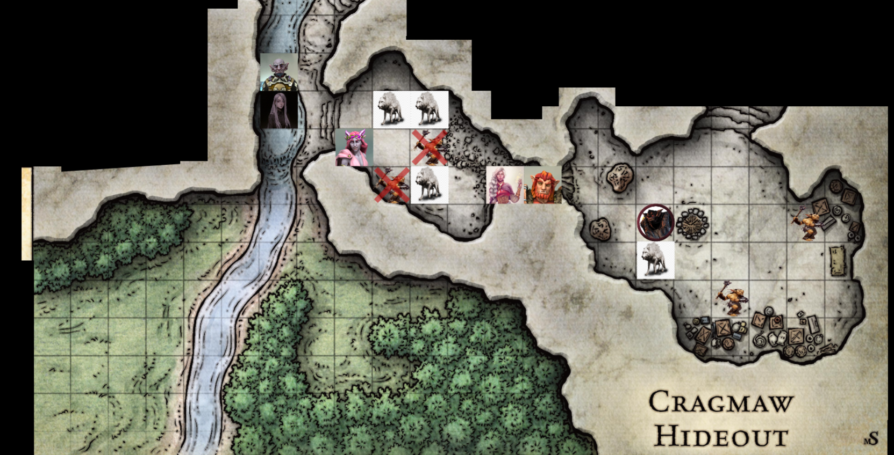
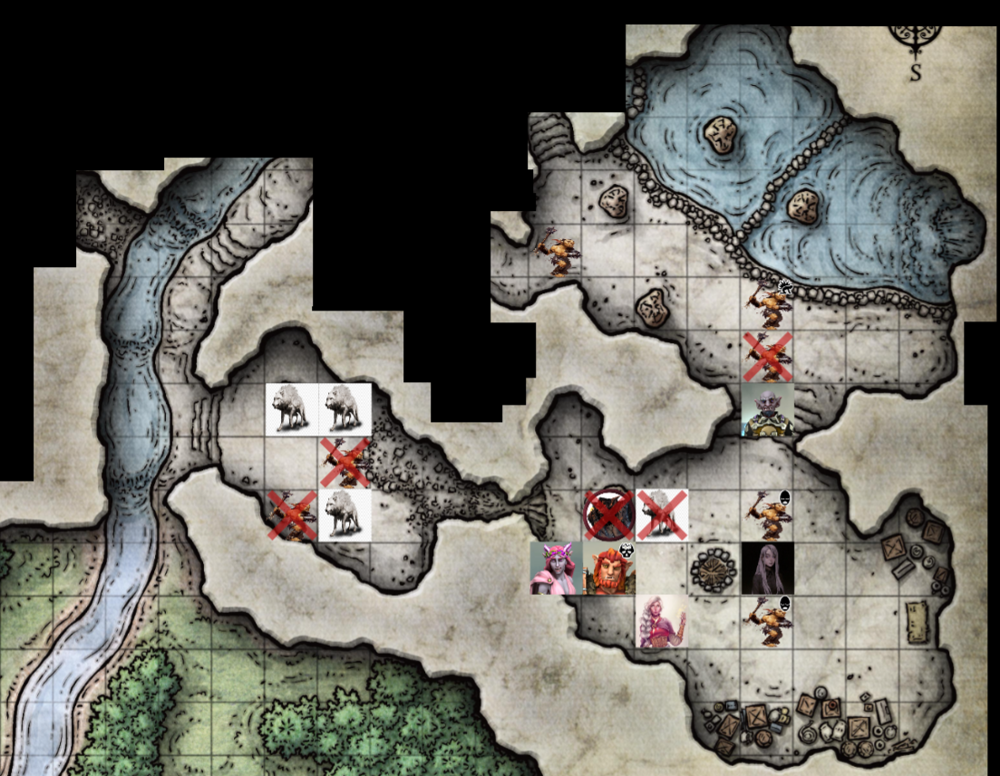

# Session 6 | 2023. 07. 01. (szombat)

### ⚔ COMBAT ⚔

A melee goblinok leszaladnak a dombról, a közelünkbe. A rangedek nyilat húznak.

🗡
 - Az első goblin Ashley-t találja be.
 - A második Nana-t célozza, őt is megvágja a kard.
 - A harmadik elvéti Rollt.
 - A negyedik betalál, megvágja Rorrt.

🏹
 - Az első íjász elvéti Orikot.
 - A második íjász szintén Rorr-t veszi célba, ez is fáj Rorrnak.

Ashley visszaüt a goblinra, próbálja Sera-t védeni közben - ezzel a kis goblin össze is esik előtte. *`"Ezt azért, mert most megint foglalkozhatom a bőrömmel..tudod milyen nehéz ilyen szépen tartani?"`* - veti oda.
*`"Vigyázz magadra, Rorr!"`* - kiált oda Rorrnak, gyógyítva a bugbeart (fény veszi körbe őt).

Rorr az egyik előtte lévő goblint a földre dönti, a másik a döglött ló mögött kikerüli a rengést. - *`"Orik, mutassuk meg nekik!"`* - kiált még oda a hobgoblinnak.

Serafine az egyik íjászt veszi célba, átkot mormol felé.

Orik odafut az előttük álló goblinhoz - az ökrök ezalatt csendesen legelésznek. A goblint elvéti..

* *`"Áruló!"`* - kiált fel a goblin, de nem találja el a hobgoblint.
* Az íjász sem találja el Orikot.
* Az egyik melee elvéti, a másik eltalálja Rorrt.
* Az íjász Nanat célozza, de elpattan a húr az íjon. Káromkodva előveszi a kardját.

Nana az előtte álló goblint veszi célba, egy kis lánggömb jelenik meg a kezébe, de elejti, mielőtt a goblinra dobhatná.

Ashley a fenti íjász goblint veszi célba - egy színváltó energianyaláb lő ki a goblin felé - a szívárvány minden színét végigjárja - majd a goblin feje elporlad, a teste összeesik.

Rorr az egyik goblinra kiált - az a füléhez kap, a keze véresen esik mellé, majd felfordul és összeesik. *`"Csak így tovább!"`* - lelkesíti a többieket Rorr.

Sera ismét célba veszi az egyik goblint - akinek a fejében egy kislány hangja hallatszik: *`"Segíts nekünk, ments meg minket!"`* - az zavarodott arcot vág, majd leteszi az íját.

Orik egy kézmozdulattal - miután a goblin fajtársának tekinti -, egy kavics felé nyúl - majd a kavics a goblin felé repül - a gerince derékszöget vesz fel azon. *`"Ahhoz, hogy elárulhassalak benneteket, előbb közétek kellett volna tartozzak."`* - teszi oda, gondosan megtaposva a hullát. - *`"És te leszel a következő!"`* - teszi oda az íjásznak.

A fenti goblin arrébb szalad: *`"Ne bántsd őket, hagyjad!"`* - kiált a társának.
Az a kiabálás hatására elvéti az ütést.

*`"Meg tudod csinálni!"`* - teszi Rorr válára a kezét Nana. (*🧙‍♀️ guidance*)

Ashley felmászik a dombra, majd a Rorr előtt álló goblint veszi célba. Rorr és a goblin feje között elsüvít egy szívárvány csóva, de nem talál célba. *`"Bocsánat!"`* - teszi hozzá, a nyakukba zúduló homok láttán.

*`"Thernurr, segíts!"`* - kiált fel Rorr, miután elvéti az ütést. A kései sámán szelleme megjelenik Rorr szeme előtt, majd egy-két seb begyógyul rajta.

Sera Orik mellé sétál, majd finoman megjegyzi, *`"Kérlek hagyd, majd én elintézem!"`* Ezután a goblinra kiált: *`"Nem bántunk, ha elárulod, hogy hova tettétek a zsákmányotokat!"`*

Orik egy pillanatra becsukja a szemét, koncentrál egy kicsit, küzd magával. *`"Ahogy a kisasszony kívánja.."`* - majd bízván Sera képességeiben az árván maradt goblin felé fordul -a pajzsot továbbra is a magasban tartva, védve Sera-t az esetleges támadásoktól. A számszeríjával eközben Rorr hóna alatt átlő, eltalálva a bugbear előtt álló goblint. A nyílvessző a szeme közé fúródik. Összenéz a nyílra, majd eldől hátra (holtan). *`"Nos?"`* - kérdez vissza udvariasan Sera-ra nézve.

### 🕊 COMBAT VÉGE 🕊

*`"Hát..természetesen minden zsákmányt elvittünk a rejtekhelyre!"`* - hangzik a goblin furcsán fátyolos és gyermeteg hangja.
*`"Na és hol ez a rejtekhely?"`* - kérdez vissza Sera.
*`"Hát, úgy..arra!"`* - mutat északra a goblin.
*`"Messze van?"`* - érkezik a következő kérdés.
*`"Nem, nincs messze."`* - hangzik a felelet a goblintól.
*`"Esetleg el tudnál vezetni oda minket?"`* - puhatolózik tovább Serafine.
*`"Persze, hogyne!"`* - hangzik a lelkes válasz.

Ashley odalép, majd bemutatkozik: *`"Szervusz, Ash vagyok. Téged hogy hívnak, Titnek? Én mondjuk Titnek hívlak. Odaadnád nekem az íjadat és a kardodat, hogy békésen sétálhassunk tovább?"`* - kérdi, próbálva ártalmatlanítani a goblint.

A kérdés hallatán kérdőn néz Serara a kis goblin. *`"Velem jön a barátnőm is, ha nem baj."`* - magyaráz Sera. *`"Hát, jó..A nevem egyébként Tiri, nem pedig Tit!"`* - válaszol. 

*`"Köszönöm"`* - hallja Orik a fejében a már jól ismert hangot.

*`"Most akartok menni?"`* - kérdezi Tiri. *`"Igen most, minél gyorsabb, annál jobb.."`* - válaszol Serafine. *`"És a régi társaimat csak így itt hagyjuk?"`* - teszi fel a kérdést a goblin. *`"Ne aggódj, majd a többiek gondoskodnak róla."`* - hangzik a megnyugtató válasz Seratól.

*`"Nézzétek, ő itt Tiri, ő az új barátunk!"`* - szól Ashley, bemutatva a többieknek is a goblint.
*`"És te miért akarsz a zsákmányhoz jönni, az nekünk kell! A többiek biztos nem fogják odaadni!"`* - kiált fel Tiri.
*`"Többiek? De mostmár mi vagyunk a barátaid!"`* - csitítja őt tovább Serafine.
*`"De a rejtekhelyen vannak még legalább ennyien!"`* - tartja fel a kezét, kinyújtva mind az 5 ujját, majd újra- és újra megismétli a mozdulatot. Sera kérdőn néz a többiekre, hogy megéri -e a dolog.

Oriknak ismerősek a lovak. *`"Meddig tart a hatás?"`* - kérdezi suttogva Seratól. *`"1 perc..most már csak fél.."`* - jelzi. *`"Lehet utána sem lesz agresszív, de erre nincs garancia."`* - teszi hozzá a lány.

*`"Egy pillanatig tartsd csak fel, valamit ellenőriznem kell!"`* - Orik.

*`"Mit csináltál velem, ez teljesen fölösleges volt!"`* - kérdi a goblin Seratól, furcsán rázva a fejét, ahogy az előbb említett varázslat elveszíti a hatását fölötte.
*`"Te nem is vagy a barátom!"`* - teszi oda Ashleynek durcásan, aki nyújtaná felé a kezét.

*`"Ezt a nyikhajt nem öljük meg?"`* - kérdi Rorr. *`"Nem öljük meg, hasznos barát!"`* - jelzi Sera - miután a goblin befut mögé.
*`"Egy goblin sosem hasznos, kivéve, ha a föld alatt van.."`* - morog Rorr. *`"Maguk jól vannak?"`* - kérdezi Orik a hölgyektől, akik megnyugtatóan bólogatnak. *`"Ha szabad lesz.."`* - tolja odébb Ashleyt, majd a lovakhoz lép. Ashley kissé megbántva érzi magát, mert Orik nem kérdezte tőle, hogy ő hogy van. Durcásan a szekér mellé sétál, ott duzzog tovább.

A lovakat vizsgálva Orik látja, hogy ezek Sildar és Gundren lovai. A nyeregtáskák üresek, a bőrkötéses henger alakú tárgy egy térképtartó - szintén üres. Ezt a hátizsákjába teszi Orik.

*`"Menjünk inkább, a többieket nem akarom odavinni.."`* - súgja a goblin Seranak. *`"Csak egy pillanat, megvárod amíg beszélek a barátommal?"`* - kérdez vissza, ahogy Orik visszasétál Sera mellé.
*`"Attól tartok a megbízóink nem feltétlen jutottak el a céljukhoz.. Ugyanis ezek az ő lovaik.."`* - hallatszik Orik beszámolója.

*`"Mi történt azokkal, akikhez a lovak tartoznak?"`* - kérdezik Tirit.
*`"A zsákmánnyal együtt a rejtekhelyen vannak, az egyikük legalábbis!"`* -válaszol a goblin.

*`"És még életben vannak?"`* - hangzik az aggodalmas kérdés.
*`"Mikor eljöttem, még éltek! Az egyikük, legalábbis."`* - jön a válasz.
*`"Melyikük?"`* - kérdezi Orik. *`"A törpöt elvitték, messzebb!"`* - festi le a helyzetet.

*`"Bánod -e, ha mégiscsak elvinném a barátaimat?"`* - kérdezi újra Serafine.
*`"De bántani fogják a többieket, és elviszik a zsákmányt!"`* - próbál ellenállni Tiri. 
*`"Ugyan, mire kell az nektek?"`* - győzködi őt Sera.
*`"Hát kifizetni a királyt!"`* - értetlenkedik.
*`"Na és mi van akkor, ha meg tudunk titeket szabadítani tőle?"`* - hízeleg Sera.
*`"Akkor valami nagyon erősen fejbe talált téged - de nem én voltam."`* - jegyzi megy Tiri.
*`"Nekünk az a nagy darab fontos, szeretnénk visszakapni!"`* - utal megbízóinkra ismét a lány.
*`"Hát, a főnivel lehet tárgyalni!"`* - morfondírozik a goblin.
*`"Akkor megpróbálunk vele tárgyalni, és nem bántani a barátaidat!"`* - ajánlja fel a békés megoldást Sera.
*`"Sok fényecske kell hozzá, hogy tárgyalni lehessen vele!"`* - utal a *"főni"* kapzsiságára.
*`"Akad nálunk pár fényecske!"`* - mosolyog Sera, miközben az ujjai között átpörget egy pirosra bűvölt aranyérmét.
*`"Hogy hívják a 'főnit'?"`* - kérdezi Orik.
*`"Nem tudom..Mi csak főninek hívjuk, nem rég került ide! Úgy néz ki mint ő!"`* - mutat Rorra a goblin.

*`"Ki jön, ki marad?"`* - kérdi Sera.

Orik előveszi a szerződést, átnézi, hogy a megbízók testi épsége hogy befolyásolja a küldetést. Mivel erre való kitételt nem talál - csupán a rakomány szállításáról szól az irat - ezért a csapat döntését várja.

*`"Javaslom, hogy tanácskozzunk! Mindannyian!"`* - szól Orik, összehívva a többieket. Jelzi a többieknek, hogy ezek kinek a lovai. Ashley nem érti kik ők és mi dolgunk vele (utolsó emlékei még a megbízás előttről vannak), így gyorsan Sera elmagyarázza neki a helyzetet.

~~~
{🌟} +60 XP
~~~

* *`"Ki az a főni, hogy-hogy úgy néz ki mint én?"`* - hallatszik Rorr kérdése.
* *`"Hát nagy, és szőrös és undok."`* - jön a rövid magyarázat.
* *`"És mióta ő a főnök?"`* - érdeklődik tovább a bugbear.
* *`"Hát úgy...ennyi napja: 🖐"`* - mutatja fel az egyik kezén az ujjait.
* *`"Mi történt az előző főnökkel?" - 💬 [Serafine]`* - kérdi Sera, agresszív végkimenetet feltételezve.
* *`"Ja, semmi, most ő a szakács! Bár ő ennek annyira nem örül! A király ideküldte a főnit, hogy mostantől ő a főni!"`* - magyarázza Tiri.
* *`"Mi a főni neve?"`* - puhatolódzik újra Nana.
* *`"Mondom, hogy nem tudom, annyi ideje még nincs itt.."`* - hessegeti el a kérdést a kis goblin.
* *`"Nem tudom, ki hogy van vele..Én úgy gondolom, hogy hasznos lenne, ha életben tartanánk a megbízóinkat! De ha titeket ez nem különösebben érdekel, hajlandó vagyok szemet hunyni az eset felett, és tovább menni!" - 💬 [Serafine]`*
* *`"Egyetértek a kisasszonnyal! - 💬 [Orik]"`*
* *`"Milyen messze van ez a goblin tanya?" - 💬 [Rorr]`*
* *`"Nem túl messze, hogy ne kelljen sokat cipekedni!" - 💬 [Tiri]`*
* *`"Milyen praktikus gondolkodás, nem jellemző rátok! - 💬 [Orik]"`*
* *`"köszönjük!"`* - kisgoblin. *`"Visszaérünk oda, mire a nap legmagasabban van!"`* - teszi még hozzá.
* *`"szép heylen laksz?" - 💬 [Serafine]`* - kérdi Sera.
* *`"nekünk jó - vannak szép sziklák, meg egy kis patak!" - 💬 [Tiri]`*
* *`"én megnézném! és a többiek?" - 💬 [Serafine]`*
* *`"amennyiben megmentjük a megbízóinkat, el fogják nekünk nézni!"`* - orik
* *`"nem beszélve a bónuszról, ami csurran cseppen egy ilyen hőstettért" - 💬 [Serafine]`*
* *`"És a szekérrel mi lesz? Nem hagynám itt.." - 💬 [Orik]`*
* *`"Az ösvényen még eldöcög - de a veremcsapdán már biztos nem tud átmenni! - 💬 [Tiri]"`*
* *`"Lehet addig kitalálok valamit, ami segít.." - 💬 [Orik/gondolkodva] - "Bár ha ezek a goblinok tartják magukat a jól megszokott hagyományokhoz, hallgatni fognak ránk" - 💬 [Orik/Rorr-ra kacsintva]`*
* *`"Én bízom az ítélőképességedben, Orik" - 💬 [Serafine]`*
* *`"És mondd csak, ahol ti laktok, az egy barlang, vagy egy kis falu házikókkal?" - 💬 [Ashley]`*
* *`"Barlang!" - 💬 [Tiri]`*
* *`"Akkor? Mehetünk?" - 💬 [Sera/a bakra felugorva]`*
* *`"Ha nem tart sokáig, nem bánom.. Elkísér minket odáig, aztán ha már nem barátságos, elvágjuk a torkát!" - 💬 [Rorr]`*
* *`"Hogy mi?!" - 💬 [Tiri]`*
* *`"Felvágjuk a tortát!" - 💬 [Serafine/nyugtatóan]`*
* *`"Ashley, minden rendben?" - 💬 [Orik]`*
* *`"Persze." - 💬 [Ashley/durcásan]`*
* *`"Kiváló!" - 💬 [Orik/örömmel]`*
* *`"A hatás megújítható, ha elmúlna?" - 💬 [Orik/Serafine-tól]`*
* *`"Ha jól csinálom, igen. Ha elszúrom, akkor nem." - 💬 [Serafine]`*
* *`"Akkor ne késlekedjünk!" - 💬 [Orik]`*
* *`"Ezeknek a szívéből mi nem eszünk..a vadaknak adjuk, nem méltóak rá!" - 💬 [Rorr/megvetően a goblin tetemekre mutatva]`*

Keskeny ösvényen indulunk északra, elöl Tiri, Sera a bakon, a többiek gyalog követik őket. Kb. 10 perc séta után Tiri megálljt mutat.

* *`"Itt van egy csapda keresztbe az úton!" - 💬 [Tiri]`*
* *`"Tudod hatástalanítani?" - 💬 [Sera]`*
* *`"Megpróbálhatom, ha szeretnéd!" - 💬 [Tiri]`*

A goblin nézegeti bambán a boka magasságában keresztbe feszített kötelet.

* *`"Nehéz hatástalanítani?" - 💬 [Sera]`*
* *`"Nem, csak el kell vágni a kötelet!" - 💬 [Tiri]`*

Orik pár lépéssel hátráltatja a szekeret.

* *`"Ha elvágod a kötelet akkor mi történik?" - 💬 [Sera]`*
* *`"Zutty!" - 💬 [Tiri]`*
* *`"Legyél óvatos!" - 💬 [Sera]`*
* *`"Ki, én?" - 💬 [Tiri]`*
* *`"Igen, nem szeretném hogy baja legyen az új barátomnak!" - 💬 [Sera]`*

Ashley megunja a tökökést, valamint a goblin kezében sem látna szívesen fegyvert. Közbelépve egy kis mage hand-et varázsol, a kezébe egy tőrt tesz, azzal vágja el a kötelet. Az ösvény mellett egy faág felcsapódik.

* *`"Jó, mehetünk!" - 💬 [Tiri]`*

Ahogy megyünk tovább, az erdő egyre sűrűbb. Egy újabb 10-15 perc után megint megállít Tiri.

* *`"Itt a veremcsapda, amit mondtam!" - 💬 [Tiri]`*
* *`"Tehát itt kell hagyni a szekeret..Vagy Orik?" - 💬 [Sera]`*

Orik lepattan a szekérről, majd megvizsgálja a csapdát: 6ft széles négyzet alakú gödör, faágakkal és avarral lefedve.

*`"Kis időbefektetéssel át tudhatjuk vinni, de ahhoz legalább egy fát ki kell vágjunk."`* - teszi hozzá, miután alaposan szemügyre vette az akadályt.

*`"És ha megérkezünk a barlanghoz a szekérrel, mit kezdünk vele? Erősebb célpont leszünk és lenne mit ellopni tőlünk!"`* - Ashley.

*`"Élnek ragadozó vadállatok ebben az erdőben?"`* -  kérdezi Orik, az ökrök biztonságát szem előtt tartva.
*`"Ja!"`* - böki oda Tiri.
*`"És pontosan milyen fenevadakkal lenne dolgunk?"`* - hangzik az újabb kérdés.
*`"Farkasok, meg mindenféle húsevő dög."`* - számol be a goblin.

Tanácskozunk pár percig, hogy mit csináljunk az ökrökkel és a szekérrel. Egyik lehetőség, hogy állítunk egy csapdát ide is. Másik opciónk, hogy valaki itt marad a szekérrel, őrizni azt. Végül arra jutunk, hogy az ökrök jól be vannak tanítva, ha nem foják a gyeplőt, nem mennek sehova. Rorr vállalja, hogy egy, a korábbihoz hasonló csapdát felállít ő is.

Rorr rutinosan felállítja a csapdát, bő 10 perc alatt kész is van vele.
*`"Ez pont olyan, mint a másik volt, csak jobb! Mehetünk is tovább!"`* - jelzi Rorr.

*`"Marad!"`* - jelzi Orik, megpaskolva az ökrök nyakát.
*`"Szép állat az ökör / A csapat sokat tököl!"`* - felkiáltással indulnk.

megyünk az ösvényen, enyhén emelkedik. Lassan delelőre ér a nap, ahogy haladunk, Tiri hirtelen megáll. Megfordul, és ordítva Sera-ra veti magát. Hanyatt vágódik, majd a goblin fojtogatni kezdi.
*`"Még mindig a barátod vagyunk, mi vagyunk azok!"`* - lép oda Ashley. Odanéz, rászisszen, és megpróbál elfutni. Ashley utána vág, a goblin összeesik.

* *`"Én tényleg szerettem volna a barátod lenni!" - 💬 [Ashley/szomorúan]`*
* *`"Biztos nem volt mód életben tartni őt?" - 💬 [Serafine]`*
* *`"Nem" - 💬 [Orik/undorral]`*
* *`"Én megpróbáltam, de nem sikerült." - 💬 [Ashley]`*
* *`"Hahh, mondtam én, hogy el lesz vágva a torka! Csak így végül hátulról!" - 💬 [Rorr/büszkén]`*
* *`"És most hogy tovább?" - 💬 [Serafine]`*
* *`"Itt van ösvény, azon tovább tudunk menni!" - 💬 [Ashley]`*
* *`"Amilyen szaga van ezeknek, tudni fogjuk, melyik barlangot keressük! - 💬 [Rorr]"`*
* *`"Semmi gond, amúgy sem élnek sokáig." - 💬 [Orik/kínos vállveregtés közepette Ashleynek]`*
* *`"Hát így valóban nem..." - 💬 [Ashley/szomorúan]`*
* *`"Legalább gyors vége volt, az ő fajtájuknál ez szinte ritkaság!" - 💬 [Orik]`*

tovább sétálunk, egy kis tisztásra érünk perceken belül. a túloldalon egy domboldalban egy nagy barlan bejárata van, onnan kis patak csordogál kifelé, a jobbunkon kanyarog tovább. a túlparton sűrű bokrok.
a barlan jobb oldalán vezet tovább az ösvény.
*`"A patakból bent én nem innék..csak tapasztalat"`* - jegyzi meg Rorr.

tényleg próbáljunk tárgyani, vagy hozzuk ki őket?: -s sera
megpróbálhatjuk a diplomatikus megközelítést - kb. 50% esélyt adok neki - orik
*`"Rorr és én tárgyalnánk"`* - jelzi Orik.
*`"Az egyetlen előnyünket a tárgyalásban, Tirit, 5 perce hagytuk magunk mögött. Vajmi kevés esély van rá, hogy tárt karokkal fogadnának, tekintve, hogy zsákmány helyett mi jöttünk. De lehet nincs igazam"`* - ashley.

tanakodás, mit hogy, ki menjen, hogy legyen.

Rorr-ba áll egy nyílvessző, egy pedig a lábunknál landol.

A patak túlpartján a sövényből két goblin vicsorog.

### ⚔ COMBAT ⚔ 

 Ashley a két nyílvesszőt látván a bokrot célozza meg. A bokorból halálhörgés, majd egy goblin hullája esik a patakba. *`"Szerintem arra vannak! És most már valóban nem innék a patakból!"`* - teszi hozzá.

Rorr a bokorhoz siet, majd belebasz egy nagyot a goblinba.

a goblin az íjával csapja fejbe rorrt, az szét is törik a fején. *`"Csak ennyit tudsz?"`* - kérdezi Rorr. *`"Igen!"`* - kiált a kis goblin, majd befut a barlangba.

Sera a bejárat felé siet, majd benéz a barlangba - a goblin egy lépcsőn siet felfelé.
*`"Megtennéd, hogy megállítod?"`* - kiált oda Ashley. A goblin nyakára egy csontváz-kéz próbál kulcsolni, de melléfog. Sera még utána nyúl mágiával, mire a goblin megbotlik a lábában, és visszaesik a patakba. *`"Így már jobb.."`* - teszi hozzá.

*`"Mit csináljak, mit csináljak.. Túrjam az orrom, vagy pisáljak?"`* - morfondírozik Orik, majd odalép Sera elé. A patakban botladozó goblin felé suhant, majd a patak vére vörössé válik. A dárdát ott tartja, amíg a buborékok el nem ülnek.

### 🕊 COMBAT VÉGE 🕊

*`"Az agresszív véleménycserét választottuk, úgy látom.."`* - jelzi Rorr.

Orik a barlangba nézve kőbe faragott lépcsőket lát, a plafon változatos magasságú. A patak elég hangos és visszhangzik, a lépteket elnyomja.
A barlang büdös, bentről morgás és csörgés hallatszik.

Ahogy előrébb lép, két elágazást is lát, ahol kis hasadékban 3 farkast lát. Mind a háromnak a nyakában lánc van.

*`"Ez még holtában is hasztalan.."`* - jelzi Rorr, miután nem talál semmit a goblin hullában. Rorr felkapja a hullát, viszi magával a barlang felé.

Rorr a két goblin hulláját a farkasok közé dobja, azok egyből rájuk vetik magukat - érzi, hogy nem fognak többet balhézni. 

Sera szorosan Orik nyomában sétál, ő nem lát a sötétben.

*`"Nagyszerű ötlet! Így legalább végre ők is jóllakhatnak!"`* - jelzi Ashley, majd a farkasok mögé nézve szemetet lát - üres flaskák, korsók, ládák és zsákok maradványai. A hátsó falon egy hasadékot is lát - ezt jelzi Rorrnak is.

*`"Merre tovább? De csak óvatosan, ezek váratlanul értek!"`* - kérdi a bugbear.

*`"Sajnos a vaksötétben én nem tudok döntést hozni!"`* - mondja Sera.

*`"Onnan várnak a legkevésbé!"`* - mutat a hasadékra Ashley. Rorr elindul afelé.

A hasadékhoz lépve az felfelé vezet. Első ránézésre szemétledobónak tűnik, felülről fény szűrődik. Kis diskurzus után, hogy vajon hol várnak többen minket, Rorr szépen elkezd mászni felfelé, a feléig el is jut.
*`"Nekem az nem fog menni, nem biztos, hogy fel fogok tudni mászni!"`* - jelzi Sera.
*`"Még most találjátok ki, akkor nem mászom tovább!"`* - nyögi Rorr kapaszkodva.

Rorr szinte felszalad, egy szűk kijáratnál találja magát. A lyukon kinézve egy újabb barlang van előtte - a fény forrása tábortűz a barlang közepén. Körben zsákok, hordók, ládák - itt a loot. Balra/északra lépcsők lefelé, egy hasadék. Nagyon hangos vízcsobogás is hallatszik onnan. Nekem háttal, a tűz felé egy bugbear alakja, mellette egy szép nagy farkas fekszik.
A barlang hátuljában két goblin tevékenykedik.
*`"Rorr mit látsz? Elég ha gondolsz rá, ne mondd ki!" - 📡 [Serafine/Rorr fejében]`*
Rorr leírja a látottakat, jelezvén, hogy egyedül itt nem fogja tudni tartani a frontot.

Ahogy Rorr átpréseli magát a repedésen, a farkas felkapja a fejét és elkezd szaglászni!

*`"Nem jó, nem jó! Nagy farkas!" - 📡 [Rorr/pánikolva]`* - remélve, hogy Serafine a maga módján hallja őt.

A farkas Rorr felé néz, a bugbear is odapillant. Rorr felismeri, látja, hogy ez Borgork. Meglepődik, nagy szemeivel pislog rá.
* *`"Rorr?" - 💬 [Borgork]`*
* *`"Borgork?" - 💬 [Rorr]`*
* *`"{🗣:goblin} Hát te mit csinálsz itt Borgork rejtekhelyén?" - 💬 [Borgork]`*
* *`"{🗣:goblin} Egy törpöt keresek..és egy nagy darab embert!" - 💬 [Rorr]`*
* *`"És hol hagytad a kis barátnődet?" - 💬 [Borgork/megvetően]`*
* *`"Háhh, ő is itt van." - 💬 [Rorr/büszkén]`*
* *`"Itt??" - 💬 [Borgork/megrökönyödve]`*
* *`"Hát, nem <itt> itt, de <itt>." - 💬 [Rorr/mentve a helyzetet]`*

A két bugbear beszélgetésének hangja már Orik fülét is megcsapja. Gyorsan felméri a helyzetet - Rorr lebukott, de vérontás nem történt. A hobgoblin gyorsan és ügyesen mászik felfelé, a hasadékhoz érve már nem csak hallja, de érti is a fenti, goblin nyelvű beszélgetést.

* *`"Csak nem azért jöttél, hogy csatlakozz hozzánk, és visszaszerezd a becsületedet?" - 💬 [Borgork]`*
* *`"Szerintem nem az én becsületem veszett oda.. Én a törpöt keresem, és az embert!" - 💬 [Rorr/szemrehányóan]`*
* *`"És Borgork miért mondaná meg, hogy hol vannak?" - 💬 [Borgork]`*
* *`"De hát tudom hogy itt vannak, azért jöttem!" - 💬 [Rorr/értetlenül]`*

Egy pillanatra Borgork megáll, méregeti Rorrt - ő hasonlóan tesz. A múlt sérelmein, a mostani helyzetről, és társa jövőjéről gondolkodnak.

* *`"Bodorság volt ide jönnöd, de ha méltónak találunk, csatlakozhatsz a Cragmaw törzshöz! De szívesen  a törp után küldelek, a király örülne neki!" - 💬 [Borgork]`*
* *`"És már nem is bugbearekkel szövetkezel, hanem csak ilyen kis satnyákkal?" - 💬 [Rorr/lenézően a goblinokra utalva]`*
* *`"Hé!!" - 💬 [az egyik goblin/sértődötten]`*
* *`"Na és mi legyen vele?" - 💬 [a másik goblin/harcra készen, Rorra mutatva]`*
* *`"Lehet a becsületét elvesztette, de azért erős!" - 💬 [Borgork]`*
* *`"Mi a ennek a törzsnek a küldetése?" - 💬 [Rorr]`*

A csevely közben Orik kilép a sötétből, odaáll Rorr mellé, várva, hogy bemutassák őt a bugbearnek. 

* *`"Ez a kopasz meg kicsoda?!" - 💬 [Borgork/fegyvert szegezve Orikra]`*
* *`"Orik Spellweaver, nagyon örülök!" - 💬 [Orik/bemutatkozva]`*
* *`"Miért?" - 💬 [Borgork/értetlenül]`*
* *`"Még nem találkoztunk, ilyenkor illik mondani!" - 💬 [Orik/illedelmesen kezet nyújtva]`*

Borgork nem viszonozza a gesztust, továbbra is gyanakvóan tekint a párosra. Ashley is közben felér a hasadékon, eloson a társalgók mögött, egy sztalagmit takarásában áll, hallgatva a számára érthetetlen nyelven folyó beszélgetést.

* *`"Látom, legalább rendes társaságot is szedtél magad mellé.." - 💬 [Borgork/a hobgoblinra utalva]`*
* *`"Nem válaszoltál, mi a küldetésetek?" - 💬 [Rorr/elengedve a sértést]`*
* *`"Hát úgy ez! Gazdagság és dicsőség a király nevében!" - 💬 [Borgork/a zsákmányra mutatva]`*
* *`"A főni gondolom te vagy. De ki a király?" - 💬 [Rorr]`*
* *`"A főni én vagyok. Groll király nevezett ki pár napja" - 💬 [Borgork/büszkén]`*
* *`"Groll? Nem hallottam róla  - 💬 [Rorr]"`*
* *`"És egyéb cím is járt a kinevezés mellé?" - 💬 [Orik/érdeklődve]`*
* *`"Más nem." - 💬 [Borgork/mogorván]`*
* *`"Mi nem a zsákmányodért jöttunk..csak a törpöt és az embert keressük!" - 💬 [Rorr/időt húzva]`*
* *`"Azt a törpöt elküldtük a királynak...az ember pedig..lassan ebédidő!" - 💬 [Borgork]`*
* *`"Na és ki lehet e váltani ezt az embert? - 💬 [Rorr/kérdőn]`*
* *`"Mire gondolsz?" - 💬 [Borgork]`*
* *`"Hogy ne egyétek meg, arra." - 💬 [Rorr/tömören]`*
* *`"Hát, erre nem gondoltam.." - 💬 [Borgork]`*

Miközben Rorr és Borgork beszélgetnek, Serafine is sikeresen felmászik a járaton. Tekintve, hogy a beszélgetés goblin nyelven folyik, sem Ashley, sem Sera nem érti a történteket. Telepatikus úton Orik jelzi Seranak, hogy mi a helyzet. Az időhúzás egyelőre működik, de már érezhető, hogy nem sokáig. Sera is beáll Ashley mellé, a sztalagmit takarásába.

* *`"Miért akarnád kiváltani? Ez egy fontos fogoly!" - 💬 [Borgork]`*
* *`"De hát nekem is fontos..És én még nem mondtam le a küldésünkről.." - 💬 [Rorr/szemrehányóan]`*
* *`"A koponyáról?" - 💬 [Borgork]`*
* *`"Igen!" - 💬 [Rorr]`*
* *`"Hah, arról lemondhatsz!" - 💬 [Borgork]`*
* *`"Már mer' miért?" - 💬 [Rorr]`*
* *`"Miért mondanám meg?" - 💬 [Borgork]`*
* *`"Mert kérdeztem!" - 💬 [Rorr]`*
* *`"Én azt csak úgy nem mondom meg..de ha hűséget fogadsz nekem, meg a királynak, és bizonyítod a rátermettségedet, akkor átgondoljuk!" - 💬 [Borgork]`*
* *`"Én ilyet nem ígérhetek..Most nem harcolni jöttem, hanem az emberért!" - 💬 [Rorr]`*

A bugbearek beszélgetése - és ezzel az időhúzás tovább folytatódik.

Rorr bizonygatja, hogy a csapatának szüksége van Sildarra, de Borgork hajthatatlan, harc nélkül, csak úgy nem adják. Rorr tovább folytatja az alkudozást, hogy esetleg pénzért ki lehet -e váltani a harcost. A válasz nevetve jön, nincs nekünk annyi aranyunk, hogy meg tudjuk őt fizetni. Rorr körbenéz, a barlangban felhalmozott értékekre mutatva - ugyan minek kell Borgorknak még több pénz. *`"Ez nem a miénk..ezt mind  a királynak küldjük! De a fegyverek és páncélok egy részét - a jobbakat azért megtartjuk!- 💬 [Borgork]"`*

A farkas morogni kezd, vicsorgatja a fogát a sarok felé. *`"Na mi van, Reaper?" - 💬 [Borgork]`* A morgás erősödik, ahogy a kalandorok szaga és hangja a farkashoz ér. Borgork, aki eddig Rorral volt elfoglalva, már alaposabban körbe néz, észrevéve a félhomályban meghúzódó alakokat.

* *`"Na, hát mi ez itt? Ejj Rorr, a becsületed sosem fog visszatérni! Tudtam én, hogy a zsákmányért jössz!" - 💬 [Borgork/dühösen]`*
* *`"Ez esetben tanítanok egy új szót. {🗣:common} Rajtaütés!" - 💬 [Orik/a számszeríját szegezve Borgorkra]`*

### ⚔ COMBAT ⚔ 

Orik egy nyílvesszőt küld Borgork felé, vállba találja őt. *`"Támadás!"`* - kiált fel a bugbear.

Rorr dobolásának hatására a két hátul álló goblin szemei előtt megjelenik egy öreg bugbear alakja, fülükben pedig monoton hangon a Bugbear törzs vezetőinek neveit kezdi hallani (*`"Az első Churrark, a bátor! Utána Stitturk, az erős! Őt követte Bazzark, a goblinölő!"`*), el is alszik mind a kettő ennek hatására.

Ashley kilép a sztalagmit mögül, Borgorkot oldalba pörkölve. Hatalmas kiáltás, de még életben van.

Nana még mindig a hasadékban küzd, próbál feljutni.

A farkas védi gazdáját, és Orikra ugrik, hanyatt dönti, és megtépázza a karjait.

Orik a tűz mellől egy nagyobb farönköt küld a farkas felé, a tűzből kicsapódva. A farkas a lendülettől a sztalagmitnek vágódik, majd egy nagy nyüszítés következtében nem is kel fel többet.

Orik feltápászkodik, a hasadékhoz lép (Borgork elvéti az ütést), és segít Nanának fellépni.

Borgork üvöltésének hallatára egy meglepett goblin lép fel a lépcsőn, Ashley-t próbálja megütni, de elvéti. Egy újabb goblin siet az előző mögött. *`"Jönnek még páran!"`* - kiált.

Sera a két goblin felé küld egy varázslatot, mely talál, de nagy kárt nem okoz. Egy újabb lökéssel a két goblint lelöki a lépcsőn - Ashley még pont utána tud vágni, ez után már fel sem kel az a goblin.

Borgork: *`"Ezt kéred? Mármint az arcodba!"`* - kiált oda, majd kiüti Rorrt. *`"Sosem szerzed vissza a becsületedet!"`*, majd Orik felé szalad.

Ashley bekeríti Borgorkot, és hátulról támadja a kardjával. *`"Kérdezd meg a halott társaidtól, mennyit ér a becsület!"`* - vágja át a bugbeart.

Nana időközben felkapaszkodik, megfogja Orik kinyújtott kezét, hogy felérjen. Látva a vérző Rorrt, odasiet hozzá.

*`"A lépcső aljában bonyodalom várható!"`* - jelzi Ashley.
*`"Köszönöm szépen!"`* - biccent Orik, majd elindul a lépcső alja felé. Elállván az utat még egy goblint pillant meg a járatban.

(*A vályatban egy vízesés, egy nagy kőmedence, kettéválasztva. Zsilippel lezárva, azt felengedve a medence felengedhető.*)

Orik a távolból futó goblinra lő, de csak a fülét lövi el.

Az Orik előtt fekvő goblin ledobja magáról a társa hulláját, és Orik mellé lép. Az ellőt fülű is megpróbál ráütni, de a pajzs blokkolja az ütését.

Sera a mellette lévő goblint próbálja leszúrni, de sikertelenül, a füsttől könnyezve és köhögve.

Ashley megpróbálja Rorr sebeit begyógyítani - a bugbear sebei begyógyulnak, Rorr magához tér. *`"Köszönöm szépen!"`* - nyögi. *`"Igazán nincs mit!"`* - jön a válasz.

Nana látván, hogy Rorr felkelt, Sera mellé lép, majd egy tűzkígyót idéz a távolban, Orik előtt álló goblinok mögé. A kígyó elköp a goblinok mellett, de nem sérülnek.
*`"Velünk van, ne bántsátok!"`* - kiált Nana.

Orik szemöldöke felszalad, de mivel a goblinra köpött, ezért egyelőre szimpatizál vele.

Orik ledobja a kezében lévő crossbow-t, és egy dárdát vesz elő. Apró, zöld lángot bűvöl a pengére, de elsuhint a goblin mellett a kígyós meglepődés kapcsán. A két goblin hasonlóan.

*`"Minek szórakozom én itt.."`* - jelzi az előző kudarca kapcsán Sera. Az Orik előtt álló egyik goblin orrából vér kezd folyni. *`"Szaladj!"`* - hallja a fejében.

Rorr odalép az egyik alvó goblinhoz, majd egy *`"A kurva anyátok.."`* mondattal bezúzza a koponyáját.

*`"Orik, ha megengednéd.."`* - lép Ashley a hobgoblin mögé. *`"Mi sem természetesebb.."`* - húzódik félre. A célzott goblin összeesik, és nem mozdul többet.

Nana a tűz melletti, még alvó goblin ágyékát perzseli meg, aki felébred ettől és kiáltozni kezd.

A tűzkígyó az Orik előtt még álló goblint köpi le - a zsíros haja lángra kap, majd üvöltve összeroskad és meghal ez is.

Orik összeszedi a crossbowt, visszaakasztja az oldalára. A goblin mellé lép, és segítőteljesen megtapossa, a lángok kialszanak.

*`"Alku?!"`* - kiált fel fájdalmasan a fekvő goblin.

### 🕊 COMBAT VÉGE 🕊
