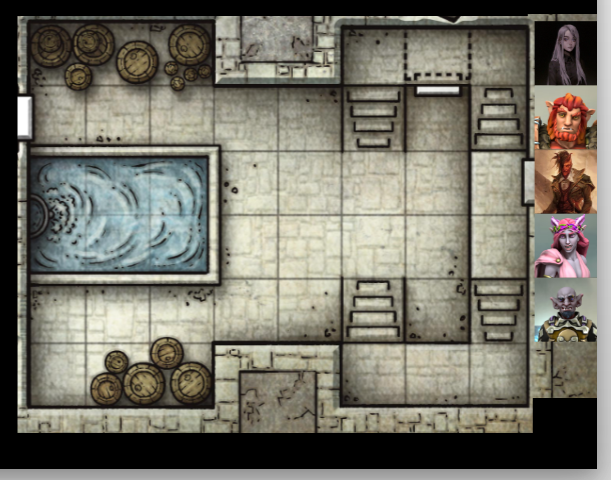
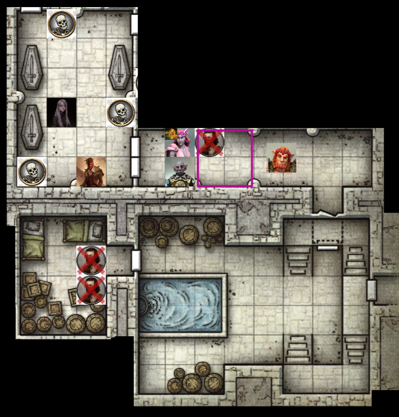
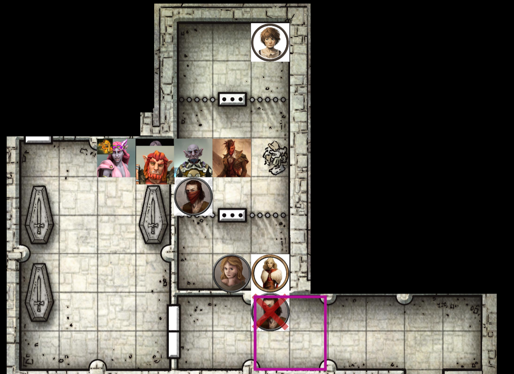

# Session 10 | 2023. 08. 27. (vasárnap)

A csapóajtón és a kőlépcsőn elindulva végig a falakon olajlámpások világítanak. A lépcső aljára érve egy csukott faajtó fogad minket. Nana ötlete, hogy vegyük fel a piros kendőket (amit még az Alvó óriásnál zsákmányoltunk). Bár nem vagyunk benne biztosak, hogy túlságosan sokat érnének - tudnak rólunk, az első naptól kezdve számítottak ránk. És míg Serafine és Nana talán el is tudna rejtőzni a kendő mögött, Rorr és Orik a maguk megjelenésével nevetségesen néznének ki a maszkokban.
Rorr azért ad kioszt egy kendőt minenkinek - Orik udvariasan visszautasítja azt. Rorr a feje méretéből fakadóan egy ideig babrál és ügyetlenkedik egy kendővel magában, végül inkább összeköt kettőt, és úgy teszi a szája elé azt.

Ashton - megunva a bugbear szerencsétlenkedését - lenyomja a kilincset. Az ajtó nyitva, egy nagyobb pincehelyiség tárul a szeme elé, egy kúria szokásos pincéje. Az ajtón átlépve egy kisebb párkányra ér, ahonnan kis lépcső a két irányba lefelé. Szemben a falon egy csukott ajtó látszódik - mellette egy beltéri medence/szökökút, a falaknál körben hordók, ládák. A jobb oldali alatt egy másik ajtó is látható.

Ashton, és nyomában Orik a két ellentétes lépcsőn indul el, szembeérve udvariasan biccentenek egymásnak.

* *`"Ha én bandita lennék, hová rejtőznék?" - 💬 [Sera]`*
* *`"Na, hogyan tovább?" - 💬 [Ash]`*
* *`"Megölünk mindenkit, akit látunk!" - 💬 [Rorr]`*
* *`"Whoah, whoah, lassítsunk kicsit! Ők határozottan többen vannak, mint mi.. És kellene egy terv is. Egyezekedni akarunk, vagy csak újraegyesítjük őket a kompániájukkal és/vagy teremtőjükkel?" - 💬 [Ash]`*
* *`"Figyelembe véve, hogy érdekünkben áll a vezetőjüket eltenni láb alól, az egyezség valószínűleg nehezen járható út." - 💬 [Serafine]`*

Orik eközben a szökökúthoz lép, megnézi mennyire tiszta a víz. 10ft mély medence, 8ft víz + 2ft perem. a víz tiszta, ciszternának tűnik. Felirat, vagy díszítés nem látszik rajta. Belenyúl, tiszta vizet vesz magához, majd megmosná kezét+arcát. A vér és kosz leoldódik a kezéről.

Rorr a hordókat nézi - kaját, piát talál (sózott hús, liszt, stb.). Átkiált Ashtonnak:

* *`"Van sör! Kérsz egyet?" - 💬 [Rorr]`*

Ashton helyesel, előkeresi a kulacsát, majd Rorr felé dobja azt. Sera eközben a szökökút melletti ajtóhoz lépne, mozgolódás hallatszik az ajtó mögül. Sera-ra vágódik az ajtó, nincs ideje ellépni. Kiront három már _"jól ismert"_ bandita.

### ⚔ COMBAT ⚔ 

* *`"Te mit keresel itt?! A többiek ott vannak hátsó szobában.. És ki ez sok ember?" - 💬 [bandita/Rorrnak]`*
* *`"Azt mondták, vigyünk nekik enni meg inni!" - 💬 [Rorr/próbálkozik]`*
* *`"Na várjunk csak..ki merne megkérni egy bugbeart erre?" - 💬 [bandita/visszakérdez]`*

Mögötte a másik két bandita nyújtogatja a nyakát, a társuk elállja az utat az ajtóban, nem férnek ki tőle. Nem veszik be a bugbear kamuját, kardot rántanak.

Sera hátralöki őket, az elöl állóra varázslatot küld, de sok külsérelmi nyom nem látszódik egyelőre. Gyorsan hátrál, mielőtt rácsapnának egyet.

* *`"Pyro-python, téged választalak!" - 💬 [Nana]`*

Az eladrin felkiáltása után egy tűzkígyó jelenik meg az ajtóban, ahol eddig Sera állt. A kígyó egyből le is köpi tűzzel az előtte álló fickót, majd kiáll az útból, a szökőkút fölött lebeg.

Orik beáll az ajtóbe, elállva az utat. Lopva Sera-ra néz, hogy minden rendben van -e vele. Zöld lángot idéz a kardjára, azzal suhant a bandita felé, de csak az ajtófélfát találja el. Rózsaszínen dereng az orra, pironkodva az elvétett találat nyomán.

Rorr elkapja az odadobott kulacsot, majd a csatához fordul. Orikot inspirálja, majd mögé lép, és átszúr Orik válla fölött a kardjával - még épp időben húzza félre a fejét. A bandita torkából vér fröccsen fel, de még életben van.

A bandita még Orikra szúr, majd megpróbál helyet cserélni a mögötte állóval. Rorrnak nem sikerül eltalálni, félti Orikot - de a hobgoblin utána rúg, nekiesik egy láda szélének, és elterül a földön. 

* *`"Maradj is ott!" - 💬 [Orik/utána kiált]`*

A következő a társa helyére lép, de Orik pajzzsal hárítja az felé érkező vágást. A másik is odaáll, de neki sem sikerül ütést bevinni.

* *`"Rorr, hol a söröm?!" - 💬 [Ashton/a bugbearnek]`*
* *`"Mindjárt adom!" - 💬 [Rorr]`*
* *`"Ezt kapd el!" - 💬 [Ashton]`*

A tiefling varázst küldve az ajtóban álló bandita felé - arcba találva őt, kifordítva az állkapcsát a helyéről. 

* *`"Ne edd meg, csak kapd el!" - 💬 [Ashton]`*
* *`"Kapd el, vagy kapd be..lehet nem hallotta jól!" - 💬 [Rorr]`*
* *`"Biztos a maszk miatt van!" - 💬 [Ashton]`*

Sera újra mormog magában, majd ő is a banditát veszi célba - egy fantom csontváz indul feléjük. Sera érzi, hogy a kéz nem jut majd elég messzire - egy újabb löketet éreznek, hasra is esnek tőle.

Nana a szökőkút mellé lép, majd tűzlabdát formál a kezében. Be is dobja a szobába, de az ajtófélfába csapódik (a kígyó kineveti). A kígyó varázsa már betalál, a félre álló állkapcson a kendő is felgyullad.

(a kígyó kiköpködte magát, nem tud felállni Orik lába közül :v #nsfw)

orik rángatná a lándzsát, nem sikerül neki... rorr hátulról segít neki (ezt nem veszi észre orik, bardic insp. used)

Orik megemberelve (meghobgoblinolva) magát keresztül döfi az első banditát, majd a mögötte állóba csap át a zöld láng a kardja végéről.

* *`"Akarsz -e alkudozni az életedért?" - 💬 [Rorr/fölétornyosulva]`*
* *`"Most hogy így mondja, kedves uram, élnék a lehetőséggel!" - 💬 [bandita]`*
* *`"Milyen alkura gondoltál, Rorr?" - 💬 [Sera]`*
* *`"Kifaggatjuk, aztán a többit majd meglátjuk." - 💬 [Rorr]`*
* *`"Készségesen válaszolok minden kérdésre, tudásomnak megfelelően. Kérlek, ne öljetek meg!" - 💬 [bandita/az életéért rimánkodva]`*

### 🕊 COMBAT VÉGE 🕊

Orik kezet nyújt, bemutatkozik.

* *`"Redbrand Ruffian #2 vagyok, csak egy utolsó bandita.." - 💬 [bandita]`*

Orik készségesen kitessékeli őt az előtérbe. A bandita félve néz a tűzkígyóra, óvatosan átlép rajta.

* *`"Megkínálhatlak a saját sörötökből?" - 💬 [Rorr/banditát kérdezve]`*
* *`"Nem, köszönöm.. Szóval, mit szeretnétek pontosan tudni?" - 💬 [bandita]`*
* *`"Hányan vagytok, hol vagytok, vannak -e túszaitok, ... ?" - 💬 [Ashton/hadarja a kérdéseit]`*
* *`"Ennyit nem tud megjegyezni.. Szóval..hányan vagytok?" - 💬 [Sera]`*
* *`"Nem tudom pontosan... Nagy mostanában a jövés-menés, mi itt _őrködtünk_..vagy mi" - 💬 [bandita]`*
* *`"Hát, azt mondjuk szarul.." - 💬 [Ashton/megvetően]`*
* *`"Mit őriztetek?" - 💬 [Orik]`*
* *`"Ezt..a kaját, a piát, a bejáratot." - 💬 [bandita/körbemutat]`*
* *`"Jól értettem az előbb, van itt más bugbear is?" - 💬 [Nana]`*
* *`"Igen, a 'fekete pók' küldte őket." - 💬 [bandita]`*

Ashton a "név" hallatán önkéntelenül is a kardjához nyúl, kellemetlen emlékek érzetei derülnek fel - képek a korábbi fogságából. A név mindenkinek ismerős, többen is hallották már, de pontosat senki nem tud, csupán a "háttérben hálóját szövő" ellenség képe van mindenkiben.

* *`"Na szóval..két dolgot keresünk.. Iarnot..meg azt a Glasstaff nevű mágust." - 💬 [Rorr]`*
* *`"Glasstaff irodája bent van a nyugati végében a pincének. Iarnoról viszont én még nem hallottam." - 💬 [bandita]`*
* *`"Ahová hogyan is jutunk el?" - 💬 [Ashton]`*
* *`"Hát..a folyosón végig, aztán nyugatra." - 💬 [bandita/nem értve a kérdést]`*
* *`"Azért valljuk be, sokat nem érsz nekünk élve.." - 💬 [Ashton]`*
* *`"Itt van egy titkos ajtó amúgy!" - 💬 [bandita/a ciszterna oldalához mutatva]`*
* *`"És az hová vezet?" - 💬 [Sera]`*
* *`"A nyugati végre" - 💬 [bandita]`*
* *`"Na és ez?" - 💬 [Rorr/a látható ajtóra mutatva]`*
* *`"Az a kriptába, és a tömlöcbe!" - 💬 [bandita]`*
* *`"Milyen foglyaitok vannak?" - 💬 [Ashton]`*
* *`"Csak civilek." - 💬 [bandita]`*

Ash azt tanácsolja, hogy a börtönben lévőket cseréljük ki a red bandana-s foglyokra - a tömlöcig pedig mi magunk is _"fogolyként"_ jutnánk el. Orik kétkedik a tervben, senki nem hinné el, hogy egy bandita kíséri az 5 foglyot - mindenféle ellenállás nélkül.

* *`"Féltem az életem - nem elfogatási parancs van ellenetek, hanem gyilok." - 💬 [bandita/közbeszól]`*
* *`"Pontosan miért is?" - 💬 [Nana]`*
* *`"Hát, Glasstaff azt mondta." - 💬 [bandita]`*
* *`"Mi sem kívánunk jobbat neki.." - 💬 [Serafine]`*
* *`"Vagy neked.." - 💬 [Ashton]`*
* *`"Kedves Ruffian, a tömlöc felé vezető út messze van?" - 💬 [Orik]`*
* *`"Nincs messze, be az ajtón, keresztül a folyosón, át a kriptán, és utána jobbra!" - 💬 [bandita]`*
* *`"Szerintem szabadítsuk ki a foglyokat.. Ha velük minden rendben, akkor pedig a kis titkos ajtón át irány Glasstaff!" - 💬 [Rorr]`*
* *`"És mihez kezdjünk vele?" - 💬 [Ashton/a banditára utalva]`*
* *`"A kriptában nem élő, de mozgó csontik is vannak, de én tudom hogy kell elkerülni! Az életemért cserébe segítek nektek!" - 💬 [bandita/alkudozik tovább]`*

Orik az arcába néz, színtiszta rémület látszik benne - valószínűleg annyira fél, hogy igazat mond.

* *`"Át kell verekedni magunkat a csontvázakon?" - 💬 [Rorr]`*
* *`"Amennyiben a kriptától visszaengedtek, áll az alku. A barátaimnak egyébként csak 'Rafi'!" - 💬 [bandita]`*
* *`"Benned nem bízom, de a barátaimban igen." - 💬 [Orik]`*
* *`"Én azt tanácsolom, hogy sose becsüljétek alá egy gyáva ember élni akarását!" - 💬 [Rafi]`*

Orik arcán a szavak hallatára kiül az undor.. Rafi kezet nyújt a hobgoblinnak, aki megszánóan elfogadja és megrázza azt.

* *`"Szóval..a kriptában van 3 szarkofág - ezek mellett vannak a csontik. Ha megpróbáltok a tömlöcbe bemenni, akkor ők megpróbálnak titeket megállítani.. De..de!! Ezek nem sima eszetlen csontikk, ezek idomított csontik!" - 💬 [Rafi]`*

Egy pillanatra hátat fordít a csapatnak, be fut a raktárba, és visszahoz 3 koszos, de használható piros köpenyt.
* *`"Akin ilyen van, azt nem támadják meg." - 💬 [Rafi]`*
* *`"Ha nem haragszol meg.. Ez a kinézetből adódik, vagy mágiából származik?" - 💬 [Orik]`*
* *`"Fogalmam nincs..ezt Glasstaff nem mondta!" - 💬 [Rafi]`*

orik megvizsgálja, de nem látja mágia nyomát elsőre. "én megoldom a köpeny kérdést"
(hogy lehet egy csontvázat idomítani? kérdi sera ash-től.. "ne aggódj, nekem is eszembe jutot.. sőt, ha a köpeny bevállik, akkor visszamegyünk a vásárba, mekkora show lesz belőle! diskurzus hogy lehetne ebből műsort csinálni, miért (nem) támadják meg egymást)

Egyre izgatottabban várom a csontikat! - sera
ash mögött meglebeg a köpeny, majd pirosra vált.
Rorr, Sera és Nana kap egyet-egyet.
orik ugyanolyan köpenyt bűvöl magára, mint a többieknél, a ruházata maradéka egy merchantra hajaz.

~~~
{🌟} +60 XP
~~~

a lépcsők közötti ajtón eltűnik Rafi, egy szűk folyosóra lépünk be utána.
szebben faragott oszlopok, poros minden. a folyosó végén duplaajtó, bezöldült réz foganytúval. az ajtó közepén egy gyászoló angyal domborműve.

bizalomgerjesztő, patináns objektum" - jelzi meg orik, indulna az angyal felé.

"az már a kripta, ahova én ha belépnék, bajban lennék" - Rafi.
"legyünk civilizáltak... hagyjuk _egyelőre_ életben." - rorr

Orik alatt beszakad a kő - még időben félreugrik, nem esik le.. 20ft mély.

Rafi kihasználva a helyzetet átugrana a gödör fölött, de Ash még időben reagál, tarkón találja a varázs, és arccal veszi a verem szélét.

"pedig én..jófej akartam lenni." - rorr.. odalép Orik mellé, segít neki kimászni a perem széréől.

"amennyiben Rafi készült arra, hogy ő túléli, de mi nem, vajon ér -e bármit a köpeny?" - ash

nana késve ér be - "mi történt? hol van rafi?"
"ott lent" - mutat rorr.

sera, ash és orik átugranak.
"menni fog ez, nana?" - kérdi rorr.
"mutatok egy trükköt!" - nana, majd átportol.. 

Sera megvizsgálja az ajtót - mágiát, csapdát nem talál rajta, de egyértelműen a kripta ajtaja.
Benyit rajta, ott is olajlámpák fénye világít. A korábban említett három kőszarkofág áll a kriptában, mellette egy-egy csontváz. kettő férfi és egy nő nemesi vonásai látszódnak kifaragva.
az északi oldalán egy ajtó, másik szarkofág mögött még egy.

~~~
{🌟} +20 XP
~~~

tanakodás, mi legyen a csontokkal - rozsdás páncél és rövid kard mindegyik mellett.. Sera félve összegyűjti a kardokat, és a gödörbe dobja.

Ash a csontvázakat nézi - leveszi az egyikről a koponyáját.
"Végülis ha akarjuk, elvihetjük későbbi használatra" - orik
"mennyire értelmes ez a mágus? " - sera
orik furán néz rá..
Ashton a koponyát is a gödörbe dobja.
Orik eközben egy csontvázat próbál a táskájába gyűrni.

"Orik kedves, segítnél"? - sera, az egyik szarkofág tetejét eltolva - orik segítségével könnyedén eltolják a fedeleket.

A szarkofágban már van egy test - egy nemesi ruha maradványaival borított csontváz, foszló hús pár helyen rajta, a kezén egy gyűrű.
Sera jelzi, hogy van ott egy gyűrű - Ash felfigyel erre. Platinum pecsétgyűrű - ragadozómadár van rajta, de nem ismeri fel. Serafinenak sem ismerős, túl sok nemesi család címerében van ilyesmi.

Mind a három szarkofágot átnézik - ugyanilyen gyűrű van mind a háromban, a kúria (~név korábbról~) nemesi családja valószínűleg.

Sera és Ash a jobb oldalra nyíló ajtó felé lépnek, és nyitnak be rajta. A földön egy nagy ruhahalom, kétoldalt rácsok. 3 részre osztott helyiség, a cellákban mocskos széna, az északiban kisfiú, két nő a déli tömlöcben. Nyakukon bilincs, egyszerű zsákruha rajtuk.

Ezután két rövid kard vágódik felé.

### ⚔ COMBAT ⚔ 

a két vágás a földre küldi Sera-t, váratlanul érte a két vágás. A másik Astonnak ront, megvágja őt.

Ash átkot küld a banditára előtte, mellbe vágja a varázslat.

Rorr is odalép, felésuhant, és átvágja a bandita fejét. biztatja orikot ismételten, majd Sera fölé lép, védve őt.

Orik mögéjük lép, majd egy nyílvesszőt küld az ajtó mögött álló másik bandita felé, el is találja a vállát.

a bandita nem fér hozzá Serahoz, emiatt a hobgoblint támadná, de az ijedtségtől melléüt.

Nana odalép Sera fölé, és felszedi őt a földről (Rorr fenekét látja először). A tűzkígyó eközben mellérepül, és a banditára lángokat köp.

Ashton átslisszol a többiek között, "hogy képzelitek hogy megvágjátok a barátomat..." felkiáltással átszúrja a bandita torkát.

### 🕊 COMBAT VÉGE 🕊

~~~
{🌟} +40 XP
~~~

A rácsok mögül ijedt foglyok tekintenek ránk. (nana kígyó: 20p telt el, még 40p van)

(note: Lionshield Coster-ben Linene árul fegyvert - Rorrnak hand crossbow/shortbow)
cure wounds-ot lecserélni -> viceous mockery? vagy valami ranged damage
