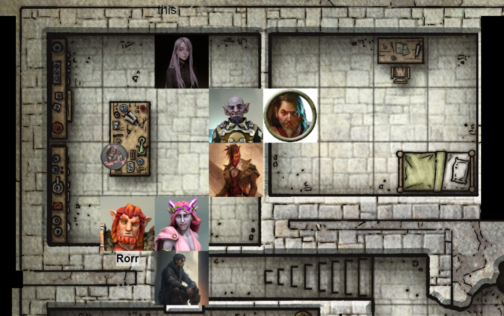
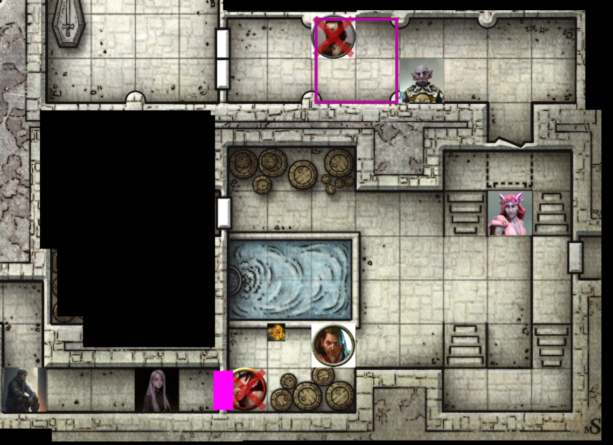
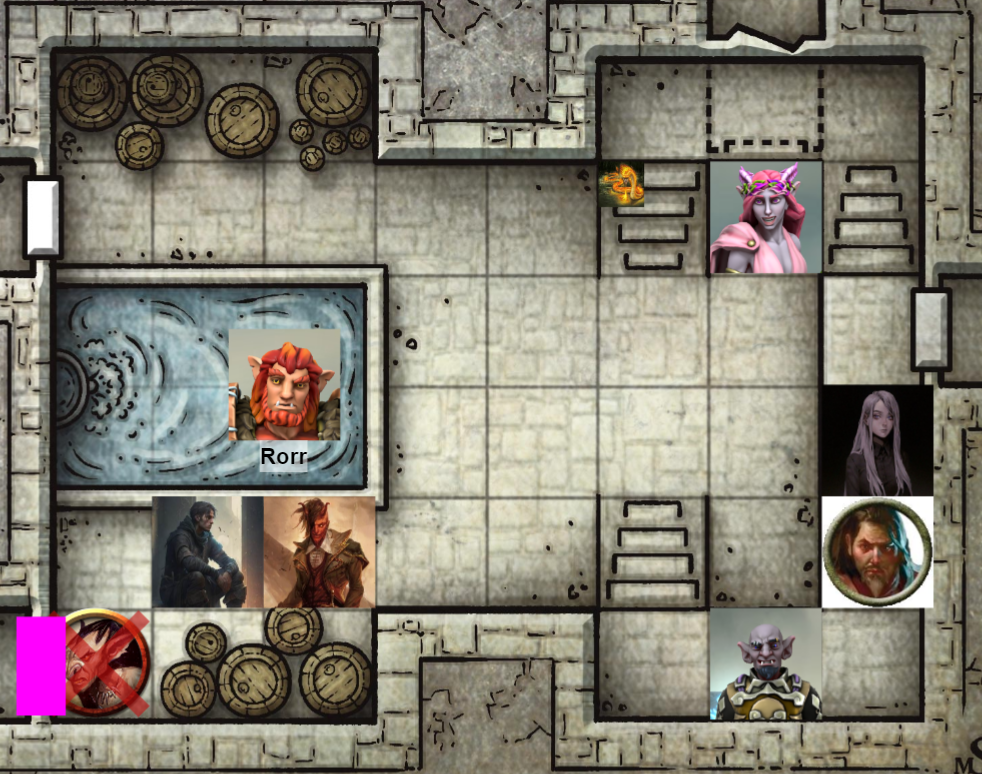

# Session 13 | 2023. 10. 27. (péntek)

Ashton: "Szerintem nincs más hátra, mint előre! Orik, eddig is olyan jól voltál, akarod e folytatni ezt a sort, vagy megadjuk valaki más, bátrabb próbálkozónak" 

menjek előre? - sera

orik csúnyán néz

"Orik, ezt idd meg.. jót tesz! " szól Rorr, valamit beletesz neki egy kupa sörbe.. Orik gyógyul.

Orik odalép az ajtóhoz, kopog, majd választ nem várva, benyit.
Első pillantásra látja, hogy egy laborba érkezett - egy varázsló irodája / munkahelyisége. kis motoszkálás, egy megtermett patkány futkorászik az asztalon. Lombikok, disztilláló cuccok körbe mindenfelé, alkímista felszerelések, bugyorgó üvegcsék stb.. Számos könyvespolc és szekrény is körbe, tekercsekkel, könyvekkel. A patkány szemléli őt, ahogy a hobgoblin belép.

"de szép nagy állat.." int fejjel ashnak.
"talán nem vele lesz dolgunk... amennyiben igen, az probléma.." ash

Orik hessegeti a patkányt - Nana ezt látja, "Orik, ne legyél ilyen gonosz az álatokkall inkább beszélgessünk vele!"
beszélgessen a ksikisasszony kedve szerint -orik
"kérdezd meg mit találunk az ajtó mögött" ash

Nana a patkányhoz lép, különös nyelven szól hozzá a fenti kérdést megismételve.
A patkány érdeklődik, de nem válaszol.

Az ajtó alól füst jön ki, majd gonosz kacaj hallatszik mögüle.. kicsapódik az ajtó, egy pirosba öltözött varázsló, egy üvegnek tűnő staffal - ami szinte vakít minket.

alacsony fekete szakállú, hosszú fekete hajú ember. klasszikus mágus kinézetű.

"Üdvözlök mindenkit, kedves vendégeim, szerény hajlékomban. először is szeretném megköszönni mindenkitnek, hogy megspóroltátok a felkutatásotok nehézségeit" - kezet nyújt oriknak.

Orik viszonozza a kézfogást.

"Orik Spellweaver.. Moderáltan örülök." megrázza a kezét.

COMBAT

Orik kezéve villámok vágnak az érintés hatására - shocking grasp

Ash'ton abban a pillanatban, ahogy a varázsló keze Orik felé nyúlt, kirántja a kardját, és felé suhant vele.

Rorr a mágus felé suhantana, de elvéti.

Orik megpróbálja kitekerni a varázsló kezét, túszként befogva maga elé, de a varázsló könnyedén félrelép, egy kacak keretében. Orik egy mérges arcot varázsol a pajzsán lévő arcra.

Vel belép a szobába, de csak beáll a sarokba, nem támad.

A mágus végigméri a csapatot, az arca előtt állók nem tűnnek egyszerű ellenfélnek, a két női csapattag tűnik "könnyű prédának", páncél nélkül. 
Nagyon gyors egymásutánban 4 ökölméretű tüskre repül Nana felé, a mellkasába csapódik - egy pillanatra lefagy, és a földre esik.

Sera: "azt hittem, hogy beszélgethetünk, de úgy tűnik, hogy nem..." néz Nana-ra.
Egy örömtelen hideg mosoly kúszik az arcára, finom dallam indul GS fejében, de a vége sikításba fordul át - a mágus láthatóan megijed, és befut a szobába, ahonnan jött.

Orik és Ash is utána vág - utóbbi mellé üt.

GS egyre kevésbé mosolyog, Orik annál jobban.

Ash belép a mágus után, enyhén kurvaanyázva átkozza meg őt, majd egy varázslatot is utána dob. A varázslat hatalmasat robban a piros köpenyes hátában, láthatóan nem esett jól neki. Valami aura mintha derengene a mágus körül.

Rorr eldobja a kardját, az íjra vált és a mágusra lő, de a vessző lepattan róla.. nem érti a bugbear, lefagy, és gondolkodik, mi történt.

"Nyugodtan vegyen részt tevékenyen a fiatalember!" kiált hátra Orik Val felé, miközben megindul a mágus felé.. Megragadja a varázslót - "Módfelett értékelném, ha egy helyben maradna..."

Val az asztalhoz lép, megragadná a patkányt egyik kezében, de az ráfúj egy nagyot, visszahúzza a karját.

A patkány az incidens után a bokájához kap, villámharap egyet.

A varázsló Orik arca elé teszi a kezét, de mágia nem jön ki az ujjaiból ezúttal.

"most hogy így siekrült nyugton maradnod, lenne pár kérdésem..." - sera, próbálja megbűvölni. A varázsló csúnyán néz rá, a kezét már a lány felé fordítva. "hol van Iarno?!" kérdezi még sera.
"A közelben.." hangzik a válasz.

Nana egyre rosszabbul van..

Ashton az ajtóba áll, és újabb varázslatokat küld a varázsló felé, betalálnak. segítene Nanának, de nem tud mit kezdeni vele.

Rorr nana fölé hajol, mormol pár szót, az eladrin feltápászkodik.. " A patkány is megtámadott minket..." mondja még neki.

Orik hátra lép, a mágus utána üt a botjával, de nem sok hatása van. A hobgoblin az íját veszi a kezébe, és a mágus felé lő vele. A vessző a mágus vállába áll, majd el is tűnik a lövedék.

Vel is megcélozza a mágust az íjával, de elsőre elvéti. A második lövés viszont talál.

A mágus "nem vagytok túl szép vendégek, mit ne mondjak.." felkiáltással a sarokba áll, a falhoz ér, a fal kinyílik mögötte, majd eltűnik egy mágikusnak tűnő effekt keretében.

A paktány még lábon harapná Velt, de félre ugrik.

Sera előhúzza a világító mecha aranyhalat, amit még a fesztiválban nyert, fényt varázsol rá, és GS után néz - szűk folyosó a feketeségbe. Egy ajtót lát, mögötte GS menekül a hódprémes helyiségből kifelé.

"ERRE!" kiált még sera a többieknek. Nana feláll, és dühösen szalad GS után.

Ash kihúzza a rapírt az ajtófélfából, megindul a lányok után.
rorr is összeszedi a fegyverét, megy a többiekkel.

"elnézést ashton, elnézést kis-kisasszony, elnézést kisasszony", furakodik orik előre, megpróbálva elállni a menekülő mágus útját.

Val is megindul, de a paktány utána harap egyet. Val dühösen visszafordul, és pofánlőné a patkányt, de elvéti.. inkább fut a többiek után.

Iarno elteleportál a veszély elől, a barlang és a szakadék közepére.. meglátja a halott notic-ot, erre kezd elbizonytalanodni, de továbbfut a barlangból kifelé, az Ash által nyitvahagyott titkos ajtó felé..

Sera utánaszalad, próbál a nyomában maradni.

Nana északról, ahonnan jöttunk próbál a nyomában maradni, átszalad a koporsók közt, átteleportál a szakadék fölött.

Ashton felszalad a lépcsőn, senkit nem lát sehol.. "Hová tűnt?!" kérdezi.
"Az alagúton távozott.. délnek!" -válaszol Val.
"A faszom.. fürge ez a szar.." - sétál vissza Rorr-hoz.

Ash körülnéz a szobában - a mágus hálószobájában van. A falakon vörös szövetek, ízlésesen/igényesen berendezett szoba, íróasztallal/székkel; kényelmes ágy, ládikó a végén.
Az asztalon szépen rendezett papírok - a legtöbb rendelés alchemy alapanyagokhoz a környező városokból - valamint egy kézzel írt levél, fekete pók szimbólummal, amelyet Ash elrak.

"nem kellünk ott fönt?" kérdi asht Rorr.
"ha elég gyors lennék, már utolértem volna.. nem vagyok friss." - jön a válasz.
"hát..gyors én sem vagyok.." - mondja a bugbear, és megnézi a ládát inkább. Felnyitja a ládát, belenéz - GS félrerakta a redbrandek zsákmányát - 130 arany, 180 ezüst, egy tasak (5 borostyánsárga kő (10g/db, 2 zöld másik drágakő (15g/db), egy gyöngy)). Két tekercset is elrak még a bugbear.
"Hátha a többiek megállítják, és utolérjük!" mondja Rorr még Ash-nek, és indul a többiek után a lépcsőn.

Orik Nana után szalad, átugrik a szakadék fölött, Nana mellett ér földet.

Val nekiiramodik, ő Sera irányából próbálja utolérni a mágust.
"te már látod?!" -kérdi a lány.
"Oy.." - szól még vissza.

GS meglepődik, hogy már a sarkában van rogue, tovább szalad - Val utána vágna még, de a lihegéstől elvéti az ütését.
"Állj az ajtó elé!" - hallatszik a pince-helyiségből.
"Drup?!" - hangzik, majd a reszketeg goblin áll az ajtóba Val útját állva.

Sera is befordul a folyosóra, ahol Drup áll.
"Drup, milyen jó hogy látlak... arrébb állnál egy kicsit?! Aztán beszélgethetünk az otthonodról, ha visszajöttem.." 
drup nem mer megszólalni, de rázza a fejét.
"te akartad.." - mondja Sera, mágikus módon hátrébb lökve a goblint.

Nana belép az első helyiségbe, Glassstaff a vízgyűjtő mellett áll egy kis szütyővel a kezében, amiből csöpög a víz.

"PP! téged választalak" - hangzik az ismerős mondat. GS félreugrik a kicsapódó lángnyelvek elől, de Drupot megperzselik a lángok- "Druuuupppp..." kíséretében elenyészik..

"Még beszélni akartam vele.." - sera.

A kígyó a mágus felé köp, de a tűzköpetet a mágus láthatatlan pajzsa ismét elnyeli.

Ash és Rorr megiramodnak Sera és Val után.

Orik is belép a pincehelyiségbe, GS-sel szembe áll.

"elnézést Glassstaff úr... csak a szekerek kiterjesztett garanciájáról szeretnék egy kicsit beszélgetni.." - majd rálő a crossbow-val.. A kieresztett mágikus lövedék átfúrja magát a pajzson, majd a mágus mellkasába áll.. Most először igazán azt érzi, hogy nagy szarban van.

Oriknak ismerős a fazon, de nem tudja hova tenni.

Val átsétál az ajtón, a crossbow-t vállhoz emeli, de mielőtt rálő, "Orrorát, a hugomat láttad, vagy tudod merre van?!" - kérdezi.
"Hát hogyne tudnám..." hangzik a válasz.
"akkor mi lenne, ha megmondanád.." 
végignéz a lyukakon a mellkasán.. " ha megkíméltek, akkor tárgyalhatunk"
"részemről a megkímélés állhat.. a többiek nevében nem beszélhetek." - val

Val leengedi a fegyverét..

GS villámgyorsan a táskájába nyúl, egy potit vesz elő, és lehúzza a fiolát - eltűnik a szemük elől.

Sera: "Álljátok el a menekülési útvonalakat!", majd a bejárathoz szalad.

nana vakon ellőtt tűzlabdája az ajtófélfába csapódik - a kígyó odébb ugrik, tüzet idéz maga köré, de a vízfelszín gőzölgésén kívül nem történik más.

Ashton beszalad a többiekhez... " Mi a fasz? Hol van GS?" -kérdi
"eltűnt.." - nana
"mindenhol.." sera
" a faszért nem ragadtok vödröt és locsoltok mindenhová vizet?!" - ash

rorr, ahogy szalad utánuk, meghallja a vezényszót, és - jobb ötlet híján - ugrik egy hasast a ciszternás medencébe - az egész termet beteríti a víz - PP nem örül neki, Orik és Ash viszont csurom víz, Nana már szárazabb.

Sera mellett teljesen száraz a fal - "ITT VAN!" kiált fel.

Orik felszalad a lépcsőn, és földhöz vág egy tintásüveget - egy pár fekete csizma kibukkan a padlón. {gm inspiration Oriknak}
"Fiatalember, úgy sejtem, ez az egyén hazudik!" - kiált Vel felé. "Értékelem az igyekezetet... ez okos volt!" súgja GS felé.
Orik hall egy kalapemelést, és egy defeated - "Ehh, köszönöm.." választ.

Val előrébb megy, hogy rálőhessen - megcélozza a falat, de a nyílvessző megáll a levegőben. Újra lő egyet, de az a másik nyílvessző mellett ugyanúgy megakad.

Egy light cantrip jelenik meg a botján, átnyújta azt Oriknak - a két nyílvessző a földre esik.

Orik tartja a szemkontaktust, fejet hajt, "Méltó ellenfél voltál.. kedves Albrek"

Orik "The end, done!" pillantást küld Ash felé.. Aki a lángoló zöld kardot duzzogva teszi.

COMBAT VÉGE

Orik a belső zsebébe teszi a "Staff of Defense" -et, Rorr kikászálódik a vízből, ázott kutyaként néz körbe - "NYERTÜNK?!" {gm inspiration Rorrnak}

elsőre csak annyit szeretnék mondani, bosszantóan kompetens ez a társaság, de gundrennek jó szeme van az ilyesmihez..
albrek úr tartozik némi magyarázattal - orik
persze, személyes épségemért szívesen válaszolok bárminemű kérdésre - de először garanciát kérek erre
ameddig válaszol, addig megígérjük, hogy nem lesz rosszabb az állapota. - ash
szívesen válaszolok, jobban preferálnék egy hivatalosabb helyszínt.. - GS
hivatalos hatóság jelenlétében is nagyobb biztonságban érezném magam - 
kezdjük a fiatalember kérdésével - orik
halvány lila fogalmam sincs, hogy kiről beszél - GS - sok ember megfordult itt nálunk, de ilyen nem rémlik.
midnenkivel tisztában van? - sera
persze, indent vezetünk. itt van a fejemben. -  GS
és velünk mi volt a tervM? miért büktök a csőrét? - sera
önökkel? szerintem erre a választ Sildart is érdekelné.
akkor mondd el nekünk, aztán sildarnak is.. - nana
nekem ez az opció nem tetszik. - GS

Rorr, milyen a víz?
hideg, de úszni kicsi.

tetszik a lelkesedése - de nem válaszolok ha nincs itt sildar, alkudozás halottan vagy halál nélkül kérdésekre válaszolva

orik, mit gondolsz, meg tudnád az összes kérdésünket fogalmazni 5 kérdésben? - ash neki.
orik vívódik belül - 
Sera kihasználva a csöndet: és sildartól kegyelmet vársz? 
legalábbis méltó eljárást
miért, ennél méltóbbat érdemelsz? - nana
elgondolkodik... igen, elvégre továbbra is a lordok szövetségének tagja vagyok.
és annak nem jár kivégzés? - sera
hivatalos eljárás nélkül semmiképp
Ashton, bár kifejezetten érdekelne a kimenetele annak, amit tervezel, de az különböztet minket _ezektől_, hogy mi civilizáltan is el tudunk járni. - orik
Halia is csinos summát adna magáért. - sera
ha már Halia is szóba került, róla is tudnék érdekes dolgokat mondani.. - GS

Itt van ez a drup.. róla tudja melyik törzsből származik? - sera
igen
így, hogy megboldogult, nem tudjuk tőle megkérdezni, mit tud a "királyról".
óh igen, King Grol ..
az ő hollétéről ha tudna infomrációt adni, szívesebben kísérnénk Sildar elé.
Az álláspontom nem változott - Sildar jelenlétében válaszolok bármire, amit tudok.
de a bugbearek pár szobával arrébb biztos tudják az infót, hogy hol van.
ők halottak.

mint látom, nem jutunk dűlőre. - ash - kénytelen kelletlen, de pár órán keresztül életben fog maradni. - sarkon fordul, és visszamegy a labor felé.

Orik elővesz egy kötelet és egy rongyot. bár nem kérdőjelezem meg az úriemberségét, de ön is megérti, hogy vannak olyan helyzetek, ahol az óvatosság a legcélravezetőbb.
csalódott vagyok, de megértem.. - tartja a kezét előre GS.
Hátra.. - Orik - majd megköti hátul a kezét -a fél lábához, a száját is betömi egy _tiszta_ ronggyal. Levezeti a lépcsőn, megáll Val előtt..
"Számíthatunk arra, hogy a továbbiakban is velünk tart a fiatalember?" - 
"ha beavattok.."
amint nyugottabb környezetbe érünk megkapja a részletes beszámolót. De röviden .. - beszámol TL;DR-ben a bánya/Gundren/Sildar/Iarno témáról.

Orik is elindul a laborhoz, Ash után, vele együtt mozog GS is, ahol Val-nek beszámol.

Rorr: GS-t meg kell ölni, Iarno-t kiszabadítani, vasra vágva a középút.

Val, honnan kaptad az infót, hogy itt találod a hugodat? - sera
erre bandukoltam, mikor összefutottam Daran Edarmath-tal - ő említette hogy errefelé látott egy hasonló lányt és egy idősebb urat.

még egy futó kérdés, nem úgy néz ki ez a társaság, mint ami egy faluból származik.. mi az összetartó erő? - val
"na majd este egy kupa sör mellett!" 

Ash olvassa a levelet közben: Lord Arbrek-nek címezve
neverwinteri kémekim jelentették h fucsa társaság van úton phandalinba. valszeg a törpöknek dolgoznak. fogja el őket ha tudja, ölje meg ha muszáj. de ne engedje, hogy közbeavatkozzonak. a térképet mindenképp szerezze meg tőlük.
számítok önre iarno, ne okozzon csalódást.. az imposztor messzi északra küldése jó ötlet volt, remélem a továbbiakban is hasonló módon együtt tudunk működni.
aláírás helyén fekete pók pecsét.

a patkány már nincs ott - ash körbenéz, de nincs healh poti. kísérletezés egy potion kapcsán, de sikertelen eredménnyel. Cetlik, papírok mindenfelé, de rendezetlenül. egy naplót talál még, törp nyelven, de nem érti.

higany, sárkányepe, porított nightshade üvegcséket talál.

többiek is ideérnek.

Nos? - orik ashtonnak
kevés érdekes, legalábbis za én tudásomhoz - ezt a 3 vüegcsét találtam. feltételezem értéket is képviselnek, bár nem számomra -db-ként 25g a jó vevőnek.

Orik odahúz egy széket, leülteti rá Ianot. Ash közben átkutatja a foglyot - a vizes szütyőben egy heal poti van benne, 50 gold, egy átlagos kinézetű ruhaszettet. - ash körbeosztja, 8 aranyat kap mindenki (sera 10et).

Orik rendesen is körbenéz a jegyzeteken és a felszerelésen - potion of invisibility-t próbált magának gyártani, sikertelenül.

a fogolynak Ash rapirját látva elkerekedik a szeme - ezt ő észreveszi, innentől érdeke, hogy életben maradjon.

Orik - "Kedves Albra úr! nincs véletlenül egy fölös, nagy értékű gyöngye? Önnek most úgysem lesz rá szüksége!" 
"egy ilyen? ez az ő ládájába volt" - nyújtja a tenyerén azt.
ha nem bánod, én tudnám ezt haszonítzani mindenyiiunk érdekében.." 
"ja, nekem úgyse kell!" - rorr odaadja oriknak a gyöngyöt.

elindulunk kifelé.

275+40 XP