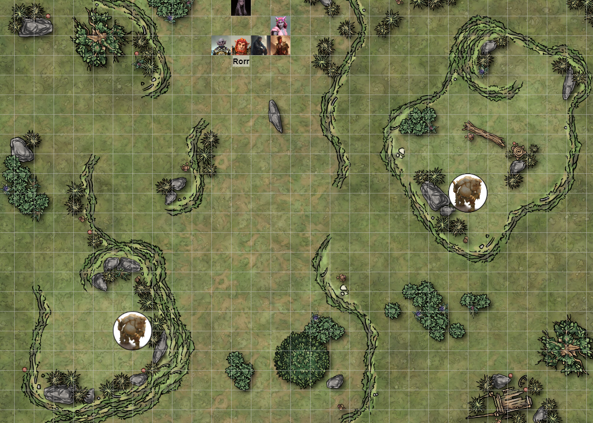
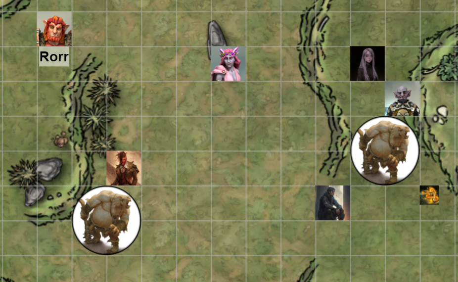
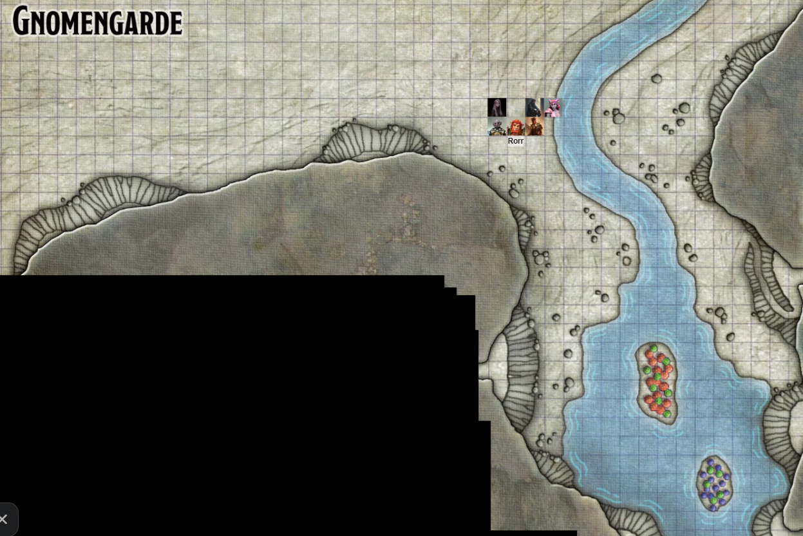

# Session 17 | 2023. 12. 16. (szombat)

elindulunk dél felé, kis ösvényen, ami Gnomengard felé vezet. Ragyogó napsütés, messzebb gomolyfelhők, Rorr elbambul, az egyik felhőnek koponya alakja van.

kb. 5 óra az út, Nana megy elöl. Néha kis kitérővel, de tartjuk az utat.
Pár óra múlva, a dombok közé érve Nana az egyik tetején egy sziklát lát, ami mögül mintha valami "kerek", félkör alakú domborulat dolog kandikál ki. Jobban megnézve a többiek is észreveszik.

Ash elküldi Bizcuit -et körülnézni. Az imp felröppen (többiek ezt nem látják), Ash szeme elfordul, és az imp szemén keresztül lát - egy megtermedt Ogre fekszik ott lesben, a domborulat a feneke - ránk vár. Bizcuit átröppen a másik oldalra, ott is észrevesz egy másik ogrét, szintén csupasz tomporral.

S: "mi a helyzet Ashton?"
A visszahívja Bizcuitet, elmondja mit látott. "2 ogre, valszeg nem csak ketten, lesben állva várnak.. vagy random vacsorát látnak bennünk vagy tudják hogy jövünk, hiszen elhagyatott út"

s: vagy türelmesek.. a legközelebbit megpróbálnám elaltatni.. Eggyel kevesebb ogréval kell akkor foglalkozni.. próba-szerencse. 

Varázsol, megremegnek a farpofák, "uuhm, borgok álmos.." - hallatszik onnan..
"ne kiabálj te ostoba, meghallanak!" - másik oldalról

s: ha el nem aludt, nem túl eszes..

"de borgok aludni akar!"
"de előbb akkor együnk! "

kiront a két Ogre a dombok mögül.

### ⚔ COMBAT ⚔ 

sera: megpróbál közelebb kerülni az egyikhez, mentálisan altatódalt próbál énekelni Borgok-nak.. Az ogre elkezd laposabbakat pislogni.

ashton közelebb fut a a második Ogre felé: "ha csak ételre vágytok tudjuk hol lehet a környék legjobb kajáját beszerezni!", közben az ogre hangszínét utánozva próbálja az ogre fejében mondani: 
"de lehet hogy van náluk kaja.. mi van ha csak kérünk tőlük? olyan sok macera a verekedés.. könnyebben is lehet ételhez jutni"
"Ogre nem kér kaja ogre elvesz kaja!"

Val is közelebb lép, de nem támad.

Rorr varázst küld az ogre felé, majd "mutassuk meg a senkiháziaknak!" -oriknak
orik elindul, nana mellé odaáll :"legalább a kiskisasszonynak legyen némi józan esze".. Sera elé lép, határozott mozdulattal maga mögé tessékeli.. "Kisaasszony, erről már beszéltünk..." Egyik kezén keszytű és sisak jelenik meg Orikon box-jellegű beállással áll.
S: "bíztam benned kedves Orik!" 

Borgok laposakat pislog, "haha, kicsi én!"
Orik felé dobja a javelint, a többiek feje mellett elsuhan.. utána leugrik, elővesz egy buzogányt és Orikék közé fut.

Nana summolja PP-t az ogre mögé.. filmesen néz egyre magasabbra a gigaogre felé, nem tudja leköpni.

A másik ogre Ash felé dobja a javelint, a sziklába vágódik és ripityára törik.. "A nyársam...!" akrobatikus mozdulattal leugrik a dombtetőről, odafut Ashtonhoz, egy kőbunkót vesz elő "HAMM!" felkiáltással.

sera szája mozog, de nem hallani mit mondd: egy másik dallam is visszhangzik a fejében tébolyult nevetéssé fajulni, de nincs sok hatása.

Ashton érzi hogy túl közel a baj, kap egy hexet, és a rapírral felé vág, talál is.
"el kell intéznem ezt a piros ördögöt előttem" - hallja ismét a fejében az ogre.

Val közelebb lép az Ogre-hoz, felévág, talál is. A crossbow-t is előveszi, a közel lévő nagy ogre feneket könnyedén megcélozza vele.

Rorr is megcélozza a távolabbi ogret, könnyedén eltalálja vesszővel.
"Szerintem menj onnan!" kiált még Ashton felé
'you dont say..' fej.

Orik a kesztyűs kezeivel üt az Ogre felé, talál is.

Az ogre kifejezetten rosszul néz ki, de hátracsap Val felé a bunkójával - elég nagyot üt rá.

Nana tűzgolyót dobna az Ash előtt álló ogre felé, de elejti azt, és lángra kap a fű a lába alatt - gyorsan odébb is lép. PP is megcélozza az ogret, de az a tűzgolyó sem ér el az ogréig.

Az ogre Ashre üt egy hatalmasat; "HAMM!" kiált fel újra.

Sera Nana felé lép; megátkozza a körülállt ogre-t. Az riadtan elindul a másik irányba, közben füléből és orrából folyik a vér..
Orik utána vág, a lehetőségen kapva hátbaüti az Ogrét, aki földrehull.

"Szívesen, kedves Orik!" - sera.

"A KURVA ANYÁDAT!" kiált rá Ash, Az ogre a fejéhez kap ezután.

Val megfordul, az Ogréra lő, több nyílvessző is belefúródik.

Rorr is megcélozza az ogre-t, tökéletesen eltalálja a jobb szemét, mely a tarkó másik oldalán jön ki. a két szem még összefordul, az ogre összeesik.. "Hammm...."

### 🕊 COMBAT VÉGE 🕊

Sera: mehetünk?
A: a faszt... Ash leül a hulla mellé, pihen egy kört.
Rorr körülnéz, de az ogrek nem hagytak zsákmányt maguk mögött.
Orik eltűnteti a kesztyűket és a sisakot magáról.

kis pihenés után továbbindulunk Gnomengarde felé.

Ritkul a növényzet, erdő helyett cserjék, előbb utóbb az is eltűnik, csak fű/sziklák.
Egy patakhoz érünk, mely tudjuk hogy gnomengrade felé vezet, azt követve megyünk a kopár hegyen felfelé.
szép fokozatosan erősődő robajlást hallunk.. a patak egy hegyoldali vájatba vezet, a dübörgés egyre hangosabb - szemközt egy vízesés zúdul a mélybe. A robaj már olyan hangos, hogy csak kiabálva értjük egymást. a vízpermet ködöt képez, de kivehető a hegyoldal. a patak tóvá bővül, két kis sziget, azokon gombácskák - nem is gombák, 2 láb magasak, mindenféle színben -  piros zöld és lila gombák vannak. A hegyoldalban több kis bejárat-szerű dolgot látunk.

Orik közelebb megy, megnézni a gombákat. Ezek nem létező gombafajok, ezen a világon nem jellemzőek, Feywild-ban vannak ilyesmik ott, ahol nagyon erős a mágia.

S: mit látsz orik?
o: "nos hát nagyon érdekes.. tulajdonképpen szemügyrevéve ezeket a gombákat.. meglepően nem várt fordulat az hogy ezek itt jelen vannak, ugyanis nem kellene nekik. lényeg a lényeg, ez a faj nem jellembő ezen a világon. találkoztam  velkük korábban ahonnan én számrmaozom, jellemzően heveny mágialenyomatok helyén nőnenk" {ordítva hogy hallja} 
s: "akkor jó felé megyünk orik?"
o: az attól függ hogy mi a célunk
{fejben megy tovább}
s: gondoltam a gnómok mágikus tevékenysége okozhatta..
o: mindenképp, érdekes hipotézis, könnyedén bizonyítható.. igen.
s: jó lenne tudni, hogy ott-vagy ott vagy ott vagy ott lehet bemenni? a híd két oldalán valamerre, vagy valamelyik barlang?

Ash átgázol a vizen, elindul a keleti oldalon a kis ösvény felé. A többiek követik, Rorr még kicsit pancsol a vízben.

Sera kelletlenül gázol a vízben, felhúzza ruháját.
o: mindjárt csatlakozom, csak egy pillanat...

o átmegy a gombákhoz, mindegyik színű gombából egyet megpróbál összeszedni. A kardjával átvágja a pirosat, olajszerű folyadék szivárog belőle utána. A zöld gomba elsőre nem adja magát, Orik újrapróbálkozik vele, a lilához is idő kell, de abból édeskés, szinte gyümölcsös illatot áraszt.

A többiek egy barlangnyílásban találják magukat, bentről fény szűrődik ki, 7ft magas, mesterséges barlang.

Ash előre kiált: "Adj isten!" mielőtt belép - bár a vízesés zúgásától nem valószínű hogy hallják. Kettéágazik a barlang, az északi fal mentén végig olajlámpások - falból kötél, plafonon csiga, onnan lógnak a lámpák. A keleti folyosó megint ketté ágazik. Rorr behúzza a fejét, különben beütné a plafonba.

Ash egy ebédlő helyiségbe toppan, oldalt egy faszekrény, benne tányérok. Nincs por, használatban lévő helynek tűnik, az asztal is szépen le van takarítva.

Sera és Val kelet felé indulnak, Nana és Ash északra. Rorr a bejáratnál várja Orikot.

Val egy tágasabb barlangot lát, a terem közepén egy emelvény, egy kör alakú platform, rajta 4 állvány, mindegyiken egy nagy crossbow feltelepítve, középen pedig egy rúd, tetején egy szék, benne egy gnome néni ül, a karfákon lévő karokat bütyköli.

Sera közelebb lép, és integet a néninek, hogy észrevegye őt.

"háh! nocsak. vendégek? idegenek? betolakodók? nem-nem, teszt-alanyok!" - kiált fel a gnome (őrült feltaláló fejjel örül).

### ⚔ COMBAT ⚔ 

{Sera, Val és a gnome}

v: "mielőtt bármit elkapkodnánk, beszélgessünk!"
gn: "tesztalanyok jó lesz, nagyon jó lesz! büszkék leszünk!"
v: én elindulnék kifelé a helyedben!
s: azt hittem csak én vagoyk gondolatolvasó.. 
s fejben: {szívesen segítünk tesztelni, ha az nem kerül életünkbe, de vendégek vagyunk, vásárolni jöttünk}.
gn: {még egy hang a fejemben, de érdekes, ez mást mond!}
S kifut a helyiségből

a platform fordul egyet, Val felé néz az egyik crossbow, megkarcolja őt kicsit {izeg-mozog a gnome, a másik crossbow a másik oldalon a falba lő egyet}.

Val egy magic handet varázsol, leguggol, a handdel az egyik kart meghúzza, a platform fordul 180at. a gnome szédülve vihog, majd kifut Sera mellé

gn: elmentek a tesztalanyok.. vagy itt se voltak? ki tudja..

### 🕊 COMBAT VÉGE 🕊

Sera még visszafordul a barlang bejárata felé, varázslattal maga felé húzza, a gnome hátraesik, nyekken egy nagyot. kiszalad a tüdejéből a levegő, majd elkezd köhögéssel vegyítve röhögni.

S odaszalad: "úristen, jól van?"
gn: akkor mégse.. mégse hallucináltam a tesztalanyt?
s: sajnos nem, de a tesztelésbe azt hiszem bele kell egyeznie az alanynak.
gn: haha-ha de hát nem.. nem tudtam tesztelni.
s: vannak itt mások is?
gn: presze  ez gnomengarde
s: és ők hol vannak?
gn: mit érdekel az engem, de rájuk nem lőhetek.. {röhög}
s: segíthetek valahogy?
gn: persze, állj meg itt egy picit.

Val beséltál, a hóna alá veszi a gnome-ot, lefogva a menekülés elől.
s: vigyük magunkkal?
v: szerintem beszéljünk a többiekkel mielőtt tovább megyünk..

visszaindulnak a bejárat felé, a gnome kapálódzik, összefüggéstelenül beszél {dolgoznia kell, tesztalanyok de mégse tesztelhet}

=============

ash tovább megy északnak, egy faajtóval találja magát szembe, rozsdás zsanérokkal/kilinccsel.
Ash bekopog - nincs válasz. Újra kopog, majd benyit - "Elnézést!" felkiáltással.
Egy konyhába érkezik, 5 kis gnome sürög-forog bent. A plafonon kötelek csigákon, minden lóg össze-vissza a teremben. egy gnome a tűz körül, egy prést használ piros gombákkal; egy kis asztalon áll és zöld gombákat présel hengerek között (kart teker), a negyedik ezeket mint a tésztát gyúrja, az utolsó pedig egy hordó mellett áll egy sámlin és a lila gombákat tölti bele.
Ahogy benyit és köszön, mindegyik odakapja a fejét, majd visszatér a munkához, és túlharsogva egymást "csukd be az ajtót!" - oldalt egy másik folyosó megy tovább.. Ahogy becsukja az ajtót Nana mögött, a vízesés moraja elcsendesül.

A: "nem akarom zavarni a munkájukban, csak útbaigazítást kérnénk. először vagyunk Gnomengardban, vásárolni szeretnénk, phandalinból jöttünk
mit, gombát?
nem, mágikus árukat/portékákat, egy olyan gnome-ot keresek aki ebben illetékes.
akkor nektek a feltalálók kellenek, Fibblestib  és Dabbledob.. 
a: igen, őket keressük. kérhetnénk segítséget merre találjuk 
dél felé, át a kötélhágsón, át a propellereken és ott vagytok a műhelyben!
értem, jó főzést/sütést/készülődést a vacsorához.
A: a járaton indulna
gn: nem arra, az a raktár!
a: elnézést, már itt sem vagyunk

nana megy a nyomában, becsukják az ajtót.

=============

s: de jó hogy látlak orik, ezt találtuk {gnome} megpróbált lelőni minket, néhány kerekét az előző szobában hagyta...
o: lehet kolléga..
orik integet, próbálja a felhívni a figyelmét és fokuszálni a tekintetét.
o: "jó napot kolléga, mihez kell a fogaskerék, meséljen!"
gn: de ha azt kicseélrem, kell egy pót fogaskerék, de akkor csak az egyik irányba forogna... {motyog tovább}
o: ha esetleg áttéteket alkalmazna? és a rugóellenállással se felejtsen el számolni!" 
gn: okos tesztalany... 
v: ő nincs itt velünk.. csak testben..
o: ez esetben, szeretnék kérni egy kis kontextust...
v: ezt a kedves hölgyeményt találtuk egy _dolog_ tetején, amivel ránk lőtt, úgyhogy hatástalanítottuk és megvártunk valakit aki ért is hozzá mi is ez.
o: jó düntés fiatalember, tudtam hogy van magában potenciál, menjünk!

visszalépünk a barlangba, Orik és Rorr is megpillantja a szerkezetet.
orik látja, hogy úgy van kialakítva, hogy 360-ban forogjon, és automatikusan újratölti a crossbow-kat. {érdekes} hümmög orik. rövid időn belül csak 2-t lehet a 4-ből elsütni.

o: "én már értem mi a hiba."
a gn kapálózik kissé val hóna alatt.
o: "szabad?" ráfog a két vállára, felemeli maga elé, felrázza picit hogy rá figyeljen.
o: "figyeljen hölgyem.

gn "na, mostmár mennék dolgozni!" - kapálózik, majd 3 csavarhúzó alakú magic missile-t lő Orikra.
oriknak dereng haloványan az orra, leteszi a gnome-ot, ráfog a vállára, és visszakézből kap egy pofont a gnome.
o: "ez módfelett udvariatlan volt!" - orik kissé nagyot üt, a gnome kiájult.
s: nekem ez így is tetszik, menjünk tovább.

====================

ash és nana mennek tovább, egy újabb elágazás felé érnek, Ash leválik, Nana a másik irányba megy.
Ash egy terembe ér, két hatalmas hordót lát, melyeknek 6 lába van, rák-ollói, tetején valami nyílással.
Bizkuit belenéz, nincs benne semmi, de karok/irányítószerszámokat lát, pedálok, stb.

Ash is csatlakozik a többiekhez, összegyűlt újra a csapat.

A: azért jöttünk hogy csesncesljünk velük.. ez nem vagyo kbenne biztos hogy jó cserealap, hogy lezúzzuk őket, azzal kezdve.
s: szerintem meg fogják köszönni.
N: a konyhában mondtákj hogy Fibblestibet és Dabbledobot keressük.
a: délnek kell menni, átkelve a függőhídon, meg propellereken utána ott leszünk.
o: biztosíthatlak róla hogy _ő_ nem a hasznos feltalálók közül való.
a: nem én vagyok aki az első követ veti azokra akik _véletlenül_ ölnek. találtam két egészen szép és furcsa tákolmányt, mechanikus rákoknak tűnnek, bár nem a mi méretünkben.
s: legrosszabb esteben a szólhatunk hogy leesett a székről a nő, és eszméletét vesztette. vagy hozzuk magunkkal?
r: de hát előbb még életben volt, csak orik akkorát lekevert neki, hogy kiájult.
v: vagy akár mehetnénk tovább..

mese arról mi történt, balesetek történhetnek.. fektessük a gnome-ot úgy mintha véletlenül leesett volna.
A: dearm-oljuk a széket hogy visszafelé ne legyen gond.

orik meghúz egy kart, az összes nyílvessző kipotyog alul. Rorr magához vesz 2-t, pótolva az ogre kalandban elvesztettet, Orik a többit zsebrerakja.

elindulunk dél felé, újabb elágazásokhoz érve.

Val bekukkant, 12 boroshordót lát a falhoz rögzítve - déli falon 4 ami csapolt.

r: előbb üzleteljünk, és majd kifelé iszunk.
továbbmegyünk, a járattal szemben egy 10ft magas platform, balra egy járat, ott pedig két gnome áll.
A két gnome felpattan, és gyanakodva néznek ránk, látják mindegyikünket!
"állj! kik vagytok! bizonyítsátok hogy nem vagytok alakváltók!" 
a: ezt mégis hogy tennénk? a kollégák a konyhában azt mondták hogy fibblestibet és dabbledob-ot keressük, 
gn: ez mind szép és jó de bizonyítsátok
r: de azt mégis hogy?
gn: az mindegy, csak bizonyítsátok!
s: a mögöttünk lévő szobában _baleset_ történt, a hölgy leeshetett a székről.
gn: egymásra néznek. "Ne tereljétek a témát!" ő mindig fölkel.
a: felröhög. ez több kérdést is felvet, de még mindig ott tartnuk hogy mi örömmel elmondjuk, hogy nem vagyunk alakváltók. a szavunkat adjuk!"
r: "én azt gondolom hogy egy elf vagyok, de látják, nem vagyok elf!"
gn: "jó ebben van valami.."
gn: de mi nem lehetzünk alakváltók, hogy különben lőni kellett volna egymásra.
a: mind a kettőnk parancsot kaptunk hogy lőjük le őket de mi nem vagyunk azok. Factoré-ért nem kell aggódni.. meg egyáltalán, nem is biztos hogy ájult, lehet hogy hazudtok!
a: azt a parancsot kaptatok hogy ha alakváltót láttok lőjetek, de egymásra nem lőttetek, tehát egymásra nem lőttetek, .... stb ok-okozat
gn: mi is tudjuk, hogy zavaros, de a parancs az parancs! és ha 'Korbosz' király parancsol valamit, akkor az úgy van! kicsit aggódunk érte.
s: miért pont az alakváltók? annyi szerzettől lehetne félni
gn: az ogreék a vadonban elvannak
a: jogos, bárki lehet az, kivéve minket, hiszen nem lőttetek ránk.
s: tehát tovább mehetünk?
gn: a feltalálókat keresitek, ugye?
a: igen vásárolni akarunk, legyen az bárhol
gn: elsősorban itteni felhasználásra gyárttanak, de biztos meggyőzhetőek
a: akkor akarjuk 
gn: át a hídon, a propellereken és ott lesznek. 
a: a királynak 
gn: Korboz király és a férje Gnerkli király..
...
menejetek tovább és maradjatok jó formában!

továbbmegyünk. a híd kissé bizonytalan ahhoz képest hogy milyen a gnome tech.

egyesével átmegyünk.

egy rövid folyosó után egy újabb barlang, amiben egy újabb fura dolog: kirajzolódik két rúd, rajta négy lapátos propeller, amik forognak, viszonylag élesnek tűnnek.

a/o{fejben}: megtennéd és megkérdezed hogy hogy kell átjutni a forgóalkalmatosságokon anélkül hogy összekennénk a padlójuakt?

o belép
gn: állj, bizonyítsd hogy nem vagy alakváltó!
o: ezen már egyszer túlléptünk.. 
gn: igen de honnan tudjuk hogy te te vagy, nem más a te alakodban?
o: ha nem én volnénk én akkor honnan tudnék a korábbi beszélgetésünkről?!
gn: ezt kellő logikával bárki mondhatja hogy már volt itt!
o: idefigyeljen fiatalember.igen nagyra tartom azokat akik felnőnek olyan hatalmas feladatokhoz mint az őrség ellátása. jómagamnak nem volna hozzá türelme mint ahogy ehhez a diskurzushoz sincs soká.. ha megtenné nekem hogy megtenné nekem hogy válaszol arra a rövid kérdésre amely proellerek felé amerre önök irányítottak 27 mp-cel ezelőtt, hogy volnánk hivatottak azokon túljutni?
gn: azok azért vannak hogy kívültartsák azokat akik alakváltók. másrészt kellő agytornával könnyű kitalálni hogy kell kikapcsolni őket.
o: {...} köszönöm a szíves segítségét fiatalember... lekötelez. {megfordul és ellép}
gn: áálj! nem bizonítottatd hogy nem vagy alakváltó
o továbbmegy..
figyelmeztetőlövés gyanánt kap 3 magic misslet kap..

orik visszafordul, magához rántaná mágiával az egyik gnome-ot..de sikeretelül.
orik bőre nagyon élénk világoskék árnyalatot öltött, Nana és Rorr ezt észreveszi.
gn2: erre semmi szükség nem volt, mi munkánkat végezzük.. az alakváltók visszaváltoznának támadáskor! maga nagyon rossz vendég.
n: önök meg nagyon rossz vendéglátók.

o: átmegy a hídon, A mellett megáll, szemkontaktus, mély sóhajtás, és megnézi a propellereket.
ellentétes irányba forognak, de a falban véset nyomait veszi észre. A terem másik oldalán van egy kallantyú.

V: figyeljetek, hadd próbáljam meg..
mage handet idéz, meghúzza a kallantyút, megállnak a propellerek.

Egy újabb folyosó, mely lépcsőbe kanyarodik.

n: "Orik, kissé leégtél.."
o. parancsol?
"kissé leégtél."
o látja hogy világoskékek a karjai.
o: 

r: biztos a varázsgombák miatt, látod ezek is azt eszik, milyen bolond volt az a nő is ott..
o: azt kell mondjam egyetértek a hipotézissel drága Rorr, nem tudom mi okozhatja.."
s: jól vagy? 
o: rég éreztem magam ennyire .. feszélyezve ..
s: akkor heal poti nem segít?
o: ami rajtam segítene az rengeteg illemtan óra..
s: akkor nem vér?
aA: valaki vért mondott?!
o: úgy látom ma mindenki becsmérlő kedvében van.. z az ideillő válasz talán..
s: szerintem is jól állna nekik egy kis vér..

Orik combat ready.

élénk vita hallatszik a következő teremből.

egy oriknak tetszetős terembe, egy workshop-ba érkezik. körben asztalok, rajtuk félkész/abbahagyott találmányok. túloldalt egy 10ft magas perem, amin fa emelvény, rajta pedig könyv.
lent két gnome erőteljes heves vitában.

közeledve a vita témája is érthető: Korboz király őröletén hogy lehetne segíteni: a férfi gnome egy józanító sugarat vetne be, a nő ezt lehurrogja, egy kényszerzubbony mennyivel hatásosabb lenne.
belép Ash is: "alkalmatlan időben jöttünk, nem akarunk zavarni..amennyinben tudunk örömmel segítünk önöknek is, de vásárolni jöttünk. 
gn: férfi: fidlestib nő doubledob. nem tudom mit hallottatok a vitából, árulni nem fogunk, de ha tudtok segíteni, akkor 6 friss elmével talán valami újra jutunk.
a: idefelé több különc honfitársukkal találkoztunk, el tudjuk jképzelni hogy nincs minden a legnagyobb rendben.
gN: ha meg tudjátok oldani az őrületet ami a királyon úrrá lett, a kincstárból fel fogunk tudni ajánlani valamit.
a: akkor az elejéről mint egy jó történetmondó meséljétek el, hogy mi történt, és mivel próbálkoztatok.
gn: az elmúlt egy hétben két társunk eltűnt, de nem ez a fontos.hanem korboz király ebbe beleőrült, alakváltókról fecseg, bezárkózott a trónterembe, és addig nem jön ki amíg alakváltókat el nem kapjuk
a: akkor ez teória?
gn: fogalmunk nicns van -e alajpa, vagy megőrült.. józanítósugár vagy kényszerzubbony
s: lehet fontos az eltűnés, erről tudnak valamit?
gn: nyom nélkül eltűntek
s: ki és milyen szerepük volt?
gn: orin és warin a folyosókról , nyom nélkül
a: hol látták utoljára őket?
gn: nem tudjuk
s: ki látta őket utoljára?
gn: azt se, nem si tudjuk mikor/hol tűntek el, nem is egyszerre
s: mi köze az alakváltóknak ehhez
gn: semmi ez a baj ne mtudjuk
v: a másik királnyka mi a vélmeyénye?
gn nem tudjuk
a: mióta bezárkóztak nincs kontakt velük?
gn: korboz csak az alakváltókról hebeg, amik tűnjenek el.
a: megtennék azt nekünk hogy körbevezetnek mert nnincs helyismeret hátha találunk valamit ami alakváltókra utal, már többekl is volt szerencsénk találkozni.. ha itt vannak alakváltóz biztos érszervesszük, illetve hátha a két entűnt társuk nyomára bukkanhatunk, hogy enyhítsük a paranoiát.
gn: nincs időnk ilyenre, amíg zárt ajtóba nem ütköztök nyugodtna menjetek bármerre.
a: mint a közösség kiemelkedő tagjai ezt foglalják írásba, hogy ilyen alakban itt vagyunk és önök szolgálataiban vagyunk.
gn: ez kissé köröülményes de legyen.

s:mindig ilyenek voltak?
gn? milyenek?
o: ostobák..
s: különcök
gn? mi vagyunk itt a különcök.
s: a király inkább magukra hasonlít vagy a többiekre?
gn: nem értjük
a: mentalitásban, habistusban.
gn: itt mindenki feltaláló de mi vagyunk a legjobbak.
a: semmi, nem lényeg. mi megyünk és a közös problémát felderítjük, 
s: még egy kérdés, a különös gombákat mire használják és mióta?
gn: évszázadok óta, mióta megalapult gnomengarde, piros: olajat préselünk lámpáknak, zöld liszt kenyérnek, a lilát fermentáljuk bornak.
a: ezen kívül van -e bármi eszköz ami kiszűri az alakváltókat?
gn: eszköz nincs rá, ha támad vagy sérülés éri, felfedi az alakját.
o: ez a hiptézis alapjában hibás.. ugyanis az alakváltó mivoltától vagy eredetétől függően képes legyen arra hogy koncentráció fenntartásával megőrizze alakját, nem garantálja semmi hogy visszaveszi eredeti alakját.
gn: igen, ezért csak általában... fejlett tudás szükséges az ilyenhez, erre kevés eséllyel jár ilyen lény.
a: ha van önöknél kéznél örömmel szolgánla ha tudnának kölcsönözni egy tűt..

tűszúrás hogy ki alakváltó vagy ki nem...
...
orik körbenéz addig, mindenféle gadget.

A megszúrja az ujját egy nyílvesszővel, "bizonyítva" hogy nem alakváltó. Erre kéri a két gnome-ot is. mind a kettő kitartja a kezét, felszisszennek, eredeti alakban maradva.
bizonyítottuk egymásnak, hogy nem vagyunk alakváltók.
a: önöknek jó munkát, mi pedig átnézzük a helyszínkeet..
gn: tovább egyenesen a trónterem, jobbra pedig a királyi háló ahova bezárkóztak.
