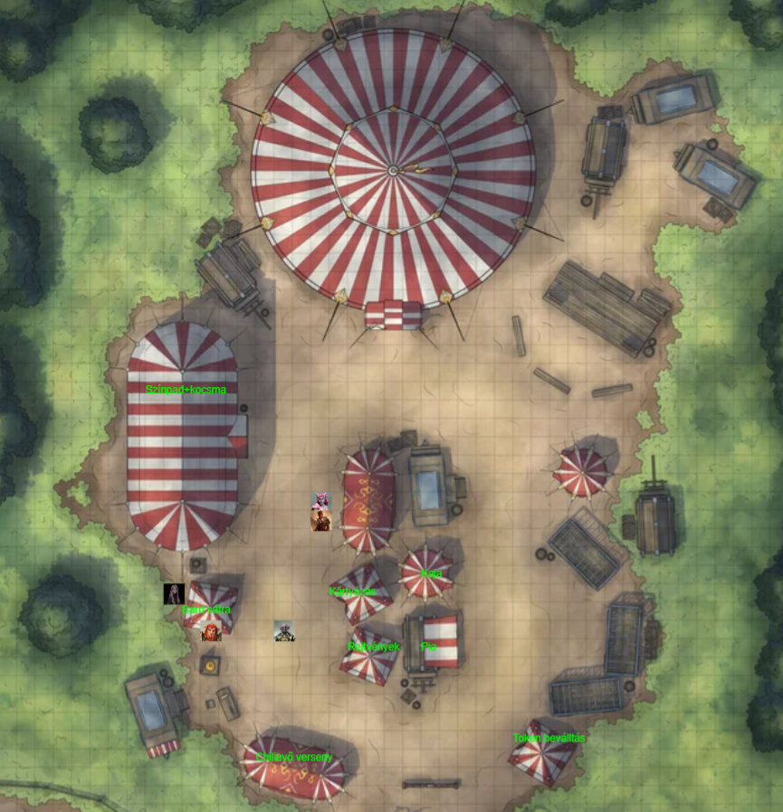

# Session 2 | 2023. 06. 04. (vasárnap)

Orik a szekér hátuljához megy, félbevágja a kötelét, és kis karikában tekeri össze a földön. Elmormol pár varázsszót, egy `snare` hatású mágikus csapdát csinál a kötélből - ez számunkra láthatatlan, nem is szól róla.

A forgalom eléggé csökken az úton, javarészt járőröző katonák mennek - szúrósan nézve ránk, de nem állnak meg kötözködni.

*`"Mi rímel arra, hogy kitépett szív?"`* - kérdez fel néha Rorr a napi történéseket jegyzetelve.
Egy *vitéz vezír*-ről énekel Ash (mindig rímelve arra, amit Rorr kérdez).

*`"Addig amíg mi dalolászunk, lenne -e kedve ellátni a company-t vacsorával?"`* - kérdezi Ash Nanát a szekéren lévő rationre utalva. Nana begőzöl, eltöri a ceruzát. *`"NEM!"`* - majd színez tovább egy másik ceruzát elővéve.

Orik bebólint a tűz mellett. *`"Na majd én hozok.. úgyis éhes vagyok már én is!"`* - mondja Rorr. Kiosztja mindenkinek, majd elkezdünk vacsorázni - Nana színez tovább. Orik felébred, megköszöni.

Tiszta, hold- és csillagfényes éjszaka van. A tengert már nem látjuk / halljuk, füves tisztás mellett vertünk tábort. Az éjszakai neszek is, tücskök, bogarak is hallhatóak. Ash nézi, ahogy Nana piros ceruzával folyton a vonalon kívül színez. Néha, sejtelmes sugallatokként tűnnek fel szimbólumok (krix-krax, "szép álmokat", "holnap majd meglátod" stb, kétértelmű jelek) - Ash szórakoztatja magát.

Ash jó éjszakát kíván, majd az egyik sátorba vonul - Serafine követi. Rorr hangosan horkol a tűz mellett - ez Nanát eléggé zavarja. *`"Nem kéne horkolni.."`* - hallja folyamatosan Rorr a fejében - de nem foglalkozik vele.

*`"Ash.. feláldozhatónak tartasz?"`* - kérdezi Serafine Ash-t a sátrukban (csak fejben beszélgetnek). *`"Nana majdnem meghalt.. Nagyon kevesen múlott, hogy nem én voltam ott."`*. Ash kerüli a választ, erősködik, hogy nem történt baj. Serafine újra és újra választ követel.. Ash rákérdez, hogy milyen kontextusban kéne feláldozni őt - ez befolyásolja a válaszát. Serafine kérdőre vonja, hogy miért egyből harccal kell megoldani a problémákat, ahelyett, hogy hagyna időt a konfliktusok másféle rendezésére. Weird beszélgetés - *`"Gondolkodj, mielőtt lősz!"`* - zárja rövidre Serafine. Visszaadja Ashnek az arcképes coint, amit még Orik bűvolt nekik. *`"Egy sajnálomot azért kipréselhettél volna.."`*. *`"De hát nem sajnálom!"`* - válaszol kajánul a halfling, mielőtt ő is nyugovóra tér.

Orik eldől a fűbe a tűz mellé, ott alszik tovább. Nana, meditálását befejezve egy falevelet keres - rajzfilmesen Rorr szájára teszi - aki a légzésével emelgeti azt. Nana őrködik, míg a többiek alszanak.
A tűz kezd kialudni, Nana tesz rá még, hogy ne aludjon ki.

~~~
{💤} long rest
~~~

Pirkadat felé a többiek is szép lassan felébrednek, Orik még szuszog. Összeszedve magunkat Orikot is felkeltjük. Kissé pironkodik, nem a koszban akart elaludni. Ash leporolja őt, aki megköszöni ezt. Szépen lassan bontjuk a tábort - az ökröket Serafine kezeli, beköti őket a szekér elé. A sátrakat is összeszedjük, majd elindulunk tovább az úton.

Kora reggel van, a forgalom szép lassan kezd beindulni - könnyebb lovasok vannak az úton még főleg. Lágy szellő fujdogál, suhog a rét. Nana az orra alatt morog - láthatóan nem élvezi a többiek számra kifejezetten tetszetős időjárást. Ash 3 kavicsot ad Serafine-nek, aki egy kék, egy zöld és egy piros világításos bűbájjal látja el azokat. Ash gyermeki örömmel kezd zsönglőrködni velük, a cirkuszos dalt dúdolva (*[Entry of the Gladiators](https://www.youtube.com/watch?v=_B0CyOAO8y0)*).

A szembe forgalom elég ritkás - kereskedők és katonák főleg, a családias szekerek nem jönnek már. Egy-egy mosolyt Ash mutatványa ér, de coint nem dob senki.

Egy óra utazás után Nana lesz figyelmes elsőre némi zsivalyra - az út egy kisebb dombot kerül meg - ott hasonló papírsárkányos karavánok, vidám hangulatban hallhatóak. *`"Nézzétek, ezek a gyökerek is hogy örülnek.."`* - mondja Nana a bulira utalva.

Ash egy zöld sárkányt bűvöl a szarvai közé. *`"Ilyen sárkányt én is bűvöljek magamra?"`* - kérdezi Rorr Ashtől, aki helyesel - ennek hatására Rorr is bűvöl egy zöld sárkányfejet magára.

A kanyar után szines, csíkos sátrak, elkerített póznás részek, szalagok kikötve a zöld minden árnyalatában. Papírsárkányok bűvölve repülnek mindenfelé. Az emberek nyüzsögnek mindenfelé, az út túloldalán egy szekérparkoló.

Az egész bejáratánál egy törp kedélyesen kiabál felénk - egyelőre nem értjük mit mond. Közelebb érve már kivehetőek a szavai: *`"Itt a sárkányfesztivál - 100 éve történt Lady Alagondar győzelme Azdraka felett. Étel-ital tematikusan! Kihívások és szórakozás az egész családnak!"`*.

Ash szívesen benézne, de a szekeret nem akarja őrizetlenül hagyni. Orik felajánlja, hogy ott marad - *`"nem akarok fölösleges feltűnést kelteni"`*. Ash erre megjegyzi, hogy szívesen hoz vásárfiát neki bentről. Orik átgondolja, a szekér mögé lép, majd visszatérve egy Orikhoz hasonló, de emberi külsejű alak lép ki. Ash szeretné megtanulni ezt, de Orik egyelőre nem tudja megtanítani neki. *`"Rorr, még mindig én vagyok jómagam."`* - jelzi meg Rorr fura tekintetét látva.

A szekérparkolóban őr is van - `P+R` jellegű. Rorr megpróbálja kideríteni, hogy vállalnak -e garanciát az itt történtekre és az árura. Az őr elmondja, hogy ők csak felügyelnejk, írásba nem tudják adni. De a főnök a kapunál (a törp) tud ilyet. *`"Bordaec Coinbranch, a házigazda"`* - mutatkozik be a törp, akinek hangját már korábban is meessziről hallották. Ash megpróbálja kideríteni, hogy vállalnak e írásos garanciát - elvégre a Lordok szövetsége pénzeli a fesztivált, és az egyik Lord megbízatásából járunk el. Lyukat beszél a törp hasába. *`"Sildar itt járt tegnap délután - szólt, hogy ti is benéztek egy-két napon belül."`* - elő van készítve minden, egy előre megírt papír van nála, melyben a két legjobb zsoldost állítja a szekér őrzésére.

Visszamegyünk a többiekhez - elmondva, hogy írásba foglalták a dolgokat. Orik egyből elkéri a papírt, és átnézi alaposan, majd nyugtázza, hogy minden rendben van. Két halfling segít a parkolásban nekünk. Amíg Ash leköti (letakarja) a ponyvákat, az ökröket elviszi az egyik halfling, a másik füttyentve két human őrt hív a szekér mellé. Nanat is sikerül meggyőzni, hogy tartson velünk.

Kora délelőtt van, kifelé nem jön még senki, belül sincs nagy tömeg, de szépen lassan gyűlnek a bentiek.

*`"A legendának megfelelően Lady Alagondar emlékére vannak különféle játékok. Sárkánycsata, kard kihúzás a koponyából - ez még magának Sildarnak sem sikerült!"`* - jelzi Bordaec a kapunál, a benti programok kapcsán.

Rorr a legelső sátorhoz lép - egyből mellettük - **'Sárkány chili evő verseny'** - *`"Na, ez nekem való!"`* - mondja, és belép, a többiek követik.

Közvetlen a bejárattal szemben a fallal párhuzamosan hosszú asztal van - megterítve. Oldalt kis ad-hoc konyha fazekakkal, benne egy nagyon-nagyon-nagyon kövér gnóm tüsténkedik. Tempósan, vidáman készíti elő az ételt. Néhány vendég már várakozik, egy wood elf férfi, egy pici félszerzet lány, egy half orc amazon csaj.
Ash a gnómhoz lép - *`"Ide csalt minket az orrunk, nem véletlenül. Mik a szabályok?"`*

A gnóm egyből válaszol: *`"Persze! Sumus vagyok. Én készítem a sárkány-chilit (nem egy gyenge cucc), már három nevezőnk már van is. Mindenki egy tál chilit kap, 5 ezüst a nevezési díj, a győztes pedig 20 fesztiváltokent (🎫) kap. A mágia kizáró tényező. Még három hely van az első körre!"`*

Ash Rorra néz: *`"Beszállunk?"`* - *`"Naná!"`* - lelkesül a bugbear. *`"Én is csatlakoznék eme kurinális kihíváshoz"`* - mondja Orik.
Rorr leszámolja a nevezési díjat (5 🥈), majd az asztalhoz lép, helyet foglal, a másik kettő is fizet, és követik őt.

Egyelőre még csak a kanál van az asztalon, tányér nincs. A fél ork már könyököl, a Wood Elf kihúzva magát ül. Kisvártatva a chilit is hozzák Sumusék. Középen megáll, két tucat ember kíváncsi ránk. *`"A szabályokat mindenki ismeri. Habozni nem szabad, egyetek jó étvággyal. Rajt!"`*

Megkóstolva a chilit az első falatnál érezzük, hogy nagyon finom. Rágódva rajta viszont érződik, hogy van ereje, de megéri.

Az asztal túl végén a félork amazon belapátol 5 kanállal, majd elvörösödő fejjel kiköpi azt. *`"Meg is van az első kiesőnk!"`*. Az ork lebassza a tányért, majd kiviharzik a sátorból. A félszerzet szépen kanalazza magába, a wood elf pasi megízleli azt, *`"Ez nem jó.."`* - majd beáll a tömegbe.

Továbbra is jó étvággyal tömjük be, de kezd gyöngyözni a homlokunk.. Lapátolva a chilit már a tarkónk is izzadásnak indul.. A félszerzet véletlenül az ölébe önti a tálat..majd elpityeredik. Orik felpattan és odanyújtja a zsebkendőjét, majd új terítéket kér neki. Sumus diszkvalifikálja mind a kettőjüket - a kieső idő negatívan hat a versenyszellemre. Orik az etikett előbbrevalóságáról mormol valamit az orra alatt, de elfogadja a szabályokat.

Rorr és Ash kanalazza tovább a chilit - kezd kiürülni a két tányér. A tömeg lelkesen morajlik, a csatározást örömmel fogadják. A thiefling átszól, hogy erről még dalt kell írni - Rorr felröhög és bólint.

Ashton fehéredni kezd, Rorr viszont egy apró büfivel felköhög némi chilit - ezzel ő is kiesik, Ash a győztes, a tömeg ünnepli őt, de megpróbálja befejezni a maradékot.. Már-már rózsaszín, de legyűri az egész tálat. Sumus elalél, hogy ennyire tetszik valakinek a főztje. A wood elf versenyző is tapsol, a félszerzet is hüppög, de elismerően bólogat. Ash tejet kér - a kocsmasátor felé irányítják őt emiatt. 20+10 🎫-t adnak Ashnek (10 🎫 bónusz az üres tányérért).

Orik megpróbálja vigasztalni a kislányt, egy bűvölt érmét nyújt át neki - egy zöld sárkány képe jelenik meg rajta (Ash érméje ezzel resetel). Tetszik neki, örül az ajándéknak.

Kifelé menet még több embert látunk a karneválon körbe. *`"Kötelességemnek éreztem, hogy tájékoztassalak: a korábban nektek adott csecse-becsék nem öröklétűek, a neked ajándékozott érme effektjét meg kellett szűntessem, hogy a kislányt felvidítsam."`* - mondja Orik Ashnek. *`"Ez jól elköltött pénz volt"`* - jelzi Ash, és visszaadja az üres copper érmét.

A következő sátor fölött **'Tridraka rejtvényei'** felirat van, bekukkantunk oda is. Belépve oda két dolgot tapasztalunk: a beltér tágasabb, mint kívülről tűnt, illetve a benti csendbe nem hallatszik be semmi kintről. Félhomály van a sátorban, hold, csillag, sárkány rúnák világítanak a falakon. Középen egy pici asztal, mögötte egy pici csuklyás alak ül, invitál minket. Két fejtörőt kínál, darabját 5 ezüstért. Ash egyből befizet, bízik bennünk. Orik még 5 ezüstöt nyújt oda - *`"Mind a két rejtvénnyel megpróbálkoznánk."`*

*`"Az első rejtvény így szól:"`* - mondja a csuklyás alak.

> *Mikor fekszel, ő akkor kél.  
> Egyszer egész, máskor csak fél.  
> Nincsen tüze, mégis lámpás,  
> A vándornak szinte áldás.*

Ash gondolkodás nélkül vágja rá: *`"Ez a Hold! 🌕"`* - a többiek is erre a következtetésre jutottak. *`"Nagyon jó! De ez még csak a bemelegítés volt ám!"`* - hangzik egy vékony hang a félhomályból. Az asztalon közben 2x20 🎫 jelenik meg.  
*`"Na de most jöhet az igazi kihívás!"`* - mondja újra a hang.

> *Mikor megkapod, értékét nem tudod.  
> Bár megvehető, el nem lophatod.  
> Gazdag és szegény is könnyen adja.  
> Becsületes ember sajátját megtartja.*

A kis csuklya pásztáz minket eközben, több szólamú kuncogást hallunk. Orik megkéri őket, hogy ismételjék el mégegyszer. Orik sejteti, hogy az *"ígéretről"* van szó - ugyanabban a hármas szólamban *`"Úgy van!"`* hangzik. Serafine megkérdezi, hogy hol lehet azokat felhasználni - a bejárat mellett jobbra.

A sátorból kilépve megcsap minket újra zsivaly - lassan delel a nap.
Rorr a következő sátor feliratát is megnézi: **'Találd meg a zöld sárkányt!'** (itt a piros hol a piros). Rorr nem érti, mit kell azon keresni, körbe mindenhol az van, erről szól az egész fesztivál, de követi a többieket.

Egy megtermett dragonborn férfi ül krupiéként az asztal mögött, csalódottan áll fel az aktuális játékos onnan. Többen röhögnek rajta.

*`"Szervusztok! Üdv Frederichnél! Egy kis játékra jöttetek?"`*  - invitálja az új játékosokat a játékmester. Rorr kap egy 🎫-t, miután ott is elmondja, hogy a sátor neve számára "félrevezető".

Nana leül játszani - az első kört meg is nyeri. Még egy körre befizet - kis segítséggel Serafine-tól itt is eltalálja a helyes lapot. Frederich rákérdez, akarnak -e még egyet játszani, rábólintanak - ezt is eltalálja Nana. Többen elismerően bólogatnak. Ash rákérdez, hogy oszthat -e egyet Frederichnek. Tét nélkül benne van. Ash elkéri a lapokat (két szürke és egy zöld sárkány), majd megbűvöli a zöldet, hogy az is szürke legyen.

Ash összekeveri őket, majd rákérdez a közönségnél, hogy valaki fogad e rá vagy Frederichre. Az egyik egy ezüstöt hajlandó felajánlani, hogy eltalálja Frederich. Ő kicsit tétova, de végül rámutat a baloldalira. Ash leleplezi a csalását, ez Frederichnek annyira nem tetszik, de nem szól be.
Nana odaadja a nyert 35 🎫-t Ashnek, hogy egy helyen, közösen gyűjtsük őket. Kilépünk a szabadba, és a szemben lévő, zárt sátor felé fordul figyelmünk.

*`"Hát itt vagy te ebadta, merre jártál eddig?"`* - hangzik Bordaec hangja. Közelebb lépve rájön, hogy összekeverte Asht a saját bardjával. Ash jelzi, hogy bizonyos ellenszolgáltatások mellett ő is tudna előadást szervezni. Ha 10 percen belül megtanulja és előadja a dalt, 100 🎫-t ajánl érte a törp. Ash próbál alkudozni, hogy még 5 sört is kapjunk érte, de ezt lezavarja, most nincs idő ilyenekre. A törp a lezárt sátorból előhozza a kottákat, odaadja Ashnek - a kocsmasátor színpadán kell 10 perc múlva fellépni.

Orikról idő közben leesett a disguise, de ez nem zavar senkit.

Ash, Serafine és Nana átmennek a kocsmasátorba - az előadás kapcsán. Serát kéri meg Ash, hogy súgógépként funkcionáljon. Orik és Rorr hátra marad átkutatni a sátrat az eltűnt zenész után kutatva.

Egy pici lakósátorba lépünk - kis szalmaágy igényes ágyneművel, asztal papírokkal, nagy, csukott gardrobszekrény. Egy másik pici asztal van mellette, sminkes jellegű. Elszórtan papírok, kis székkel.

Orik tetlegességre utaló nyomokat keres - a rumliban nem sok mindent talál. Rorr a papírokat nézegeti az asztalon - van pár értelmezhetetlen jelekkel ellátott (kotta), mellette szöveges balladák. Egy goblin komika (túl nagy fejsze), egy szerelmes óda, és egy hősi eposzt is talál: Lady Alagondar balladájáról, a törzsszöveget. Rorr ezt elteszi magának (Orik szerint szürke zónában vagyunk a lopás tekintetében) - hogy megismerje a sztorit:

> *Neverwinteri királyi család mellékágának örököse. 1390-es években toborzott két kalandor csapatot a sárkány legyőzésére. Az elbeszélés szerint innen nem messze északra zajlott a csata, (fél napi járás), a sárkányt legyőzték, a 8 kalandorból 4 ott maradt, majd később a Lady is belehalt a sérülései kapcsán. A királyi család kérésére az 5 elhunytat közvetlen a sárkány maradványai mellett temették el.*

Orik az asztalhoz lépve még alatta is talál papírokat. Az egyik egy levél, amit el is olvas.

> *Te hitvány törp!*
>
> *Amit ezzel a karnevállal művelsz, az sértés a sárkányokra nézve.*  
> *Ha nem szünteted be, komoly következményei lesznek.*
>
> *A sárkányszekta*

Orik átnézi a szekrényt, a bárd faját kutatva - konkrétat nem talál, de nem törp ruhák a méretükből adódóan.

Rorr rákérdez, mi az a sárkányszekta. Orik ismerős a témában: [`Cult of the Dragon`](https://forgottenrealms.fandom.com/wiki/Cult_of_the_Dragon). Mondja, hogy nem jelent valószínűleg jót a törp számára. Átsétálunk a kocsmasátorba mi is, hátul megállunk.

A tömeg egyre nagyobb, a sátor tele, Ash készül az előadásra - egy zöld sárkányt varázsol ő is a páncéljára.

Ash a fejében megszólal Rorrnak, hogy megfelelő helyeken lépjek majd be a dal közepén a dobbal. Ashton nekikezd a balladának, időrendben, szépen haladva. A csatához érve Rorr is becsatlakozik a dobjával háttérritmusként. Ash a szöveget és a zenét is jól csinálja, a dob is emel rajta.

Az előadás végén a taps és ujjongás közepette Bordaec is gratulál. *`"Tudod mit? Jár az az öt sör!"`*

*`"Elképesztően elfáradtam, mivel fogod ezt meghálálni?"`* - mondja Sera.

Bordaec 5 korsó sört is hoz - megköszöni az előadást. Mindenki elveszi a sört - koccintunk egy nagyot. Ash szerez egy kupa bort Seranak (aki nem iszik sört), majd együtt átvonulunk a korábbi sátorba az eltűnt félelf/bárd sátrába.

Az eltűnt bard kapcsán beszélgetünk egy kört. Rorr többször közbevág, de Orik rosszalló tekintetét látva inkább befogja. A hobgoblin részletesen ismerteti a látottakat: Bordaec szerint nincs miért aggódni, a fenyegető levél már napok óta itt van, de következménye úgysem lesz, a sárkányszekta csak pár csuhásból áll, nem mernek cselekedni, csak nagy a szájuk. A bardra utalva megjegyzi, hogy csak gyáva volt a félelf, azért futott el.

Sera kívül keres külsérelmi nyomokat. A száraz, poros talajban a sátor mögé tartó elegáns csizmatalp nyomait látja. Szól Oriknak, hogy vegye szemügyre azokat.
