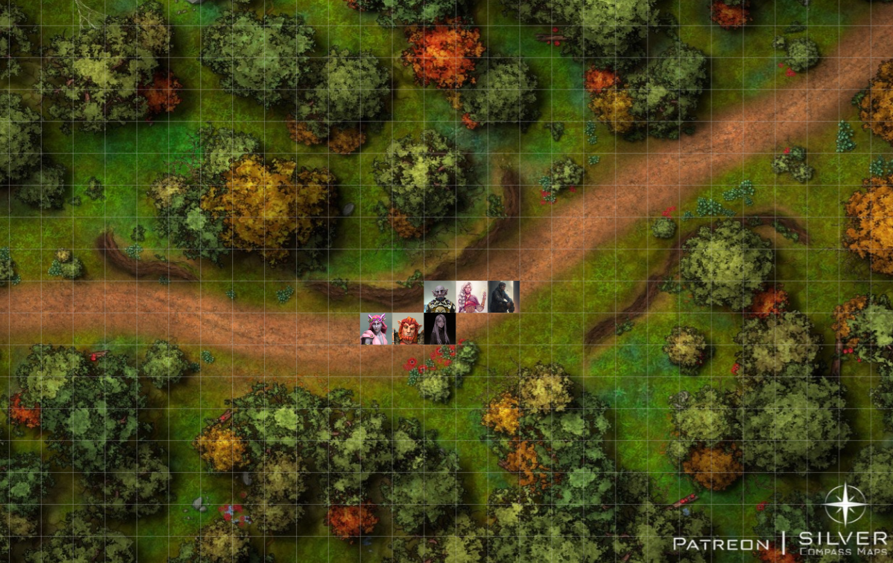
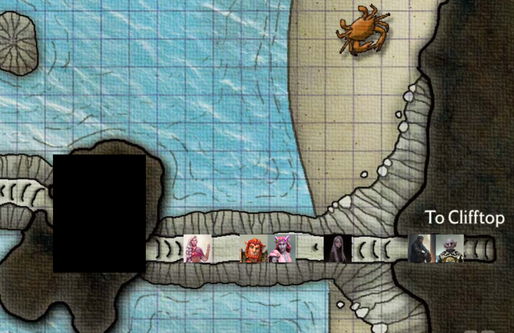

# Session 20 | 2024. 01. 28. (vasárnap)

Nana Rorr nyakában ül, úgy mennek az úton a torony felé. Eseménytelen az út a Triboar ösvényig.
tanakodunk vajon Gundren

Sera előtt egy nyíl fúródik az útba, a bokrokból goblinok törnek elő.
Nana-nak a vállába fúródik, leesik Rorr nyakából.

s: aztn nem értem miért nem unjátok hogy megölünk benneteket
a: ne léyg ilyen kegyetlen velük

### ⚔ COMBAT ⚔ 

Ashley az egyik feléjük futó goblint célozza varázslattal, az egyiket húgy eltalálja, hogy meg sem mozdul többet
a: "remélem jól vagy!" szól nana-hoz, kihúzza a nyilat a vállából, majd megsimogatja! (heal)

Rorr a másik goblin fülét lövi el, "Mutassuk meg a hitványoknak!" - kiált Oriknak, majd közelebb lép ugyanahhoz.

A hátsó íjász goblin Vall-t lövi az íjával, majd a bokorba bújna, de ügyetlenül, kilátszik a feje.

A kis goblin Rorr-t üti, majd odébbfut, az út túloldalára.

Val a bokorban lapuló goblinra lő a crossbow-val. Felhúz még egy vesszőt, eltalálja a második vesszővel is, a goblin holtan esik össze. Közelebb lép a többiekhez.

A 4ik goblin is Val-re lőne, de nem talál - mérgében visszafut a bokor.

Nana lángot küld a bokorba ahová Rorr elől befutott a kis goblin - lángra kap a zsíros haja.

Orik észak felé indul, maga felé rántja a goblint, villámot küld felé - "De hát elbújtam!" kiált fel. - "DE NEM ELÉGGÉ!" szól rá a sisak mögül.

Sera is a felgyújtott Goblint célozza - "ha nem bánjátok, szeretnék egy foglyot, hátha megkönnyíti a dolgot a Cragmaw kastély felé!" elaltatja a goblint. "Ha valaki majd lenne kedves, és megkötözné.."

Ashley is Orik felé lép, a válláról a lantot veszi elő, belecsap a húrokba - a goblin kerek szeme egyszerre kifordul hátrafelé, ráfröccsen Orikra.

a: elnézést Orik, nem volt szándékos!
o: nem szeretem ha goblinok fröccsennek rám..

### 🕊 COMBAT VÉGE 🕊

Sera odalép, és ő maga kötözi a goblint.

Rorr odalép, hogy kihallgassa a goblint - Sera finoman felpofozza.

s: remélem tisztában vagy mi történt a társaiddal
g: gondolom meghóltak.
s: meg bizony.
g: én miért nem?
s: úgy gondoltunk még értékes lehetsz a számunkra.. melyik törzsből jöttél?
g: tnyleg úgy gondoltda?
s: a cragmaw kawstélyt keressük.
g: jó!
r: és azt szeretnénk, ha megmondanád, hol van!
g: az erdőben!
s: és te hogy szoktad megtalálni? elindulsz és ott van?
g: ha sokan megyünk valaki mindig tudja
s: de te nem tudod
g: csak nagyjából.. innen úgy "arra!" mutat észak felé.
s: nahát, ha ezt nem mondod, sosem jövünk rá. {megpaskolja az arcát,a goblin közelebb bújik} vannak még barátaid a közelben?
g: barátok nem, törzstagok vannak..
s: sokan?
g: igen, nagyon.. mindenfelé! bizony
s: számíthatunk rájuk az út során?
g: mindig!
s: ha téged véleltenül megölnékn aki kicsit biztosabban tudja moiondani merre van a kastyél
a: sera..
o: nem-nem, folytassa csak a kisasszony

rorr mozdul, és lefejezi a goblint - haszontalannak ítéli.

r: azt mondta vannak többen, és nem tud semmit
A: de hát.. már beszélgetett velünk! még a hasznunkra lehetett volna! elvezethetett volna ahigh roadig lehetett volna a kis braátunk!
r: van több goblin lesz új barátunk
s: ez csak a mi érdekünkben történt. képzeld ha jönnek a barátai és jelzi a helyzetünket.. nem lehet benne bízni.

Orik felzárkózik, megpaskolja Rorr válát.

rt: ne aggódj, a következőt lefejezheted te!
s: nem ez volt a baj.
r: akkor bocsánat, kibelezheted!
s: egyet meg akar tartani
r: élve? és egészben?

o: Ashley, előfordulnak ilyen sajnálatos balesetek, de hát ezek a goblinok viszonylag könnyedén pótóolhatóak, találunk neked másikat..
a: félre ne érts, nem kár érter, reméltem hogy hasznos lehet kevesebb atrocitással érünk célt.
o: találubnk majd másiakt
a: ettől tartok

elérjük a High road-ot, oriknak eszébe jut, hogy nincs is messze innen egy korábbi táborhely.
o: "A GYŰRŰ!"

s: azt hittem komolyan megsajnáltad a goblinokat
a: nem sajnálat, taktikai hátrány.. idővel majd talán szerzünk valamit ami előny lesz. valszeg a kastélyhoz előnyös ha lenne egy vezető.
s: az még messze van, addig csak lassít.
a: kedvesnek tűnt, megkedvelt.. hittem hogy anélkül is megvár hogy magunkal kell vinni.
s: majd Rorr beépül.

elindulunk a régi tábor felé, picit északabbra, mint a torony lenne. Fél óra után egy ismerős farönk tűnik fel.
Ashley

n: oriknak mi baja?
r: lehet pisilnie kell!
a: ezt a helyet ismerem! itt jó aludni
v: akkor beavatnál?
a: itt táboroztunk mikor jöttünk Neverwinterből, én is itt találkoztam velük először.
v: és milyen gyűrűről beszél az ott elől?
a: ezt én sem tudom
s: nyertünk egy gyűrűt egy karneválon, és nyoma veszett.. valósznílűleg itt hagytuk el.
v: ennyire szentimentális az úriember?
o: nagy történelmi értékű varázstrágyról van szó. ne tartsa fel a többieket. {piros az orra}
v: dik, rudolf! Orik, ez normális?
a: amikor érzelmeketpróbál elfojytani, az az orrán jön ki
v: értem

a: tudom hogy fontos gyűrű számodra, ha itt van, meg fogod találni! {orik vállára téve kezét}

orik elősször a rönkön nézi, de ott nem találja. szép lassan elindul kifelé, Ashley is megpróbálja keresni, segítve neki.

Rorr fát keres a tűzhöz.

Orik a zsebéből a sátrat Seranak adja - dolgom van, majd később segítek
nana is rájön hol ült, próbálja keresni a gyűűrt.

val segít sátrat állítani Sera-nak.

50ft-re a tábortól talál Orik - szép, barna tollakat.

o: SZóval te lovasítottad meg .. történelmi jelentőségét szavakba önteni is nehéz
a mit találtál
o nyomokat
a az egy toll
o nem is akármlyike.. madártoll
a ha nem mondod nem feltételeztem volna.. akkor nem csak a földön keressük, hanem az égen is

máűsik 3 tollat is talál, egy irányba mutatva.
o: ashley, utánam! - elindul, ashley megy utána.

orik egy jó negyed órát bolyong, ashlenyek feltűnik, hogy nem igazán irányba mennek, orikot a lendület viszi és a mgaboztisoság
a: nem szeretnék szólni a világért, de kb. 100 perce rossz irányba megyünk!
orik körbenéz - valóban?
s nem akartam szólni, más irányba megyünk , nagyon fókuszáltál, feltételezem nem láttad elég távolra a dolgokat, de ha engeded mutatnánm az utat hogy _arra_ menjünk
a: amennyiben tévednék a hipotézis és a tudományosság érdekében azonnal mutass rá!

a nyomok délnyugatra vezetnek, de újabb tollakat nem találnak már.
az irány jó, de újabb nyomokat nem látok a madárhoz kapcsolódóan.
o: indiítványozom hogy a reggeli fényben folytassuk a dolgot.
s: mit gondolsz ha táborbontás után szólnánk a többieknek, az útuicél és az irány egybeesik?!
o: hasznos egybeesés.. azt hiszem táborozzunk le inkább - elindul a többiek felé.

Rorr visszaér a fával, a sátrak kész vannak. Ashley és Orik már fél órája eltűntek - Nana abbahagyja a keresést.

S: látta valaki merre mentek?
R: hát úgy {arra}
v: mintha találtak volna valamit arra, aztán már nem voltak ott
s: bízom orikban.
N: maradjunk itt, úgyis viszstalálnak..
s: remélem, meg azt is hogy nem hülyeségben sántikálnak.

vacsoraelőkészítés, stb. 20 perc múlva bukkan fel a tenger felől Orik és Ashley.
s: csodálatos. jó döntést hoztunk
r: kész a kaja, gyertek!
a: vetnétek erre egy pillantást? meg tudjátok állapítani mint ti akik a vadonban többet voltatok, hogy ez milyen állattól származhat? a gyűrűt ő lovasíthatta meg.

r: ez egy madár.

nana megnézi - talán keselyű, de ahogy jobban megnézi, nem annyira toll-szerű a tapintása, mint kéne.. gondolkodik mi lehet, beugrik egy madártestű de női fejű lény képe - egy hárpiához tartozik.

N: nos, ez a toll egy hárpiához tartozik.

a: ezek szerint egy hárpiát keresünk.. ha egyet keresünk nem csak eggyel fogunk találkozni. viszont legalább tudjuk hogy mérgező támadást fölösleges bevetni ellene. egy újabb hölgytől egy újabb csecsebescsét próbálunk elszedni.. a bóúvóhelye, vagy fészke? nagyjából egybeesik a holnapi útvonallal. mindenki tartsjaniytva a szemét, nagyobb bonyodalom mint terveztük
s: reméljük a toronynál van, akkor 2:1 megoldjuk..

v: mi is ez agyűrű?
a: amit rá tudsz hzúni az ujjadra, és ..
v: b+ tudom mi a _gyűrű_, de ez miért jó?
s: orik, hátha jobban el tudja mondani
o: a hevesen keresett gyűrű ne mmás mint Lady Alagondar legendás gyűrűje ami a viselőjének néminemű ellenállást biztosít a méreg alapú hatások ellen. bár varázstárgyként is nagyértékű, de történelmi jelentősége még annál is nagyobb
s: szerinted tényleg az? miért adták volna oda a wurtsliban
o term. nem, de varázstárgy.. de ha el akarnánk adni, senki ne csússzon el marketing-pitchen.
a: alagondar, olyan ismerős ez a név..

Rorr és Ashley előadják a balladát.

sera a sarokban ül és sápadt

o: ez nem ashley költeménye, ugye?
s: valóban nem.. amennyire emlékszem, nem fért hozzá Ashton műveihez.
o: kell hogy aggódjunk?
s. én már aggódom, de nem tudom kell -e.
o: ha magára vállalta az aggódó szerepét, én érdekességként jegyzem fel magamnak.
s: fordítva, kicsit nyugodtabb volnék ha ashton férne hozzá ashley emlékeihez, nem fordítíva.
o: bár ashton dominál, van e jel arra melyik tudat domináns?
s: számomra tudom melyiket ismertem előbb, melyik a domináns.
o: nos hát azt hiszem a hipotézis további alakítása még megfiygyelésre szorul

orik visszaadja Val könyvét - egy-egy széljegyzet benne, kiegészítve, pontostíva a dolgok.

beszélegetés, dalolászás, kaja.. szép lassan elmennek aludni a többiek, Rorr kezdi az őrséget, utána Val, Orik majd Sera.

Rorr piszkálja a tüzet, életben tartja. Átlagos neszeken kívül mást nem hall, békében telik az őrsége. Rorr a tűz mellett alszik, nem megy a sátorból.
Val váltja a bugbeart, eseménytelen, csak a horkolás hallatszik.
Visszamászik a sátorba, felébreszti a goblint a váltáshoz. Az őrség elején egy rituálé keretében varázslatot húz a sátrak köré Orik - Rorr horkantására néha összerezzen, hiába ismerős ez neki. Nana egy botot vesz a vállára, a tűz körül sétál, mintha őrködne - ez is elvonja a figyelmét, borzasztóan zavarja, ahogy Nana valamit _rosszul_ csinál, nem tud figyelni.
Pirkad az ég, mire Sera jön - ő is meglátja Nana-t.

s: hol találtál ekkora botot?
n: biztos rorr hozta tűzre. {leteszi a botot, cigánykerekezni tanulni kezd picit arrébb.}

Sera próbálja túltenni magát a látottakon, de ő sem vesz észre semmit az éjjel.

reggelre szépen lassan sorban mindenki felkel.

ashley köszönti őket, nézi Nana-t.

a: mióta csinálja?
s: két órája...
a: lehetne ügyesebb, nem?
s: két óra után? igen..

Nana is leül melléjük.

s: nagyon tetszett a dal amit tegnap játszottál, hol tanultad?
a megmutatja a kiskönyvet az oldaláról: "ebben van minden ami dal/ének, ha később elfelejteném akkor eszembe tudjon jutni!"

először látja Sera a könyvet nála, tele van mindenféle énekkel/balladával/stb.

s: azt mondtad, hogy szoktuk?
a: én és Temperion, ha néha megihlet.
s: és felismered a kézírásokat?
a: egy kézírások.
a: nem emlékszem hogy én írtam volna, de mindet tudok ami benne van! szépen dalloljunk, ennyi kitelik Milill követőjeként.
s: ő ki neked?
a: egy isten.. azt hittem a coast-on mindenki ismeri. termés, termékeynség, zene istennője, neki szolgál Temperion, tőle van az erőm.
s: emlékeszel hogy kaptad az erőt?
a: nem
s csak úgy lett?
a igen, álmomban jött, elvisz egy csodás utazásra.. azóta itt vagyunk meg vagytok, szóval igaza van
s: nem mondta mit kér cserébe?
a: ne mkért semmit soha még
s: nagyon kedves ésönzetlen a te .. unikornisod.
a: én úgy gondolom hogy nem önzetlenség, hanem "on his whims", 
s: egyszer csak elhagy?
a lehet
s nem félsz ettől
a nem, csak megyek amrere a szél sodor
s de ha ő nincs?
a akkor is találunk valamit
s befonnád az én hajamat is?

~~~
{🌟} +35 XP
{💤} long rest
~~~

reggeli, táborbontás, elindulunk a délnyugati irányba. dombos, cserlyés vidék.

Nana elől, Rorr utána, majd a többiek. néha kisebb kitérők, de irányban vagyunk. 2 óra után ritkásodik a növényzet, majd a tenger moralylása is hallatszik, sziklaszirteket látni.

megpillantjuk a tornyot a távolban - napfényben is éles zöld fény jön a toronyból - még csak nem is sziget amire épült, csak kitüremkedés.. a sziklaszirt aljától a toronyig egy magaslat/meredély húzódik aminek a tetején egy ösvény van odafelé.

a zöld fény mint egy szívdobogás pulzál.. folyamatos villám/vihar van körülötte.

a: mit tudunk a hárpiákról? veszélyes lények, kell védekezni valahogy?
n: a daluk a legveszélyesebb - az ember eszét elveszik, magukhoz csalják, mint a szirének.. éles karmok.

Val gyertyát vesz elő, "ólom helyett ezt próbáljuk meg.." 
a: de mi a terv?
s: először a hárpiák.
a: formázzuk meg kicsiny fülvédőiknet, és haladjunk oda. ha találkozunk hárpiákkal, a viasz nem árt, egyébként majd a torony tetején kivesszük!
r: nekem nagyon nagy a kezem ehhez, segítsen már valaki..{letöri a gyertya alját}

mindenki bedugja a fülét viasszal, irány a troony.

a sziklaszirbe dolgozva egy lépcső lefelé, elindulunk rajta, egészen a tengerszintig jutunk.

az apály-dagály itt elég erős, olyankor jóval magasabb a vízszint - nana próbálja elmutogatni, de senki nem fogja fel. Sera kiveszi a dugót a füléből, Nana szóban elmondja neki inkább.

előttünk a sziklaösvény útvonala, leérünk a falak mögül. a parton nem messze északra egy kurvanagy rák tűnik fel.. ahogy nézzük, mintha integetne az ollójával.

Rorr visszainteget.

N: szia rák! mi újság?!
c: _siastok kalandorok! - mindenki érti (crab, sejpít)
a: üdvözlöm kedves rák úr! mi járatban?
c: hát én itt.. élek. ti mi járatban?
a: jöttünk a toronyhoz, azt hallottuk hogy valamiért zöld fényt bocsát k a rendes sárga helyett és vhar van, gondoltuk megnézzük.
c: nagyon dcséretess... de muszáj kabáln nem jöttök nkább le?

ash megindul felé, szép lassan a többiek is.

ash bemutatkozik, megkérdezi az ő nevét is, hogy mi járatban?
c: sia asley, nevet sajnos nem kaptam, csak értelmet
a kitől?
c egy kedves tengeri elftől. Miralnak hívták.
a mindenkinek kell egy név.. hívhatunk Sebasbtiannak?
c: nem nagyon tetszik..
a: mi tetszene?
s: tamatoa?
c tetszik, könnyű kiejeteni
a ha már itt laksz, tudsz valamit a jelenségről amit az ittlévő kétlábúakat zavarja.. 
c: a torony elhagyatott, aztán jött valami fura szerzet, nagy és csúnya arca van, és ork szerű de mégse, beette magát megölte a mesteremet és azóta vihar van emg zöld fény
a és repkedő érlnyek
c szikla túloldalán hárpia fészek
a nekünk cél hogy a világítótorony visszatérjen régi fényébe, a mestere lakott itt amúgy is, jogot formálhatna rá hogy az övé lehessen az egész, hisz értelemmel rendelkezik. örömmel vennénk társunkul ha elkísérne és segítene
c nem kell nekem a torony,... csak azt seretném hogy segény mesterem.. ne mtudott eltávozni teljesen.
a akkor tényleg jer velünk hiszen egyszerűbb ha neki is iemreős alakkal találkozik, úgy könnyebb meggyőzni bármiről
c én nem nagyon tudok oda felmásni..nem nekem való terep.. meg térisonyom is van
a akkor köszönjük az infót, van e bármi nekünk is hasznos infó amivel könbnyebb dolgunk lenne?
c azt seretném hogy mesteremnek segítstek - Miral - hogy át tudjon lépni a túlvilágra.. ő még a kis barlangot kísérti ahol a gonos megölte.. ha tudtok segíteni, cserébe a hajókról hozok nektek fel kincset!
a jajj erre semmi szükség
r de szívesen vesszük
o 
c 5 hajóról tudok, egyikhez biztonságog lemenni
s mindegy hogy segítjük át a túlvilágra?
c lényeg hogy tudjon távozni innen.. termésetesen nem bánnám ha békésen sikerülne
o nos kedves Tamatoa, üdvözlöm - kezet nyújt.. 
c kedves barátom ezt átgondoltad? {orik türelmesen vár mosollyal.. odatartja a kisebbik ollóját, Orik finoman megfogja és megrázza}
o nos kedves Tamatoa, meséljen nekem korábbi mestereélől legyen kedves,.. mivel foglalkozott, voltak e rigoláyi, berögződései?
c egy tengeri elf volt, javarészt a vízben töltötte életét, hosszú évek óta elhagyatott a torony, a törzse ide küldte őt, hogy őrködjön hogy a torony ha lehet maradjoön lakatlan.
o ha ő ideköltözött és a tornyot védte a jelenlétével, akkor a lakatlanság fogalma mint olyan semmisé vált, nemdebár?
c nem lakott, csak őrködött
a és ha lent őrködött, fent nem lakott senki

orik lesajnáló pillantással néz rájuk..

c ő nem költözött be, itt figyelt rá hogy más se költözzön be.. de sajnos jött valaki és ő elhalálozott.

s: és ez a valaki beköltözött?
a ne aggódj Tamatoa máris segítünk a mestereden!
v volt bármi oka hogy senkinek nem kellett beköltöznie?
c hogy a tengeri elf kolóniához ne legyenek túl közel.
s szóval itt a törzs is?
c nem messze a vízben, igen
s víz alatt
c ugyanaz
s vannak mások mint te?
c nem tudok róla.
s ashley, várj! {megy utána}
c sok sikert kalandorok!

megköszönjük, elindulunk a barlang felé.

Ashley megy elöl a barlang felé, mögötte Rorr, Nana, Sera, Val majd végül Orik.
7ft magas alagút, az ösvény vékony, de elférni kényelmesen.

A: Miral! Miral, itt vagy?! - szólítja.

A barlang közepén egyszer csak egy jelenés, egy elf-szerű lény áttetsző alakja - kopoltyúi vannak, úszóhártyák; rongyos ruhák, mintha vízben lenne.

M: ki szólít?
A: Ashley, találkoztunk Tamatoa-val, mert az S betűt nehezen mondta, ő mondta hogy téged utolért a halál, szeretnénk rajtad - nem, neked segíteni, hogy te is megpihenhess.
M hűséges rák.. ha segíteni akartok, űzzétek ki a toronyból a szörnyet, és hozzátok vissza a kagylómat.
A: minden további nélkül, de egy picivel több infó kell.m ilyen kagyló és milyen szörnyeteg? tudsz e a merénylődről többet
M egy mocsok félork.

rorr is beér, erre leköp a földre.

M a kagyló jobban mondva egy gönyghűzfényű tengeri csiga háza.. elvette a testemről és így nem tudok tovább lépni. hozzátok vissza!
A természetesen. megpróbálunk segíteni rajtad. van -e valami segítség amit te tudnál?
M: hozzátok vissza!!
A tudsz e más lakójáról a toronynak aki segíti az orkot?
M: HOZZÁTOK VISSZA - majd halványul az alakja, eltűnik, csak ez visszhangzik.

A valami mágiát használ a félork, mert különben nem lenne fényes a torony meg a sok villám.. a hárpiákról tudjuk hogy a közelben fészkelnek, jó lenne óvatosan megközelíteni a tronyot.
S erre bármi javaslat?
A: nem tudom kevés hárpiával találkoztam, a félorkok is elkerültek.
R: és mi a másik fele?
o: általában ember szokott lenni.
R: de lehet félig madár, mint a hárpia!
A szerintem készüljünk attrocitásra!

Ash elindul tovább a torony felé, többiek utána. az ösvényre csapkodnak a hullámok. elérjük a falba vésett lépcsőt.
