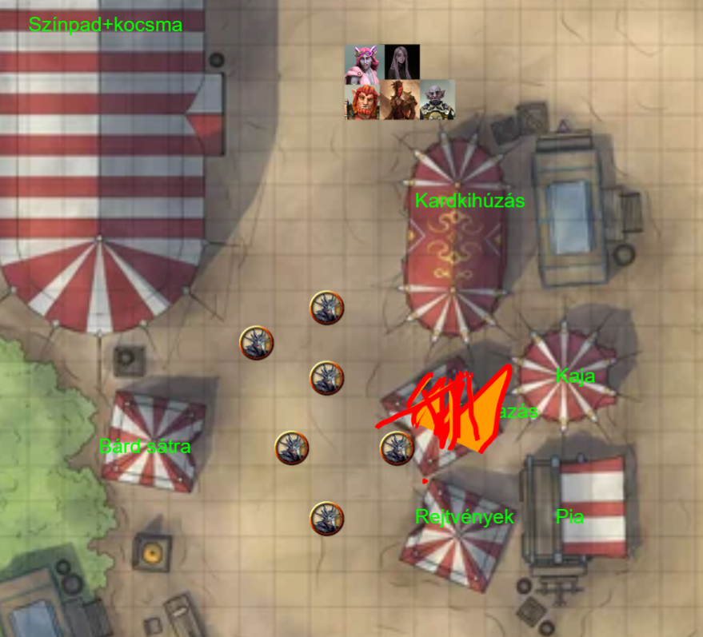

# Session 3 | 2023. 06. 12. (hétfő)

Sera és Orik a lábnyomokat követik egy ideig, de a poros lábnyomok hamar eltűnnek a füves, rétes talajon - látszólag az úttal, amin jöttünk párhuzamosan, visszafelé, a domb felé tartanak. Sera jelzi, hogy nem teljes a biztonságérzete amíg a bard ki- és holléte nem tisztázott - de Orik szerint: *`"Se a hol, se a hogy léte a bardnak rajtunk kívül nem érdekel senkit egyelőre.."`* - így végül nem követik a nyomkat, melyek bár sietősnek tűntek, de nem erőszakkal vitték, mivel egyedüli pár lábnyomról van szó. Visszatérnek végül a többiekhez.

Nana, Ash és Rorr egy újabb, nagyobb sátor elé érkeznek - **'Erőpróba - Kardkihúzás'** felirattal. Ash *`"Semmi keresnivalóm itt!"`* felkiáltással belép a sátorba, a másik kettő követi. 

Sima föld padlózat - amiből egy tekintélyes sárkány koponya lóg ki - abból pedig egy kard áll ki (egy longsword). Épp senki nem próbálkozik vele. A koponya alá nem látni be - nem tudni mi van alul. A beszélgetés alapján egyelőre senki nem tudta kihúzni. Egy fél-elf játékmester biztatja és invitálja az embereket. *" `Kettő 🥈-ért 100 🎫 a jutalom!` "*. Rorr egyből odalép, és befizeti az ezüstöket.

Nana és Ash megpróbálják megvizsgálni, mennyire csalás/kamu ez a feladat a sárkány fejének vizsgálásával. Ash még a saját előadásának hatása alatt van - ő nem talál semmit. Nana látja, hogy kamu koponya - a kard valódinak tűnik.

Rorr fellép a koponyára, a nagy rántás hatására leesik a koponyáról.. A tömeg kissé kuncog, a játékmester is felnevet. Rorr jobban megtámaszkodik, ráfog a kardra, de továbbra is sikertelen.

Ash jelzi, hogy ő is megpróbálná - hadd lássa, hogy itt valami turpisság van. Fizet, majd ő is megfogja a markolatot. Ahogy Ash húzza - egyszer csak egy baromi nagy reccsenést hall, majd kitörik a koponya teteje szilánkokat szórva. Ahogy tartja maga előtt látszik, hogy egy satu van a másik oldalán. *`"Micsoda erőfitogtatás! (Ha ezt nem vered nagy dobra, 200 🎫-t adok!)"`* - Ash elfogadja - *`"De csak mert a bugbear barátom meglazította!"`*. A félelf bezárja a sátrat, amíg megjavítják a koponyát és a környéket. *`"Te ezt nem ma kezdted - ha jól sejtem"`* - jelzi a félelf. Átad Ash-nek két guriga tokent. Ash rákérdez, miből készült a koponya - egy speciális meszes keverékből - gyorsan helyreállítható. Ash jelzi, hogy a satut is be kéne keverni - így a későbbiekben az nem törik ki. *`"A te érdemed volt, hogy ki tudtam húzni - az én ujjaim ennél finomabb dolgokhoz vannak szokva."`*.

Rorr rákérdez a beváltásra - a naponta frissülő kínálat a bejárat melletti sátornál található. *`"A gyűrűt ajánlom figyelmetekbe - az a fődíj!"`* - jelzi. Rorr morog a "csalás" miatt, de követi a többieket a következő kis sátorhoz.

A nagy sátorból izgatott morajlás hallatszik ki, jó sokan lehetnek bent. Oldalra két ösvény vezet - **'Sárkányölés'** és **'Sárkánylövészet'** néven. A kis sátornál **'Etesd meg a sárkányt!'** felirat áll.

Ashton előbb a kajás bódénál vesz egy adag chilit az ott álló gnómtól - Orik számára, hiszen tőle elvették a verseny alatt.

A sátorba lépve egy félszerzet hölgy tevékenykedik - más nincs rajtunk kívül bent. Egy asztalon egy kézzel megfogható babzsákok - az asztal túl oldalán 3 ferdén felfelé, sárkányfejt megformázú figura - mindhárom száján egy-egy lyuk. Sera rákérdez a játék árára - 2 ezüstért 5 zsák jár - először a legnagyobb szájat kell etetni, és így tovább. 5-20 és 40 🎫 a jutalom. 

Rorr befizet - majd az első dobásával egyből betalál csont nélkül a legnagyobb szájba. A középsőbe is gond nélkül betalál. Rorr a 3-ik sárkányt is megcélozza - de ez megáll az állkapcsán - majd kifelé leesik. 

A negyedik babzsák a dobással már befelé csúszik a sárkány állkapcsáról. A félszerzet átad 40 🎫-t Rorrnak - aki rögtön tovább adja Ashnek (aki eddigre ideért), úgyis nála gyűlik.
Orik a kapott chilit egyből elkezdi - kis zsebkendővel a nyakában - illedelmesen elfogyasztani.

Sera az elsőt gond nélkül bedobja. A második fölé megy - a harmadik próbálkozásra sikerül azonban a második sárkányt is megetetnie. A negyedik dobásával hiába próbálkozik, két sárkány közé beesik. Még egyszer próbálkozik Sera, az utolsó dobásával a sárkány elé dobja. *`"A 20 🎫 ettől még jár!"`* - jelzi a játékmester, majd átnyújtja a tokeneket Sera-nak, aki egyből tovább adja azokat Ash-nek. További játékokra invitál minket, de már nincs újabb jelentkező, tovább megyünk az ölés/lövészet felé.

Közben kora délután/ebédidő kezd lenni - a kocsmasátor felől hallatszik a tömeg hangja.

A lövészet felé egy íjász-pályát látunk, elsőnek azt nézzük meg. Egy kis tákolmány alatt íjak sorakoznak. Hosszan elfelé egy legyalult mező végén három céltábla található - egyre messzebb egymástól. A tábla egy sárkány szemét mintázza. Az íjak mellett pedig egy wood elf áldogál.

Nana egyből odamegy - játszani szeretne. *`"Na nem mondod.. 3 🥈, 6 lövés."`* - mondja unottan a kalandmester fel sem nézve a körömpiszkálásból. Nana odabassza az érméket - *`"Elég lesz az a 6 lövés?"`* - morogja. *`"2-5-20 🎫 az egyes céltábla."`* 40, 120 és 360 ft távolságban van a három céltábla. A legközelebbit megcélozva Nana a szélét eltalálja. Rorr és Ash halkan roast-olja az elfet. Nana újabb lövést ad le az első táblát célozva - de ezt mellélövi.. A harmadik lövése majdnem közepére talál. A negyedik lövést a középső táblára adja le - ez épp az érvényes felület alá érkezik. Az ötödik lövést már jól célozza - majdnem középre talál. Az utolsó lövésével telibe lövi a középső szemét. A wood elf 14 🎫-t ad át - *`"Gratulálok - egy 5 éves wood elf szintjén vagy."`*

Orik határozott mozdulattal a vállára teszi a kezét kissé beleroskad a földbe. Ash megjegyzi, hogy nem kell aggresszívan fellépni *`"A világért nem bántanám, elvégre itt mindannyian úriemberek vagyunk!"`*. A kis wood elf eléggé megszeppen - *`"Valóban - ezért most úriember módjára nem fogom hívni az őrséget.."`*. Orik kissé rendbe szedi - *`"Semmi szükség nincs őrökre, hiszen itt úriemberek beszélgetnek.."`*.

Ash lőni akar - az elf inkább ebédszünetet tartana. Enyhén agresszív hangú meggyőzésre végül beleegyezik, hogy lőhessünk egy kört ingyen.

Ash látványosan a földbe lövi az első nyilat - majd a másodikat is. A harmadik vesszőnél a mozdulat ugyanez - de a legtávolabbit veszi célba - el is találja. Vagánykodva szabadkozik - a wood elf átnyújtja a 20 🎫-t. Ash már tovább állna - de Orik még a középső targetet hand-crossbow-val meglövi - tartva közben a szemkontaktust az elffel. Egy *`"Úgyis itt állsz egész nap - gyakoroljál egy kicsit.. Jó étvágyat!"`* felkiáltással tovább állunk - Ash még meglebegteti a köpenyét elsétálva.

Nana-nak feltűnik perifériából, hogy (<s>*`"DM: Úh bazmeg -  egy molylepke!"`*</s>) a wood elf az egyik íjjal próbálkozva kettétöri azt - majd földhöz vágja a törésekert. *`"Ezek a mai fiatalok.."`* - mosolyog Orik a bajsza alatt, Nana is határozottan jobb kedvű.

A kereszteződéshez érkezve sikításokot hallunk a sátrak felől - odanézve füst száll fel valahonnan. *`"Remélem nem a beváltó pont!"`* - kiált fel Ash, majd elindul határozottan a tűz felé. *`"Hidd el, nem viccelt!"`* - mondja Sera Orik furcsa nézésére válaszul.

A füst a kártyás sátor felől jön - ami láthatóan gyorsan át fog terjedni a többi sátorra. Kiáltások, menekülő emberek mindenfelé.

Orik elindul az égő sátor felé - a többiek követik. A kardkihúzós sátor mellett köpenyes/maszkos figurák láthatóak, egyiknél fáklya a kézben. Ívelt pengéjű kardok vannak náluk, fekete sárkánymaszk fedi az arcukat - *`"A kurva anyátok..A jó kurva anyátok!"`* - kiabál a Bordaec.

*`"Mi szóltunk, hogy ez egy gyalázat a sárkányokra nézve!"`* - szól az egyikük. 

*`"Ti vagytok gyalázat!"`* - jelzi Ash. *`"Ha kezelitek őket, mi intézzük a tüzet!"`* - kiált még oda a törp.

### ⚔ COMBAT ⚔

 
Mind a hat maszk felénk mered.

Nana ice knife-ot lő a legközelebbire - az földre néz majd Nanara - majd a lábán a csizmára robbannak a szilánkok, de nem lesz baja.

A fáklyás kultista a következő sátorhoz (Rejtvények) sétál.
Rorr, Orik és Ash elé is egy-egy kultista kerül.

Ash-t az egyik a kiáltás hatására egyből meg is üti - a bordái közé szúr egy nagyot. *`"Mindig is akartam egy ilyet.."`*

Rorr is üt egyet - a dobról lecsúszik a keze, de a dobbantás hatására eltalálja a mellette lévő cultistot.

Sera az Ash-sel küzdő cultist-ra fókuszál: az egy altató dalt hall, ami egyre disszonánsabb, sikításos irányt vesz - melynek hatására megpróbál elmenekülni onnan - de sikertelenül.. Elengedi a kardot, kapkod körbe, karmolássza a fülét és szemét, majd holtan esik össze, füléből-orrából vér folyik.

Orik morcos.. Nem örül neki, hogy felgyújtják a karnevált, ahol jól érezte magát.. Előránt a zsebéből egy zöldes üvegcsét, majd az előtte álló kultistába hajítja - abból 30ft -nyi folyadék fröccsen ki. A folyadék sisteregni kezd.

Ash a fáklyás cultist-ot nézi - [Eldritch Blast](https://roll20.net/compendium/dnd5e/Eldritch%20Blast)-ot próbál hozzávágni. Arcba kapja azt, el is dől tőle. *`"Mondtam én, hogy az anyád egy kurva.."`* - jegyzi meg halkan.

A sátorból kivágódik egy sörös korsó - ami halántékon találja a Rorr előtt álló cultist-ot - *`"A kurva anyátok!"`* - hallatszik Bordaec hangja.

Nana Rorrhoz lép, majd háton veregeti - (Guidance) - *`"Gyerünk!"`*

A kicsapódó sav, melyet Orik üvege küldött feléjük - fáj a cultist-ok arcának - határozottan nem tetszik nekik - elkezdik kaparni magukról azt, némi bőrrel együtt. A külön álló, negyedik cultist Orik felé szalad, majd megüti őt is. Rorrt az előtte álló cultist nyakon vágja.

Rorr a földre csap - két cultist és Orik is a földre esik. A hobgoblin felé kiált - *`"Ne haragudj, barátom!"`* (Bardic inspiration)

Sera támadja a az Orik előtt álló, fel nem lökött cultistot, de sikertelenül. Az kicsit meginog, de végül nincs baja.

Orik feltápászkodik, majd a mellette még fekvő ellenfelét szúrja meg dárdájával. Az előtte álló kultistára zöld tűz terjed át a szúrás hatására - aki ettől összeesik és meghal.

Ash a hátsó cultisthoz sétál - majd alulról állon és fejen szúrja őt. A torkából a vér mellett a zöldes sav is folyik kifelé, majd hörögve ernyed el Ash kardján.

Egy újjabb *`"A kurva anyátokat!"`* kíséretében egy szék repül a kocsmából ki - a Rorr mellett fekvő arccal veszi le, az a cultist nem mozdul többet.

Nana az utolsó, földön fekvő cultisthoz lép. A csuklyát lehúzva róla a fejét hátrahúzza, majd a nyakát elvágja. A vér Orikra spriccen.

### 🕊 COMBAT VÉGE 🕊

~~~
{🌟} +30 XP
~~~

Rorr elkezdi megtisztítani (prestidigitation) Orik ruháját, aki illedelmesen megköszöni. Ash a fáklyás cultistot lootolja - középkorú human férfi. Nincs nála semmi érdekes. Bordaec kilépve a sátorból leköpi a hullákat, Orik és Ash a Nana által gyártott goodberry-ket. *`"Egy férfinak be kell vallania, ha hibázik: alábecsületem ezeket a csuhásokat.."`* - jelzi a törp.

*`"Van egy pár új kardunk, hogy kívánod megtéríteni, hogy megmentettük a karneválodat?"`* - kérdi Ash a törpöt. *`"Azért nekünk is volt itt emberünk rá.."`*. Ash nagyon csúnyán néz rá - *`"Na jó, igazatok van - egyrészt azt hiszem, több embert kell felvennem (ha esetleg épp munkát kerestek). Hogy lássátok, nem vagyok hálátlan"`* - átnyújt Oriknak egy aláírt cetlit - egy tetszőleges díjból 20% 🎫 kedvezmény. *`"Értékelem a gesztust - az üzletember mindig üzletember. De a hálán is nyerészkedni némileg arcátlan.."`* - jelzi Orik. *`"Azért ne becsüljétek túl magatokat.."`* - mondja Bordaec.

*`"Előkerült a bardod?"`* - kérdi Sera. *`"Dehogy került, az már messze jár."`* - válaszol a törp.

A kultisták maszkját lehúzva megnézzük, köztük van -e, de mindegyik embernek tűnik. *`"Vagy fogoly, vagy áruló"`* - mondja Sera. *`"Szerintem csak gyáva.."`* - mondja a törp.

Ash elindul a beváltó sátor felé. A személyzet elkezd eltakarítani, a felgyújtott sátor is kezd visszaépülni. *`"A hobgoblin barátotoknak mondjátok meg, senkinek nincs akkora arca, mint neki!"`* - jelzi még Bordaec. *`"De folytatódjon a mulatság!"`* - mondja miközben elszalad, újra begyújtva a buli tüzét.

Ash rájön, hogy a ruhája csupa vér - megtisztítja magát ő is.

A beváltó pultnál az asztal alól egy nagyon jól öltözött goblin mászik elő. Felül a székre, majd néz ránk. A díjak egy táblára vannak felsorolva.

*`"Áá, jónapot! Földim!"`* - kiált rá Orik goblin nyelven. *`"Mrgrh"`* - biccent oda a goblin. Orik visszafolytja rasszista gondolatait.

> - 50 🎫 mű sárkányszárny, hátra felvehető  
> - 50 🎫 kitűző - Dragonslayer felirattal  
> - 50 🎫 faragott pipa buborékfújóval  
> - 80 🎫 papírsárkány, animált  
> - 80 🎫 szépen faragott fakard  
> - 120 🎫 hógömb jellegű, csak vízzel, és mechanikus aranyhal úszik benne  
> - 150 🎫 [Candle of the Deep](http://dnd5e.wikidot.com/wondrous-items:candle-of-the-deep)  
> - 250 🎫 [Wand of Smiles](http://dnd5e.wikidot.com/wondrous-items:wand-of-smiles)  
> - 450 🎫 Lady Aragondar gyűrűje

*`"Meg tudjuk venni a gyűrűt, amennyiben megéri megvenni."`* - jelzi Ash Orik felé. *`"Amennyiben a kolléga hajlandó megmutatni a varázstárgyakat, hogy közelebbről is szemügyre vegyük, mielőtt döntést hozunk.."`*.

A goblin a gyűrűt és a wandot az asztalra teszi elénk. Orik szemügyre veszi az ékszert - szép nagy pecsétgyűrű, karddal átszúrt minotaurusz van rajta (Az Alagondar család szimbóluma). Forgatva azt megbűvöltnek érződik, de nem 100% biztos benne, lehet idővel kikopott a varázs. Szépen megmunkált aranygyűrű, de ennél többet nem lát rajta.

*`"360🎫-ért szeretném megvenni a gyűrűt."`* - jelzi Ash. Orik átnyújtja a Bordaec-től kapott papírt a goblinnak. Az nézi egy ideig, de bólint. Egy lapos kőnek tűnő tárgyat áthúz a gyűrű fölött - majd átnyújtja a gyűrűt nekünk.

Sera az aranyhalra vetett szemet - Rorrnak is az tetszik. Egy sárkányszárnyat is veszünk mellé. 
*`"Amennyiben ez elfogadható - ők megérdemlik."`* - mondja Ash, miután a 💰 szárnyat Nananak, a 💰 halat pedig Sera-nak adja. A 💰 gyűrűt Orik teszi zsebre - annak pontos varázsáról itt nem tud mit mondani.

A karnevál kezd szépen visszaállni a korábbi fényére. Visszaindulunk a nagy sátor felé - Rorr odafelé egy sárkánysteak-et még magához vesz estebéd gyanánt. 

*`"Milyen régi rend?"`* - teszi fel a kérdést Ash a levegőnek. Sera megpróbálja odébb vonszolni, de Ash még marad, várakozásra inti a lányt. *`"Ezek a kultisták valóban szégyent hoztak mindenre.. Érdekelne, mi volt a valódi fenyegetés? ... Mennyire régen? ... És meg lehet -e tudni, merre voltak aktívak? ... Akkor szerencsénk volt, további szép estét!"`* - folytatja a monológját a levegővel Ash. Sera újra húzza őt a sátor felé, ezúttal mozdul is. *`"Azt hiszem, szerencsénk volt, hogy nem a régi renddel volt dolgunk."`*

Nana, Orik és Sera sem érti, kivel/kiről beszélt. Ash próbálja mondani, hogy a két alak, de rajta kívül senki nem hallotta/látta őket. *`"Ohhh... Ne haragudjatok, biztos csak félrebeszélek!"`* - majd elindul befelé a sátorba.

*`"Csak tessék csak tessék! Mindjárt kezdődik a következő sárkányfutam! A nagy ijedtségre való tekintettel ingyenes a belépés!"`* - kiabálja a sátor előtt egy kis szerzet. *`"Egy pillanat és csatlakozom!"`* - mondja Orik, majd elszalad a felégetett sátor felé, megnézni, hogy Frederich rendben van e. A sátor már áll, de a dragonborn nincs ott. Bekukkant a sátorba is, de üres belül, csak egy perzselt asztal és szék maradványai vannak bent. Az asztalt még gyorsan rendbe hozza egy kisebb asztalt kreaálva (Mending), mielőtt kisétál. 

> *Drága Frederich!*  
>  
> *Remélem nem sérültél meg ebben a kellemetlen incidensben. Bár sokat nem tudok tenni elpusztult tulajdonaid megmentéséért, ezt a kisebb asztalt fogadd barátságom jeleként.*  
>  
> *Tisztelettel, Orik Spellweaver.*

Nana elmeséli Rorrnak az Ash-el történeket, de ő a harc utóhatásának tudja be. Belépünk a sátorba: körben végig a tribünökön ülnek a nézők. Nagy nyüzsgés, izgatott zsivaj. A sátor tetején ki is van írva, hogy **'Sárkányfutam'**. Körben egy nagy kifutó/versenypálya helyezkedik el, karámmal elválasztva.

Egy fiatal, huszonévesnek tűnő leányzó invitálja a tömeget.
