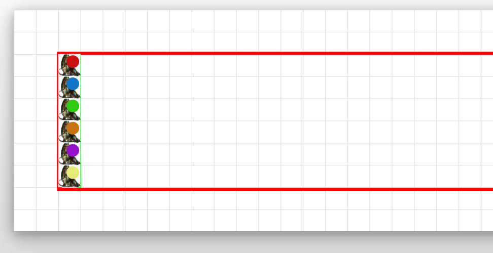
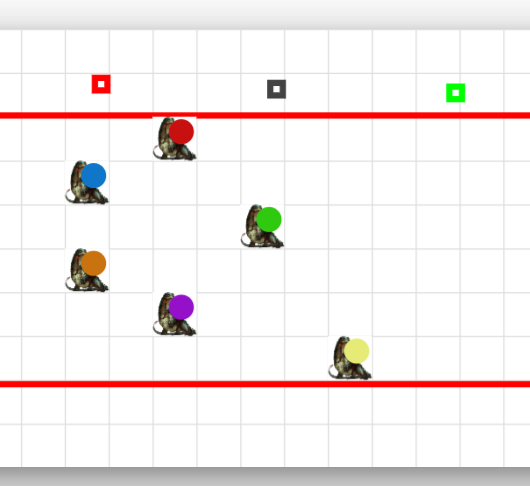
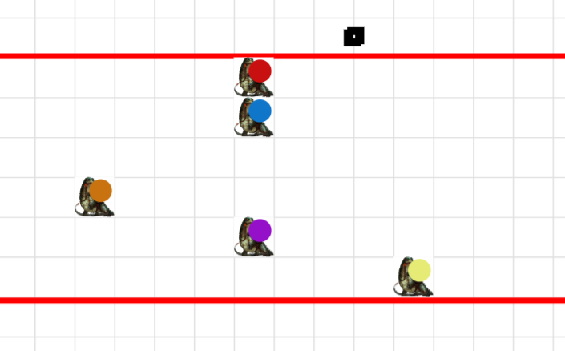
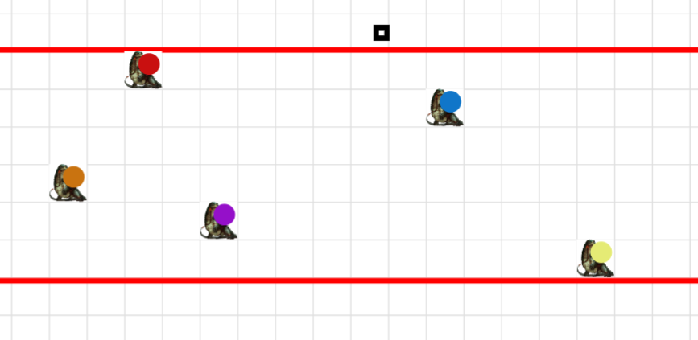
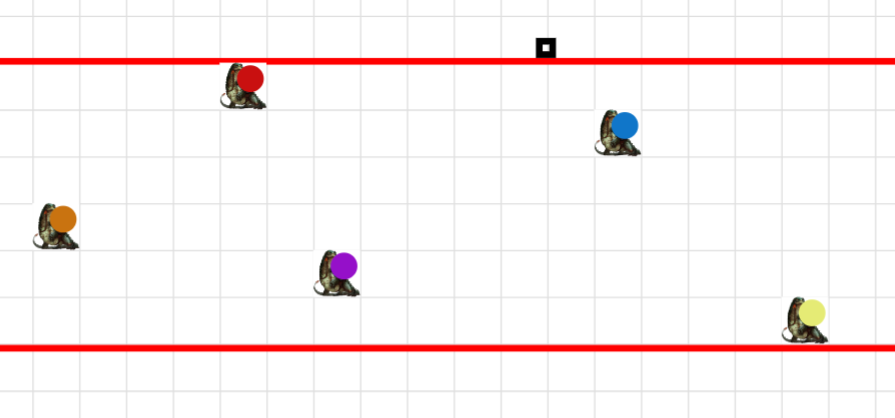
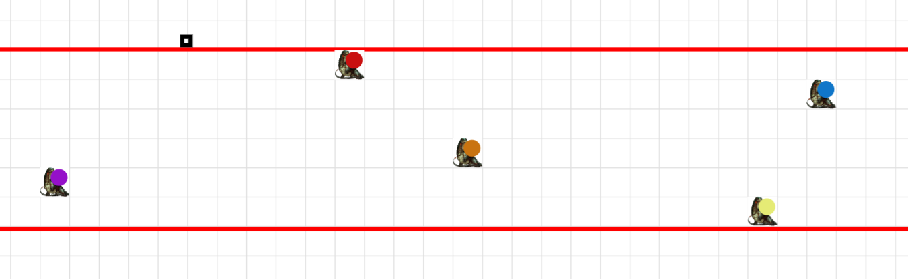
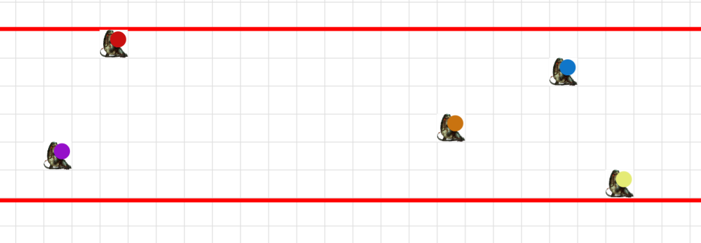
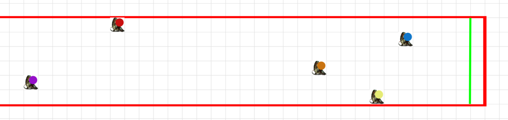
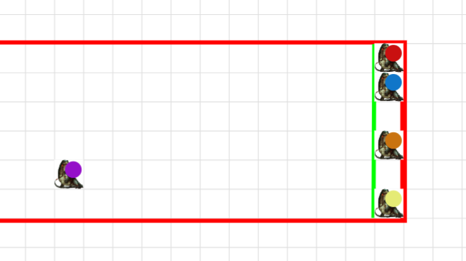
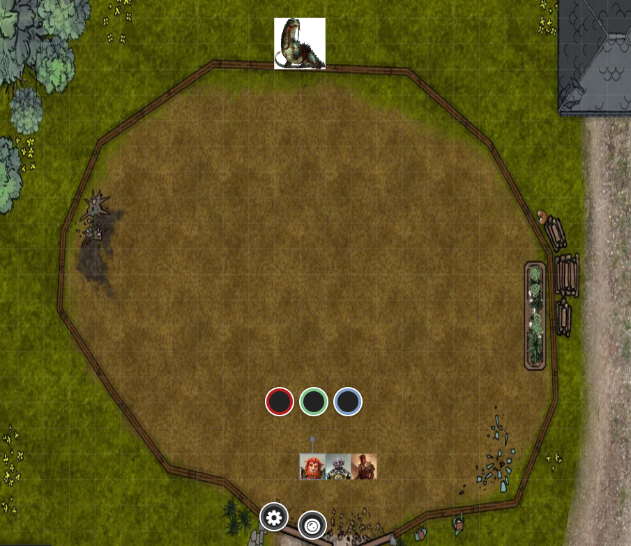

# Session 4 | 2023. 06. 22. (csütörtök)

A karám mögött kantáron hatalmas, ló méretű gyíkokat vezetnek. Hat gyík található itt, mindegyiknek a hátán különböző színű nyereg van.

*`"Mik ezek a nagy gyíkok?"`* - kérdi Rorr. *`"Ezek nagy gyíkok."`* - jelzi a hölgy. Orik lenyúgözötten bólint egyet. *`"Hogy pontos legyek: óriás gyíkok."`* - pontosít. *`"Ez a teljes nevük?"`* - kérdi Sera. *`"Igen.. nem túl fantáziadús, de hát ez a nevük!"`* - jelzi.

*`"És hogyan lehet tokenhez jutni?"`* - kérdi Ash. *`"Te vagy az Ash'ton, ugye? Te húztad ki a kardot!"`* - kérdezi a lány.
 *`"De csak mert Rorr meglazította nekem!"`* - kacsint oda a félszerzet. *`"Jó kis borsot törtetek szegény Domin orra alá!"`* - folytatja a lány. 

 *`"De megcsinálták, és segítettünk, hogy lehet hatékonyabb a mutatvány!"`* - válaszol Ash. *`"Úgy vélem, hogy a legértékesebb dolgokat elhoztuk a polcról! De még nem próbáltunk ki minden játékot, és azt hiszem nem neked kell bemutatni a játékfüggőséget..Van egy kis OCD-nk, muszáj végigjátszanunk mindent!"`* - folytatja.

*`"Ash'ton, mi is most a talonunk a ticketekt illetően?"`* - kérdi Orik. *`"Kereken 30!"`* - hangzik a válasz.

*`"Szerintem ti csak az adrenalinra vágytok!"`* - vág közbe a lány.

*`"Így utólag belegondolva, nagyon örülnék egy kis zöld sárkányfigurának! Ehhez még 20 🎫-re van szükségünk."`* - morfondírozik Orik.

*`"A győztesnek 60 🎫 jár!"`* - lelkesít a játékmester. *`"A sárkányölésnél a sárkányra azért vigyázzatok kérlek, ha oda kerültök."`* - folytatja, utalva a beszélgetésre, hogy ott még nem volt a társaság.

*`"Lucil vagyok! Én tenyésztem és tanítom ezeket a csodás lényeket!"`* - mutatkozik be. *`"Mire számíthatunk itt?"`* - kérdezzük. 

*`"Felültök az egyik gyíkra, 3 kört kell megtenni, aki leghamarabb célba ér, az nyeri a 60 🎫-t! 3 nevezést tudok még befogadni. 5 🥈 fejenként a nevezés."`* - hangzanak el a játékszabályok.

*`"Mindegyik gyík egyformán 'capable'!"`* - mondja Ash kérdésére, hogy melyik gyíkra érdemes ülni. *`"Aki árt az állataimnak, annak én fogok ártani!"`*.

Ash és Rorr is jelzi, hogy nem szívesen ülnének fel rájuk. Nana felajánlja, hogy ő szívesen kipróbálja. *`"Bár sok hátas állat nyergében megfordultam már, de ilyen teremtményekhez nem volt még szerencsém! Mikor ha nem most!"`* - Orik.

*`"Még egy fontos szabály: "`* - mutat egy táblára - *`"nézőknek és zsokéknak is tilos beavatkozni fegyverrel/varázslattal a versenybe bármilyen módon!"`*

 - 🟣: *Nana áll oda*
 - 🔵: *Sera ismerkedik vele*
 - 🔴: *egy human áll mellette*
 - 🟢: *egy törp lézeng körülötte*
 - 🟤: *egy dragonborn igazgatja a nyerget rajta*
 - 🟡: *Orik lép mellé*

Orik még nem választ paripát, hagyja a többi versenyzőt dönteni. A versenyzőket Lucli hátra irányítja. Rorr és Ash az első sor széle mellé dől, hangosan szurkolva.

Száz körüli ember van már a sátorban, izzik a levegő, várják a versenyt. Az állatok idomítottak, tűrik a közeledést.

Felvezető kürtszó után lehet szín szerint szólítva felsorakozni a rajthoz. 200ft egy kör, 3 kört kell megtenni. Maguktól 80ft-et tesznek meg egy körben - animal handling 🎲-el növelni: +/- 10-20 ft -et lehet változtatni.

A versenyzők a kijelölt gyíkhoz lépnek. Sera félelmét felismerve odabújik kissé hozzá a gyíkja. Orik hippogriffhez hasonlóan meghajol az állat előtt, az visszabiccent. *`"Nos, hát úghy tűnik, együtt fogunk versenyezni. Minden bizodalmunk magunkban van!"`* - mire megnyalja a szemgolyóját a gyík.

A kürt megszólal, felbolydul a tömeg a fő attrakció kezdetének hallatán. Lucil elmondja a szabályokat a nézőknek is, majd elkezdi szólítani a versenyzőket:

* *`"Elsőként Rubrum! 🔴"`* - a human versenyzővel a hátán érkezik az első gyík.
* *`"Kharuleum! 🔵"`* - Serafine is bekocog a rajtvonalhoz.
* *`"Viridis! 🟢"`* -a dwarf is megjelenik a pálya széle mentén.
* *`"Fuskus 🟤"`* - a dragonborn is rajtpozíciót vesz fel.
* *`"Purpura! 🟣"`* - Nana is csatlakozik a versenyzőkhöz.
* *`"Flavum! 🟡"`* - zárja a sort Orik.

A rajtkürt megszólal - indulnak.

 - A human elkezdi a gyík oldalát rúgdosni, ezért nem túl lelkesen mozog.
 - Sera bokával próbálja indítani a saját jószágját, a gyeplőt is az ökrös irányításhoz hasonlóan rázva. Elég rosszul viseli az effajta noszogatást, ugrál alatta.
 - A törp belesuttog a gyík fülébe, ami ledobja a hátáról a törpöt, és elindul nélküle  - versenyző nélkül, aki káromkodva hempereg a földben - kiesett.
 - A dragonborn úgy érzi, hogy óvatosan kell a jószágot kezelni, szép lassan indulnak el.
 - Nana a gyík fülébe suttog: *`"Menni fog, barátom!"`* - megindul a gyík, de nem igazán figyel rá.
 - Orik megpaskolja a jószág nyakát: *`"Kedves kolléga, akkor rajta!"`* - nagy az összhang.

Az első kör után az állás a következő:

 - A második körben a human magától hagyja a gyíkot mozogni.
 - Sera telepátiával próbálja a gyíkot motiválni: *`"Bármit ígértek neked vacsorára, megduplázom!"`* - melyre a gyík összeszedi magát, és felzárkózik a human mellé.
 - Hangos füttyszó kíséretében a zöld gyík lesétál a pályáról.
 - A dragonborn szolidan bánik a pikkelyes barátjával - óvatosan araszolnak előre.
 - Nana autopilot módban kocog tovább, nem szól a gyíkhoz.
 - Orik elégedetten gratulál a gyíknak - további instrukció nélkül.

A második kör után: 

A dragonborn alatt a gyík elkezd vakarózni.

 - A human továbbra is nógatja a gyíkját.
 - Sera ráhajol a nyakára - hogy áramvonalasabbak legyenek, megvakarja a gyík tokáját közben. A gyík jó tempóval hálálja meg ezt.
 - A dragonborn gyíkja görcsölni kezd, ezért nekiáll vakarózni - a noszogatás sem segít rajta a nagyobb mozgáshoz.
 - Nana simogatással motiválja a versenytársát, kevésbé sikeresen.
 - Oriknál teljes az összhang: *`"Kedves kolléga, azért ne aprózzuk, ne aprózzuk! Megy ez!"`*

A harmadik kör után: 

 - A human az állatára bízza.
 - Sera sem szól bele a tempóba.
 - A dragonborn nem akarja a hüllőtársat meghajtani, komótosan kocognak.
 - Nana nem moitivál, bízik a gyíkban.
 - Orik a lendülettől azt érzi, hogy a nyereg elkezd kicsúszni alóla, de mielőtt a pánik úrrá lenne rajta, megkapaszkodik, bár a nyereg eltűnik, de csak annyit szól a hüllőhöz: *`"Pánikra seemmi ok, csak így tovább!"`*.

 (Ash fogadást próbál indítani, de lepisszegik.)

A negyedik kör után: 

 - A human erőteljes rugásokkal motiválja a hátast, de az nem veszi ezt jó néven, kicsit lassabban mozog.
 - Sera látva az Orikkal történeteket újra motiválja a jószágot, nyakát vakargatva - újra meglendül a hátas.
 - A dragonborn is rákapcsol, érzi a lemaradást.
 - Nana ahogy halad, hirtelen előtte landol egy nagy darab véres húscafat. Bár jól vannak tartva az állatok, az ingyen kaja az ingyen kaja, megáll falatozni.
 - Orik megbátorodik a viszontagságok ellenére: *`"Semmi nem állja utunkat, szemünk előtt a győzelem. Hajrá-hajrá!"`*. A gyíknak azért kényelmetlen nyereg nélkül az utas, de mozognak.

(A nézőtéren két tagbaszakadt Ork megindul arrafelé, ahonnan a hús érkezett. Ash is leszűri honnan jöhetett a dobás, megindul feléjük. *`"Nem kell aggódni, idővel te is részese lehetsz a tömegverekedésnek!"`*)

Az ötödik kör után: 

 - A human idegesen bítatja a hátast, sikertelenül. Kezdi elveszíteni az uralmát a lény fölött.
 - Sera odamormolja: *`"Ritkán és keveseknek mondok ilyet, de megkedveltelek!"`*. Kissé dorombolva ennek hatására visszafelé hajol a gyík, ez eltereli a figyelmét.
 - A dragonbornnál a kezdeti lemaradás kezd eltűnni, lehet megtalálták a konkrét közös nyelvet.
 - Nana: *`"Mostmár elég a kajából, menjünk tovább!"`* - a gyík nyílsebesen indul el a pályán tovább.
 - Orik nem pofázik bele, tudja a jószág mi a cél.

A hatodik kör után: 

(A két ork egy human férfit tessékel kifelé a tömegből, Ash követi őket.)

 - A human kezdi belátni, hogy nem bír a bestiával, rá bízza a tempót.
 - Sera irányba állítja a jószág fejét: *`"Jó-jó, de előre nézz!"`* - egyetértő morgás után megindul a gyík.
 - Tartja a lendületét a dragonborn, egyre közelebb van a célhoz ő is.
 - Nana szól a gyíknak, hogy *`"Így tovább!"`* - de a gyík visszabüfizik egy kis husit, kissé belassul.
 - Orik elégedetten nyugtázza, hogy nem haladnak rosszul.

A hetedik kör után: 

(A human egy 50-es, tagbaszakadt, mocsok részeg úriember. *`"Én csak megetettem szegény állatot <hughkgk>..."`*. Ash még nem éri utol őket, de zárkózik fel, az őrök után szól: *`"Yorik már megint hülye voltál? Ne haragudjanak, bízzák csak rám, majd én elintézem!"`* - *`"Ki a tököm az a Yorik?"`* - kérdez vissza a részeg fickó. A két félork összenéz: *`"Na gyere velünk a bejárathoz, vigyed innen a haverodat!"`*)

A tömeg skandálni kezd: *`"Rubrum! Rubrum!"`*

 - Az emberi versenyző és a gyík is a motivációt érezve átlépik a célvonalat
 - Sera meglátja a felső sávban a sebes vágtát, megijed: *`"Húzzunk bele!"`* - beér ő is a célba.
 - A dragonborn szintén átlépi a vonalat.
 - Nana: *`"Na gyerünk, mostmár csak érjünk át a célvonalon!"`*
 - Orik teljes gőzzel megy előre: *`"Győzelem! Előre a dicsőségért kedves kolléga!"`* felkiáltással ér be.
 
A nyolcadik/utolsó kör után: 

A tömeg lélegzetvisszafojtva várja az eredményhirdetést, végül Orik hátasa szakítja át a célvonalat, pár cm-vel lemaradva érkezik Serafine, a human a harmadik, a dragonborn a negyedik helyen, végül Nana is bekocog. A tömeg hangja berobban az éljenzés keretében, skandálják Flavum nevét, aki körbesétál, ünnepeltetve magát. *`"Micsoda remek jószág, dicsőséges bestia!"`*

*`"Flavum a győztes! A nyergében, illetve nyereg nélkül, de továbbra is Flavum hátán Orik!"`* - hallatszik a human lány hangja, időnként a többi gyík hangját is hallani.

*`"Látod, ez az én barátom! Ő a leggyorsabb!"`* - veregti meg Rorr a mellette állók vállát, akik gratulálnak neki.

A félorkok löknek egy nagyot a részeg emberen, aki a porba térdel. Ash marad ott vele, orrbatérdeli a humant. *`"Mi a kurva anyádat csinálsz?"`* - hördül fel a részeg. *`"Jajj bocsánat, mindjárt ellátjuk azt a sérülést!"`* - szól oda Ash. *`"Kell valami hideg az orromra!"`* - jelzi. *`"Mindjárt adunk"`* - jelzi Ash, egy pengét tartva az oldalához. Mivel ellenkezik, Ash beleszúrja a pengét, hatására fájdalmasan felordít a delikvens. Itt már tompább a benti moraj, Ash *`"Orik! Győzelem!"`* felkiáltással próbálja leplezni a hangokat, sikeresen. Odébbtessékeli a humant, leülteti egy szekér mellé, bágyatag, fájdalmas tekintettel néz. A fejében hallja: *`"Az egyik barátom miattad nem nyerte meg a versenyt.. Azt hiszem illene kompenzálnod, és kifizetni a nevezési díját!"`*. Elkerekedett szemmel néz vissza: *`"Démon, démon!"`* - próbál menekülni, de elesik Ash lábában, a tőr is beléfúródik, kezd gyűlni a vér. *`"Túlélheted, de ahhoz meg kell fizetni a nevezési díjat, és bocsánatot kell kérned egy gyönyörű eladrintól!"`*. Felemeli a fejét, és sírva közli, : *`"Én csak...szórakoztam egyet!"`* - mire Ash: *`"Mi is.."`*. *`"Persze, megfizetem, csak ne ölj meg!"`*. *`"Na látod, kezdhetted volna ezzel is! Ez 5 🥈 lesz! Nem érdekel mennyid van, a többit megtarthatod."`*. A véres érméket Ash a human ruhájába törli, majd a sebet kissé 

Közben az üdvrivalgás közepette Orik megkapja a 60 🎫-t. *`"Nagyon szép munka, gratulálok! Egy élmény volt Önnel versenyezni!"`* - köszön a győztes a hátasának. Serahoz lép, lesegíti a hátasáról, ünnepelteti őt is, majd Nana-hoz lépve udvariasan ugyan így tesz. Biccent a másik két versenyző felé is, viszonozzák. A kiesett törp csak dúl-fúl magában, ott felfelé biccent, kissé kárörvendően. Lucil is megköszöni a részvételt, a hangosbemondón a nézőknek is megköszöni a szurkolást.
*`"Ha tényleg mentek sárkányt ölni, akkor finoman! Az előadás a lényeg!"`* - szól aggódva még utánunk. Ash ekkor csatlakozik hozzánk, nyújtja az 5 🥈-t Nana felé. *`"Megbeszéltem az úriemberrel, nagyon sajnálja a tettét, szeretne bocsánatot kérni, de sietnünk kell!"`*. Ash útbaigazítja, hogy merre találja Nana az urat, de Nana 

*`"Nagyon gratulálok, nem tudtam, hogy ennyire értesz az állatokhoz!"`* - mondja Sera Oriknak. *`"Ohh, hát nem az én érdemem, én csupán az utas voltam! Kiskegyed is derekasan versenyzett!"`* - mondja Orik.

*`"Nem biztos, hogy meg szeretnéd nézni azt, amit Ash tervez!"`* - jelzi Sera. *`"Miért, mire gondol a kisasszony? Ash'ton egy úriember, csak a lovagiasság vezeti."`* - válaszol Orik, érezve, hogy valami shady éle van a dolognak.

Rorr még ünnepel a nézőkkel, nem tűnik fel neki, hogy a többiek kimentek. Sera utána kiált, hogy jöjjön, Rorr szép komótosan felzárkózik.

Nana azt látja, hogy egy vértócsában fekszik egy úriember, aki nincs magánál. Nana segíteni próbál rajta, . 

*`"Milyen szerencsétlenül botlott meg az úriember!"`*. - szól oda Orik.
*`"Kettő félork kitessékelte, én segítettem tovább tessékelni. Mint látszik, erősen elfáradt."`*

Rorr meglátva az embert a vérben, jelzi, hogy ő tud segíteni rajta. Kis kántálás után meg is gyógyítja. Az ember lendületből felül, először Nana-t veszi észre, aki fölötte térdel. *`"Bocsánat, bocsánat, nagyon sajnálom! Nem akartunk semmi rosszat, csak szórakoztunk!"`* - majd elkezd hátrálni a földön. *`"Remélem, tanult ebből a helyzetből!"`* - jegyzi meg Nana. *`"Esküszöm, soha többé nem iszom.. verseny előtt.. sört!"`* - szabadkozik. Nana kiáll az útjából, majd kis cikk-cakk mozgással próbál távolodni, de Orik még megfogja. *`"Mielőtt elválnának útjaink, abban akartalak megerősíteni, hogy 'Azt illem mindenek előtt!'"`*. Bólint egyet lassan, majd pár mp múlva Orik elengedi, elrohan, a tömegben elvegyülve. A kocsmasátor felé megy a tömeg nagyja, egy része a kijáratot célozza, többen a sárkánylövészet/ölés felé indul. Orik a tokeneket Ash-re bízza.

*`"Amennyiben mindenki lelki békéje helyre állt, megnézzük a sárkányölést?"`* - kérdezi vidáman Ash. A többiek bólogatnak, az ösvényen balra fordulva indulunk az utolsó állomás felé.

Egy nagy karám tárul szemünk elé, lekerített résszel. Orik catch-upolja Rorrt a történtekről, a gyíkot nem kell megölni, csak előadni az gyilkolást. (tetrálisan - hogy? eljászva - akkor milért nem ezt írják)

A karámnál egy megtermett félork üdvözli a népeket. *`"Áá, biztos te vagy az Ash'ton!"`* néz ránk. *`"Úgy bizony! Látom a hírem megelőz! Beszéltünk Lucillal, és minden vágyunk, hogy megnézzük, hogyan kell sárkányt ölni!"`* - jelzi.

Beszélgetés közben feltűnik, hogy a bal karján mély és frissnek tűnő harapásnyomokat veszünk észre. *`"Nem mindig kezes?"`* - *`"Ez a dög? Rémálom, vad bestia.. Nem tudom Lucil mit csinált vele, nem véletlen, hogy velem van, nem versenyzik.. Mit mondott nektek erről?"`* - *`"Minden kedvence élje túl a versenyt."`* - *`"Mondok valamit.. alapvetően szabály nincs rá, hogy túl kell élnie, én pedig megmotiválnálak egy kis készpénzzel, ha kis túlkapás történne az előadás folyamán.. és ez a dög megdöglene."`* Unimpressed Orik. *`"Nem bántjuk az állatokat!"`* - jelenti ki Nana. *`"Történnek balesetek!"`* - *`"Balesetből sem bántjuk őket!"`* Ash és Sera fejben beszélgetnek a baleset részleteiről, hogyan lehetne kivitelezni.

*`"A lényeg annyi, kijön ez a mocsok.."`* *`"Az a mocsok, aki rosszul tartja, biztos ő nem mocsok.. Lesz rajta pár célpont / szalag, amit le kell vágni, ha mind sikerül, akkor 50 🎫. Ha a tömeg reakció elég jó, még 25 🎫"`* 

 - *`"Magadra vonnád Nana haragját?"`* (sera)
 - *`"Lehet nem merem.."`* (ash)

*`"Amennyiben nem vagytok ellene, kifejezetten szeretném próbára tenni magamat. Az előbb én nem lovagoltam, szeretnék 1st hand experience-t!"`*

*`"Tudom, tudom, csak előadjuk, nem igazából csináljuk, rossz a felirat..."`* - jelzi Rorr, mikor Nana emlékezteti, hogy nem kell ölni.

*`"Látod -e annak módját, hogy segítségetekre lehessek ebben?"`* - kérdi Orik Ash-t. *`"Nana miatt a legkevesebb vérrel kellene megúszni, tehát a gyíkot nem bántjuk, lehetőúség szerint ő se minket. Többen könnyebb elterelni a figyelmét, könnyebb a show-műsort tenni."`*

Orik egyet ért.

*`"Lássuk, le tudjuk e győzni a sárkányt!"`* - Ash, és lebegő köpeny. Szórványos taps.

Ash és Rorr a karámba lépnek, Orik is csatlakozik. *`"Látom lelkesek vagytok, de adjatok még pár percet!"`* - jelzi a játékmester. Még invitálja a nézőket, megvannak a kihívók, mindjárt kezdődik az ádáz küzdelem. Felugrik az ork a kerítés szélére, és onnan kiált: *`"Lady Alagondar győzelmének 100-ik évfordulójának emlékére újraelevenítjük a harcot! Persze csak szerény körülmények között! A sárkány adott, lássuk az előadást!"`*.

A karámból egy hüllő körvonala, és sárgás szemek látszanak. Ahogy jön kijjebb, látszik, hogy szárnyak is vannak gyártva rá. ugyanolyan, mint a versenyen, bőrpáncéllal, mindenfelé piros szalagok lógnak rajta.

Orik és Ash azt látja, hogy kissé elnagyzolt a gyík mozgása - színpadiasnak mondható. Üvölt egy nagyot, a tömeg éljenezni kezd. Ash eggyel előrébb lép: *`"Nemes bestia! Lady Alagondar emlékére megküzdünk veled, ahogy 100 éve is, hogy legyőzzünk!"`* - teátrálisan jelzi. A sárkány a szemébe néz, döngő léptekkel közelebb jön. A tömeg feszült csendben várja, hogy mi lesz.

### 🎭 PERFORMANCE 🎭

Orik igazi görög/sprátai pózban dárdával és pajzzsal előresétál. Ash Orik mögé lép, a kardjára kékes-zöld lángokat idéz *`"Az igazság tüze fellobbant! Jer ide te sárkány, ha mersz és kardélre hányunk!"`* - a tömeg meglepődve de tetszetősen morajlik fel. *`"Bár páran itt veszhetünk, de a győzelem elkerülhetetlen!"`* - lép elő Rorr is. A sárkány felméri az ellenfeleket, majd hirtelen iramban megindul, megtorpan, üvölt egy nagyot, és visszahátrál, készenlétbe helyezkedve. A tömeg hanggal követi.

Orik próbálja ellesni a színpadi jelenlétet a többiektől, a dárdáján zöldes tüzet idéz, majd lassú léptekkel megindul felé. A tömegnek tetszik amit lát, de egy kislány elsírja magát. Előrébb lép ő is. Ash: 
*`"Látom Orik rád ijesztett, nem kerülheted el a végzeted."`*  - majd balettes mozdulatokkal próbál egy szalagot megszerezni. Sikerül neki nagyon szép ugrással több szalagot is levágni. A tömegnek tetszik - látványos, hatásos. Rorr is megindul a gyík felé, dobbant egy nagyot, melynek hatására egy nagy mennydörgő hangot hall a közönség: *`"Hallod -e te bitang? Ez a végzeted hangja, mely a múltból zeng felénk!"`* - a tömegnek nagyon tetszik a show. A gyík mélyen Ash szemébe néz, mintha kacsintana, majd egy hirtelen mozdulattal a farkával odacsap Rorr-ra (aki hanyatt vágódik ettől), majd odébb szükken. 

Orik tartja a formációt, majd Rorr és Ash közé menetel. Egy mutatványos mozdulattal megpörgeti a dárdát, a sárkány egyik szalagját célozva, többet meg is szerez. A pajzsát ezután Rorr fölé emeli, de Ash felé tartja. Ash láthatóan idegesen: *`"Nem hagyom, hogy bárkit is bánts! Bestia, most megtudod, hogy ki a végzeted!"`* - az előkészített pajzsra lép, majd megpróbál átszaltózni a gyík felett a segítséggel. Tökéletes kivtelezéssel újabb szalagokat vesz magához Ash, a megmaradtak felét. A tömeg szüntelen éljenzésben van.
*`"Csak ennyit tudsz?"`* - jelzi Rorr, miközben feltápászkodik. Felé suhint, de a gyík félrehajol. A tömeg nevet, de átéléssel, nem gúnyolódva. Ezen felbuzdulva a sárkány Orikot veszi célba. Vesz egy nagy levegőt, visszahúzza a fejét, majd odakap Orikhoz, a pajzsra harap, ránt egy nagyot rajta, melynek hatására Orik válla kiugrik helyéről, aki a fájdalomtól megvakul egy pillanatra, majd odébbdobja őt. A tömegből *ghasp* hangok hallatszanak.

*`"Ez a szörnyű bestia!"`* - kiált fel hangosan Orik. Agonizál kissé, majd a földön fekve megpróbálja vállát visszatenni a helyére, újra fájdalmasan kiáltva. Ash teljesen beleéli magát: *`"Orik! Nem hagyom, hogy többet bántsd a barátaimat! Itt és most véget vetek az ámokfutásodnak!"`* - kiált. Gyönyörű mozdulatokkal a maradék szalagot is levágja a sárkányról - jobbra-balra toporog, majd oldalra vágódik. Ash odalép, leszúrja a kardot mellé: *`"Nemes küzdelem volt, de a gonosz sosem győzhet az igazság fölött!"`*

*`"Bár páran elestek a csatában, az ő dicsőségüket is dalban énekeljük évszázadok múlva is!"`* -. lép Rorr oda Orikhoz. Ash próbálja felsegíteni őt is. *`"Meglehetősen pazar előadás, de..most?"`*

### 🎭 PERFORMANCE VÉGE 🎭

A félork beszalad középre: *`"Csodálatosan méltó újraélése volt ez a 100 évvel ezelőtti csatának, nem így van?"`* - a tömeg erre skandál: *`"Sárkányölők! Sárkányölők!"`*. Ash megfogja két társa kezét, majd meghajolnak minden irányba.

*`"Ne feledjük azt, aki nélkül e remek mutatvány nem jöhetett volna létre! Ez a taps neked is szól barátom!"`* - próbálja Ash a gyíkot is ünnepeltetni. Egy fájdalmas morgás közepette a másik oldalára fordul "meghalni".
 *`"Remek előadás! Sajnos ez a dög túléli, de jár a 75 🎫!"`*. Két félszerzet beszalad a karámba, kihúzzák a tetszhalott sárkányt, (csak próbálják, mert nem bírják el), aki alig észrevehetően tolja magát kifelé.

*`"Talán még Obsidium is.. talán van ebben a dögben is valami!"`* - mondja az ork. *`"Hagyd rá..színész"`* - *`"Igen, lehet úgy kell őt kezelnem, mint a ripacsokat."`*.

Elindulunk kifelé, visszaérve a fő helyszínre. Már kezd lemenni a nap, még nincs sötét, de már nem a nappali fény.

*`"Ez derék mulatság volt, és maradt még 165 🎫! `* - jelzi Ash.
*`"Tisztelettel abból szeretnék 80-et egy zöld sárkányra költeni!"`* - mondja Orik. *`"Én egy pipát magammal vinnék!"`* - jelzi Rorr, majd beváltják a két nyereményért a tokeneket.

A maradék 35 🎫-t Orik elkéri, hogy a síró kislánynak adja (🎭 közben aki elpityeredett). Nana elkíséri Orikot, hogy ne egyedül, ijesztő módon adja át.

*`"Elnézést, ne haragudjanak! Az útitársaimmal maradt egy kis ajándék 🎫, amit gondoltuk a kislánynak..ha esetleg szeretnének venni valamit..akkor szívesen..ha elfogadják..ajándékképpen..(engesztelésül)"`*.
Az apuka beáll a kislány elé, az anyuka kissé tétován kinéz Nanára, majd elveszi a jegyeket, és megköszöni. Az apuka csak biccent, majd arrébbállnak. *`"Nem is zavarunk tovább!"`* - mondja Orik, majd visszalép az ajándékos sátorhoz. Letesz egy aranyat az asztalra, majd megkérdezi a goblint a saját nyelvükön: *`"Ez elég -e ahhoz, hogy bármilyen megmaradt ajándékra kipótolja őket?"`* - mutat a családra. Ránéz az aranyra, majd visszatolja, rázva fejét. Orik még egy aranyat tol felé, továbbra is rázva a fejét. Ash megjegyzi, hogy csak tokent fogadnak el, a goblin biccent. Orik udvariasságot erőltet az arcára: *`"Tiszteletre méltó a becsületességed"`* - majd goblinnyelven hozzáteszi: *`"használd a nagyfiús szavaidat"`*.
