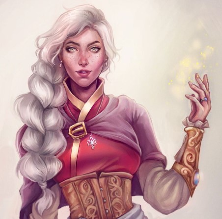
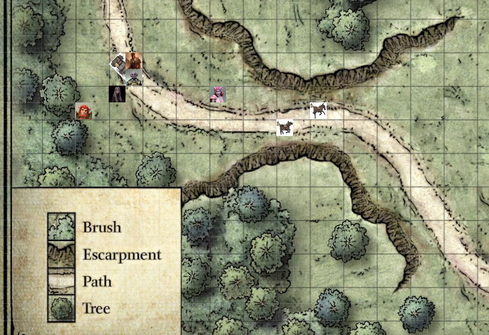

# Session 5 | 2023. 06. 25. (vasárnap)

Arról tanakodunk, tovább menjünk -e még ma, vagy táborozzunk itt a karnevál mellett.

*`"Amíg világos van, mehetünk tovább!"`* - mondja Rorr, majd elmegy kikérni a szekeret. A félszerzetek egyből hozzák az ökröket, befogják őket a szekér elé.

Orik vállalja a szekér vezetését, a többiek hátul foglalnak helyet. Rorr sétál, ahogy korábban is. Még egy gyors leltárt tartunk indulás előtt - mindent a helyén / rendben találunk.

Orik elfoglalja a helyét a bakon, Sera melléül. A hobgoblin még fáradt a harcok után. Sera felajánlja, hogy átveszi a szekeret, ha úgy van - *`"Vagy..akár le is táborozhatunk!"`* - jelzi meg hátulról Ash.

Az ökrök elindulnak dél felé a High Road-on. Kb. 2 óra múlva lesz tök sötét, még egy órát mennénk, amíg le nem bukkan a horizont alá.

Orik tartja a gyeplőt - *`"Kisasszony, ha esetleg segíthetek ebben a sötétség problémában...ha hajlandó megválni az érmétől..Elég ha kitartja ide, az egyik kezem sajnos foglalt"`* - Sera kitartja neki az érmét. Orik mormol fölötte pár szót, majd Magical Tinkering helyett Light -t rak rá *`"Sajnos nem olyan potens a bűbáj, mint egy potensebb varázslat tenné - de 5ft-et ez is világít."`*

Orik jelzi, hogy megfigyelte Sera képességeit, tudja, hogy több van ott, mint látszik.

*`"Nagyon érdekelnek a spekulációid.."`* - Sera.
Orik egy nagyon semmitmondó, nagyon tág varázselméleti monológba kezd - időnként észrevehetően belefoglalja amit Sera is csinált - történtek harc közben olyan dolgok, amelyek mágikus eredeztetnek, de senki máshoz nem tudja kötni - de ez csak spekuláció.

*`"Ha valami pontosabb következtetésre jutsz, kérlek oszd meg veled, mert nagyon érdekesek a meglátásaid!"`* - válaszol Sera.

*`"Remélem nem voltam tolakodó!"`* - *`"egyáltalán nem"`* {{small talk}}

Besötétedik, az éjszaka hangjai kezdik átvenni a dominanciát. Az út mellett enyhén sűrűsödik az erdő.

 Alkonyat tájékán megállunk - Orik sátrat ver - Sera az ökröket gondoskodja, Ash tüzet gyújt, majd zenélni kezd, Rorr és Nana tüzifáért mennek. Mire kész a tábor, már majdnem teljesen sötét lesz.

 *`"Ashton, esetleg, ha nem vagyok udvariatlan, lehet számot kérni?"`* - kérdezi Orik. *`"Mire vágynál?"`* kérdi vigyorogva a halfling. *`"Esetleg..egy ilyen világlátott történetmondó, mint te, biztosan hallott már Tasharól!"`* - csillan fel Orik szeme. *`"Óóó, Tasha és az ő mágikus üstjéről vagy a félelmetes nevetéséről?"`* - kérdezi Ash. *`"Az üstjét mindig is kedveltem, nagy hatalmú eszköz"`* - válaszol Orik.

Ashton zenélni kezd. Orik lenyűgözötten hallgatja, néha azért megrándul a szemöldöke, villan a szeme, jegyzetel egy-két dolgot, de mosolyogva hallgatja, meg is tapsolva az előadást a végén. *`"Egészen kiváló!"`* - jegyzi meg.

Így telik az este, az úton ritkás a forgalom - főleg járőrök vagy magányos lovasok mennek el néha.
Van, aki biccent, van aki inkább siet tovább.

Nana piros ceruzával egy bazi nagy kígyót színez épp - a vonalakon kívül továbbra is.
*`"Én kezdem az őrséget, ti pihenjetek nyugodtan!"`* - jelzi Rorr. *`"Nagyszerű!"`* - mondja Ash, majd el is sétál az egyik sátorhoz, és lepihen.

Orik még lefekvés előtt még egy órán keresztül a gyűrűt vizsgálgatja, melyet a 🎫-ért kapott - megállapítja, hogy még él a mágia benne. Ahogy felhúzza az ujjára, érzi, hogy ez 💰[ `Ring of Poison Resistance` ](https://forgottenrealms.fandom.com/wiki/Ring_of_resistance).

*`"Megfejtettem ennek a kis gyűrűnek a titkát!"`* - kiált fel. *`"És az micsoda?"`* - kérdi Sera. *`"Bizonyos mérgek ellen bizonyos ellenállást biztosít a viselőjének, amennyiben az hajlandó ráhangolódni és saját esszenciáját vegyíteni a gyűrű mágiájával."`* - magyarázza. *`"Ez miképpen történik?"`* - kérdez vissza a human, melyre fél órás, *"rövid"* elbeszélés után választ is kap.

*`"Kifejezetten hasznos kis csecse-becse, de nem akarom kisajátítani, ha bárki hasznát venné!"`* - várja a reakciókat.*`"Kisasszony, szabad egy kis demonstrációra? "`* - persze hogy tudok segíteni - csak tartsa ki a gyűrűs ujját - tudja mit, legyen inkább egy másik, hogy ne legyen félreérhető - ennyire nem vagyok szívbajos.
Orik leveszi a gyűrűt, *`"Figyelj csak Rorr!"`* - majd felhúzza Sera ujjára, amely változtatja méretét. *`"Jól áll ez az amethist gyűrű!"`* - szól Ash. *`"Tartsam meg?"`* - kérdi Sera. *`"Talán inkább visszaadom! Sokat dolgoztál azon, hogy rájöjj, mire jó ez a gyűrű..talán viselhetnéd is!"`* - Sera
*`"Rorr esetleg?"`* - kérdi Orik. *`"Megpróbálom, adjad csak!"`* - kisujjra húzza. Megcsillan a holdfényben, *`"Nem érzek semmit!"`* - majd visszaadja, és visszafordul őrködni. Ash elmegy aludni, és lefekszik. *`"Jó pihenést!"`* - köszön vissza Orik.

Orik odasomfordál Nana mellé - *`"Kis-kisasszony.."`* - *`"Mondjad..."`* - hallatszik. *`"Kegyed még nem nyilatkozott, hogy érdekli -e a gyűrű, vagy sem!"`* - *`"Hadd fejezzem be a színezést, majd utána ránézek!"`* - *`"Rendben akkor majd <itt> lesz!"`* - mondja óvatosan Orik, és leteszi Nana mellé a gyűrűt.

*`"Rorr, megtennéd, hogy felkeltesz a következő strázsára?"`* - kérdezi a bugbeart. *`"Persze, látom téged rendesen elkaptak ezek a dögök.."`* - válaszolok. *`"Voltam már jobban.."`* - mormolja a hobgoblin, majd elvonul a másik sátorba pihenni.

Sera is elvonul Ash mellé, még a coinnal világítja a halacskával, ahogy játszik elalvás előtt.

Rorr a kelleténél jobban feledkezik bele Lady Alagondar story-jába, amit őrség közben olvas.. 

> *Nana lágy szellőt érez - mely ismerős illatokat hoz felé - az otthona jut róla eszébe. Feláll, továbbra is színez, de elindul a szél irányába a fák közé. A szél és az illat is egyre erősebb -a fák is sűrűsödnek. Nana leteszi a ceruzát, majd az ágakat félresodorva megváltozik a táj - a sötét éjszakából visszatér szürkületi derengésbe - nem az eddigi tájkép bukkan elé (más fák/növények, a színek is intenzívek). Nana *otthon* érzi magát ebben - felfelé folyó vízesés mellett sétál, lebegő sziklákat lát, tűzpiros borostyánnal benőve. Olyan nyugodtságot érez itt, melyet már rég nem. Ahogy halad az ösvényen, egyszerre csontok között találja magát. Vihar kezdődik, villámok, mennydörgés - mögüle röhögő csuklyás alakok rontanak ki felé a csontok közt. Néha visszanéznek felé, majd kutakodnak tovább a csontok között, egyre hangosabban nevetve. Az egyik villámlás vakítása közepette egy réten találja magát - a szél nem fúj, de a fák és a fű továbbra is mozog, össze-vissza. Ahogy Nana itt üldögél, döbbenten, a földből szárba szökken egy szál virág. Gyorsan megnő, majd egy hatlmas tűzvörös liliom virágzik ki - a tűz minden színében pomázva - Nana megérinti azt. Abban a pillanatban hamuvá válik.. A hamuból két virág bújik elő, hasonló liliomok - de ezek is egyből hamuvá vállnak, abból 3 liliom... így tovább, ciklikusan majd egy hatalmas lilom mező bontakozik ki a réten. Ahogy a mező elterül, mozgást lát Nana a virágok között. Valami hosszú, tekeredő mozgást.. Egyszer csak előbukkan egy szép, megtermett lángvörös kígyó. Nana óvatosan hozzáér, az az orrát nekinyomja. Egyre intenzívebbé válik a szín rajta ettől - szinte lángolnak a pikkelyei. Elhúzódik, majd gyorsan tekeredni kezd a réten. A nyombában, ahogy hamucsíkot húz, további virágok nőnek ki. Nana követni kezdi a kígyót.. A virágok és a fák hívogatóan intenek felé, de egyre távolibbnak tűnnek. Ahogy siet Nana, úgy lesznek egyre távolabb.. Az egész hirtelen fellobban, majd Nana újra a tábortúz mellett találja magát. A színezője már egy másik oldalon van - egy vaddisznót ábrázol a papír. Erőteljes krix-kraxok, villámcsapások vannak rajta. Ezek fölött egy gyönyörű liliom rajzképe látszik. Azt érzi, hogy álom volt - de az eladrin nem alszik, inkább látomás. Az otthon hazahívja őt, de Nana még nem áll készen, hogy visszatérjen, de az ehhez vezető útra lép és kap segítséget.*

Nana kicsit közelebb húzódik Rorrhoz, nyugodtan színez, vonalon belül marad. *`"Húnynék én is egyet..ha nem baj!"`* - jelzi Rorr egy nagy ásítás közepette. *`"Csak nyugodtan!"`* - válaszol Nana, nyugodt hangon.

*`"Én a vadonban nőttem fel - nem kell magyarázkodnod, ismerem a helyzetet!"`* - mondja Rorr, miután Orik egy dárdát szegez rá a lába rángatására válaszul. Az őrségváltás alatt Rorr is pihen egyet.

*`"Jól értem, hogy a kis-kisasszony kipihente magát?"`* - kérdezi Orik. *`"Óó, én kipihentem magam, menjél csak nyugodtan, figyelek majd."`* - válaszol nyugodt hangon Nana, majd Orik visszafekszik kipihenni magát. Nana körülnéz a tábor körül, de nem talál a látomásból ismert liliomot.

> *Ash álmában fura helyen találja magát - egy sötét tér közepén áll - gőzös füst a lába körül. Alakok vannak körülötte, ismerősnek tűnnek, de nem tudja megállapítani pontosan. Felnézve pici fény dereng a hatalmas sötéttel szemben. Megpróbálna felé menni, de nem sikerül. Akárhogy próbálja az arcokat kivenni, mindig háttal látja őket. Egyszer csak a sötétség visszahúzódik - ami eddig a sötét volt, az lesz a fény.*

~~~
{💤} long rest
{🏆} level-up: #2
~~~
Eljön a reggel, kel fel a nap, csicseregnek a madarak. Mindenki szépen lassan ébredezik. *`"Jó reggelt!"`* - köszön Ash. *`"Hm...sátorban vagyunk! Mi történt a fogadóval?"`*  - *`"Rég láttalak Ash..a fogadó az utolsó, ugye? Nos, megint volt egy kis időszak, amikor nem te irányítottál.."`* - *`"Hahjj, hát persze..Temperiont megint elvitte a ló! Már megtanultam, hogy úgy jó, ahogy ő akarja! Hol vagyunk épp?"`* - *`"Úton Phandalin felé! Úgy döntöttünk - döntöttél, hogy segítünk néhány nagyon kedves idegennek eljuttatni egy szállítmányt oda."`* - *`"Nagyszerű! Ha Temperion így gondolja, én nem fogok habozni!"`*

A többiek hallják a folytott suttogást.. Sera hangja rendben van, Ash furcsán hangzik.. *`"Volt itt egy érme - egy kis világító érme, sehogy sem találom.. Van egy kis dolgom kint, addig keresd meg nekem!"`* - kéri Sera. *`"Reggelizzünk!"`* - mondja Ash. *`"Várj, keresd meg az érmét előbb!"`* - húzza vissza. *`"Bármikor tudok neked ilyet bűvölni!"`* - light cantrip egy aranyra. *`"Ilyet én is tudok!"`* - pirosra bűvöli, majd eldobja.. *`"Kérlek keresd meg az érmémet, úgy kaptam valakitől! Fontos!"`* - erősködik Sera. *`"Rendben..."`* - válaszol Ash. *`"Mindjárt visszajövök!"`* - majd Sera kilép a sátorból.

Orik kint ül a tűz maradéka mellett, csomó szerszám van körülötte, kovácseszközök, Thief's Tools. Látszik, hogy máshogy használja őket, mint az átlag ember. A végén diadalittasan felemel egy számszeríjat: *`"Sikerült! Háhh!"`* - majd elkezd pakolni. *`"Látom, legalább valaki kipihente magát."`* - jelzi Nana. *`"Beszélhetnénk, van egy percetek?"`* - kérdezi Sera halkan. *`"Mi sikerült?"`* - hallatszik a sátorból egy idegen hang. *`"Ez ki volt?"`* - kérdezi fenyegető hangon Orik.

 *`"Ash nem mindig önmaga..És ma reggel ballábbal kelt."`* - magyarázkodik Sera. *`"Milyen szinű volt, azt nem mondtad, mit keresek?"`* - lép ki Ash a sátorból. Humanoid, de nem human alak lép ki (aasimar faj).

Orik leengedi a fejszét és a dárdát, amit reflexből vett elő - Orik orra pirosan dereng, majd szépen megnyugszik.. *`"Szóval..nem..önmaga!"`* - kérdezi Orik. 
*`"Ő itt Ash..Ashley pontosabban, és ugyanúgy velünk dolgozik, és kísér minket Phandalinba."`* - magyarázza Sera. *`"Nem találom sehol! Óóh, ők a társaink?"`* - jelzi Ash. *`"Ha volnátok kedvesek bemutatkozni Ashleynek, az sokat segítene abban, hogy tudjuk folytatni a napot! Már megszoktam, hogy furcsán néznek rám az emberek! A patrónusom egy furcsa unikornis, rendszeresen olyan, mintha a fejemben trappolna, és kiesnek dolgok..Lehet hallottatok már róla, 'Milil' hátasa"`* - magyarázkodik.

*`"Ash nem mindig önmaga, ezt ő is tudja magáról, részint."`*

Orik nagyon próbálja összeszedni magát, de heves mozdulatokkal hajol oda - *`"Ezzel kapcsolatban lenne pár kérdeésem, ha a kisasszonynak van némi ideje..Elnézést a kirohanásomért.."`* - suttogja.
*`"Semmi baj, én is hasonló módon reagáltam..Reméltem, hogy erre a következő 3-5 napban nem lesz szükség!"`* - válaszol Sera.

*`"Nos, hát..Ashley, ugye? Orik Spellweaver"`* - nyújtja a kezét felé. *`"Orik, ugye?"`* - hangzik a kérdés. *`"Igen..Bocsánat, be kell fejeznem a pakolást.."`* - lép el onnan zavartan Orik. *`"Meglepő, a sztereotípiákhoz képest egész jó mododrú hobgoblin!"`* - válaszol Ash. *`"Köszönöm, igyekszem!"`* - válaszol a tűz másik oldaláról a hobgoblin.

Rorr Churrark balladáját kezdi énekelni Ashnek, bár nem teljesen érti, mi történt itt. Nana unott arccal, sírva hallgatja ezt.

Ashley megpróbál csatlakozni - egész jó sikerül neki - a többieknek deja vu-je van. A végén bemutatkozik Nana és Rorr is - Ashleynek tetszik Nana neve, meglepődik, hogy egy bugbear tud beszélni, sőt énekelni is.

*`"A kishölgy mindig ilyen naivan bájosan rasszista?"`* - kérdezi Orik. *`"Még nem szóltam neki róla, de igen!"`* - válaszol lesújtó hangon Sera. *`"Csak hogy mire számítsunk.."`*

Sera kedvetlenül elkezd összepakolni, a rutin már kezd kialakulni. Mindenki a maga módján emészti a fejleményt, majd útnak indulunk dél felé.

*`"Akkor továbbra is a gyengék a szekéren, az erősek sétálnak?"`* - kérdi Rorr. *`"Én sétálok, ha Ashley fent ül.."`* - jegyzi meg Sera. Orik és Ashley a bakon ülnek, Sera sétál Rorr mellett.

*`"Mondja csak, kishölgy, ha meg nem sértem.."`* - kezdi Orik. Ashley kérdőn, magasra vont szemöldökökkel néz rá . *`"Hogy aludt? Kipihente magát?"`* - nyögi ki. *`"Nem csak kipihentem magam, mintha egy buborékból szabadultam volna..Pezseg bennem az élet!"`* - válaszol. *`"Ne haragudjon, de muszáj megkérdeznem..Ismeri -e ön a.."`* - keresi a szavakat Orik, majd belenéz a jegyzeteibe. *`"..tudatszomszédját?"`* - fejezi be a kérdését.

*`"Óvatosan kérdezz Orik!"`* - vág közbe Sera Orik fejében. Orik nagy vigyorral válaszol fejben, hogy *`"spekuláció 1 igazolva!"`*. *`"Megérte, hidd el, megérte! Óvatosan!"`*. *`"EZek szerint a kisasszony hallja, amit gondolok?"`* - *`"amit válaszként gondolsz, azt igen!"`* - hangzik. Orik jegyzetel.

*`"Temperiont egész rég óta ismerem, rég óta suttog az agyam hátuljában, egész furcsa utakra visz el néha, de hát ilyen egy rakoncátlan unikornis! Ne haragudjon, ez olyan bonyolult..Világért nem akarom megsérteni, kedves Orik - de megengedi, hogy tegeződjünk? Én nem vagyok jó távolságtartásból.."`*  - *`"természetesen, ha így kívánod, ashley, akkor tegeződjünk!"`*-  genuine öröm Ashley arcán.
*`"Szép időnk van, nemdebár?"`* - folytatja a small talkot Orik. Újabb üzenetet kap fejben Orik: *`"Ha tudni akarsz valamit, kérdezz engem, egyszerűbb"`*. majd a válasz: *`"Értem kisasszony, fogom keresni..meglehetősen nagy mennyiségű kérdésem van!"`*  - majd *`"Nem biztos, hogy mindet meg tudom válaszolni, de biztosan többet, mint Ashley."`*

Ashley előveszi a lantját, majd az utat és az útitársakat próbálja dalba foglalni - Rose Tattoo jellegű nóta közepével.

Orik Nanát kérdezi a gyűrűről, de Nana még nem próbálta fel - a látomás bezavart számára.

Ilyen hangulatban haladunk tovább az úton. A forgalom megint élénkül, szokásos karavánok, járőrök, családos szekerek. Süt a nap, hűs szellő fújdogál. Másfél óra után elágazáshoz érünk - itt kell Phandalin felé fordulni. Az erdő egyre sűrűbb, az út szűk, sokkal jobban zötykölődik. Helyenként az út nyomvonalakon halad - mintha a dombot kiszelték volna. Egy újabb másfél óra után a kanyarba fordulva a távolban kettő valamit pillantunk meg - két ló fekszik keresztben. Közelebb érve látszik, hogy nyílvesszők állnak ki belőlük.

*`"Segítenünk kell rajtuk! Megölöm azt, aki bántotta őket.."`* - mondja Nana mérgesen. Orik megnógatja az ökröket kissé.

Közelebb érve fekete tollú nyílvesszőket látunk - a lovak már nem élnek. Ashley és Rorr egyből felismeri, hogy ezek bizony goblinok nyilai. *`"Orik..azt hiszem hogy ezek a nyílvesszők hozzátok köthetőek..mármint a fajtátoknak van ilyen kisebb változata is, ugye?"`* - kérdi Ashley. *`"Esetleg a goblinokra gondolsz?"`* - *`"NEM..EGY..FAJ!"`* - próbálja dühét visszafogni Orik.. *`"Ooh, valóban?"`* - hangzik a naiv kérdés. *`"Majd <elmesélem>!"`* - hangzik agresszívan. *`"Inkább ne segíts!"`* - kéri Sera Ashleyt.

Nana előre szalad a lovakhoz. Rorr a közeli bokrokat ellenőrzi, de elsőre nem lát semmit, csupán a növényzetet. Orik próbálja a goblin harcmodort felidézni.

Ashley a lovak mellett mást is észrevesz. Hátrakiált: *`"Szerintem itt a lovak környékén nézzünk körbe! De az is lehet, hogy fölülről nyilaztak! Ez kellően jó hely a rajtaütéshez!"`* - fejtegeti a helyzetet.

Orik az egyik fát célozza meg a kézi íjával - a lombkoronában eltűnik a vessző, pár madár felröppen, de hulla nem puffan.

Rorr a lovakhoz lép - fentről nyilazták le őket. A lovakon a nyeregtáska még rajta, de már üresek. A két ló között egy hosszú, henger alakú bőrtárgyat lát. Ahogy lehajolok érte, kiáltások hallatszódnak fentről. Mind a két oldalról két-két goblin rohan felénk, fent is egy-egy goblin áll, íjjal a kezében.
