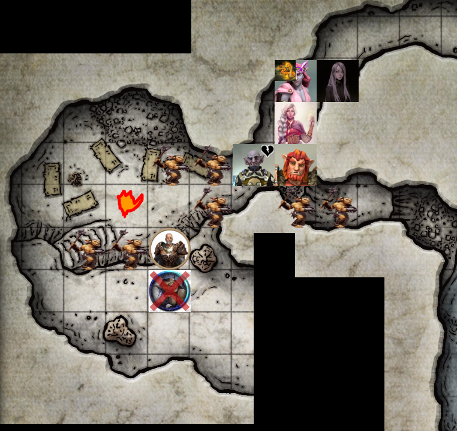
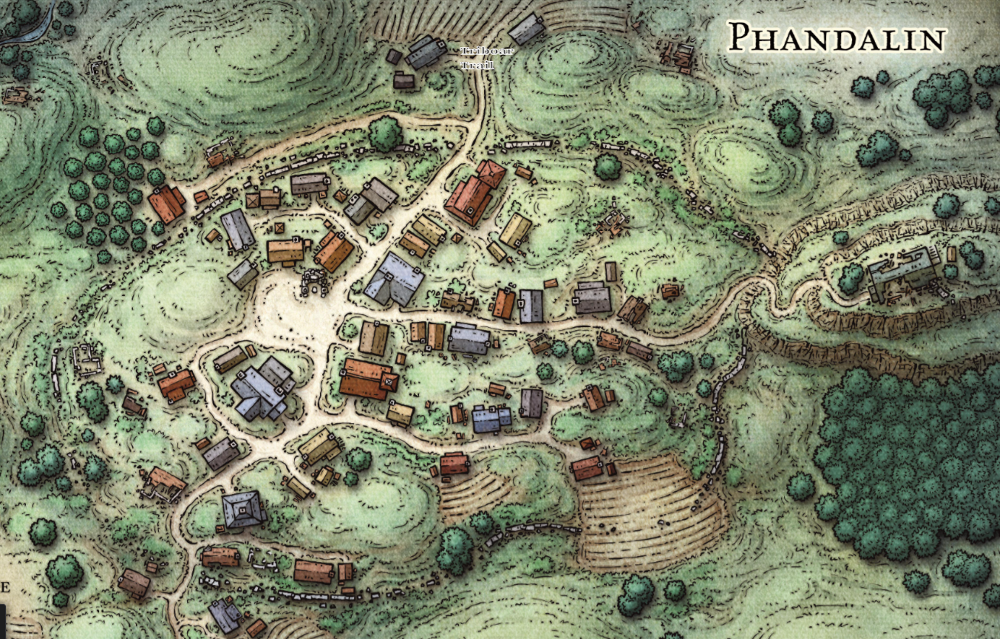
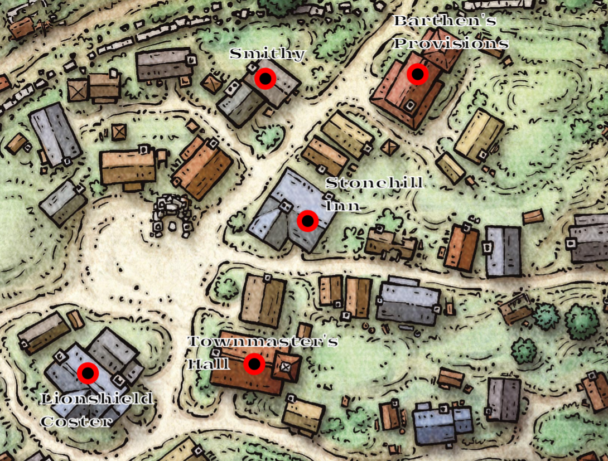

# Session 7 | 2023. 07. 09. (vasárnap)
* *`"Ezt már szeretem, mikor ilyen könnyű.. Mit ajánlasz?" - 💬 [Sera]`*
* *`"Hát ööhm..így ezt?" - 💬 [goblin/körbemutatva a looton]`*
* *`"Mi akadályoz meg minket abban, kedves goblin uraság, hogy csak simán elvigyük <ezt>, mit teszel te hozzá ehhez az alkuhoz?" - 💬 [Orik]`*
* *`"Hát ööhhm..." - 💬 [goblin]`*
* *`"Jajj Orik, minden életért kár, még az ilyen alsóbrendűekért is.." - 💬 [Ashley]`*
* *`"Csak elmennék anélkül, hogy szólnék a többieknek!" - 💬 [goblin]`*
* *`"A szó amit keresel: 'kegyelem'!" - 💬 [Orik/megvetően]`*
* *`"De vajon megbízhatunk e a szavában?" - 💬 [Ashley]`*
* *`"Egyelőre nem ér túl sokat a szava, nem ajánl semmi hasznosat.." - 💬 [Sera]`*
* *`"Soha ilyen becsületes goblin nem járt még a barlangban, mint én!" - 💬 [goblin/győzködve minket]`*

Orik felnevet, pontosan tudja, hogy a goblin kijelentése nem sokat ér. 

* *`"Nem túl nagy ez a barlang, és nem sok goblin él már benne..Így az összehasonlítás nem a legjobb." - 💬 [Orik]`*
* *`"Jó, hát mit vársz tőlem?!" - 💬 [goblin]`*
* *`"Tudod e hol tartják Sildart fogva, akkor talán megkíméljük az életed!" - 💬 [Rorr]`*
* *`"Az ember a barlang másik felében van!" - 💬 [goblin]`*
* *`"Meg akarják enni, mindjárt ebédidő!" - 💬 [Rorr]`*
* *`"És ezt mikor is akartad elmondani?" - 💬 [Sera]`*
* *`"Eddig nem volt idő rá!" - 💬 [Rorr]`*
* *`"Meg tudnád mutatni, hol van?" - 💬 [Ashley/a goblint kérdve]`*
* *`"Nem olyan nagy az a barlang, odataláltok!" - 💬 [goblin]`*

A golbin az életével játszik, ezt jelezzük is neki, hogy sok ajánlanivalója nincs a helyzetében, az együttműködés az egyetlen lehetősége.

* *`"A zsákmányt se felejtsük majd itt!" - 💬 [Rorr]`*

Sera átkutatja Borgorkot - eredménytelenül.
* *`"Látom, nem tudod hogy kell ezt, vagy mit keress, na majd én!" - 💬 [Rorr/odalépve]`*

 A felszerelése van nála, bőr páncél meg pajzs (elég rossz állapotban). Morning star fegyvere pluszban. Ashley sürget minket, Sildar kapcsán fogy az idő.

Orik felállítja a goblint - * *`"🗣{goblin} Akkor megegyeztünk?" - 💬 []`*
Orik alkudozik a golbinnal az életéért - odavezetni, és nem elárulni minket. - segíteni meggyőzni a többieket.
* *`"Akkor indulhatok?" - 💬 [kis goblin]`*

félsötétben indulunk le a lépcsőn, a goblin+orik elöl, többiek utána
* *`"Akkor itt most átmegyünk ezen a barlangon, át a hídon, egészen az etetőveremig!" - 💬 [goblin/jó hangosan]`*
orik befogja a száját, erőteljesen csitítva a goblint.
elengedlek, nem szaladsz, nem kiabálsz, rendben? - orik
mhmhmph - goblin
itt jobbra lent van a patak melletti szilkaösvény, fölötte a hídon tudunk átmenni - vigyázzatok, csúszik
* *`"🗣{common} Azt mondja, csúszik. csak óvatosan!" - 💬 [Rorr]`*

ahogy megyünk át a hídon, látjuk a medencék felől folyó patakot. kb. 20 feettel a atak fölött - elég ramaty híd.

Átérve egy keskeny járatba érkezünk. Egyesével férünk csak el - Nana nyakában a tűzkígyóval.

* *`"Megsimogathatom?" - 💬 [Ashley]`*
* *`"Nyugodtan!" - 💬 [Nana]`*

A szeme között simítja a kígyót - az dorombolni kezd ennek hatására.

* *`"Mi a neve?" - 💬 [Ashley]`*
* *`"Még nem találtam ki neki.." - 💬 [Nana]`*

A balrang tovább kanyarog - kiérve a kesekeny részről egy másik barlangba érkezünk. Viszonylag nagyobb tér, két felé osztva: egy alacsonyabb rész, déli oldalán 10feet magas emelkedővel - belevésve egy lépcső. A magasabb szinten, a terem közepén egy kisebb máglya ég - fölötte egy nagyobb kondér. Belépve 5 goblin áll velünk szembe - a legtöbbnél ívelt kard, és pajzs, egynél íj van.

Fegyverrel a barlang felé állva várnak minket. A meredély szélén egy "tekintélyesebb" goblin áll. Egy sztalagmit mögül kirángatja a félholt sildart.

* *`"{🗣:common} Tárgyalunk, vagy az ember meghal!" - 💬 [főgoblin]`*
* *`"Tárgyalni jöttünk mi is - különben már halottak lennétek!" - 💬 [Rorr]`*
* *`"nagy szavak egy nagy kis bugbeartől..a másik nagyobb nálad!" - 💬 [goblin]`*
* *`"Hát, a másikat már megöltük!" - 💬 [Ashley]`*
* *`"Tényleg? akkor nincs is rátok szükségem" - 💬 [goblin]`*
* *`"de most mondtam hogy mindenkit megöltünk, miért hiszitek, hogy nektek jobb lesz?" - 💬 [Ashley/lemondóan]`*

### ⚔ COMBAT ⚔ 

* *`"Egy pillanatra, ha megengednéd, köszönöm!" - 💬 [Ashley/Orik vállát megütögetve]`*

A nagy goblin felé küld egy varázslatot - mellkason találja azt, visszafordulnak a szeme, hátradől, majd Sildaron taszít egyet estében. Az ember lebucskázik, majd nem mozdul többet.

* *`"Nem megmondtam, hogy mind meghaltok, ha hülyék vagytok..most ez kellett nektek?" - 💬 [Ashley]`*

Az Orik előtti goblin visszaütne Ashley-re, de sikertelenül.

* *`"{🗣:goblin} Na ki akar tárgyalni?" - 💬 [Rorr]`*
* *`"Aki tárgyalt volna, az meghalt..úgyhogy ti is meghaltok!" - 💬 [goblin]`*

Az kis túszgoblin Orikra ütne, elvéti. Az íjász goblin is Orikra lő - ő betalál. Egy újabb goblin fut felé, rávág - Orik összeesik a fájdalomtól. A hátsó kettő egyelőre készenlétben várakozik.

Az oldalsó barlangból másik 2 goblin ront Rorra - a meglepetés erejétől Rorr is a földre kerül.

Nana előre furakodik földön fekvő társai fölött, az összetett tenyerét a goblinok felé tartva - a kígyó áttekeredik a a kezén, majd lángok csapnak elő a kezeiből. A 3 goblin fájdalmas sikolyok között összeesik, hólyagossá égett bőrrel, mozdulatlanul. (*`"Whoah!" - 💬 [Ashley/lenyűgözve]`*)

A kígyó az egyik hátsó goblin felé köp egy lángcsóvát - a haja lángra kap, majd némi pánik után összeesik ő is. (*`"Öljünk le mindenkit, aztán keltsük fel a srácokat!" - 💬 [Ashley]`*) Sera Ashley vállára teszi a kezét:

 * *`"Van, akit fel tudsz kelteni, ugye?" - 💬 [Sera]`*
* *`"Persze, de előbb hárítsuk el a fenyegetést, aztán foglalkozzunk a többiekkel." - 💬 [Ashley]`*

Sera ezután kifejezéstelen arccal felemeli a kezét, majd a Rorrt ütő goblin felé fordul. A goblin nyaka felé suhan egy csontváz-kéz, de a goblin elhessegeti, kitér előle. *`"Nem igaz már!" - 💬 [Sera]`* felkiáltással hátralöki a két goblint. Az egyik kiugrik a lökés elől, a másik fájdalmas buckázások közepette egy placcsanással ér földet.

Ashley ismét Rorr fölé lép, majd az oldalt még életben lévő goblint célozza - mellbevágja őt a varázslat, majd követi társát a folyosó alján.

* *`"Szerintem meg van az új főnök!" - 💬 [Ashley/a barlang bejárata felé kiált]`*

A goblin megpróbál kirontani a többiek mellett, a két hulla mellé talpra érkezik.

Nana egy tűzgolyót dobna utána, de az a barlang falába csapódik. A tűzkígyó utána repül - egy tűzlabdával felgyújtva a goblint - az is követi másik két társát a padlón.

### 🕊 COMBAT VÉGE 🕊

* *`"Basszus, de menő vagy!" - 💬 [Ashley]`*

Ashley Rorr mellé térdel, kis mormolás közepette a bugbear magához tér.

* *`"Köszönöm! Ez már a második ma.." - 💬 [Rorr]`*

Serafine Sildar fölé hajol - csúnya seb van a fején, lassan lélegzik. Nana pár bogyót idéz a tenyerébe - kettőt Orik, kettőt pedig Sildar szájába tesz. Elég ramaty állapotban vannak, Sildar fején a vérzés épp elállt. Nagyon kótyagos állapotban van, lassan tér magához.

* *`"Mindig is arra akartam kelni, hogy halott golbinok..Valóra vált álom!" - 💬 [Orik/magát leporolva]`*

Nana még 2-2 goodberryt ad Orik és Rorr kezébe. Ashley elindul visszafelé a loot irányába.

* *`"Ohh..kalandorok..milyen szerencsés véletlen, hogy erre jártatok!" - 💬 [Sildar]`*
* *`"Ez azt hiszem, nem egy véletlen..nem tudom, hogy felismer -e minket!" - 💬 [Serafine]`*
* *`"Persze, igen..Gundren.. Gundren!! Elvitték őt, a térképpel együtt!" - 💬 [Sildar/felül]`*
* *`"Fontos az a térkép?" - 💬 [Sera]`*
* *`"Talán a legfontosabb, ami jelenleg a régiót érinti!" - 💬 [Sildar]`*
* *`"Ki és hova vitte Gundrent?" - 💬 [Nana]`*
* *`"Nem tudjátok, mióta lehetek itt?" - 💬 [Sildar/zavartan]`*
* *`"Egy két napja - tegnap a fesztiválon jártunk, ott azt mondták, maguk előző nap jártak arra." - 💬 [Rorr]`*
* *`"A kastélyba vitték Gundrent a térképpel együtt, a királynak...Ez nem egy véletlen rajtaütés volt, kifejezetten Gundrent és a térképet keresték!" - 💬 [Sildar]`*
* *`"Azt javaslom, menjünk ki, szedjük magunkat össze; vigyük amit akarunk, és kint beszéljük meg, amit kell!" - 💬 [Sera]`*

Sildar támogatja az ötletet, neki sincs kedve több időt tölteni a goblinbarlangban - minél hamarabb szeretné maga mögött hagyni a helyet. Kérdésére, mely a napszakra vonatkozik Rorr válaszol, jelzi, hogy dél van, még hosszú a nap.

* *`"Még ma eljuthatunk Phandalinba, ha kicsit sietünk!" - 💬 [Sildar]`*

Nana még két bogyót próbál az ember szájába nyomni, látva, ahogy erőlködik.

* *`"Na! Ezt mire véljem!" - 💬 [Sildar]`*
* *`"Csak jót akartam!" - 💬 [Nana]`*
* *`"Áhh.. Kérem, legközelebb szóljon előre!" - 💬 [Sildar]`*

Orik mégegyszer átvizsgálja a térképtartót, de az továbbra is üres. Serafine a társa nélkül nem dönt semmiről - Ashleyvel együtt szeretné megbeszélni a továbbiakat. Sildar elfogadja a lány kinyújtott karját, lassan mennek kifelé. Menet közben a harcos egy kardot vesz magához a földről.

* *`"A felszerelésemmel nem találkoztatok? Arra is szükségem lehet!" - 💬 [Sildar]`*

Míg Sildar összeszedi magát, Ashley átvizsgálja a lootot Borgork barlangjában - enni- és innivaló, különféle páncélok, fegyverek, bányászfelszerelés. Az összes dobozon lát egy kék oroszlánfejet. Egy ütött-kopott, jelzés nélküli ládát is talál. A kék oroszlánfej a térségben üzérkedő kereskedő-hálózat, a 'Lionshield Coster' jele, akiknek Phandalinban is van üzletük.

Ashley a jelöletlen láda felé fordul, felnyitva azt. Benne Borgork cuccait találja: 11 🥇és 60 🥈 benne, és két kis üvegcse piros folyadékkal. Egy életnagyságú békaszobrot lát még, egy jade szobor, melynek szemei kis aranyból vannak. Ashley elteszi ezeket.

A többiek pont ekkor érnek oda a lootoló Ashleyhez. Beszámol arról, mi mindent talál - a pénzt és a fiolákat Serafine és Rorr kezébe teszi.

* *`"Látom, hatékonyak vagytok...De azt is látom, hogy nem volt könnyű dolgotok!" - 💬 [Sildar/a hullákra nézve]`*
* *`"Ez nem az enyém, ez a Lionshield-é! Hmm, ezek szerint ide hordják a zsákmányt.. Jó pár hónapja fosztogatják a kereskedő utakat! Linen Greywind biztos hálás lenne, ha visszajuttatnánk neki!" - 💬 [Sildar]`*
* *`"Van itt három farkas, akik őrzik a barlangot - valószínűleg fél nap alatt nem fosztják ki a barlangot, és ha odaérünk Phandalinba, tudunk nekik szólni, hogy hol találják a cuccaikat." - 💬 [Ashley]`*
* *`"Amennyiben van lehetőségem és időm visszanyerni az erőmet, meg tudom könnyíteni a logisztikát!" - 💬 [Orik]`*
* *`"Majd alkalom adtán egy tábortűz mellett meg tudnád nézni nekem ezt a békát?" - 💬 [Ashley/Oriktól]`*

Tanakodunk, mi legyen a lootal, itthagyjuk, vagy időt szánjunk arra, hogy kipakoljuk a szekérig a dobozokat, ezek alapján mikor tudnánk indulni.

* *`"Miért vitték magukkal Gundrent?" - 💬 [Sera/Sildartól]`*
* *`"A térkép és a felfedezés miatt.. Belekezdhetek, de az hosszú lesz!" - 💬 [Sildar]`*
* *`"Akkor csak röviden!" - 💬 [Rorr]`*
* *`"Hallottatok már a pandenveli egyezményről?" - 💬 [Sildar]`*

A legtöbben értetlenül nézünk rá, Ashley viszont pontosan érti a dolgot, ezért Sildar összefoglalja:

> *Phandalin viszonylag nagy város volt több száz éve, törpök és gnómok bányásztak együtt. A két faj szövetségére szóbeli egyezményként tekintettek. Találtak egy gazdag bányát, amit elkezdtek kitermelni, a bánya neve pedig 'Wave Echo Cave'. Amellett, hogy nyersanyagban is gazdag a bánya, ősi varázslat jelenlétét is tapasztalni lehetett - mágikus erővel bírt. Mikor ez kiderült, ember varázslók is csatlakoztak az egyezségbe, együtt kezdték ezt a mágikus erőt kiaknázni.*
>  
> *Létrehoztak egy Varázskohót🌍, ahol mágikus tárgyakat tudtak kovácsolni magunknak. Ekkor volt Phandalin fénykora, viszont pár évtizeddel ezután, a nagy ork invázót a város és a bánya nem élte túl. A bánya helye el is veszett az idők során - a mágikus csata híre és a rengeteg áldozat viszont fent maradt.*

Ashley néha egyszerűsíti Sildar mondanivalóját a többieknek. Orik szeme felcsillan a kohó hallatán.

* *`"Amint sejthetitek, Gundren és testvérei megtalálták a bányát, és szeretnék újra beindítani azt, ami nekünk, és a Lordoknak is kapóra jönne a térség felvirágoztatása érdekében." - 💬 [Sildar]`*
* *`"A térképen pedig szerepel a barlang holléte, jól sejtem?" - 💬 [Sera]`*
* *`"Pontosan - más nem is tudja, hogy hol lehet a barlang." - 💬 [Sildar]`*
* *`"Szóval a goblin királynál van Gundren?" - 💬 [Sera]`*
* *`"Igen, emlegettek valami "fekete pókot", de csak utasítást kaptak, nem tudni pontosan. Tőle jött a megbízás, hogy vigyék el Gundrent és a térképet hozzá." - 💬 [Sildar]`*
* *`"Tudni lehet, hol van ez a kastély?" - 💬 [Sera]`*
* *`"Nem, nekem sajnos fogalmam nincs, de talán Phandalinban valaki tudja." - 💬 [Sildar]`*
* *`"Először csak vigyük el a dolgokat Phandalinba, előre nem ígérünk és nem vállalunk semmit!" - 💬 [Rorr]`*
* *`"Drága barátaim, Gundren hiányában az a küldetés, hogy Gundren előkerüljön!" - 💬 [Sildar]`*

Rorr eközben Borgork holtteste mellé lép, majd a bugbear bal fülét és a két, szájából kilógó agyarát levágja, és a táskájába teszi.

Ashley szorgalmazza, hogy menjünk vissza az ebéd helyszínére, és együnk egyet abból, ami maradt.
* *`"Nem én leszek az akadálya..én megszabadulnék ettől a bűzös helytől, de te tudod! " - 💬 [Sera]`*
* *`"Abban a kondérban csak víz volt, semmi más!" - 💬 [Sildar]`*
* *`"A goblinok főztjéből amúgy sem ennénk!" - 💬 [Rorr+Orik/ismerve a gasztronómiát]`*
* *`"Akkor mindegy..nem főzünk!" - 💬 [Ashley/szomorúan]`*

A barlangból kilépve, elhaladva a jól lakottan alvó farkasok mellett, a kis tisztáson ülünk le pihenni egyet.

* *`"Így ma már szinte biztos, hogy nem jutunk el Phandalinba.." - 💬 [Sildar]`*
* *`"Mi lenne, ha inkább a szekéren pihennénk, felváltva?" - 💬 [Ashley]`*
* *`"Ha most megpihenünk, és frissen vágunk neki az éjszakának, talán nem lehet gond!" - 💬 [Sildar]`*

Némi tanakodás után végül a Lionshield dobozait is összeszedjük, majd több körben a szekérhez visszük őket. Egy óra pakolás után újra menetre kész a csapat, felstócoljuk a saját cuccok mellé, gondosan elpakolva. Ashley "őrzi a szekeret", amíg pakolnak a többiek. Rorr hatástalanítja a csapdát, a kötelet visszateszi a táskájába.

* *`"Önnel amúgy még nem találkoztam..Sildar Hallwinter" - 💬 [Sildar]`*
* *`"Ashley Qu'ira!" - 💬 [Ashley]`*
* *`"Óó, csak nem a másik, Ashton úriembernek a testvére?" - 💬 [Sildar]`*
* *`"Nem ismerek másik Asht." - 💬 [Ashley]`*
* *`"Ő az.." - 💬 [Sera/sóhajtva]`*
* *`"Tegnap férfi volt, mára nő lett.." - 💬 [Nana]`*

Sildar kissé zavarodottan néz a többiekre, nem teljesen érti a helyzetet - bár a többiek arcán sem látszik, hogy teljesen tisztában lennének a magyarázattal.

* *`"Javaslom, induljunk! Ma már nem érünk oda, de talán több probléma nem ér minket az úton! Holnap délelőtt odaérhetünk, Barten kifizeti a megállapodott öszeget, Linen biztosan hálás lesz a dolgokért, jómagam pedig - ahol láthatjátok - nem maradt sok értékem, de felkínálok 50🥇-t, amit nem az érkezéskor fizetek ki, hanem amint a helyi kapcsolataimtól tudok szerezni!" - 💬 [Sildar]`*
* *`"Jajj, ugyan, a lényeg, hogy egészségben és egyben odaérjünk!" - 💬 [Ashley]`*

Elindulunk "tolatva" az úthoz vissza, szépen lassan a megpakolt szekérrel.

~~~
{🌟} +220 XP
~~~

Visszajutunk a Tribore ösvényre, elindulunk Phandalin felé. Késő délután van, javában süt a nap. Sildar az utunkról kérdez - Rorr beszámol a fesztiválról - ahogy Ashton kihúzta a kardot, ami még Sildarnak sem sikerült.

Ashley eközben Lady Alagondar dalát kezdi énekelni, a többiek is csatlakoznak. Sildar is kezd megnyugodni - már nincs közvetlen életveszélyben.

Sera kiosztja a barlangből összeszedett pénzt: 2 🥇 és 12 🥈 jut mindenkinek. Az egyik healing potit Rorrnak adja, a másikat pedig Ashleynek. Orik jelzi, hol van nála a korábban általa begyűjtött poti - ha esetleg újra önmagán kívül lenne.

Ashley közben előremászik Orik mellé - a jade békát mutatva neki. Orik megvizsgálja, mire is jó ez a tárgy, Sera eközben átveszi a gyeplőt. Elsőre a hobgoblin nem vesz észre küllemileg semmit - mágiára utaló jeleket sem talál rajta.

* *`"Ne haragudj, de így, menet kzöben csak annyit tudok elmondani, hogy ez egy nagyon szép kézműves munka, de perpillanat mágia nyomait nem találom rajta. De később tüzetesebben is megvizsgálhatom, nyugodtabb körülmények között." - 💬 [Orik]`*

Ashley megköszöni, és elteszi a békát a cuccai közé.

Sildar beszámol róla, hogy ők is voltak a karneválon, de csak futólag - enni, inni és kardot húzni. Amikor rákanyarodtak az ösvényre, jött a rajtaütés. Nagyon hatékonyan, lovakat nyilazva támadtak a goblinok. Őket leütötték, kifosztották a nyeregtáskát, elvitték a térképet Gundrennel együtt - valszeg az ő páncélja is ott lehet, mivel a barlangban nyoma sem volt.

Orik a térképtartó kapcsán kérdezi, hogy vajon azt miért nem vitték el, csak a tartalmát - de erre nem tud válaszolni - valószínűleg a tartó nem szolgált egyéb célt már.

* *`"Kedves Sildar..említésre került korábban, hogy nem véletlenszerűen támadtak ezek a goblinok..felmerült bárki, aki tudhatott a tervről/utazásról és értesíthette volna őket?" - 💬 [Sera]`*
* *`"A fekete pók fogalmam sincs ki lehet/mi lehet, honnan tudhat bármiről - Gundren titokban akarta tartani az egészet, nem véletlenül. Az egyedüli, aki Phandalinban tudott a dologról, az az egyik partnerem, a Lordok Szövetségéből, akiről sajnos már hónapok óta nem hallottunk. ezért is tartok Gundrennel, hogy ellenőrizzem, hogy minden rendben van -e vele: 'Iarno Albrek'. Ő tudott a bányáról, de a mostani utazásról nem tudhatott, hiszen hónapok óta nem volt kapcsolat vele." - 💬 [Sildar]`*
* *`"A térképről sem?" - 💬 [Serafine]`*
* *`"a térkép létezéséről tudott, de egyéb részletről nem" - 💬 [Sildar]`*
* *`"Mire specializálódott a mágus?" - 💬 [Orik]`*
* *`"Nem tudom.." - 💬 [Sildar/gondolkodva]`*
* *`"A legjobb akkor ha megkeressük, és megkérdezzük - ha még életben van." - 💬 [Serafine]`*

Két óra utazás után egy újabb elágazáshoz érkezünk - itt jobbra fordulva megy az út Phandalin felé. A sötétedés kezdetekor jelzi Sildar, hogy innen már csak 2-3 óra út Phandalin, talán már nem érdemes megállni, még ha veszélyesebb is.

* *`"Én lehet az ökrök zabolájára raknék egy-egy apróbb fényt, hogy lássanak az ökrök is valamit!" - 💬 [Ashley]`*

Serafine az ötlet nyomán a két zablára is sötétkékes fényt bűvöl, majd visszaül a bakra, és továbbindul a szekér. Rorr figyeli az erdőt, bármiféle mozgás kapcsán, de egyelőre semmit nem lát. Az éjszaka hangjai veszik át a levegőt.

Serafine visszaadja a gyeplőt Oriknak - a lány fuvoláján újra Lady Alagondar nótája hallatszik fel. Kissé már unalmasnak hangzik, ezért inkább Ashley egy újabb dallamot kezd játszani. A feltünésmentességet teljes mértékben kerülve megyünk tovább a sötétben a település felé.

Egy kis dombtetőre érve tárul elénk Phandalin városa: a fáklyák és házak ablakaiból szűrődő fénye innen is látszódik már. Pár tucat, 40-50 rönkház sziluettje látszódik. Ahogy haladunk az úton lefelé, a régi város maradványai is körvonalazódik - mészkőalapra épült házak romjai, falmaradványok a régmúlt időkből. A fő út a városközpontba vezet - ekörül vannak a házak.

Bal kéz felé, keletre egy másik domb tetején egy nagy épület látszódik.

Az utcák kihaltak már, nincs mozgás. Befelé haladva újabb beszélgetés alakul ki.

* *`"Hát, barátaim, javaslom keressünk szállást. Úgy hallottam a helyi fogadó egész tűrhető!" - 💬 [Sildar]`*
* *`"Nem hasznosabb előbb az áru tulajdonosához bekopogni?" - 💬 [Ashley]`*
* *`"Megpróbálhatjuk, de kétlem, hogy Barthen ilyenkor még nyitva tart." - 💬 [Sildar]`*
* *`"Csak nehogy levonjon a bosszúságért a fizetésünkből!" - 💬 [Sera]`*
* *`"Azt nem teheti, a szerződés őt is köti. Talán egy próbát megér. Ugyanakkor, a szekér is az övé, így a többi cuccal már anélkül kéne tovább menni!" - 💬 [Sildar]`*

Sera lecsusszan a szekér mellől, de végül nem kopog be. Megbeszéljük, hogy előbb a másik árut kéne lepakolni, hogy nyugodtan aludhassunk. Sera rábólint, a szekér tovább megy a főtér felé.

Ahogy haladunk tovább, a sötétben egy kovácsműhely látszódik, a főtérnél jobb kéz felől egy mészkő kegyhely, balra pedig egy kivilágított épület: a **'Stonehill Inn'**. A tér túloldalán egy másik, nagyobb épület: valószínűleg az a Lionshield épülete.

A cégér fent lóg az épület elején: a fapajzson egy kék oroszlán. Orik leparkolja a szekeret az épület elé. Ashley bekopog, de nem jön válasz. Sera is bekopog, kissé hangosan, válasz továbbra se. Orik körbenéz, figyeli -e valaki a mutatványt, de már mindenki alszik.

* *`"A fogadós csak tudja, hol vannak, nem?" - 💬 [Rorr/kérdőn]`*
* *`"Amondó vagyok, menjünk pihenni! Én kezdem feladni.." - 💬 [Serafine]`*

Átmegyünk a fogadóhoz, egy jól kivilágított épület tárul szemünk elé. Az épület az egyik legújabbnak tűnik a városban - nem csak rönkből épült, kő alapon vannak a falak. Az udvarra benézve egy nagyobb kaput látunk, Orik azon befordulva a benti istállóhoz vezeti a szekeret. Az ökröket megeteti/itatja Orik, de bízik benne, hogy még ma le tudjuk adni a cuccokat a tulajdonosának.

Rorr indítványozza, hogy ne ő menjen elöl, Sildar hírneve valószínűleg nagyobb biztonságot nyújt, mint egy bugbear. Orik a biztonság kedvéért kint marad a szekér mellett, őrzi azt.

A többiek belépnek a fogadóba - egy megszokott fogadó kép tárul elénk. a pult mögött egy fiatal human férfi áll, vele szemben a pultnál egy fiú üldögél.

* *`"Jó estét!" - 💬 [Rorr+Sera/egyszerre]`*

Végigmérik a társaságot, megrökönyödve nézik Rorrt. Visszaköszönnek.

* *`"Toblen, ugyebár?" - 💬 [Sildar]`*
* *`"Igen, én vagyok, Toblen Stonehill." - 💬 [fogadós]`*
* *`"Sildar Hallwinter, már leveleztünk párszor." - 💬 [Sildar]`*
* *`"Óhh, Sildar úr! Persze, persze! Üdvözöljük Phandalinban! Örülök, hogy mostmár személyesen is találkozhatunk!" - 💬 [Toblen]`*
* *`"Én is örülök.. Mondd csak, Iarnoról tudtok valamit?" - 💬 [Sildar]`*
* *`"Két hónapja eltűnt.." - 💬 [Toblen/elkomorodva]`*
* *`"Eltűnt?" - 💬 [Sera]`*
* *`"El, mindenféle nyom nélkül." - 💬 [Toblen]`*
* *`"Ettől féltem.. Na jó, ezt majd megbeszélem Harbinnal személyesen..azt hiszem, most minél előbb nyugalomra kellene térünk. Van szabad szoba esetleg?" - 💬 [Sildar]`*
* *`"Van 6 szabad szobám, gyakorlatilag majdnem az összes.. A konyhát fel tudjuk fűteni újra, vagy esetleg kenyér van hideg hússal, ha megfelel." - 💬 [Toblen]`*
* *`"Hideg húsunk meg kenyerünk nekünk is van.. De azt hittem egy ilyen _szépfiútól_ valami pikánsabb vacsorára is futja!" - 💬 [Ashley/kacéran]`*
 * *`"Megkérhetem a _feleségemet_, hogy valami finomat esetleg rittyentsen össze" - 💬 [Toblen]`*
* *`"Te nem vagy gonosz?" - 💬 [kisfiú/Rorrtól]`*
* *`"Attól függ, kivel." - 💬 [Ashley]`*
* *`"Miért lennék gonosz? én jó vagyok!" - 💬 [Rorr]`*
* *`"Láttam ahogy elintézett egy csomó rossz goblint!" - 💬 [Sera]`*
* *`"De nagyon szépen tud énekelni!" - 💬 [Ashley]`*
* *`"Egy éneklő miacsoda?!" - 💬 [fiú/ámulva]`*
* *`"Bugbear!" - 💬 [Toblen]`*
* *`"Mielőtt belekezdenél, mit gondolsz, a rakományunk biztonságban lehet az istállóban az éjjelre?" - 💬 [Sera/Toblentől]`*
* *`"Szívesen mondanám, hogy igen, de sajnos...nem tudom, beszélhetek -e róluk...van némi bandita problémánk a városban." - 💬 [Toblen]`*
* *`"A városban, vagy városon kívül, de bejárnak portyázni?" - 💬 [Ashley]`*
* *`"Sajnos a városban - mióta eltűnt a mágus (Iarno), átvették a gyakorlati irányítást a környék fölött." - 💬 [Toblen]`*
* *`"És Harbin semmit nem tesz az ügyben?" - 💬 [Sildar/felháborodva]`*
* *`"Fél..nem mer tenni semmit.." - 💬 [Toblen]`*

Rorr megkérdezi, hogy le tudjuk -e pakolni a dolgokat, amiket hoztunk. Toblen jelzi, hogy a Lionshield tulaja ilyenkor már alszik, őt már nem fogjuk ott találni, de Barthennél még a segédek talán ébren vannak. Tanakodunk, hogy esetleg behozzuk a fogadó előterébe - csak reggelig, aztán visszük is a őket a megfelelő helyre. Toblin felhúzza a szemöldökét, de jelzi, hogy végülis elfér.
* *`"Én majd segítek! Én mindent is elbírok!" - 💬 [a kisfiú]`*
* *`"Téged hogy hívnak? Én Ashley vagyok." - 💬 [Ashley]`*
* *`"Az én nevem Pip!" - 💬 [kisfiú]`*

Végül arra jutunk, hogy inkább nem pakolunk ennyit 2x, valakinek úgyis őrködnie kellene. Váltva egymást inkább kint aludnánk, amennyiben nem probléma. Toblen elfogadja az ajánlatunkat, az istálló éjszakára 1 🥈 fejenként.

Ashley letesz egy aranyértmét a pultra - fizeti az istállót, a vacsorát (5 🥉), és _**"rengeteg alkoholt!"**_

Toblen jelzi, hogy az italt már egyből fel tudja szolgálni, a vacsorára kicsit várni kell - a tűzhelyet be kell izzítani, és a felmelegíteni az ételt.

Nana eközben kimegy, és beszámol Oriknak, hogy ma az istállóban lesz az alvás.. Orik leplezi a csalódottságot, de megköszöni az infót Nananak.

Toblen hátrasiet, majd kissé mérges női hangot hallunk a konyha felől: *"ilyenkor?, pff, na jó'van!"* - hangzik.

* *`"A vacsora máris készül..én pedig hozom az italt!" - 💬 [Toblen]`*

Ahogy helyet foglalunk egy asztalnál, Pip mellénk ül. Ashley megkérdezi a kisfiút, mi a kedvenc nótája, mit szoktak itt énekelni a zenészek. Pip elmondja, hogy főleg a bányászoknak a bányásznótáit szokták it énekelni, néha gyerekdalt.

* *`"Apukám is bányászni jött ide, de nem sikerült neki. Úgyhogy inkább nyitott egy fogadót." - 💬 [Pip]`*

Rorr bányászdalokat énekel, emelve a hangulatot.

* *`"Nem 'nem értettem hozzá', csak...ez kényelmesebb! Pip, neked nem aludni kéne?" - 💬 [Toblen/pult mögül zsörtölődve]`*
* *`"Miért? Anya még főz! A vöröskendősökkel egyébként nem érdemes packázni! A barátomat is majdnem elintézték, pedig csak az erdőben játszott!" - 💬 [Pip]`*
* *`"Merre, melyik erdőben?" - 💬 [Ashley]`*
* *`"Nem kell vele foglalkozni, csak élénk a fantáziája!" - 💬 [Toblen]`*
* *`"Úgy érti, hogy nem is támadták meg a barátját?" - 💬 [Sera]`*
* *`"Ezek gyerekek..felnagyítják a sztorit! Én nem szeretnék ebbe belekeveredni..amit látott meg ami történt két külön történet lehet!" - 💬 [Toblen/félve]`*
* *`"Pedig de! Carp ott játszott a kúriától délre, és ott!" - 💬 [Pip]`*
* *`"Na jó, elég ebből. Menj szépen aludni!" - 💬 [Toblen/mérgesen]`*

Pip elköszön és duzzogva elmegy hátra. Toblen ezután folytatja:

* *`"Nézzétek, volt aki eltűnt, az egész családjával együtt..Én ezt nem szeretném..Legalább ne a gyereknél puhatolózzatok..én sem szeretnék ebbe belekveredni. Nagyon zavaró, bosszantó, hogy a "jobb élet reménye" ide jutott, de féltem a családomat." - 💬 [Toblen]`*
* *`"Kitől kell félteni az életünket, pusztán preventív jelleggel?" - 💬 [Ashley]`*

Toblen végigmér minket.
* *`"Színes társaság vagytok, de nem ismerlek titeket..fogalmam sincs, hogy ti kik vagytok." - 💬 [Toblen]`*
* *`"Én kezeskedem értük, már bizonyítottak!" - 💬 [Sildar]`*

Kis hatásszünet és gondolkodás után Toblen végül megszólal.

* *`"Jó..hát akkor... A vöröskendősök Iarno eltűnése után pár nappal vették át a hatalmat. Aki felszólal, azt elviszik vagy eltűnik. Harbin semmit nem tesz, valószínűleg nem is akar, ő csak a bőrét félti és próbálja menteni." - 💬 [Toblen]`*
* *`"Nagyon szívesen segítünk, elvégre azért jüötünk Phandalinba, hogy segítsünk a helyieknek. Örömmel felajánlom a szolgálatainkat! Persze ellenszolgáltatás nélkül, az nem lenne helyes!" - 💬 [Ashley]`*
* *`"Én nem kérlek titeket semmire, sem felszólalni ellenük, sem bátorítani nem foglak titeket." - 💬 [Toblen]`*
* *`"Nagyobb a probléma, itt mint vártam..ezt holnap alaposan beszéljük meg." - 💬 [Sildar]`*
* *`"Bele fogunk futni ezekbe a kendősökbe?" - 💬 [Sera]`*
* *`"Ha sokat kérdezősködtök, lehet a probléma talál meg titeket..Vagy nagyon magabiztosak vagytok, vagy ostobák.." - 💬 [Toblen/Rorra nézve]`*
* *`"És még egy hobgoblin is van velünk!" - 💬 [Ashley/mosolyogva]`*
* *`"Mégis milyen csapatot szedett össze, Sildar úr?" - 💬 [Toblen/kérdőn]`*
* *`"A csapat fele, hogy úgy mondjam...nem az a tipikus hősies, megmentő fajta" - 💬 [Sildar]`*
* *`"A csapat egésze ilyen..De ez nem akadályoz minket abban, hogy bármerre jót cselekedjünk!" - 💬 [Ashley]`*
* *`"Eddig bizonyítottak - ha másért nem is, legalább az aranyért teljesítik a feladatot!" - 💬 [Sildar]`*
* *`"Nekem nem kell hozzá az arany!" - 💬 [Ashley]`*

Ashley odajnyújtja a korábban kapott 4 aranyat Sildar felé, de az visszautasítja.
Eközben kinyílik közben a konyhaajtó, és egy Toblennel egykorú nő lép ki, kezében a tálakkal. Azokat - jelezvén a késő estére nem várt plusz munkát - nemes egyszerűséggel lebassza elénk az asztalra, majd mérgesen így szól:

* *`"Legyetek szívesek a fiamat nem belevonni mindenféle cselszövésbe, ármánykodásba, hősködésbe..nem akarunk úgy járni, mint szegény fafaragó!" - 💬 [Trilena (Toblen felesége)]`*
* *`"Miért, hogy járt?" - 💬 [Sera]`*
* *`"Már sehogy!" - 💬 [az asszony/elviharozva]`*
* *`"Thel Dendrar volt itt a fafaragó, egy héttel ezelőtt kivégezték a banditák, aztán elvitték a testét, 2 nappal később a felesége és a két gyereke is eltűnt." - 💬 [Toblen/szomorúan]`*
* *`"Egyre kevésbé szimpatikusak ezek.." - 💬 [Ashley]`*
* *`"Ennek örülök..de javaslom egyenek, aztán térjenek nyugovóra." - 💬 [Toblen]`*
* *`"Thel Dendrar volt itt a fafaragó, egy héttel ezelőtt kivégezték a banditák , aztán elvitték a testét, 2 nappal később a felesége és a két gyereke is eltűnt." - 💬 [Toblen]`*
* *`"Egyre kevésbé szimpatikusak ezek.." - 💬 [Ashley]`*
* *`"Ennek örülök..de javaslom egyenek, aztán térjenek nyugovóra." - 💬 [Toblen]`*

Sildar inkább kivesz egy szobát - nincs elég jól ahhoz, hogy kint éjszakázzon. Nagyon hálás a megmentésért, a beígért jutalmat másnap kifizeti. Jó éjszakát kíván, és óvatosságra int minket, valaki mindig őrködjön. Elköszönve mindenkitől elmegy aludni.

Amíg a többiek bent voltak, Orik egy ismerős női hangot hall a fejében:

> *- Drága Spellweaverem, jelentést kérek!*
>  
> *+ Úrnő, milyen kedves hogy a figyelméből rám is szentel egy keveset!*
>  
> *- Drága Orikom, én folyton figyeltelek!*
>
> *+ Egészen érdekes dolgokra találtam itt.. Biztosan hallott már az úrnő a Varázskohóról🌍.. Gundren és testvérei megtalálták ezt az elveszettnek hitt bányát. Egészen érdekfeszítő!*
>
> *- Ahogy sejtettem..*
>
> *+ Egyebek közt Gundrent elrabolták a goblinok, egy kisebb kompániát átsegítettünk a túlvilágra.. Ha az űrnő szándékozik csinálni valamit, az éterben keringenek. A goblinkirály színe elé viszik Gundrent, Sildart kiszabadítottuk.. Megérkeztünk Phandalin városába, meglepően felújított koszfészek. "It's a work in progress!"*
>
> *- Nem kell mindig elhamarkodottan ítélkezni. Phandalinban több van, mint gondolnád. Főleg ha a bányát, és a kohót beüzemelik - az engem is érdekel. Nem szeretném, ha rossz kezekbe kerülne.*
>
> *+ Ezek szerint a kohó itt van?*
>
> *- Valahol a környéken. A történelem során elveszett. Érdekes, hogy Gundren megtalálta, és térképe is van hozzá.*
>
> *+ A Lordok Szövetségének egy tagját, Irano Aldreket 2 hónapja elrabolták - vagy eltűnt. Azóta a város uralmát banditák vették át.*
>
> *- A Lordok Szövetsége egy szép kis gittegylet, dicséretes amit próbálnak elérni, de komolytalan.*
>
> *+ Amennyiben új instrukció nincs, folytatom a fejlemények felderítését!*
>
> *- Köszönöm Orik. Hangsúlyoznám, nem szeretném, hogy rossz kezekbe kerüljön a kohó!*
>
> *+ Minden erőmmel azon leszek, hogy a **megfelelő** kezekbe kerüljön!*
>
> *- Köszönöm, drága Spellweaverem..pápá!*
>
> *+ Alászolgája!*

A többiek ekkor érnek ki, nem veszik észre Orik belső monológját. Eszünk, iszunk, vacsora közben megosztjuk Orikkal is, hogy mi hangzott el bent.

Nana a szekérre mászik, és naplót kezd írni. Orik a szekér mellett egy bűbájjal szórakozik - a vértezetén bűvöl valamit - egy pillanatra felgyújtja magát - kizökkenve az eddigi helyzetéből, szabadkozva eloltja a tüzet.

Orik felajánlja, hogy ő kezdi az őrséget. Serafine is jelzi, hogy egy ideig ő is vállalja, még úgysem őrködött, és a harcokban is megúszott eddig mindent, nincs szüksége annyi pihenésre, mint a többieknek. A többiek elfogadják a felajánlásokat, nyugovóra térnek.

Orik őrsége eseménytelenül telik, csupán az éjszakában megszokott zajokkal - baglyok, apró rágcsálók - találkozik. Pár óra elteltével ő is pihenni megy, Serafine váltja őt.

Serafine nagyon koncentrál a sötétben - hiszen ő nem lát ott. Fülel, nézi a környezetét.. Bár néha mozgást vél felfedezni, nem tudja biztosra, mi is történhet a feketeségben.

Amint Nana befejezi a színezést, átveszi az őrködést, Sera is aludni megy. Nana sem vesz észre semmit, az éjszaka eseménytelenül telik így.

~~~
{💤} long rest
~~~
