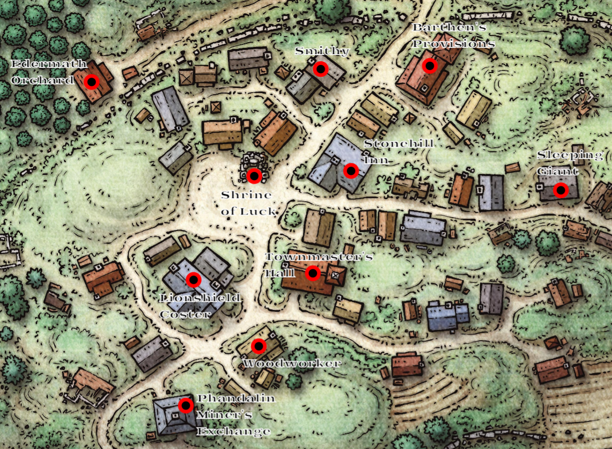

# Session 8 | 2023. 07. 21. (péntek)

Mindenki felébred, semmi nem tűnt el az éjjel. Nana éjjel néha vihart/villámokat rajzolt tudat alatt a füzetkébe. Az egyik karámban egy lovat látunk, ami este nem tűnt fel.

Rorr belép a fogadóba, hogy reggelit intézzen. Toblen már ott tevékenykedik, egy felszolgálólány és egy megtermett köpenyes alak ül.

* *`"Jó reggelt, mind az ötünknek kérnénk reggelit!" - 💬 [Rorr]`*
* *`"Ötnek? Tegnap este csak 4-en voltatok!" - 💬 [Toblen]`*
* *`"Az 5-ik kint maradt, ő addig őrködött." - 💬 [Rorr]`*
* *`"Semmi probléma, a reggeli a szállás része. Sildar úr korábban kelt, azt üzeni, hogy körülnéz ügyes-bajos dolgait intézve, ha kell, akkor a városházán megtaláljátok." - 💬 [Toblen]`*"

Rorr visszamegy a többiekhez, elmondja a hallottakat:
* *`"Sildar még dolgokat csinál. Ha szükség van rá, akkor a városházán van. A reggeli is már készül!" - 💬 [Rorr]`*

Sera már szabulna a cucctól, minél kevesebb ideig kelljen ülni rajta, de arra jutunk, hogy üres hassal nem indulunk el. Rorr visszasétál a fogadóba.

* *`"Hová teríthet Elsa?" - 💬 [Toblen/Rorrtól]`*

Rorr egy újabb kört megy, megkérdezi a többiektől, hol tálaljanak.
* *`"Együnk kint! Már úgyis megszoktam a lószagot.." - 💬 [Sera]`*

A bugber harmadjára is belép a fogadóba:
* *`"Toblen úr! A többiek azt mondták, hogy kint szeretnének enni!" - 💬 [Rorr]`*
* *`"Ahogy kényelmes..Elsa! Kérlek, vidd ki a vendégeiknek a reggelit!" - 💬 [Toblen]`*

A fiatal felszolgálólány kissé mérges, zsörtölődik, hogy _"mindent ő csinál"_. Bár Rorr felajánlja neki, de nem hagyja, hogy segítsen, elboldogul azzal. Rorr nem erőlteti a dolgot, visszasétál a többiekhez és jelzi, hogy mindjárt érkezik a reggeli.

Pár perc telik csak el és Elsa jön is, kezében 5 tányér, azokon a szokásos hideg reggeli: kenyér. sajt, kolbász, zöldség stb. Miközben kiosztja az ételt, tovább morog félhangosan:

* *`"Jó étvágyat! Milyen jó is lenne enni, háhh, kinek van ideje erre! Folyton van valami, nincs megállás egy pillanatra sem..na majd ha mindenki épp ebédel, akkor talán jut nekem is pár szabad perc!" - 💬 [Elsa]`*
* *`"A régi kalandort, akiről hallottunk, merre találjuk?" - 💬 [Ashley/Elsa-tól]`*
* *`"A gyümölcsös mellett van a háza, ott lesz." - 💬 [Elsa]`*
* *`"Majd kérdezünk tőle Phandalin régi múltjáról" - 💬 [Ashley]`*
* *`"Na annyira azért nem öreg, fél elf!" - 💬 [Elsa]`*
* *`"A ló gazdája itt van?" - 💬 [Sera/a jószágra mutat]`*
* *`"Igen, épp reggelizik. Na de nekem nincs időm beszélgetni, dolog van!" - 💬 [Elsa/elsiet]`*

Elköltjük a reggelit, majd Rorr összeszedi a tányérokat, és beviszi Elsa-nak. A lányt nem látja sehol, de Toblen int neki, úgyhogy Rorr leteszi a pultra a koszos edényeket. Rorr körülnéz; az alak, akiről Elsa is beszélt, egy human férfi. Poros, használt köpeny van rajta, bőrpáncélt visel, az oldalán rövid kard lóg.

A többiek beszélgetnek ezalatt:

* *`"Hogy viszonyulsz a varázstárgyakhoz?" - 💬 [Orik]`
* *`"Nagyon szeretem őket!" - 💬 [Ashley]`*
* *`"Sokkal találkoztál már?" - 💬 [Orik]`
* *`"Láttam már Sera-nak a gömbjét, az nagyon cuki! de nem, nem sokkal találkoztam." - 💬 [Ashley]`*
* *`"Értem.. Akkor megtennél egy érdekes szívességet? Csak afféle kísérlet." - 💬 [Orik]`*
* *`"Mondd csak!" - 💬 [Ashley/érdeklődve]`*
* *`"Koncentrálj kérlek a köpenyedre egy kicsit! Most képzeld azt, hogy győzedelmesen lebeg a szélben!" - 💬 [Orik]`*

Ashley erősen fókuszál. Pár pillanattal később  picit meglebben a köpenye alja.
* *`"Whoah! Ezt te csináltad?" - 💬 [Ashley]`*
* *`"Nem, nem én voltam. ezt te csináltad!" - 💬 [Orik/mosolyogva]`*

Ashley kissé elalélt, próbálja rávenni a lebegésre a köpenyt, melyik pózban hatásos leginkább. Szépen lassan rájön a titkára.

* *`"Egészen olyan vagy, mint egy vámpír úrnő!" - 💬 [Sera]`*

Ahogy Ashley elképzeli, és libbenti a köpenyt, beesett fehérre változik az arcszíne, a szeme vöröses-feketére villan egyet, majd minden vissza is áll a régire.

* *`"Ezt hogy csináltad?" - 💬 [Sera/kérdőn]`*

Ashley büszkén meglebegteti újra a köpenyt, arcán hatalmas mosoly.

* *`"Mindegy..nem fontos." - 💬 [Sera]`*

Rorr eközben visszaérkezik a többiekhez, elmondja, kit/mit látott. Gyors eszmecsere után megegyezünk abban, hogy először megszabadulunk a Lionshield-ben a visszaszerzett dolgoktól, aztán a maradéktól is, melyről az eredeti megbízásunk szólt. 

Visszafogjuk az ökröket a szekér elé, elindulunk. A főtérnél lévő templom/kápolna romjait látjuk - viszonylag jobb állapotban van, bár teteje nincs, de még a falak állnak. Az `U` alakú rom közepén egy oltár áll, a falakon egy-egy drapéria lóg, melyeken egy ezüst érme látható, az érmén pedig egy női porté arca és egy 4 levelű lóhere - a szerencse istennőjének, [Tymora](https://forgottenrealms.fandom.com/wiki/Tymora)-nak oltárja. Sera még azt is tudja, hogy Tymora a _jószerencse_ istennője.
A bejáratánál egy fiatalabb elf nő sepreget, sokatmondó ruhában (_papnő_).

* *`"Ide lehet érdemes később betérni egy imára, már akit érdekel az ilyesmi." - 💬 [Sera]`*

Ashley kedélyesen köszön a papnőnek, az visszaint. Nana észreveszi az elf nőn, hogy a kézfején és nyakán enyhe zúzódások láthatóak. Egyelőre nem állunk le csevegni, cél megszabadulni a rakománytól. Tovább zötyögünk a Lionshield Coster felé, odafarolunk, mint este is.

Rövid tanakodás után, kit is fogadnának leginkább, végül Sera kopog be elsőként. Kisvártatva lábdobogás hallatszik, majd egy középkorú human nő áll vele szemben. Hosszú barna hajú, szúrós szemmel néz ki ránk az ajtóból.

* *`"Na mi van?" - 💬 [a nő]`*
* *`"Bocsánat a zavarásért! Úgy gondoltuk, örülnének neki, ha visszahoznánk egy-két csecse-becsét, amit út közben találtunk!" - 💬 [Sera]`*

A nő nem válaszol, csak kérdőn néz továbbra is.

* *`"Visszahoztunk egy csomó lopott holmit!" - 💬 [Ashley/leegyszerűsítve]`*
* *`"Egy goblin hordába botlottunk, mikor erre tartottunk, de legyőztük őket, és ezeket a ládákat találtuk. Egyből láttuk, hogy ezeken az Önök címere van, ezért úgy gondoltuk, hogy visszajuttatjuk azokat a jogos tulajdonosának." - 💬 [Sera/magyarázva a helyzetet]`*

Megértve, mit is akarunk itt, a nő arca mosolyba borul, nagyon örül a hírnek, már régóta várják ezeket a szállítmányokat.

* *`"Még jutalmat is adok, amiért azokat a kurva kis tetveket elintéztétek! Hadd kérjek még valamit, egyedül vagyok itt, segítenétek az első helyiségbe bepakolni a ládákat? Onnantól már elintézem a többit." - 💬 [a nő]`*

A csapat segít neki, eddigra már neki is sokkal jobb kedve van, bemutatkozik:

* *`"Köszönöm, 'Linene Greywind' vagyok! Nem elég, hogy a szállítmányokat a rohadt útonállók folyton ellopják vagy eltérítik, ha egyáltalán megérkezik, legtöbbször hiányos..A vörös maszkos zsiványokat is ide ette a fene." - 💬 [LG]`*
* *`"Milyen gyakran bukkannak fel?" - 💬 [Sera]`*
* *`"Áh, ezek állandóan itt vannak.." - 💬 [LG]`*
* *`"Tehát ha maradunk, beléjük botolhatunk? Nem is kell őket keresni?" - 💬 [Sera]`*
* *`"Egészen valószínű. Főleg ha a fülükbe jut, hogy szállítmányt hoztatok, fel fognak figyelni rátok. Engem szerencsére békén hagynak, hiszen nem csak árulom a fegyvereket, tudom is használni őket. Na meg aztán elég nagy brand is vagyunk, nem akarnak magukra haragítani minket." - 💬 [LG]`*
* *`"Az valahogy nem akadályozta meg őket, hogy a Lordok Szövetségének egy tagját eltűntessék." - 💬 [Sera]`*
* *`"Iarno csak eltűnt az erdőben..nem tisztázott a helyzet teljesen." - 💬 [LG]`*
* *`"Bocsánat, én összefüggést véltem felfedezni.." - 💬 [Sera]`*
* *`"Áhh, ez egy kis város, sok a pletyka.. De az tény, hogy eltűnt, és utána bukkantak fel a banditák." - 💬 [LG]`*"
* *`"Arról a házról mit lehet tudni?"" - 💬 [Ashley/a domb teteji épületre mutatva]`*
* *`"Hát, a ház kissé lekicsinylő, vagy túlzás. Nézőpont kérdése. Régen kúria volt, most már csak romhalmaz.. Elég régóta lakatlan, még Phandalin bukásakor rombolták le. Talán a tető még áll, de rom az egész." - 💬 [LG]`*
* *`"Ha itt akarunk maradni, lehet nem árt nekünk egy bázis!" - 💬 [Ashley]`*
* *`"És szeretnéd felújítani?" - 💬 [Sera]`*
* *`"Természetesen!" - 💬 [Ashley]`*
* *`"Én a ti helyetekben elkerülném azt a helyet..elég sokat matatnak a banditák körülötte." - 💬 [LG]`*
* *`"Így csak még jobban érdekel!" - 💬 [Ashley]`*
* *`"Azért csak ne becsüljétek alá őket, elég szervezettek." - 💬 [LG]`*
* *`"Jól értem, hogy amíg itt volt Iarno, addig nem volt se bantita, se probléma?" - 💬 [Ashley]`*
* *`"Igen, de alig egy hónapja volt csak itt, mikor eltűnt." - 💬 [LG]`*

A társalgás közben a kérésnek megfelelően az előtérbe lepakolunk. Belül nincs semmi kitéve, csak pult, iratok, szekrény, egy ajtó befelé egy nagyobb, nem látott helyiségbe. Linene megköszöni a segítséget.

* *`"Először is; cserébe, hogy visszahoztátok, vásárolhattok is nálam! De csak viccelek, ilyen bátor kalandorokat nem hagyok ám üres kézzel távozni!" - 💬 [LG]`*

50 🥇-t tesz le az asztalra.

~~~
{ ℹ } vásárolni PHB standard fegyvereiből lehet

{🌟} +40 XP
~~~

* *`"Tudom ám, hogy milyen fegyvert adtam el! Ha az én fegyvereimmel ártotok a környéken bárkinek, tudni fogom!" - 💬 [LG]`*"
* *`"És ha a vörös maszkosokat bántjuk?" - 💬 [Sera]`*
* *`"Akkor még kedvezményt is kaptok! De óvva intelek titeket a kúriától, és 'Alvó óriás' kocsmától is." - 💬 [LG]`*
* *`"Ez utóbbi merre van?" - 💬 [Sera]`*
* *`"A kúria felé..de minek mondom, csak odamentek." - 💬 [LG]`*

Sera tovább faggatózik, milyen fegyvert ajánl egy esetleges konfliktus esetén.

* *`"Éleset, tompát, bármilyet. A lényeg, hogy feléjük hadonássz vele." - 💬 [LG]`*

Visszanéz a szekérre, látja, hogy annak csak a fele került kipakolásra, a több, jelzés nélküli doboz és cucc még a ponyva alatt tornyosul.
* *`"Kinek hoztátok a többit, csak nem Halia Thorntonnak?" - 💬 [LG]`*
* *`"Ő kicsoda?" - 💬 [Sera]`*
* *`"A bányászcég vezetője." - 💬 [LG]`*
* *`"Ó, neki is hoztunk ám valamit!" - 💬 [Rorr/a névre felfigyelve]`*
* *`"A szomszédban van..de vele is vigyázzatok.. Nem bízom benne, bár hatékonyan csinálja a dolgokat.. A kormányzás a településen nem teljesen megoldott, Harbin Wester csak dísznek van, Halia tartja kezében a dolgokat. Nem csak a bányával kapcsolatos dolgokat intézi, hanem _egyéb_ papírokat is megőriz." - 💬 [LG]`*
* *`"Egy utolsó kérdés, nem tudod, hol lakott a fafaragó?" - 💬 [Sera]`*
* *`"Ő is pont itt, szemben... Ha bármire szükség van, szóljatok! 10% kedvezménnyel nyugodtan számolhattok nálam." - 💬 [LG]`*

Megköszönjük az információkat, kimegyünk a szekérhez, még minden meg van.

* *`"Mi lenne, ha megpróbálnánk leadni Barthen boltjába a cuccokat, és utána rohangálnánk?" - 💬 [Ashley]`*

Az ötlettel mindenki egyetért, visszapattanunk a szekérre, és elindulunk a település széle felé. Már késő délelőtt van, a város utcáin játszó gyerekek fölött felnőttek vigyáznak óvó szemmel, a férfiak ilyenkor már az erdőben vagy a bányában dolgoznak. A kompániát látva fura szemmel néznek ránk, visszahívják a gyerekeket a bugbear és a hobgoblin látványára.

Ashley megáll a kegyhely mellett, rövid imát mormol:
* *`"Kérlek, Tymora, védd meg a barátaimat!" - 💬 [Ashley]`*
A középen lévő oltár előtti adománygyűjtőbe 4 🥇-t tesz, egy-egy név kíséretében. Utánunk fut, erre Sera megkérdezi, merre járt Ashley, ő elmondja.

Tovább haladunk a szekérrel, perceken belül odaérünk Barthen's-hez, az épület egy standard trading postnak tűnik. Nagy ablak mellett bejárati ajtó, fedett porch. Az ablakon benézve mozgolódást látunk. Ashley feltipeg a lépcsőn, most ő kopog.

* *`"Nyitva van!" - 💬 [öblös hang bentről]`*

Ashley benyit, Sera követi.

* *`"Szép jó napot! Gundren megbízásából meghoztuk a szállítmányt!" - 💬 [Ashley]`*
 
A belső tér tágasabb, mint a Lionshield Coster volt, tárgyak is vannak kipakolva. Mindenféle, kalandozáshoz szükséges dolgot lát: takarók, kötelek, táskák; hálózsák, ellátmány, stb.

~~~
{ ℹ } vásárolni PHB standard Adventuring gearjéből, 25🥇 alatti értékű tárgyakból lehet
~~~

A pult mögött egy 50-es éveiben járó, kopaszodó úriember áll. 

* *`"Csodás, még a megadott időn belül is!" - 💬 [a férfi]`*
* *`"Ahogy illik." - 💬 [Ashley/mosolyogva]`*
* *`"Remek..gondolom minden a szekéren van. Máris átveszem, átvesszük!" - 💬 [férfi]`*

Hátrafordulva füttyent egyet, hátulról két fiatal srác lép elő.

* *`"A szekeret hátra, pakoljatok le.. Ti pedig gyertek, intézzük az üzlet ránk eső részét!" - 💬 [férfi]`*
* *`"Orik, az üzlet ránk eső részét akarják rendezni. Azt hiszem, itt papírozás lesz!" - 💬 [Sera/kikiált]`*

Orik sietősen belép.

* *`"Orik Spellweaver, nagyon örülök!" - 💬 [Orik/kezet nyújtva]`*

A férfi meglepődik a hobgoblinon, a kifinomult stíluson főleg.

* *`"Elmar Barthen. Amíg a két kis mihaszna leltárba veszi a dolgokat, meséljetek, milyen utatok volt!" - 💬 [Barthen]`*
* *`"Eseménydús.." - 💬 [Orik]`*

Amíg a két fiú leltározik, mi beszámolunk az utazásról, a goblin támadásról, hogy Gundrent elvitték a királyhoz.

* *`"Ez szomorú hír.. Gundren régi barátom.. még életben van?" - 💬 [Barthen]`*
* *`"Talán igen, de nem tudjuk biztosra." - 💬 [Sera]`*
* *`"És Sildar úr?" - 💬 [Barthen]`*
* *`"Őt sikerült kiszabadítani, már itt van a városban." - 💬 [Sera]`*

Orik jelzi, hogy ráutaló magatartást tett Sildar társaságunk számára, Gundren kiszabadítása érdekében..

* *`"A papírmunkát még intézni kell.." - 💬 [Orik]`*
* *`"Mennyit tudtok az itteni helyzetről?" - 💬 [Barthen]`*

Orik futólag mindent érintve beszámol a tudásunkról - szót ejt a térképről, a régi bányákról, a Varázskohóról, annak (újra)felfedezéséről, Gundren és Sildar terveiről..

* *`"Nundro és Thardren a két testvére Gundrennek, ők valószínűleg a bányánál táboroznak, lassan visszajönnek felszerelésért. Nem láttam már egy hete őket." - 💬 [Barthen]`*
* *`"Merre van a bánya?" - 💬 [Sera]`*
* *`"Nem tudom, az a térképen van.. Még az is előfordulhat, hogy maga Sildar sem látta azt a térképet!" - 💬 [Barthen]`*
* *`"Segítsünk pakolni?" - 💬 [Rorr]`*
* *`"Mindjárt végeznek..Annyira azért nem mihasznák!" - 💬 [Barthen]`*
* *`"Mit érdemes itt a környéken, vagy a faluban megnézni?" - 💬 [Sera/érdeklődve]`*
* *`"Ez szerény település, nincs sok látnivaló.. Ide dolgozni jönnek az emberek, vagy rabolni..Persze, azt is lehet munkának nevezni.. Mint látjátok, nekem egész jól megy a sorom, Sildar gondoskodik az utánpótlásról, de mindenkit megsarcolnak.." - 💬 [Barthen]`*
* *`"És azt lehet tudni, hányan vannak a banditák?" - 💬 [Sera]`*
* *`"Fene se tudja, mindegyik arcát fedi a randa kendő.. Az 'Alvó óriás'-ban szoktak lenni páran, természetesen mindig csapatban mászkálnak." - 💬 [Barthen]`*
* *`"Abba a kocsmába mások is járnak, vagy csak ők?" - 💬 [Sera]`*
* *`"Még nem hallottam olyanról, aki ott járt volna, és utána élve eljött onnan.." - 💬 [Barthen/borúsan]`*

Közben az egyik legény belép a hátsó ajtón, papírral a kezében sétál az asztalhoz.
* *`"Ander, rendbe vagyunk?" - 💬 [Barthen/a fiútól]`*

A papírt lerakja az asztalra, minden leltár elem mellett egy pipa látszik.

* *`"Minden rendben, hiánytalan a készlet." - 💬 [Ander]`*
* *`"Ez igen, szeretem a jól végzett munkát! Akkor..szeretnétek, ha mindenki szerződését aláírnám? No meg aztán, tőletek is kellene egy signo!" - 💬 [Barthen]`*

Orik már intézi is a papírmunka hátralévő részét.

~~~
{💰} 10🥇
{🌟} 40 XP
~~~

* *`"Öröm volt Önnel üzletelni!" - 💬 [Orik]`*
* *`"Számomra is öröm! Az külön öröm, hogy ama nem túl tiszteletre méltó fajtádnak eme tiszteletreméltó egyéne vagy!" - 💬 [Barthen]`*

Egy erőltetett mosoly jelenik meg az arcán, rózsaszínessé válik az orra vége, de úriember marad Orik, nem szól vissza a rasszista megjegyzések kapcsán.

* *`"Remélem, hogy a környéken maradtok, és Sildar úrral megegyezésre tudtok jutni. Nagyon hálásan vennénk, ha segítenétek Gundrennek, és a térségnek!" - 💬 [Barthen]`*
* *`"Neked esetleg tudunk valamiben segíteni?" - 💬 [Orik]`*
* *`"Ha eltakarítanátok a banditákat a környékről, az elég jó lenne!" - 💬 [Barthen/viccesen]`*
* *`"Na végre, valaki kimondta!" - 💬 [Ashley]`*

Orik egyből papírt és pennát ránt:

* *`"Milyen feltételekkel?" - 💬 [Orik]`*
* *`"Nem-nem-nem-nem, megbízást nem adok..féltem a saját életemet, a boltom épségét, a segédeket...Talán hangosan is mondtam, amit mondtam." - 💬 [Barthen/szabadkozva]`*
* *`"Na és ki adhat erre megbízást? Talán Harbin Wester, a polgármester?" - 💬 [Sera]`*
* *`"Áhh, ő annak örül, hogy a golyóit megtalálja..a hasa miatt, na meg mert töketlen..Sildar nagyúr viszont talán végre kézbe veszi a gyeplőt." - 💬 [Barthen]`*
* *`"És mi a véleményed Halia-ról?" - 💬 [Sera]`*
* *`"Ő jól el van ebben a helyzetben is..őt nem merik..még a vörös maszkosok sem mernek kekeckedni vele." - 💬 [Barthen]`*
* *`"Ennek mi lehet vajon az oka?" - 💬 [Orik/érdeklődve]`*
* *`"Az a nő a tekintetével is tud ölni! Már persze képletesen." - 💬 [Barthen]`*
* *`"Halia és Gundren gyakorlatilag vetély-, vagy üzlettársak?" - 💬 [Sera]`*
* *`"Hát, egyiknek sem igazán mondanám..üzlettársaknak semmiképp sem.. Halia 4 éve - mióta újraépült a település - viszi a bányász céhet. Gundren 2 és fél éve bukkant fel, de Halia nem adta jelét, hogy bánná, hiszen Gundren nem a meglévő bányát akarná átvenni, csak kutatgat. Így tehát nem jelent konkurenciát, vagy veszélyt.. De Halia talán azt se tudja, hogy Gundren pontosan mi után kutat." - 💬 [Barthen]`*
* *`"Beszélni kellene Halia-val!" - 💬 [Rorr]`*
* *`"Meg Sildarral is, nem árt talán az eddig megtudott információk alapján újra beszélni vele." - 💬 [Sera]`*
* *`"Én is ezt javaslom.. Persze engem nem kérdeztetek..de ez még mindig az én boltom!" - 💬 [Barthen/mosollyal]`*
* *`"Köszönjük a segítséget, akkor nem is zavarunk tovább!" - 💬 [Sera]`*
* *`"Ha bármire szükségetek van, akkor gyertek nyugodtan, minden árumért garanciát vállalok!" - 💬 [Barthen]`*

Elköszönünk, és kilépünk az üzletből.

* *`"Ti is érzitek? Ez a szabadság! Nincs többé végre szekér, nem kell rá vigyázni!" - 💬 [Sera]`*
* *`"Pedig én már egészen megkedveltem az ökröket.." - 💬 [Ashley]`*

A nap lassan delel, ebédidő táján járhatunk. A polgármesteri hivatal felé megyünk, Sildart keresve.

A kegyhely előtt a papnő egy széken olvasgat. Ránk mosolyog, és olvas tovább.
* *`"Szoktak lenni itt misék?" - 💬 [Ashley]`*
* *`"Misének nem mondanám..nagyon szervezetten nem működik itt semmi.. Kevés az ember, meg aztán mindenki más istenséghez imádkozik.. Ez a kegyhely a régi Phandalin idején is itt volt, megszentelt földnek számít." - 💬 [papnő/mosolyogva]`*
* *`"Kár érte, pedig összehozná a falut..a banditák ellen." - 💬 [Ashley]`*
* *`"Én nem szeretnék átcsábítani senki Tymora-hoz, kinek mire van szüksége az életében.. Főleg a hozzátok hasonló kalandorok szoktak átutazóban itt egy-egy imát elmondani, és adományt adni." - 💬 [papnő]`*
* *`"Óh, hát akkor ezzel hátha tudok segíteni!" - 💬 [Ashley/4🥇-t nyújtva neki]`*
* *`"Gondolj arra is, hogy ennünk is kell.." - 💬 [Sera/Ashley-nek]`*

Ahogy beszélgetnek, Nana újra látja a zúzodásokat a papnő kezén, ezt jelzi Oriknak, így már ő is felfigyel rá.. A korábbi gesztust viszonozva Nana is tesz egy aranyat Ashley-ért a tálba.

* *`"Titeket is megsegít Tymora, látom!" - 💬 [papnő]`*

Orik közelebb lép a nőhöz, ahol már suttogva is tud beszélni hozzá.

* *`"Ne haragudjon, nem akarok tolakodó lenni..de ha már a segítségről beszélünk..Önnek tudunk segíteni valamiben?"" - 💬 [Orik/a papnő kezére utalva]`*
* *`"Ha már így kérdezed, látom, ti szeretitek a mókás kis küldetéseket.. Én is megpróbáltam egy küldetést elvégezni, de kisebb összeütközésbe kerültem egy banshee-hez tartva.. {{felmutatja a csuklóit}} Nem tudom, mennyire ismeritek a térséget, van egy régi város innen észak-keletre, sajnos már lerombolták a barbár hordák évtizedekkel ezelőtt... A város mellett az erdőben él(t) egy banshee - nem is élt, inkább tanyázott. A banshee továbbra is ott van, bár a városnak vége. Az érdekesség az, hogy a feljegyzések szerint harmónia volt a lakók és a banshee között. Nem engedték a lakók sem elüldözni, hiába jelentkeztek a feladatra többen is. Ez a hely kb. 2 napi járásra van." - 💬 [papnő]`*
* *`"Lehet, hogy korábbi városlakó volt?" - 💬 [Orik]`*"
* *`"Nos, erről nem szólnak dolgok, de előfrordulhat.. Mindenesetre én próbáltam felkeresni, hogy az évszázados tudásának hasznát vegyem, de el sem jutottam oda, mert tele van csapdával az oda vezető út, inkább hazajöttem kipihenni... De ha ti vállaljátok a küldetést - persze jutalomért cserébe - azt kérném, hogy tegyetek fel neki egy kérdést." - 💬 [papnő]`*
* *`"Szívesen segítünk!" - 💬 [Ashley]`*
* *`"Nos..egy varázskönyv hollétére lennék kíváncsi, amit esetleg tudhat a banshee. Bowgentle mágus könyve. Ez az Agatha nevű banshee esetleg tudhatja, hol van. Megkönnyítem a dolgotokat, a bansheek legendásan hiúk, ha ezt átadjátok neki, akkor hajlamosabb lesz válaszolni a kérdésre." - 💬 [papnő]`*

A táskájából elővesz ékkövekkel berakott ezüst hajkefét, majd átnyújtja Ashley-nek.

* *`"Ha visszatértek az információval, amire szükségem van, akkor 3 gyógyító főztetet tudok nektek felajánlani cserébe." - 💬 [papnő]`*
* *`"Az mindenképp jól fög jönni ahhoz, amire készülünk." - 💬 [Sera]`*

A papnő felvont szemmel néz ránk, de nem kérdez vissza, sejti, mire utalt.

* *`"Elfogadjuk az ajánlatot!" - 💬 [Sera]`*
* *`"Már a szándékért is hálás vagyok, elmondok egy imát értetek!"" - 💬 [papnő]`*
* *`"Ér használni a fésűt, mielőtt odaadnánk? Kicsit kócosodik a hajam vége." - 💬 [Ashley]`*
* *`"Furcsa kérdés, de ér használni. A lényeg, hogy a hajszálaid ne hagyd benne! Sok szerencsét! Nem tudomm mennyi dolgotok van, de nekem ez nem sürgős, ráértek ezzel." - 💬 [papnő]`*
* *`"Óó, bocsánat, nem is kérdeztük meg a nevét!" - 💬 [Sera/szabadkozva]`*
* *`"A nagy hév közepette én sem mutatkoztam be. Garaele nővér vagyok!" - 💬 []`*
* *`"Ha esetleg mégis sikerül felüdhíteni a bansheet - Agathat, van tippje vagy ötlete, hogy mi segíthet vele szemben?" - 💬 [Sera]`*
* *`"Hát, én például elfutottam!" - 💬 [Garaele]`*
* *`"Arra emlékszik esetleg, hogy milyen csapdák voltak felállítva?" - 💬 [Nana]`*
* *`"Hát ööhm..a környék tele van vermekkel. Azokat valószínűleg mondjuk nem ő ásta, hanem még a városlakók, hogy megvédjék.." - 💬 [Garaele]`*

Megköszönjük az információkat, elindulunk a városháza felé, átsétálva a főtér másik felére. Menet közben Orik elmagyarázza a többieknek, akik nincsenek tisztában a helyzettel, hogy a bansheek jellemzően női elfek szellemei, akiket bosszúvágy, harag, vagy hasonló, erősen negatív érzelmek tartanak ezen a világon. Közismerten hiúk lények, akik nem explicit ellenségesek, eléggé maguknak valók, alkalomadtán lehet alkudozni vagy tárgyalni is velük, de ha felbosszantják őket, veszélyesek.

Odaérkezve egy kirívó épület tárul szemünk elé. A település többi épületétől eltérően ez nem farönkökből épül, hanem kőfalú, nyeregtetős, harangtornyos. Őrök nincsenek, de láthatóan ez a központja a városnak.

* *`"Burzsuj gecik.." - 💬 [Sera/halkan]`*

Sera az ajtóhoz lép, annak az egyik szárnya nyitva van. Belépve egy előtérbe találja magát, egy kisebb helyiség nyílik onnan, benne padok, pulpitus - láthatóan ha az itt lakóknak gyűlést tartanak, azt itt tartják. A pulpitus mögötti falon egy csukott ajtó található - de Sildar hangja - ami egyértelműen nem boldog -  kiszűrődik így is.

Sera odalopódzik, és hallgatózni kezd az ajtó előtt - az emelt hangerő miatt minden szót jól ért. Sildar érezhetően kiabálni akarna, de pozíciójához mérten ezt visszafogja, csak mérgesen vitatkozik egy idősebb férfival - a polgármesterrel -, aki magasabb hangon mentegetőzik a számonkérés hallatán.

* *`"Mit diktál az illem, megzavarhatom őket?" - 💬 [Sera]`*
* *`"Szerintem meg fogja osztani velünk, amit kell, de nem baj, ha figyelünk addig is.." - 💬 [Orik]`*

Ő is hallgatózni kezd - a vita hallhatóan rég óta tart. Sildar már körbejárta a várost, felkészült a helyzettel. Számonkéri a banditákat, Iarno eltűnését, miért nincs senki tömlőcben, bármit tesz -e azon kívül, hogy tömi a zsebét a Lordok Szövetségének pénzéből. Harbin Wester fontoskodva mentegetőzik a rágalmak alól, a vörösmaszkosok nem jelentenek akkora problémát, csak banditák, majd megunják ezt az egészet. Ha több pénzt kapna, akkor lenne pénz őrségre, de így nem mer senki szembeszállni velük. Ő egyébként is bankár, nem harcos.. Amúgy is, őt a város választja meg, évről évre, így biztos jól végzi a dolgát, különben már más lenne a polgármester.

Sildar a mentegetőzésre egy fokkal jobban kikel magából, az egy dolog, hogy őt megválasztották, de a Lordok Szövetségének érdekei azt kívánják, hogy tartós fejlődés legyen a térségben - ehhez nem elég a farokbehúzós módszer, tenni kell a problémák ellen. Sildar kijelenti, hogy ezennel átveszi a nagyobb volümenű irányítást. Iarno *"megüresedett"* helyét, és az ezzel járó jogokat ideiglenesen átveszi, a többi jogkör maradhat Harbinnál. Van is egy csapat, akit meg tud bízni a rendfenttartással.

* *`"Úgy vélem, ránk céloz." - 💬 [Orik]`*
* *`"Én is attól tartok.." - 💬 [Sera]`*

A polgármester is emeli a hangját, nem tetszik neki amit Sildar sugall, miféle módszer ez, hogy zsoldosok védik a térséget. 
* *`"Bizonyított, becsületes bandáról van szó. Maga csak maradjon behúzott farokkal az asztal alatt, majd én intézkedem." - 💬 [Sildar]`*

Gyors léptek hangja üti meg a füleinket. Bár Sera még időben arrébb lép az ajtó elől, Orik egy pillanattal tovább időzik ott, mint kellene, és nekiütközik a kilépő Sildarnak.
* *`"Elnézést..ez nagyon kellemetlen.." - 💬 [Orik/szégyenkezve]`*
* *`"Pont most érkeztünk, szerintem Orik nem számított arra, hogy ki fog nyílni az ajtó, amikor kopogni fog!" - 💬 [Ashley]`*

Sildar meglepődve néz Orikra.
* *`"Nagyon örülök, hogy megérkeztetek! Ő itt Harbin Wester, a polgármester." - 💬 [Sildar]`*

A 60-as éveibne járó, pocakos emberke a falhoz lapulva, ujjal mutogat Orikra.

* *`"Orik Spellweaver, nagyon örvendek!" - 💬 [Orik/nagy mosollyal]`*
Odalép, miközben a kinyújtott mutatóujjal ráz kezet a bemutatkozás közepette.

Sera is odalép, bemutatkozik ő is a legbájosabb mosolyával. Nyel egy nagyot az ürge, majd Sera (kézcsókra) kinyújtott kezét megrázza. A polgi is bemutatkozik.
* *`"A társaim pedig Nana, Ashley és Rorr!" - 💬 [Sera]`*

Harbin még jobban összemegy, ijedten néz a társaságra.

* *`"Polgármester úr, jól van?!" - 💬 [Sera]`*
* *`"Így már értem, hogy miért mondták, hogy nem találja a tökeit!" - 💬 [Ashley]`*
* *`"Hogy..hogy képzeli?! Sildar, ezek lennének a hősök, akiket említett? Ezek mentenék meg Phandalint?" - 💬 [Harbin/felháborodva]`*
* *`"Nem _ezek_, hanem _ők_." - 💬 [Orik/helyesbít]`*
* *`"Nem kell hinnie nekünk, de Sildar nagyurat már megmentettük." - 💬 [Sera]`*
* *`"Ugyan, kisasszony, ez nem hit kérdése.." - 💬 [Harbin]`*

Sildar csak mosolyog, nem szól közbe. Orik közelebb lép, a polgármester fölé magasodik: 
* *`"Valóban nem hit kérdése..ahogyan Sildar nagyúr is tanusíthatja, mi már bizonyítottuk rátermettségünket." - 💬 [Orik]`*
* *`"Így van, ezért kezeskedem. Barátaim, menjünk ki a közös helyiségbe. A polgármesternek úgyis sok dolga van, hagyjuk őt." - 💬 [Sildar]`*

Ahogy kiindulunk, Ashley odahajol Nanahoz, majd félig hangosan, hogy biztosan hallja a polgármester is, így szól:

* *`"Szerintem nem elég nagy az asztal ahhoz, hogy bebújjon alá!" - 💬 [Ashley]`*

Nana hangosan röhög, majd elindul kifelé.
* *`"Nem is tartjuk fel a polgármester urat bokros teendői közepette, a viszont látásra!" - 💬 [Orik]`*
* *`"Így van! Majd kérem a jelentést a helyzetről!" - 💬 [Harbin/fontoskodva]`*

Erre már Orik is felnevet. Nana még odakacsint az ajtóból:

* *`"Persze, mindenképp!" - 💬 [Nana]`*

Sildar tartja az ajtót, amíg egyesével távozunk, majd erőteljesen teszi (bassza) be az ajtót maga mögött.

* *`"Ostoba, öreg..de sajnos kell valaki helyi, politikai okokból. A pénzzel jól bánik az öreg, elvégre bankár volt..Sajnos emiatt azt is tudja, hogy kell a saját zsebbe tenni belőle, de a papírmunkát is mindig jól csinálja, nincs fogás rajta." - 💬 [Sildar/magyarázva a helyzetet]`*
* *`"Van kihívója?" - 💬 [Sera]`*
* *`"Nem tudom..Sajnos nem esett ilyenekről szó." - 💬 [Sildar]`*
* *`"Úgy nem nehéz nyerni, ha nincsen ellenfele." - 💬 [Sera]`*
* *`"Örülnek, hogy valaki egyáltalán vállalja.. Ezek becsületes emberek, nem való nekik a politika." - 💬 [Sildar]`*

ashzely jelzi, hogy conniberry felé is el akarunk majd menni, a bansheehez.
* *`"Mi dolgotok van ott? Itt helyben is van elég sok dolog." - 💬 [Sildar]`*
* *`"A papnő kért meg minket valamire!" - 💬 [Ashley]`*
* *`"A nem akarlak titeket eltéríteni, de előbb helyben van rátok szükségem. Vannak fejlemények, körbekérdeztem. Iarno már 2 hónapja eltűnt, csak utána jöttek a banditák. Állítólag a kúria környéki erdőben tűnt el..a pontos körülmények ismeretlenek számomra." - 💬 [Sildar]`*
* *`"Óóh, ezeket már tudjuk! Mi is hallottunk pár dolgot ma.." - 💬 [Ashley]`*

Ashley belekezd a mesélésbe, elmondja, mi mindent tudtunk meg a nap folyamán.

* *`"Látom, ti is tevékenynek voltatok! Én továbbra is aggódom, félek, hogy Iarnot foglyul ejtették. Szeretném tudni, hogy él -e, és milyen információt tudtak tőle meg a banditák. De így, hogy már kiderítettétek, merre van a tanyájuk, én 200 🥇-t ajánlok fel, ha megtaláljátok Iarnot, vagy a maradványait, vagy bármiféle információt róla. kopasz, alacsony dús fekete szakállú, 30as férfi." - 💬 [Sildar]`*
* *`"A világért nem bírálnám fölül a felállított prioritást, de mi a helyzet Gundernenel?" - 💬 [Orik/kérdőn]`*
* *`"Erre akartam pont kitéreni.. Ne érts félre, Gundren jó barátom, de Iarno a társam, a Lordok Szövetségének tagja.. Gundrennel kapcsolatban nem tudtam meg túl sokat, nem tudják a helyiek, hol lehet a Cragmaw kastély.. A másik megbízásom, hogy ezt ki kellene deríteni. Akár a környékbeli goblin portyákat ártalmatlanítni úgy, hogy legyen kihallgatható túsz, vagy akár a helyiektől, akikkel itt a rövid idő alatt nem találkoztam megtudni valamit. Csak van valaki, aki tudhat dolgokat.. Ha megtaláljátok a kastélyt, és ezt a sokat emlegetett 'Királyt' tudjátok likvidálni, 500🥇-t tudok felajálnni a társaságnak.. Ohh, ha már pénzügyek, 50🥇 tartozásom van felétek! {{átnyújtja mindenkinek a pénzt}} Hát, jelenleg ez a helyzet, nagy a baj.." - 💬 [Sildar]`*
* *`"Ha jól értem, a fontossági sorrend: Iarno, Gundren, majd a további dolgok felgöngyölítése." - 💬 [Orik/összefoglalva]`*
* *`"Ha a bansheet keressük, találhatunk arrafelé goblinokat?" - 💬 [Sera]`*
* *`"A helyiek szerint az egész Triboar ösvényt portyázzák, bármerre lehetnek.. Illetve a helyi öreg kalandor is tudhat talán dolgokat." - 💬 [Sildar]`*
* *`"Na és a másik kalandor?" - 💬 [Sera/a reggeli alakra utalva]`*
* *`"Én vele nem találkoztam, korán keltem, elkerülhettük egymást." - 💬 [Sildar]`*
* *`"Nos, azt hiszem van miről beszélnünk.." - 💬 [Sera]`*
* *`"Én bíztatlak titeket a gyors cselekvésre, de természetesen legyetek felkészültek!" - 💬 [Sildar]`*
* *`"Ha szabad megkérdeznem, Sildar úrnak mik a tervei? Merre találjuk Önt, ha információt kell cserélni?" - 💬 [Orik]`*
* *`"Én azt hiszem, főleg itt leszek. Még valami, a bánya kapcsán.. Én sajnos nem láttam a térképet, nem tudom, hol a bejárat.. De van délre innen, nem túl messze, egy gnóm város - Gnomengarde. Ők is a hegyekben turkálnak, talán tudnak valamit, de ez most nem prioritás..Hasznos kis varázstárgyakat is gyártanak, akár azok is a segítségetekre lehetnek.. Illetve van még egy pletyka: a helyiek panaszkodnak, hogy az orkok lejöttek a hegyekből. Phandalinnak nem okoznak kárt, de északra, észak-keletre gyakoribbak a portyázások." - 💬 [Sildar]`*
* *`"Eléggé rá jár a rúd a szerencse istennőjének településére.." - 💬 [Sera]`*

Megköszönjük az infókat, és elköszönünk, Sildar mostanában a város többi dolgával kell, hogy foglalkozzon. Ahogy kilépünk a városháza épületéből, már késő délután / kora este van, elbeszélgettük az időt.

Sok még a tenni-, azaz beszélnivaló, Halia-t is fel kell keresni, és az öreg kalandort is jó lenne felkeresni. Ashley tanácsa mentén kettéválunk - este a fogadóban találkozunk, és mindenki beszámol a látottakról, hallottakról. Rorr és Nana elindul a bányászcéh épülete felé, Ashley és Orik a kalandort fogják felkeresni.

* *`"Zavar titeket, ha veletek jövök, vagy csak ketten mennétek Halia-hoz?" - 💬 [Sera]`*
* *`"Mi csak egy csomagot hoztunk neki, nincs titkolni valónk!" - 💬 [Rorr]`*

Ashley Orikba karol, és elindulnak az **'Edermath Orchard'** felé az öreg kalandort megkeresni.
* *`"Ne haragudjon nővér, de meg tudja mondani, merre van a gyümölcsös? Szeretnénk beszélgetni a kalanodorral!" - 💬 [Ashley]`*

A nővér épp gyertyákat gyújt a kegyhelyen.
* *`"Az öreg Daran Edermath-ot keresitek? Bár csak félelf, de így is jól tartja magát, pedig már 100 éves is elmúlt. Pont a domb mögött van a gyümölcsöse, örülni fog a látogatóknak. Szegénynek hiányzik a kalandozás, biztos szívesen hall egy-két új történetet." - 💬 [Garaele]`*

Ashley megköszöni, elindul a domb felé toronyirányt, hogy levágja az utat. Garaele aggodalmas arccal néz Ashleyre, ezt Orik észreveszi.
* *`"Mi gondfelhők árnyékolják kedves homlokát, nővér?" - 💬 [Orik]`*
 * *`"Bocsánat..valahogy olyan furcsát érzek a barátod felől..jól van?" - 💬 [Garaele]`*
* *`"Nos..eddig nem fejezte ki diszkomfort érzetét, mire gondol pontosan?" - 💬 [Orik]`*
* *`"Olyan..furcsa árnyék vetül rá..kicsit fenyegetően hangzik, de mintha..nem lenne 'teljes'." - 💬 [Garaele]`*
* *`"Érdekes hipotézis, miből gondolja? Mik a jelek?" - 💬 [Orik/jegyzetelve]`*
* *`"Nem tudom pontosan..csak megérzés, de nem akartam udvariatlan lenni, és egyből varázslatot zúdítani rá." - 💬 [Garaele]`*
* *`"És miylen varázslatot használt volna?" - 💬 [Orik]`*
* *`"Orik, jössz?" - 💬 [Ashley/hátrakiált]`*
* *`"Azonnal!" - 💬 [Orik]`*
* *`"Én sem tudom pontosan.. Valmailyen detektáló varázslattal talán..De nem tudom, mit és mivel találnék, ha egyáltalán találnék bármit.." - 💬 [Garaele]`*

Ashley meglebegteti a köpenyét, figyelmet vonva magára - a két nézője megdicséri.

* *`"Ha valami furcsát tapasztaltok vele, és diagnosztizálni kéne, akkor gyertek hozzám és megpróbálkozom vele!" - 💬 [Garaele]`*
* *`"Lekötelez nővér, mindenképp - ha alkalmas - élni fogunk vele." - 💬 [Orik]`*
* *`"Vigyázzatok rá, és egymásra, és sok szerencsét!" - 💬 [Garaele]`*
* *`"Köszönjük, az istensége álja meg, minden jót!" - 💬 [Orik/elköszön]`*
* *`"És Téged is, gyermekem!" - 💬 [Garaele]`*

Orik Ashley után siet.
* *`"Meglehetősen érdekes diskurzusba keveredtem a nővérrel." - 💬 [Orik]`*
* *`"Papokkal beszélgetni mindig vicces." - 💬 [Ashley]`*
* *`"Igen, kifejezetten ilyen témákról, ugyanis rólad kérdezett.. Mondd csak, hogy érzed magad ma este?" - 💬 [Orik]`*
* *`"Az előbb meg lettem dicsérve, a hősies mozdulatért, azt hiszem fejlődőképes vagyok. Egész nap mentünk 'A'-ból 'B'-be, de egész jó hangulatú ez a közösség." - 💬 [Ashley]`*
* *`"Ennek örülök! Akkor ne fecséreljük tovább az időt, keressük fel a kalandort!" - 💬 [Orik]`*
* *`"Darant? Szerintem arra lesz!" - 💬 [Ashley]`*

A dombtetőről látszik a gyümölcsös, a szélén egy takaros kis házikó, elindulnak felé.

~~~
{✈} <Rorr, Nana, Serafine>
~~~

A favágó háza mellett elhaladva az ajtaján keresztben egy széles piros csík látszódik. A bányászcéhhez érve egy egy helyiséges, irodaépület látszódik, ahol csukott ajtó fogadja Rorrt, Nana-t és Sera-t.

* *`"Előbb intézzétek el vele, amit akartatok, aztán mehet a többi"! - 💬 [Sera]`*

Rorr bekopog.

* *`"Tessék!" - 💬 [női hang]`*
* *`"Halia Thornton-t keressük!" - 💬 [Rorr/belépve]`*
* *`"Én lennék az. Csak nem bányászni szeretnél? Látom, a fizimiskád meg van hozzá!" - 💬 [Halia]`*
* *`"Én? Nem! Mi csak.." - 💬 [Rorr]`*
* *`"Rorr barátommal egy küldeményt hoztunk Önnek!" - 💬 [Nana/közbevág]`*
* *`"Küldeményt, nekem? Kitől?" - 💬 [Halia/felvont szemmel]`*
* *`"Nem tudjuk a nevét, nekünk csak annyit mondott, hogy ő a dealer!" - 💬 [Rorr]`*
* *`"Óóh, nem is kell tudni! A régen várt dohányom.. Köszönöm szépen!" - 💬 [Halia/nyájasan]`*

Átveszi a csomagot, közben visszahajol a papírokhoz, amiből elég sok van az asztalon.

* *`"Na és, hogy-hogy ti lettetek a megbízottak?" - 💬 [Halia]`*

Rorr elmeséli a törzsében a koponyával történteket, hogy a nyomait követve Neverwinterben kissé bonyolultan, de végül találkoztak a dealerrel. A dealer azt mondta, tőle egy hobgoblin vette át a koponyát, de többet azóta nem tud róla - viszont ha Halia-nak leszállítják a csomagot, itt talán további nyomokra bukkanhatnak.

* *`"Óó, igen, hobgoblin.. Az van a környéken is, a Cragmaw-ban is van tagjuk." - 💬 [Halia]`*
* *`"Cragmaw törzs? Úgy tudom, van egy központjuk..A 'kastély', talán" - 💬 [Sera/felfigyelve a névre]`*
* *`"Igen, beszélnek róla.. Valahol a neverwinteri erdőben található.. A rajtaütés helyszínéből nagyjából kikövetkeztethető, ha azt vesszük, mi lehet a sugár, ahova viszik a zsákmányt.. De pontosan én sem tudom. Viszont...gondolom hallottatok a helyi kis bandita problémáról." - 💬 [Halia/sejtelmesen]`*
* *`"Igen, persze." - 💬 [mindhárman]`*
* *`"Úgy értesültem, hogy van egy kis goblin szolgájuk. Ő hátha tudja, hogy hol a kastély!" - 💬 [Halia]`*
* *`"Ez egy nagyon hasznos hír! Ön elég tájékozott asszony, igaz?" - 💬 [Sera/hízelegve]`*
* *`"Igen, ebben a férfiak uralta világban egy nő, ha a hatalom közelébe kerül.. Mondhatni a polgármester után nekem van a legtöbb adminisztratív feladatom, így elég sok infó eljut hozzám. És az üzlet is jól megy. A bánya..nos..itt a környező hegyeket nem mondanám könnyű célpontnak, de az elszánt bányászok megtalálják az ereket." - 💬 [Halia]`*
* *`"Na és hogy küzd meg a bandita problmával?" - 💬 [Sera]`*
* *`"Nos..egy kis megtévesztés itt, egy kis pletyka ott..ezzel megnövelve a saját..khm..renomémat." - 💬 [Halia]`*
* *`"És akkor a kis goblin szolgát kellene keresni, igaz?" - 💬 [Sera]`*
* *`"Igen..ha jól sejtem, velük van. Tudjátok, hogy hol keressétek?" - 💬 [Halia]`*
* *`"Az Alvó óriásban?" - 💬 [Sera]`*
* *`"Áh, oda csak inni járnak. A bázisuk a kúria alatt van." - 💬 [Halia]`*
* *`"Ez lenyűgöző!" - 💬 [Sera]`*
* *`"De lenne egy ajánlatom: ki tudnék deríteni egyet s mást ennek a bizonyos Churrark koponyájáról, egy kis szívességért cserébe..ha már úgyis a banditák fészkébe tartotok a goblint megkeresni.. Úgy hírlik, a vezérük egy 'Glasstaff' nevű mágus.. Ha ezt a vezért kiiktatnátok és tőle tudnátok hozni valamiféle információt, vagy iratot, ami hasznos lehet számomra, akkor egyrészt kaptok infót Churrarkról, másrészt még 100🥇-t is hozzáteszek." - 💬 [Halia]`*

Rorr kinyújtja a kezét, áll az alku.

* *`"Ha már információ csere, Iarno eltűnéséről szabad kérdeznem?" - 💬 [Sera]`*
* *`"Ó, hát arról számtalan pletyka kering.." - 💬 [Halia]`*
* *`"Én a _valószínűkre_ vagyok kíváncsi." - 💬 [Sera]`*
* *`"Tetszik a célratörőséged, még sokra viheted. Személy szerint a legvalószínűbbnek azt tartom, hogy a banditák foglya. Hogy életben van -e, hát.. Két hónap alatt sok mindent megtudhattak." - 💬 [Halia]`*

Nana és Sera látják, hogy a stílus mögött valószínűleg biztosan van hátsószándék is.

* *`"Borzasztó, ami a fafaragóval történt a szomszédban!" - 💬 [Sera/újabb információt remélve]`*
* *`"Valóban szörnyű..nyílt utcán kivégezni..aztán még a családja is eltűnt." - 💬 [Halia/sajnálva]`*
* *`"Kedvelték őt errefelé?" - 💬 [Sera]`*
* *`"Ez egy kis város.. Itt ha valakit nem kedvelnek, nem tud sokáig megmaradni." - 💬 [Halia]`*
* *`"És Ön, kedvelte?" - 💬 [Sera]`*
* *`"Nem volt vele sok ügyletem, én a bányászokkal foglalkozom. Becsületesen dolgozó családapának tűnt." - 💬 [Halia]`*

A hangsúlyából érződik, hogy a csevellyel lezártnak tekinti a beszélgetést, visszafordul a papírokhoz.

* *`"Rorr, Nana? Hogyan tovább?" - 💬 [Sera]`*
* *`"Egy korsó sör, egy nagy adag vacsora, egy jó alvás, és irány holnap!" - 💬 [Rorr]`*
* *`"További szép estét, köszönjük az információkat! A viszont látásra!" - 💬 [Sera]`*
* *`"Én is köszönöm, és sok sikert! Remélem, még találkozunk!" - 💬 [Halia]`*

Visszaindulunk a fogadó felé, megbeszélve a hallottakat.

~~~
{✈} <Ashley, Orik>
~~~

Orik és Ashley megérkezik a kis házikóhoz. Bentről fény szűrődik ki, a gyümölcsös csendes. Ashley bekopog, pár pillanat múlva kivágódik az ajtó, egy lelkes ősz félelf mosolyog rájuk.

* *`"Háhh, szervusztok!" - 💬 [elf]`*
* *`"Daran Edermath?" - 💬 [Sera]`*
* *`"Igen, én vagyok!" - 💬 [Daran]`*
* *`"Ashley Quira" - 💬 [Ashley/kezét nyújtva]`*
* *`"Igen, Daran Edermath, miben segíthetek? Jöttetek mesélni? Esetleg mesét hallgatni?" - 💬 [Daran]`*
* *`"Információra volna szükségünk. De ha már itt tartunk, Orik Spellweaver!" - 💬 [Ashley/Orikra mutat]`*
* *`"Óó, egy hobgoblin! Nagyon sok fajtársaddal..társaddal..tudom, több törzs van..akadt dolgom... Részvétem?" - 💬 [Daran/zavartan]`*

Orik kezet ráz az elffel, de nem szólal meg.

* *`"Gyertek be, főzök egy teát! Vagy esetleg erősebbet kértek? Egy kis rumot?" - 💬 [Daran/invitálva őket]`*
* *`"Cidert szokott csinálni? Neverwinterben nagyon finom van, próbálja ki!" - 💬 [Ashley]`*

Belépve takaros, egy helyiséges kunyhó fogadja őket. Minden felületén különféle tárgy, régi fegyverek, páncélok, kalandozó felszerelés található. A falon kisebb-nagyobb agancsok, a polcokon kis csetreszek vannak.

Ashley belép, Daran már neki is áll a teafőzésnek. Ashley nekiáll a beszámolójának: elmondja, mi van, hogy van, mi történt eddig - Sildar, Gundren, Cragmaw, Agatha, gnóm város, bánya, banditák. Rákérdez, hogy Darant miért nem zavarják, vagy bántják. Daran arcán minden infóra más kifejezés jelenik meg.

Orik, hallva hogy Ashley kifecseg elég sok mindent, megértő mosollyal nézi ahogy *"zsák a foltját"* megtalálja, a két hadaró beszélgetését hallva. Körbesétálva egyszerűbb mágiával átitatott dolgot lát csak - örökmozgó, drágakövek. Az egyik polcon egy páncélkesztyű, rajta egy szem formájú szimbólum. Eközben Daran is reagál Ashley mondandójára:

* *`"Elég jól informáltak vagytok.. Szóval, mivel tudnám kiegészíteni?" - 💬 [Daran]`*
* *`"Bármiféle megjegyzés, további információ - esetleg merre érdemes indulni, vagy támpont. De akár jöhetnél velünk is, és útközben elmondhatod!" - 💬 [Ashley]`*
* *`"Csábító felvetés, de az én koromban már késő van ehhez." - 💬 [Daran]`*
* *`"Áhh, a kalandor életmód nem kor kérdése, ebből nem lehet kiöregedni!" - 💬 [Ashley/győzködve]`*
* *`"Megvallom őszintén, szükség van rám helyben is..problémák lennének nélkülem!" - 💬 [Daran]`*
* *`"Ezért kérlek, hogy keresd meg velünk Iarno-t!" - 💬 [Ashley]`*
* *`"Én is csak annyit tudok, hogy eltűnt. Valószínűleg a banditák fogja, vagy legalábbis az volt, de már lehet, hogy meg is ölték.. De az is lehet, hogy csak egy medve volt! Bár a banditák a valószínűbb, ő nem esne csak úgy egy medve áldozatává! De az is jó lenne, ha a banditákat valaki végre helyre tenné!" - 💬 [Daran]`*
* *`"Sildar úr 40🥇-t ad, ha segítesz!" - 💬 [Ashley]`*
* *`"Nekem?" - 💬 [Daran/csodálkozik]`*
* *`"Igen, azért is kerestünk téged, hogy hátha tudsz segíteni minden szinten!" - 💬 [Ashley]`*
* *`"Sildar nagyúr? Ez megtisztelő, de én már nem megyek sehova.." - 💬 [Daran]`*
* *`"Hallottunk arról, hogy van egy tapasztalt kalandor a városban, aki a helyismeretével, és a helyiek ismeretével sokkal könnyebbel jutna eremdényre. Ezért Sildar nagyúr megkért, hogy próbáljunk meg elcsábítani téged és magunk mellé állítani, amennyiban Iarno-ról nyomot tudsz találni." - 💬 [Ashley/hízelegve-kamuzva]`*
* *`"Ez megtisztelő, de én már nem harcolok... Információt pedig nem tudok már nagyon újat adni nektek, mindennel képben vagytok, ahogy hallom.. Én már csak mesélek." - 💬 [Daran]`*
* *`"És miről?" - 💬 [Ashley]`*
* *`"Óó, hát mindegyik csecsebecséről, itt mindennek története van!" - 💬 [Daran/új lendülettel]`*

Ashley a korábban Orik által is vizsgált kesztyűre mutat. Daran egy hosszú mesébe kezd; ez volt rajta, amikor még a Dragon Coast körül szolgált, ahol zsoldos volt, kalandozott. A szem akkor került rá, mikor csatlakozott a "Kesztyű Rendhez" - mely Helm istenséget szolgáló rend, főleg paladinok, de egyéb kalandorok is megfordulnak ott. A feladatuk főleg a gonoszt kiűzni, az igazságosságot védeni. Leszerelése után egy ideig Neverwinterben lakott, de mikor kiderült, hogy Phandalint újraépítik, ideköltözött gyümölcsözni - itt béke és nyugalom van. Néha talán unalmas is, de mindig elfoglalja magát. A cider gondolata is jól hangzik, lehet ad neki egy próbát.

Ashley is jelzi, hogy szívesen letelepedne - a kúriát fenttartani drága lehet, személyzet, meg minden. Orik, aki eddig csendben, de figyelmesen követte a beszélgetést, megszólal.

* *`"Ez a kesztyű, amellett hogy szép munka, bír különleges tulajdonsággal?" - 💬 [Orik]`*
* *`"Egy kis plusz védelmet ad nekem." - 💬 [Daran]`*
* *`"Érdekes.. Biztosan jól jött a _fajtársaim_ elleni küzdelemben." - 💬 [Orik/vigyorogva-kacsintva]`*
* *`"Így van, kemény ellenfelek voltak, szükség volt mindenre.. Na és ti mit csináltok a környékek? Mondjuk, sejtem mi járatban.. " - 💬 [Daran]`*
* *`"Kicsit gyorsan beszélsz, és sokat!" - 💬 [Orik/Ashleynek]`*
* *`"De ha unatkoznátok van még egy tippem: a helyi bányászok emlegették, hogy az egyik helyszínen nem tudnak tevékenykedni. Az Öreg Bagoly kút (Old Owl Well) mellett egy őrtorony volt, akörül." - 💬 [Daran]`*
* *`"Milyen messze van?" - 💬 [Ashley]`*
* *`"Másfél napnyi járás, a hegyek közt.. A bányászok szerint élőholtak kergették el őket.. Nagyon furcsállom, mit kereshetnek egy őrtoronynál.. Ha esetleg arra jártok, és megnéznétek, és elmesélnétek a dolgot, nagy örömet szereznétek nekem!" - 💬 [Daran]`*
* *`"És jó uram, szemrevaló csecse-becséket is felhalmoztál.. Én régóta keresek két dolgot, hátha neked van belőle.. Egy igazgyöngyöt, az értékesebb fajtából.. Akad -e ilyen, amitől hajlandó lennél megválni?" - 💬 [Orik]`*
* *`"Sajnos nem rémlik ilyen." - 💬 [Daran]`*
* *`"A másik amit keresek; gyakorlatilag bármilyen kristály, mely kellően csiszolt ahhoz, hogy reagensként lehessen használni." - 💬 [Orik]`*
* *`"Hát, olyanok vannak nekem, de az mind emlék.." - 💬 [Daran]`*
* *`"Óó, nem akarnálak emlékektől megfosztani! Felejtsd is el, hogy kérdeztem." - 💬 [Orik]`*
* *`"Semmi gond, nekem ezek sokkal többet érnek, mint az arany, így letelepedve!" - 💬 [Daran]`*

Ashley dalokról kérdez, amiről énekelhetne. Daran a Netheril birodalomról mesél, akikhez az előbb említett őrtorony tartozott. A rég letűnt birodalom a mágiájáról volt híres, repülő városokkal.
A mesék végére érve Ashley és Orik megköszönik a vendéglátást, a történeteket. Daran is megköszöni a látogatást, és a hallgatóságot. A lelkükre köti, hogy ha később bármi izgalmas kalandba keverednek, arról feltétlenül számoljanak be neki. Orik és Ashley megnyugtatják, hogy mindenképpen tájékoztatni fogják az izgalmas eseményekről.

~~~
{✈} <Nana, Rorr, Serafine>
~~~

Rorrék napnyugtára érnek vissza a fogadóba, már sötétedik, gyújtják az utcán a lámpásokat.
Ott van Toblen és Elsa, forognak, bár nincs sok vendég. A furcsa figurát nem látjuk bent, egy öreg farmer ül az egyik asztalnál, a másiknál két törp bányász iszogat, a pultnál egy nő beszélget Toblennel.

* *`"Nem tudom hogy vagytok vele, én éhen halok!" - 💬 [Sera]`*
* *`"Szerintem együnk, ne várjunk rájuk!" - 💬 [Rorr]`*
* *`"Csak nem maradnak túl sokáig.." - 💬 [Nana]`*

Sera a pulthoz lép - Toblen örül neki, nagy mosollyal fogadja. 3 szobát kér Sera az éjszakára, melynek 2🥇 4🥈 ára. Sera 1🥇 6🥈-t fizet, Nana 8🥈-t tesz le a pultra. Eközben egyből tálalnak hármunkra, egyszerű pörkölt a vacsora.

* *`"Eddig nem merült fel bennem, de most már érdekel, ti hogyan találkoztatok?" - 💬 [Sera/kérdőn]`*

Rorr elmeséli a találkozásukat, hogyan vált ellenségessé Borgork. A történet mesélése közben érkezik vissza Ashley és Orik, odaülnek mellénk. Sera jelzi, hogy van 3 szoba az éjjelre, melyhez vacsorát és reggelit is kapunk. Toblen máris tálal a két újonnan érkező vendégnek, majd mindenki elmondja, kivel mi történt aznap. A vacsora elfogyasztása után mindenki aludni tér, a korábbi felosztásban - Nana és Rorr egy szobában, Ashley és Serafine egy másikban, míg Orik külön, egy harmadik helyiségben.

~~~
{💤} long rest
~~~
