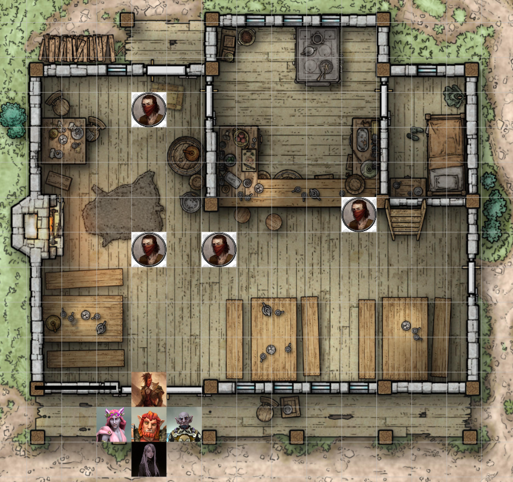
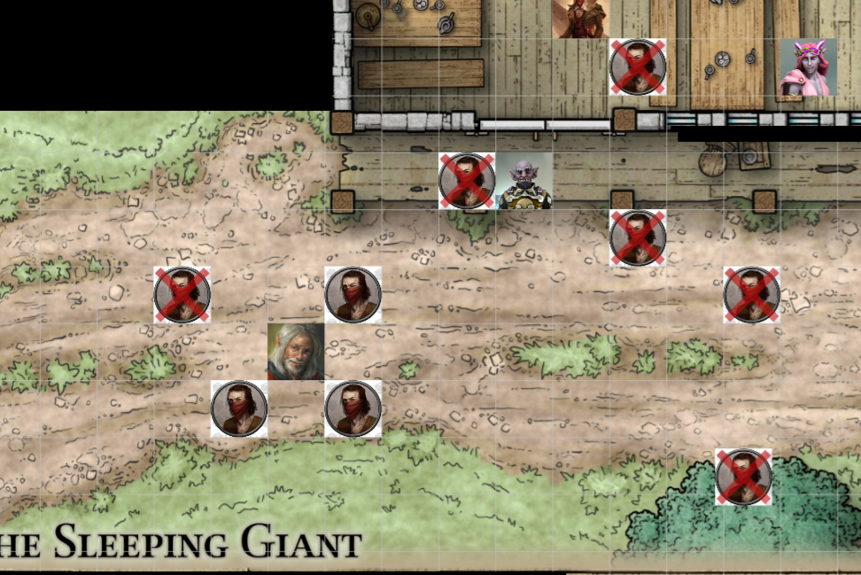
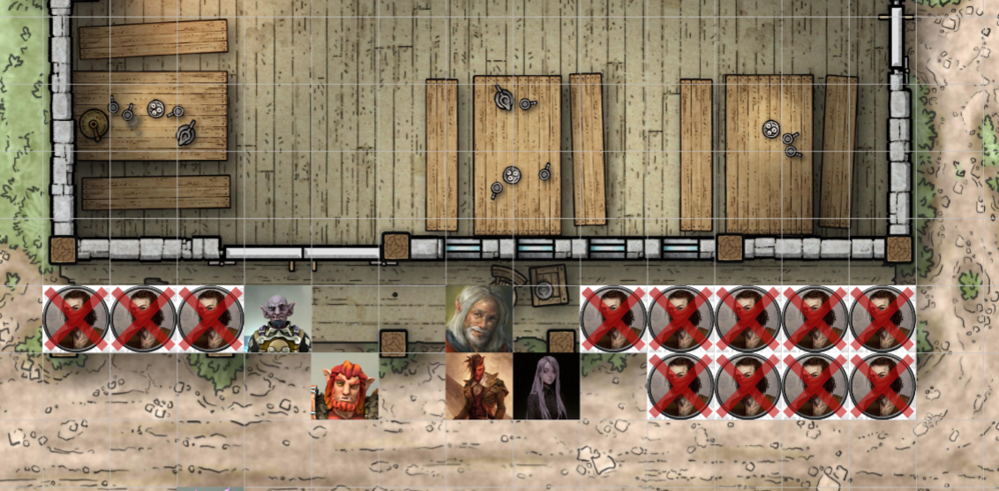

# Session 9 | 2023. 07. 31. (hétfő)

Nana az éjjel a korábbi látomását látja újra, és újra. Ash számára is az előző látomás ismétlődik, ezúttal a fényt szorítja vissza a sötétség, három alakkal, akiket továbbra sem tud kivenni.

Reggel Seranak egyből feltűnik, hogy *"pöcse vagy a menyasszonynak"*, Ashton fekszik a mellette lévő ágyon.

* *`"Úhh, bazdmeg..Oké..jó..hol vagyunk, és van -e bor?!" - 💬 [Ashton/másnaposan]`*
* *`"Megérkeztünk Phandalinba, és ha jól tudom, van bor, de azt javaslom, egy darabig ne igyál." - 💬 [Sera]`*
* *`"Kutyaharapást szőrivel!" - 💬 [Ashton]`*
* *`"Mi az utolsó emléked?" - 💬 [Sera]`*
* *`"Nem túl sok..a fesztiválról eljöttünk, tábort vertünk, dalolásztunk, ittunk..lehet, az a chili ártott meg...nem tudom, de kéne valami reggeli.." - 💬 [Ashton]`*

Ashton szép lassan magához tér, és piszok másnapos mozdulattal indul el a lépcsőn lefelé, keresve a fogadóst.

* *`"A szekeret visszavittük, a fizetést megkaptuk - a saját részed nálad van." - 💬 [Sera/Ashton után szalad]`*
* *`"Mennyi ideig voltam kiütve?" - 💬 [Ashton/erszényét rázva]`*
* *`"Kb. másfél, két napig." - 💬 [Sera]`*
* *`"Ennyire azért nem volt erős a chili! De csodás barátaink vannak, vigyáztak ránk! Csak ne felejtsem el meghálálni, hogy megkaptam a részem - még így is, hogy átaludtam a dolgokat.. Neked kell valami? Lemegyek reggelizni." - 💬 [Ashton]`*
* *`"Kérhetsz nekem is egyet, de bort nem!" - 💬 [Sera]`*
* *`"Ne aggódj, majd megiszom a tiédet is!" - 💬 [Ashton]`*

A lenti asztaloknál újra összegyűlik mindenki, a reggelit várva.

* *`"Üdv újra a körünkben!" - 💬 [Orik/Ashtonnak]`*
* *`"Először is, köszönöm! Másodszor, elnézést! Harmadszor pedig..jó, hogy újra itt vagyok, bár nem tűnt fel a kiesés... Elnézést, amiért annyira leittam magam.. Mindenesetre köszönöm, hogy helyettem is befejeztétek a küldetést.. A reggelit most én állom!" - 💬 [Ashton]`*
* *`"Már rendeztük, a reggeli a szállás része, benne van az árban." - 💬 [Orik]`*
* *`"Príma, akkor a vacsorát fogom én állni!" - 💬 [Ashton]`*

Orik keresi Sera tekintetét, hátha sikerül némi információt kapnia a lánytól telepatikus úton.

* *`"Na és merre jártál, Ashton?" - 💬 [Nana]`*
* *`"Picit komorabb álmok, tele borzalmakkal.. De erről nem beszélnék most, egy ilyen fejfájós reggelen kevésbé vagyok jó beszélgetőtárs." - 💬 [Ashton]`*
* *`"Reggeli után szívesen meghallgatjuk, akár dalban!" - 💬 [Nana]`*

Toblen a lenti helyiségben a pult mögött tevékenykedik, az egyik asztalnál egy halfling nővel pletykál Elsa, egy másik asztalnál pedig az előző reggeli kalandor foglal helyet.

* *`"Ez az a kalandor, akiről hallottunk, nem?" - 💬 [Sera]`*
* *`"Ő itt volt tegnap reggel is! De szerintem előbb együnk, nem jó zavarni senkit reggeli közben!" - 💬 [Rorr]`*
* *`"Jó reggelt! Jöhet a reggeli?" - 💬 [Toblen]`*
* *`"Naná!" - 💬 [Rorr/korgó gyomorral]`*

Ashton kér egy korsó vizet, és egy korsó bort is a kaja mellé.

* *`"Már jön is! Elsa!" - 💬 [Toblen/a háta mögé kiáltva]`*
* *`"Jövök már, nem kell ordibálni!" - 💬 [Elsa]`*

Elsa kelletlenül félbeszakítja a pletykálást, és elkezd sürögni. Egy jó nagy köcsög vizet tesz le az asztalra, felszolgálja a szokásos reggelit (sajt, tojás, kenyér, kolbászka).

* *`"Ez a legfinomabb sajt, amit valaha ettem az elmúlt négy napban!" - 💬 [Ashton]`*

Elsa szája be nem áll, folyton beszél, miközben felszolgál. Nagyon örül ő is, hogy itt vagyunk, és már várja a friss pletykákat, amivel szolgálni tudunk. Megjegyzi, hogy a kovács csak délután van a műhelyében, délelőtt a bányában dolgozik - addig hiába keresnénk.

* *`"Kaphatnék egy kancsó vizet, és egy kupa bort?" - 💬 [Orik]`*
* *`"Persze-persze, hozom már!" - 💬 [Elsa]`*
* *`"Köszönöm, nagyon kedves!" - 💬 [Orik]`*

Ezköben Serafine magyarázza Ashtonnak az elmúlt napokban történteket.

* *`"Kissé bonyolult a helyzet. Sildar úr további munkát ajánlott, ha elhozzuk a felszerelését, Gundrent ugye elrabolták a goblinok.. Úgyhogy tervezzük, hogy kiszabadítjuk, de előbb megígértük a kedves kis falunak, hogy kiderítjük mi történt az elöljárójukkal - Iarnoval -, akit a vörös kendős banditák raboltak el." - 💬 [Sera]`*
* *`"Itt is vannak vörös kendősök?" - 💬 [Ashton]`*
* *`"Mindenhol vannak, ez bandita attribútum.." - 💬 [Sera]`*
* *`"Mi felénk is volt sok.." - 💬 [Ashton]`*
* *`"Merre?" - 💬 [Sera]`*
* *`"Fönt északon." - 💬 [Ashton]`*
* *`"Szóval, mentőakciókba kezdünk." - 💬 [Sera/összefoglalva]`*
* *`"Remélem, hogy jól megfizetnek minket érte." - 💬 [Ashton]`*

Eközben Elsa is visszaér az italokkal, leteszi Orik elé a kupákat.

* *`"Nagyon kedves, köszönöm!" - 💬 [Orik]`*
* *`"Még valamit?" - 💬 [Elsa]`*
* *`"Nem, köszönjük." - 💬 [Orik]`*

Elsa továbbra is ott álldogál, hegyezi a fülét. Orik feltűnően néz rá, várja, hogy a lány ellépjen.. Forgatja a szemét, és kicsit megsértődve visszatér a félszerzethez tovább beszélgetni. Ahogy Ashton befejezi az étkezést, így szól:
* *`"Amennyiben szeretnétek, tényleg tudok mesélni az álmaimról..Nem biztos, hogy sok információ tartalma van, de hangulatfestésnek jó lehet." - 💬 [Ashton]`*

Előveszi a lantot, énekelve elmeséli, ahogy egy épp kitörő vulkán oldalán vágtatott egy fekete unikornison, kezében kehellyel, melyben kisgyermekeke könnyei voltak, körülötte halál és szenvedés.. Úgy tűnt, az uniokornis viszi útján, de pontosan hová is...
~~~
ℹ: https://www.youtube.com/watch?v=yjJDBP292rM
~~~
* *`"Hát, valami ilyesmiről lenne szó." - 💬 [Ashton]`*

A szélső asztaltól a kalandor hátranéz ránk, majd egy irritált morgással visszafordul a reggelihez.. Elsa és a félszerzet hangosabban kezdenek pletykálni.

* *`"Nagyon érdekes.. És gyakran álmodsz ilyen jelenségekről?" - 💬 [Orik]`*
* *`"Az álmaimat pár hónapja balsejtelmek és halál övezik.. Ugyanígy fel-feltűnik ez az unikornis, aki valahová el akar engem vinni." - 💬 [Ashton]`*

Elsa pletykáiból a város ügyei, a vihar és villámlás szavak ütik meg Nana fülét, ő közben arra koncentrál. Arról beszélnek, hogy az út mellett, a tengerparton van egy világítótorony, ami rejtélyes zöld fénnyel csalja a hajókat a sziklának, és folyton vihar van körülötte.
Erről pletykálnak, biztos tele vannak kincsel, miért nem tesznek semmit ellene.

* *`"Ő nem tudja, hogy az a másik is ő?" - 💬 [Rorr/Sera-nak]`*
* *`"Így is fel lehet tenni a kérdést..Fogalma sincs róla..egyiküknek sem." - 💬 [Sera/Rorr fejében]`*
* *`"És nem is akarják tudni?" - 💬 [Rorr/erőlködve-fejben]`*
* *`"Úgy tűnik, nem.. Próbáltam rávezetni, de nehezen fogadják el az igazságot." - 💬 [Sera]`*
* *`"Minden rendben? Olyan fura arckifejezést vágtál az előbb.." - 💬 [Ashton/Rorrnak]`*
* *`"Igen, csak félrement a tojás..Délelőtt egy kis gyilkolás, délután meg valami más!" - 💬 [Rorr/témát terelve]`*
* *`"Mennyire igazad van! Francba a másnapossággal!" - 💬 [Ashton]`*
* *`"Valami más? Ashton, halkabban!" - 💬 [Orik]`*
* *`"Nem ők béreltek fel minket?" - 💬 [Ashton]`*
* *`"Valóban, de egy kis _image_-t már felépítettünk, a jótevőjük vagyunk!" - 💬 [Orik]`*

Ashton körbenéz a társaságon.. Egy hobgoblin, thiefling, bugbear.. Nagy vigyorral bólint egyet Orik szavaira.

* *`"Nos, Ashton, eddig aki fenhangon beszélt a banditák ellen, az mind szörnyű véget ért.. Ezért próbálunk kissé diszkrétek maradni, nehogy bajt hozzunk valakire itt." - 💬 [Orik/tisztázva]`*
* *`"Eddig talán hatásos volt, amikor diszkrétek akartunk lenni?" - 💬 [Nana]`*

Ashton bólint, érti, mire gondol.

* *`"Az illem mindenek felett.." - 💬 [Orik/csalódottan morogva]`*
* *`"Elnézést kérek.. Minden vörös kendős bantitától, akinek majd átvágjuk a torkát, bocsánatot kérünk majd!" - 💬 [Ashton]`*

Ekkor nem bírja tovább az Elsa-val csevegő halfling, kifakad:

* *`"Mit akarjátok ti itt felbojgatni a méhkast! Már eddig is mennyi bajt hoztak ránk a banditák, a fiacskámat is elvitték az erdőből majdnem; pedig ő csak ott játszott! A fafaragó is hogy járt, nem kell nekünk, hogy bárki más is így járjon, jobb lenne, ha meghúznátok magatokat ahelyett, hogy belekevertek minket is ebbe!" - 💬 [halfling]`*
* *`"Végtelenül sajnálom, nem akartunk kora reggel ilyen kedély állapotba hozni! Csak azért jöttünk, hogy mindent kissé jobbá tegyünk! Ha ezen tudunk segíteni, örömmel megtesszük!" - 💬 [Ashton]`*
* *`"Mégis hogyan segíteni? Még több gyilkolással?" - 💬 [halfling]`*
* *`"Áhh, még véletlenül sem!" - 💬 [Ashton]`*
* *`"Nagyon köszönjük, hogy éleslátásával és tapasztalataival hozzájárul ahhoz, hogy a küldetésünk sikeres legyen! {{Ashtonra néz}} És azt hiszem, hogy szerintem mi..megyünk is, hogy a gyanúnak a legcsekélyebb árnya se vetülhessen erre a fogadóra, köszönjük." - 💬 [Orik/elindul kifelé]`*
* *`"Köszönöm, aztán csak semmi gyilkolásás!" - 💬 [halfling]`*
* *`"Mi sem természetesebb, nincs rá okunk!" - 💬 [Ashton/Orikot követve]`*
* *`"Ha mi vagyunk a gyorsabbak, az végülis kivégzés, nem gyilkolászás.." - 💬 [Rorr/orra alatt a többiek után]`*

Sera rámosolyog a kalandorra, megpróbálja megnézni magának, de semmit sem lát a csuklya miatt. Kopottas, kemény ruházata van, oldalán és hátán is fegyverek lógnak, ahogy tegnap is. Végül nem szólítja meg, csak követi a többieket, akik hangosan nevetnek az előbb elhangzottak után.

* *`"És amúgy, mit tudunk ezekről, amit tervezünk, és mit is tervezünk?" - 💬 [Ashton]`*

Orik röviden és gyorsan elmondja a tegnap történteket - kiről és mit tudtunk meg, milyen lehetőségeink vannak a továbbiakban - az **'Alvó óriás'** mindenképpen útbaesik, érdemes lehet ott kezdeni.

* *`"Ez a kúria.. Nos.. Arra gondoltunk, hogy ezt a későbbiekben akár ki is sajátíthatnánk, ha lehetőségünk támad rá." - 💬 [Orik]`*
* *`"Kiváló választás! Mindig tudtam, hogy remek ízlésetek van, nagyszerű "Base of Operation" lenne! Lesz vele munkánk, az biztos, de látok benne fantáziát!" - 💬 [Ashton]`*

Orik néha Sera-ra pillant, de a lány csak lemondóan rázza fejét.

* *`"Egy ilyen kúria felújításához valószínűleg folyamatos bevételre lesz szükségünk.. De ha a banditákat kiírtottuk, akár a másik fogadót is üzemeltethetnénk!" - 💬 [Ashton]`*
* *`"Picit aggódom, mert nem tudjuk, hányan vannak.. Jó lenne apránként elbánni velük." - 💬 [Sera/aggodalmasan]`*
* *`"Elhitetjük, hogy nem ellenük jöttünk, hanem értük, legalábbis hozzájuk!" - 💬 [Ashton]`*
* *`"Erre én nem vagyok alkalmas.." - 💬 [Sera]`*

Ashton visszafogja a nevetést, ami előtörne belőle.

* *`"Miért, te elhinnéd, hogy banditának akarok állni?" - 💬 [Sera]`*
* *`"Miért is ne.." - 💬 [Orik]`*
* *`"Sera..én a banditák helyében tőled jobban félnék, mint tőle. {{Rorr-ra pillant}}" - 💬 [Ashton/Sera-nak fejben]`*
* *`"Sokat dolgoztam az image-men..azt mondod hiába?" - 💬 [Sera/Ashtonnak fejben]`*
* *`"Nem, csak azt, hogy hosszú út áll még előttünk.. De lehet, csak régebben ismerlek a kelleténél!" - 💬 [Ashton/Sera-nak fejben]`*

Sera csúnyán néz, majd a nyelvét nyújtja Ashtonra, aki végül felnevet.

* *`"Mit tudunk erről a kocsmáról?" - 💬 [Sera]`*
* *`"Aki oda bemegy, nem jön ki élve." - 💬 [Rorr]`*
* *`"Ebben az esetben ne csak betévedjünk, hanem határozott céllal és fellépéssel menjünk be." - 💬 [Orik]`*
* *`"Mi lenne, ha elkapnánk valakit, aki kijön onnan?" - 💬 [Sera]`*
* *`"Nem rossz ötlet, de mit kezdünk vele?" - 💬 [Ashton]`*
* *`"Kínvallat... khm.. kikérdezzük." - 💬 [Orik]`*
* *`"Örülök, hogy kezdesz feloldódni a társaságunkban! Úgy látom, jót tett az a karnevál neked." - 💬 [Ashton]`*

Elindulunk az **'Alvó óriás'** felé, tanakodva, hogy vajon találunk e józan embert ott, és ha igen, az vajon tud -e bármi hasznosat mondani. Pár perc alatt a kocsma elé érünk, a cégéren egy óriás fekszik, hóna alatt egy sziklával. Ahogy a településen szinte mindegyik, ez is rönképület, bár indokolatlanul leharcolt a többihez képest. Lengőajtó, western stílusú bejárat látszódik. Az ajtón belül támaszkodik egy piros maszkos férfi. A tájra a reggeli nyugalom jellemző, egy-két ember megy dolgozni, nagy ívben elkerülve a kocsmát, közben csicseregnek a madarak. Csörtető csürhe hangja nem hallatszik ki bentről.

* *`"Én hátra megyek, bekukucskálok az ablakon!" - 💬 [Sera/elindul]`*
* *`"Akarunk beszélgetni is, vagy csak szétcsapunk köztük?" - 💬 [Rorr]`*
* *`"Nem kerülne túl sok erőfeszítésbe, hogy elhitessük velük, hogy mi is csak erre tévedt haramiák vagyunk. Hallottuk, hogy itt jó dolga van annak, aki Vörös Kendőt húz.. Talán meg tudjuk győzni őket, hogy csatlakozni akarnánk, amivel könnyedén a főnök elé kerülhetünk, hiszen ő dönt erről... Persze a gyilkolászást is választhatjuk." - 💬 [Ashton]`*
* *`"Nekem sincs ellenemre, hogy cselszövéssel próbáljunk a közelükbe férkőzni," - 💬 [Orik]`*
* *`"Benne vagyok!" - 💬 [Nana]`*

E szavak után egy Orikhoz hasonlatos, de human külsejű férfivé varázsolja magát a hobgoblin. A felszereléséről eltűnteti a rá utaló jeleket.

* *`"Alkalom adtán ezt még mindig meg kell tanítanod!" - 💬 [Ashton/álmélkodva]`*
* *`"Eljutunk majd oda is!" - 💬 [Orik/mosollyal]`*

Sera eközben hátul egy verandát lát, hátsó ajtóval, farakással. A farakás és az ajtó között észrevesz egy vékony ablakot, de nagyon koszosnak tűnnek az üvegek. Az egyiket letörli, de a kosz nyikorog, és karcolja az üveget.. A takarítás sajnos nem segít, a belső rész is nagyon koszos, nem sokat lát.. Zsíros kosz van a másik oldalon, valószínűleg a konyha mögött állhat. A fészer mellett elsétálva tovább megy, egy ajtót lát a keleti oldalán is a háznak. Körbeérve visszatér hozzánk, elmeséli mit látott.

* *`"Nem valószínű, hogy minket itt szívesen látnak.." - 💬 [Sera/Oriknak]`*
* *`"Szóval; agresszívan vagy megtévesztve?" - 💬 [Ashton]`*
* *`"Én az utóbbit választanám.." - 💬 [Sera]`*
* *`"Akkor, uccu neki!" - 💬 [Ashton]`*

A felkiáltással Ashton elindul a bejárat felé, ahol az eddig támaszkodó kendős alak megpillant minket, és így kiált:

* *`"Óó, nocsak..egy csapat kiskutyus.. Mit szeretnétek kutyuskák, jöttetek megugatni minket?!" - 💬 [bandita/lenézően]`*
* *`"Cimbora! Hamar rá fogsz jönni, hogy pont ugyanabban a ligában ugatunk.. Lenne egy ajánlatunk számodra..vagy inkább számotokra!" - 💬 [Ashton]`*
* *`"Legyél már olyan jó, és szóljál egy nagykutyának, mert kiskutyákkal nem tárgyalunk!" - 💬 [Orik]`*
* *`"Nocsak, a kiskutya próbál vicsorogni!" - 💬 [bandita]`*
* *`"Mindjárt farkassá válok, és leharapom a fejét.." - 💬 [Sera/orra alatt]`*
* *`"Nézz rám.. Tényleg úgy tűnök neked, mint akit bárhol megtűrnek, ahol emberek laknak? Azt mondták a fesztiválon, hogy nem áll jól a szénája az ittenieknek.. {{int Rorrnak}} Régóta keresünk egy helyet, ahol szívesen látják a magunk fajtákat!" - 💬 [Ashton]`*
* *`"Halljátok fiúk? A kiskutya szeretne csatlakozni a falkához!"" - 💬 [bandita/hátrakiált]`*
* *`"Te egy nagyon elmés humoros gyerek vagy, téged öllek meg utoljára!" - 💬 [Orik/félhangosan]`*
* *`"Azt hiszitek, nem tudjuk kik vagytok? Hogy bárki érkezhet ebbe a városba anélkül, hogy mi tundnánk róla? Láttunk aludni titeket a fogadónál!" - 💬 [bandita]`*
* *`"Persze, volt egy megbízásunk, de hát, semmiféle vérszerződés nincs innentől.. Szeretünk a győztes oldalon állni, főleg ha ott a több pénz!" - 💬 [Ashton]`*
* *`"Jó hozzáállás, de sajnos Glasstaff szeretné a fejeteket!" - 💬 [bandita]`*
* *`"Az is megoldható! A kérdés csak az, hogy mennyit fizet érte.. Nem csak a fejünket kapja, hanem a benne lévő tudást is! Vagy akár a kezünket..plusz az abban lévő fegyvereket is." - 💬 [Ashton]`*

Ahogy Ashton győzködi a banditát, az felnevet.

* *`"Mi az oka, hogy így a bögyébe kerültünk a főnöködnek?" - 💬 [Sera]`*
* *`"Ok? Miért kellene ahhoz ok.." - 💬 [bandita]`*
* *`"Meg hát, amúgy se mondta meg!" - 💬 [egy hang bentről]`*
* *`"Ebből látszik, hogy tényleg nem veletek kéne tárgyalni.." - 💬 [Ashton]`*
* *`"Meg kell értened..hát..ilyen komoly érveléssel nem tudnak mit kezdeni.. Hát nézz már rá szegénykére.. Retardált!" - 💬 [Orik]`*
* *`"Az mit jelent?" - 💬 [Rorr/Oriknak súgva]`*
* *`"Idióta, visszamaradott..csekély értelmű.." - 💬 [Orik]`*

Orik belefelejtkezik, sorolja a szinomímákat, Nana hangosan röhög rajta.

* *`"Valóban idiótának kell ahhoz lenni, hogy ha azt hiszed, hogy nem ajánlattal érkeztünk ide. A kérdés csak az, hogy ez nektek, vagy rátok szól!" - 💬 [Ash/a bandita fejében]`*
* *`"Ajánlat..na jól van, gyere kutyus..lábhoz!" - 💬 [bandita/fennhangon]`*

 A bandita eltávolodik az ajtótól. Egymásra nézünk, madj elindulunk az ajtó felé.

A lengőajtón áthaladva egy lehurcolt kocsma tárul szemünk elé. Koszos, rumlis, tipikus *"talponfekvő"*. foltos, koszos asztalok és padok, bent 4 bandita, vörös maszk az arcukon, kivont karddal várnak. A pult mögött egy törp asszonyság koszos ronggyal koszos korsót törölget - meglátva minket inkább besüllyed a pult alá. Ash még odakiált - kér tőle 8 sört és egy üveg bort. A kandallóban még parázs az esti tűzből, előtte vaddisznószőnyeg a földön.

* *`"Na..múltkor az úton nem sikerült elkapni titeket.. De most innen már nem menekültök!" - 💬 [bandita #2]`*
* *`"Azok ti voltatok?" - 💬 [Ashton]`*
* *`"Ezek biztosan nem.." - 💬 [Orik]`*
* *`"Megtaláltuk társaink meggyalázott holttestét.. És még ti neveztek minket primitívnek?!" - 💬 [bandita #3]`*
* *`"Ha láttátok, tudjátok, mire számíthattok.. Mi tényleg tárgyalni jöttünk!" - 💬 [Ashton]`*
* *`"Nincs miről beszélnünk!" - 💬 [bandita #4]`*
* *`"Pedig azt hittem, lehetünk jóban!" - 💬 [Ashton]`*

### ⚔ COMBAT ⚔ 

Ash bal kezében rapír, és a szemben álló banditára küld egy varázslatot, mellkason találja, de még nem esik földre.
"ezek szerint az ajánlat _rátok_ szólt." - fejben hallja Ash hangját.

Sera is belép, Ash mellé lép, a másik banditára küld egy varázslatot, de az alig érzi meg ezt - a másnapossággal vegyül.

Ez a bandita az asztalra ugrik, Ash felé suhint, a vállát vágja meg. Felbátorodva újra szúrna, de mellélép, és leesik az asztalról.

Az első bandita az ajtóban álló Orikot támadja, talál. Furcsállja, hogy a támadás vizuális és "érezti" része nem egyezik, a második suhintás nem talál.

A két hátsó bandita a két hátsó ajtóhoz lép, bezárják azokat.

Orik egy dárdát vesz a kezébe. Ledobja magáról a disguise-ot: "Buuh!".. "azt hiszed, nem tudtam?"! - kiált fel a bandita - Orik egy egyszerű mozdulattal szúrja le őt, aki nem mozdul többet.
"nem tudsz te semmit édes fiam..." - majd elindul az egyik hátsó bandita felé.

Nana mérgesen a terem közepére fut, tűzlabdát küld a másik ajtónál álló bandita felé, az próbálja a lángokat eloltani.

Rorr, ahogy a bandita felé suhantana, a földön egy kis zsíron megcsúszik, így melléüt.

Kintről sok ember hangja hallatszik, az ajtóban több bandita jelenik meg.. Röhögnek egyet, majd két fa lemezt helyeznek az ajtó elé, kalapálás hangja hallatszik, legalább 6 másikat látunk kint. Az egyikőjük nyakára egy kesztyű kulcsolódik, a kesztyűn egy szem látszódik (az öreg kalandor). "Na hát akkor, térjünk vissza a business-be!" - majd elkezd dulakodni a kintiekkel.

Ash: "béna" felkiáltással a padon fekvő ember mellé lép, közben Orikhoz szól: " A bejáratnál elkélne a segítséged!". Ahogy a banditába szúrja a rapírt, a kardból sötét energia árad a bandita testébe, majd a végtagjai elernyednek, és nem mozdul többet.

"ha jól értem, nincs értelme foglyokat ejteni.." - sera, majd a felgyújtott banditát átkozza meg.. egy csont keze suhan felé, majd elkapja a fejét, átmegy rajta, és összeesik.

a bandita dörömböl az ajtón, valszeg. ő nem tud róla, hogy rá akarják gyújtani a helyet.

nem túl lelkesen visszafordul, és Orikot támadja. eközben kintről erős, hangos csetepatét hallunk.

Orik mellészúr a fájdalomtól, nem találja el a banditát, de a vállára ráfog, hogy ne tudjon elfutni.

Nana egy újabb tűzlabdát küld az árván maradt bandita felé.

Rorr is odalép, és a kalapácsával sóz oda egy jó nagyot, majd a konyhaajtót nyitja ki.

Ash "Most te jössz!" kiáltással kivégzi az árván maradt banditát, a kardból most is fekete energia tejred szét a testén.

A rapír markolatán egy fekete pókot lát Orik, a penge is matt fekete. "Megtennéd, hogy csinálsz nekünk egy kijáratot?" - kéri Ash Oriktól.

### 🕊 COMBAT VÉGE 🕊

Rorr belép a konyharészbe, körbenéz, van -e valami kaja vagy pia. A pult alatt lát pár hordót, a söntésen pedig nagyon koszos korsókat talál. Eközben Orik gyenge pontot keres az ajtóra szögelt lapokon. Nana az ablakon próbál kinézni, de csak elmosódott kendős alakokat lát egy másikat körbevenni.

* *`"Egy kis ital, amíg Orik utat tör?" - 💬 [Rorr]`*
* *`"Örülök a lelkesedésnek, de inkább itt gyülekezzünk.." - 💬 [Orik]`*

Ash meg sem várva, amíg Orik befejezi, amit csinál, egy varázslatot röpít a deszkákba. A kettétörő lemezek és deszkák némi szilánkot robbantanak Orik arcába.

* *`"Ashton!!" - 💬 [Orik/erősen köszörüli a torkát]`*
* *`"Elnézést, lehet, kissé türelmetlen voltam!" - 💬 [Ashton/szabadkozik]`*
* *`"Ezt majd később megbeszéljük.." - 💬 [Orik]`*

Orik kisöpri a szilánkokat az arcából, majd elindul kifelé a varázs által vágott lyukon.

* *`"A sörért majd később visszajövünk.." - 💬 [Rorr]`*

Az ajtón kilépve két hulla fogadja Orikot, hatalmas szúrt sebekkel. A porban távolabb másik két holttestet lát. Az öreg kalandor mellett 3 ellenfél, mögötte még egy hulla.

* *`"Ha meg nem sértelek, segíthetek esetleg?" - 💬 [Orik/hangosan-udvariasan]`*

Daran egyik kezében egy hosszú, másikban egy rövid kard van. A kiáltás hatására odafordulnak a banditák, az elterelésre két banditát kivégez, majd a harmadikat is leszúrja. 

* *`"Elnézést..tárgytalan!" - 💬 [Orik]`*
* *`"Köszönöm, azt hiszem, megvan, de kicsit megpihenek.." - 💬 [Daran/lomhán]`*

A szavak után az idős félelf eldől a porban. Orik odasiet, megpróbálja a sebeit begyógyítani.

* *`"Rorr, azt hiszem, mégis csak szükségünk lenne a pár kupa sörre!" - 💬 [Ashton]`*

Rorr hátramegy a sörös hordóért, majd kisétál vele.

* *`"Tele kérem!" - 💬 [Orik]`*

A hobgoblion kiüríti a kulacsát, majd a csapolt hordó alá tartja azt. Darant eközben Sera és Ashton a székre ülteti.

* *`"Köszönöm, ez jó kis testmozgás volt, ugye?!" - 💬 [Daran]`*
* *`"Az nem kétség, de ki vagy idegen, hogy jöttél megmenteni minket?" - 💬 [Ashton]`*
* *`"Igen, a hobgoblin úrral már találkoztunk!" - 💬 [Daran]`*

Orik bemutatja őket egymásnak.

* *`"Daran Edermorth.. én vagyok itt a kertész!" - 💬 [Daran]`*
* *`"Óó, gyümölcsöskertje van?" - 💬 [Ashton]`*
* *`"Igen, főleg almákat termesztek!" - 💬 [Daran]`*
* *`"Cyder is van?" - 💬 [Ashton]`*
* *`"Ezt kérdezte a hölgy is..Tényleg, hol van Ashley?" - 💬 [Daran/Oriktól]`*
* *`"Nos, ez jó kérdés.. Azt hiszem, ezt majd kicsit pihentebb és nyuglamasabb közegben megbeszéljük." - 💬 [Orik]`*
* *`"Kár, meg akartam köszönni, hogy kirángatott a nyugdíjból!" - 💬 [Daran]`*
* *`"Mi is köszönjük, hogy még egy utolsó kaland kedvéért a segítségünkre sietett, igazán önzetlen cselekedet az Ön részéről!" - 💬 [Orik]`*
* *`"Ezzel viszont úgy érzem, végleg visszavonultam.. Már így is eléggé felpiszkáltátok, vagyis felpiszkáltuk ezt a darázsfészket. Ami kis energiám van, azt inkább ott fent töltöm, nyugalomban." - 💬 [Daran]`*

Rorr végignézi a hullákat, de semmi különleges nincs náluk. A red bandana-kat összegyűjtjük, alatta mindegyik egy középkorú fehér férfi, ismerős arc nincs köztük. Rorr a hullákat összeszedi, a kocsma elé ülteti őket, felsorakoztatva.

* *`"Ez most nem lesz szép.. Azt kérném, a szemérmesebbek forduljanak el.." - 💬 [Orik]`*

A korábban az ajtóban sokat pofázó bandita fejét letépi helyéről, majd egy karddal a fejét az ajtóra tűzi.
* *`"Ilyet láttam már a fajtádtól.. Hát, nem mondom, hogy nem érdemelték meg.." - 💬 [Daran]`*
* *`"Akármilyen kulturált körülmények között, és az illemet becsülve nőttem fel..nos, vannak dolgok, amik nem változnak." - 💬 [Orik]`*

Ashton közben visszamegy, és bekopog a konyha mögötti szoba ajtaján.

* *`"Igen? Mi van?" - 💬 [női hang/morcosan]`*
* *`"Szeretnénk elnézést kérni a problémák miatt.. A bútorzatban nem esett kár, de egy hordó sör látta kárát ennek a félreértésnek.. megtéríteném!" - 💬 [Ashton]`*
* *`"Ez a minimum! De a vendégkörömet is megfeleztétek!" - 💬 [pultos/ajtót nyit]`*

Ashton próbál több információt kiszedni a nőből, a *"kellemesebb klientúra kialakításának érdekében"*.

* *`"Csak ígérd meg, hogy ide többet nem jöttök!" - 💬 [pultos]`*
* *`"Még akkor sem, ha rengeteg pénzt hozunk a fogyasztásért?" - 💬 [Ashton]`*
* *`"Azt még megláthatjuk.." - 💬 [pultos]`*
* *`"Mert nagy örömmel fogyasztunk pénzért is! Mi jó szándékkal jöttünk ide beszélgetni, szívesen folytatjuk azzal, aki itt maradt! Tud e esetleg ilyesmikről, mint hogy van -e őrjárat, ha igen, milyen sűrűn.. Kire kell figyelni, stb.." - 💬 [Ashton/kérdezősködik]`*
* *`"Áh, nincsenek ezek ilyen jól szervezve! Csak jönnek, esznek, isznak, aztán elmennek!" - 💬 [pultos]`*

ash virágnyelven megfogalmazza, hogy "elrettentést hagynánk" itt.. érti a célzást, nem örülne, hogy hullahegyeket látnának a városlakók.

* *`"Ugye tudod, hogy a városháza elől is ide lehet látni erre a teraszra? Ez egy pici város!" - 💬 [pultos]`*
* *`"Nagyon helyes!" - 💬 [Ashton/vigyorral]`*

3 🥇-t hagy a pulton, majd csatlakozik a többiekhez.

* *`"Bármilyen bájos ez a kiállítás, amit rendeztetek, ideje tovább állnunk, és felkutatni a többieket!" - 💬 [Sera]`*

"óvintézkedés gyanánt - a gyerekek ne sérüljenek felnövésük során.."

* *`"Barátaim, ez így ebben a formában elég elrettentés...amit ezen túl terveztek tenni, az már barbárság..azzal pedig nincs jó tapasztalata az itt lakóknak!" - 💬 [Daran/intően]`*

Rorr végül letesz a lefejezési kísérletről, megy a többiekkel a kúria felé.

* *`"Orik, szabad egy szóra?" - 💬 [Daran/Orik után]`*

A hobgoblin visszafordul, a kalandor megvárja, míg a többiek messzebb mennek..

* *`"Szóval.. Hol van Ashley?" - 💬 [Daran]`*
* *`"Nos..egy olyan tapasztalt kalandor, mint Ön, biztosan látott furcsa dolgokat a világon. {{Daran bólogat}} És bár tudományokban és mágiában jártas egyénnek tartom magam, azt kell mondjam, én sem teljesen értem, hogy Ashley most hol van.. De biztosíthatlak róla, hogy nem esett bántódása, csupán helyet cseréltek." - 💬 [Orik/magyarázza]`*
* *`"Kivel?" - 💬 [Daran/értetlenül]`*
* *`"Nos, hát.. Ash-ley, Ash-ton.." - 💬 [Orik/rávezetve]`*
* *`"Az feltűnt, hogy ugyanaz a ruházatuk.. Talán ugyanannak a szervezetnek a tagjai? Helyet cseréltek, mint hogy osztott küldetés?" - 💬 [Daran]`*
* *`"Nos, azt hiszem ez egy kellően jó magyarázat, ami nem megy túl mélyre olyan dolgokban, amit egyiknünk sem ért." - 💬 [Orik/bólint]`*
* *`"Azt mondd meg, hogy visszavárható e Ashley." - 💬 [Daran]`*
* *`"Ezt én is szeretném tudni. Bízom benne, hogy igen, de hogy pontosan mikor, hogyan, vagy egyáltalán '-e', abban nem vagyok biztos.." - 💬 [Orik]`*
* *`"Értem.." - 💬 [Daran/szomorúan]`*
* *`"Esetleg üzensz neki valamit?" - 💬 [Orik]`*
* *`"Szeretném meghálálni hogy kirángatott a mindennapokból.. És jellemre is a fiatalkori önmagamra emlékeztetett.. Esetleg áttadnád neki ezt?" - 💬 [Daran]`*

Daran lehúzza kezéről a kesztyűit, és átnyújtja Oriknak.

* *`"Megtisztelő, hogy rám bízod ezt a kedves feladatot!" - 💬 [Orik]`*
* *`"Ha és amikor átadod, feltétlenül említsd meg neki, hogy szívesen várom bármikor egy kis sztorizgatásra!" - 💬 [Daran]`*
* *`"Mindenképpen átadom! És elnézést a korábbi intermezzoért, biztosíthatlak róla, hogy a legtöbb esetben _úriember_ vagyok." - 💬 [Orik]`*
* *`"Óó, tudom én, egyértelmű volt.. Sok ilyet láttam már, régi emlékeket idézett fel!" - 💬 [Daran]`*

Daran régi sztorikba kezd a hobgoblin hordákról, az általuk végzett és hagyott borzalmakról.
Orik nosztalgikusan hallgatja, de pár perc múlva észbe kap:
* *`"Ha nem sértődsz meg daran, köszönjük a segítségedet, mindenkire ráfér a pihenés..nekünk is akad még tennivalónk!" - 💬 [Orik]`*
* *`"Minden jót, hajrá!" - 💬 [Daran]`*
* *`"Amennyire hozzáértő kezedhez telik, vigyázz a falucskára! Nem megyünk messzire, de várhatóak _attrocitások_. Igyekszünk úgy intézni, hogy ne a falut érjék ezek, sőt, éppen ellenkezőleg.. De sosem tudni.." - 💬 [Orik]`*
* *`"Köszönöm, én is meg fogom tenni a magamét! És Ashleyt üdvözlöm!" - 💬 [Daran]`*

Kezet ráznak, majd Orik sietve elindul a többiek után.

~~~
{🌟} +80 XP
~~~

A többiek elindulnak a **'Tresendar Manor'** (kúria) felé. kerítés, kapu már nincs, egy két szintes, viszonylag nagy kúria volt. a tető egy része és a pár fal még áll, inkább a magasságából látszik az emelet. a belső falakból is csak pár áll még.

Sera észrevesz egy ösvényt a romok között, ahol a növényzet kissé gyérebb. Megnézi hová vezet: egy csapóajtó van a hajdani konyha közepén - szemmel is jól látható, nincs elrejtve a szem elől.

* *`"Új barátaink nem túl elmések.. Nos, várjuk meg Orikot!" - 💬 [Sera]`*

5-10 perc után csatlakozik a hobgoblin is, szabadkozik a késésért.

* *`"Nos, ki szeretné a megtiszteltetést?" - 💬 [Sera/az ajtóra mutatva]`*
* *`"Na jó, ha senki, akkor majd én!" - 💬 [Rorr/odalép]`*

Erőlködés nélkül, könnyedén nyitja az fel ajtót. Egy viseltes, kopott kőlépcső tárul elénk, a falon végig olajlámpásokat látni.
