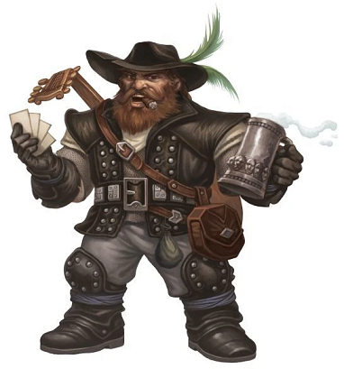
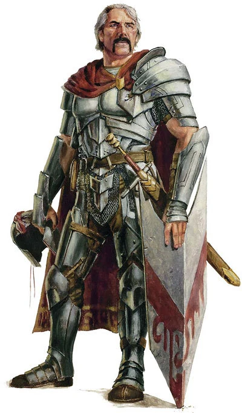
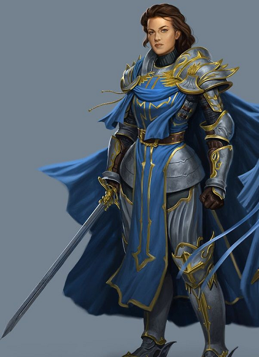
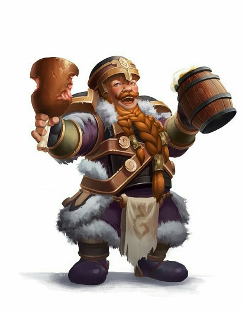
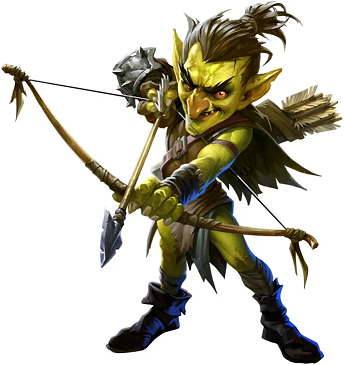
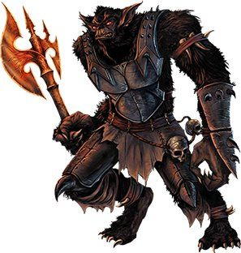
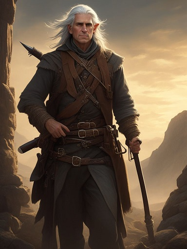

# Ki kicsoda?

Ha egy fontosabb név elhangzott, amely NPC valamiért érdekes lehet, arról pár mondatban itt lehet olvasni. A kép nem feltétlen a pontos ábrázolás, inkább google első találatok egyike.

## Gundren Rockseeker

A Rockseeker testvérek egyike, aki kalandozókat eredetileg felbérelte. A küldetés egyszerű: Phandalinba kell eljuttatni egy szekeret, annak minden rakományával együtt, épségben. Az escort során kiderült, hogy a goblinok rajtaütöttek az előre lovagló Gundren+Sildar pároson, amit a lovak nem éltek túl. Az egyik támagdó goblint kihallgatva kiderült, hogy Gundrent a *"király"*hoz vitték, elválasztották Sildartól. 🔁

## Sildar Hallwinter

A térség egyik védnöke, a Lordok Szövetségének megbecsült tagja. Többek között neki köszönhető, hogy Neverwinter, Phandalin és környékük újra a régi fényében ragyog. Gundrennel együtt a küldetés elején elhurcolták a rajtuk ütő golbin hordák. A zsákmánnyal együtt egy barlangba hurcolták őt, a kalandorok megkísérelték kiszabadítani. A csapat még időben érkezett, mielőtt a félholtra vert harcost a goblinok megehették volna. A mentőakció sikerrel záródott (bár a felszerelését nem találták meg), Sildarral együtt Phandalinba utazott a társaság.

Phandalinban a helyi viszonyokat látva Sildar a saját kezébe vette a dolgokat, a Lordok Szövetségének hivatalos képviselőjeként.
 🔁

## Lady Tanamere Alagondar

Neverwinteri királyi család mellékágának örököse. Az 1390-es években toborzott két kalandor csapatot a sárkány legyőzésére. Az elbeszélés szerint Neverwintertől délkeletre zajlott a csata, (fél napi járás), a sárkányt legyőzték, a 8 kalandorból 4 ott maradt, majd később a Lady is belehalt a sérüléseibe. A királyi család kérésére az 5 elhunytat közvetlen a sárkány maradványai mellett temették el.

## Bordaec Coinbranch

A Lady Alagondar által vezetett diadal 100-ik évfordulóján rendezett viadal és fesztivál szervezője. Gundren és Sildar által is elismert törp. A játékokkal a *"Sárkányszektát"* haragította magára, fenyegető levelek kíséretében. Mikor a kalandorok is a játékra érkeztek, a szekta több kultistája váratlanul gyújtogatni kezdett, megzavarva a szórakozást.

## Tiri

Goblin íjász, aki a megpróbált a csapaton <a href='./session-6.md#tiri_introduction'>rajtaütni</a>. Serafine varázslata hatására a csapat mellé szegődött, elvezetve őket a goblinok rejtekhelyére - a menet közben található csapdákat bejelentve és hatástalanítva. A barlang bejárat előtt nem sokkal a bűbáj lejártával rátámadt Serafine-ra, így rövid barátsága (és élete) a csapattal Ashley késével a tarkójában ért véget.

## Borgork

  
⚠ <b><i>Session 0 | Spoiler</i></b> ⚠

  A Bonebreaker nevű bugbear klán egyik kiváló harcosa, aki a sámánjuk, Thernurr meggyilkolása után együtt indult Rorral megkeresni Churrark ellopott koponyáját. Miután találkoztak Nanával, és Rorr nem hagyta, hogy megölje az ifjú eladrint, Thernurr kitagadta Rorrt, árulónak nevezve, majd a maga útjára indult.
  

A Bugbear harcos a Cragmaw nevű goblin törzs vezetője lett. A *király*tól kapott kinevezést nem élvezhette sokáig, miután a kalandorok rajta ütöttek. Rorrt, amennyiben a bugbear fejet hajt előtte és hűséget esküszik, *"visszafogadja"*, bár továbbra is becstelennek tartja a kalandozó bugbeart.

Miután a diplomatikus megoldásokra nem volt nyitott, agresszív véleménycsere keretében intézte a nézeteltérést a csapattal.
Habár Rorrt átmenetileg padlóra küldte, Ashley kardja által a három napos hatalma hamar véget ért.

## Daran Edermath

Idősebb fél-elf kalandozó, aki a Phandalin melletti gyümölcsös mellett telepedett le, visszavonulva időskori éveire. Segített a kalandozóknak a Sleeping Giant kocsmában tanyázó banditák elintézésében. 🔁

